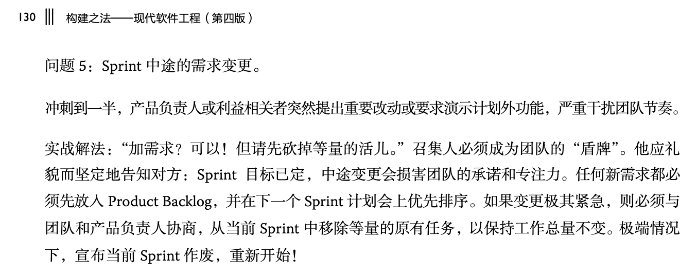

# 2026 秋季 现代软件工程 中关村学院
## 作业要求
https://gitee.com/vibe-coding-2026-9/zgca_mse_202609/issues/IKE1BA

## 学生提问和回答

### 姓名：杨翘楚
博客链接：https://gitee.com/joshua69/modern-software-engineering/blob/master/reading-notes.md
回答： 
1. 但如果是医疗系统、自动驾驶或者机器人控制软件，一个很小概率的错误都可能造成完全不同的后果。
回答：所以不同行业有不同的 “足够好” 标准。 例如 IEC 62304， ISO 26262， ASPICE，等等。 

2. 单元测试真的能证明程序“正确”吗？
回答：单元测试主要完成的是 验证（Verification）——即"我们是否把东西做对了"，而不是 确认（Validation）——即 "我们是否在做对的东西"。 例如， windows 8 决定取消 ‘开始’ 按钮， 我们测试验证了它做到了， 但是用户是否非常满意这个新设计？ ‘确认用户满意’ 这个部分并不是在单元测试中进行的。 

另一个例子： 手机App 要显示启动的广告停留3秒，如果用户晃动手机，就等于认同用户感兴趣，马上打开广告。 
这也有 ‘单元测试验证程序做对了’， 和各种确认的区别： 
- 用户的反馈 确认了 体验好
- 投广告的客户 确认 广告效果
- app 的公司广告收入 确认 了广告收入超过成本

可以到网上搜一下用户对这些无孔不入的广告的反馈。 

3. 不是一个问题

4. 敏捷开发强调快速交付，但“没有做出来”一定算失败吗？
回答： 我们要分清 ‘科研’， 和 ‘软件工程’ 的区别

5. 用户说出来的“需求”，真的就是需求吗？
回答： 可以再看看教材的各种描述，的确需求的 ‘挖掘’ 方法论多种多样。 

6. PM 最核心的能力到底是管理能力，还是判断能力？
回答： 可能是交流能力， 形成了判断，还是要通过交流让大家都同意这个判断。 

7. 用户体验真的应该越“顺滑”越好吗？
回答：你自己回答了。 

8. 创新一定要从“用户需求”开始吗？
回答： 哪里提到这是一个 ‘绝对原则’ 呢？ 

最后：在当前的课程中考察

### 姓名：曹祥旭
博客链接：https://gitee.com/cao-xiangxu/questions/blob/master/README.md
1. 人类还需要什么样的编程能力？ 
回答： 在实践中，我们越来越依赖于 AI，但是人要有能 debug 的能力，另外还要分清 -- 在实践中用工具 vs 在学习过程中锻炼脑力：  https://gitee.com/zouxin2025/ASE/blob/master/chapter0/edu02.md 

2. 如何平衡“看得见的进展”与真正可靠的成果？
回答： 要分清 科研 vs 工程项目。  科研中是有很多探索性的工作， 但是在工程中， 就要实打实地交付，不能 “我花了 3 个月探索了最新的技术但是后来发现对我们的项目帮助不大”。 

3. 成功公司的工程原则，真的是成功原因吗？
回答： 是必要条件。 到了真实的世界上，大家会发现草台班子到处有，真的能把工程原则都落地的，那也是非常了不起的团队了，一般人想加入可能也未必有机会。 

4. 测试全部达标，却让用户觉得不可靠，算高质量软件吗？
回答： 那问题是 -- 为何这些 ’不可靠‘ 没有放到测试中呢？ 

5. 创新的正确时机能够提前判断吗？成功有多少依赖运气？
回答： 项目管理的很大一部分价值， 以及软件团队的成熟度标准， 就是要和 ‘运气’ 解耦。 克莱顿·克里斯坦森（Clayton M. Christensen）确实写过一本标题包含“Luck”的书。

书名为 《Competing Against Luck: The Story of Innovation and Customer Choice》 （中文常译为《与运气竞争》），出版于 2016 年。 这本书与他的成名作《创新者的窘境》一脉相承，核心是阐述“待办任务”（Jobs to Be Done， JTBD）理论，旨在解释企业如何将创新从一场靠运气的赌博，转变为可以预测客户选择的过程。 《窘境》解释了为什么优秀企业会失败（被颠覆），而《与运气竞争》则正面回答"企业怎样才能持续做出对的创新"——通过深挖用户真正想完成的任务。  《构建之法》教材也覆盖了 JTBD 理论。  另外， 彩票中奖与否，的确靠运气， 但是你也要每天付出努力去买彩票， 而不是在一旁反复思考 “有多少依赖运气”。 

### 姓名：钟芳梽
博客链接：https://gitee.com/fangzhi-zhong/model-software-engineering/blob/main/homework-1/read-notes.md

1. 一个普通商业软件应由谁共同定义“足够好”？哪些指标可以权衡，哪些底线即使会延期也不能让步？
回答： 底线：刑法、民法、合同、行业道德和行规。 优秀的公司会发布带有已知缺陷的软件，同时及时跟进修复 —— 但注意，这两个"及时"不必同步。发布要及时，修复也可以及时，但它们的节奏是独立的。

2. 团队应该怎样根据模块风险设置测试门禁？除了覆盖率，还应结合哪些指标或方法，才能判断一组测试是否真正有发现错误的能力？
回答： 高风险模块（如核心交易链路、认证授权、数据持久层）应设置更严格的门禁规则；低风险模块（如静态展示页面、独立工具脚本）可适当放宽，以保持交付效率。 

覆盖率回答的是"跑没跑到"，构建失败率和 MTTR （平均故障修复时间） 回答的是"门禁拦没拦住真问题"，静态分析回答的是"能不能在运行前就发现问题"，而真实环境演练回答的是"这套体系在关键时刻到底靠不靠谱"。四个层面合在一起，才能判断测试门禁是否真正具备发现错误的能力。

3. 应当用任务复杂度、缺陷率、知识共享程度，还是团队成员经验来决定是否结对？怎样设计实验，比较“结对编程”和“独立开发后复审”的真实成本与收益？
回答： 当然是要根据团队成员的具体情况（经验、是否远程工作、时区、负责领域...） 来决定。 结对编程并非程序员的独创 —— 越野赛车有驾驶+领航员，飞机驾驶有机长+副驾驶。这些场景的共同特征是"高速度、高技术要求、失败代价高"。因此，判断是否结对时，第一个要问的问题是：这个任务如果做错了，代价有多大？ 如果失败成本高（比如核心交易链路、认证授权、数据持久层），结对的优先级就高；如果只是静态展示页面或独立工具脚本，独立开发后走门禁可能更高效。
另外，结对编程还要考虑 ‘培训， 隐性知识的传递，合作精神的培养’ 等不容易量化的收益。

4. 在需求不确定时，团队应该预先设计到什么程度才开始迭代？怎样判断一次需求变更是在创造价值，还是暴露了前期分析不足？
回答： 分而治之： Cynefin 框架能帮助我们做出动态的、可操作的判断—— 一个系统在什么时候可以被降维为“可分析”的 Complicated，什么时候必须被视为“只能通过试错来感知”的 Complex，以及什么时候已经滑入了“无人能预测”的 Chaotic。而判断能力，恰恰需要通过具体的工程案例来训练。 参见：  https://mp.weixin.qq.com/s/FncvcXBOhmn7zqY4SSqylg 

5. 用户说出的需求，就是真实需求吗？ 当访谈、日志数据和商业目标互相冲突时，应该如何决定需求的可信度与优先级？对人数少但受影响严重的用户，应该如何给予合理权重？
回答：前面学生也问过。  这些问题并不是非黑即白， 而是要建立透明评分机制，按数据置信度和商业价值对每项需求打分排序，而不是在访谈、日志和商业目标之间简单二选一。对人数少但受影响严重的用户，按影响深度而非触达人数赋予权重，并在决策记录中保留可追溯依据，让"为什么优先"有据可查。

6. 在小型学生团队或创业团队中，是否必须设置专职 PM？怎样划分 PM、开发者和用户代表的决策权，既避免无人负责，也避免一人包办？
回答： 先确定目标，然后做起来，不断调整结构。 慢慢就会形成不同角色。 

7. “让用户不用思考”是否总是好的用户体验？
回答： 注意，我们提的是 “不要让用户费神”， 并不是不思考。  同意按不同的情况设置不同程度的摩擦和提醒。 

8. 创新应该用市场成功来证明吗？ 当一项创新商业上成功，却带来隐私、成瘾、就业替代或环境成本时，我们还能称它为“成功的创新”吗？谁应该承担评估和约束这些外部影响的责任？
回答： 首先，“成功的创新“ 这个词组就非常宏大，要具体问题具体分析： 能否持续创造经济价值？正外部性是否大于负外部性？谁受益、谁承担代价？是否对弱势群体不成比例？短期成功是否会透支长期资源或信任？如果发现危害，能否及时修正或回滚？ 最近某国规定 16 岁以下人群不能使用社交软件，也是一个 “评估和约束外部影响” 的很好例子， 当然这发生在社交软件兴旺了 10 多年后。  另外， 智能无人机这个新兴产业， 不同的地方对它有不同的政策，从 "大力发展低空经济"， 到 "不能拥有"。 这都值得我们去分析。 

### 姓名：胡家威
博客链接：https://gitee.com/hu-shuo-jw/modern-software-engineering/blob/master/homework-1/read-notes.md

1. 软件“足够好”了，这个标准由谁来定？
> 一个作业提交系统在大多数设备上正常运行，却会让少数设备上的用户丢失未提交的内容。
回答：这个系统在发布的时候，规定过了自己支持的设备的范围么？

2. 能否让没有参与实现的同学，先根据需求独立列出验收样例，再和开发者对照？如果双方恰好都理解错了，又该通过什么方式发现？
回答：可以，还可以让 AI 参与测试用例的设计。 

3. 作者和复审者对风险的判断不一致时，应该凭什么决定是否合并？对于决定延期修复的问题，怎样跟进才能避免反复登记、始终没人处理？
回答：优先级随着时间流逝而提高，让人不能忽视。

4. 小组该怎样区分任务进展和个人贡献？一个人发现了问题、帮别人排了故障，却没完成多少自己的任务，这些工作又该怎么评价？
回答：那么， 这个人的工作优先级是和整个项目优先级一致的么？ 项目的领军人物如何奖励 “在自身任务之外帮助别人的人”？ 

5. 怎样设计验证，才能区分需求不足、方案不合适和试用门槛过高？如果决定再试一次，应该改变什么，才能获得新信息，而不是继续寻找支持自己想法的结果？
回答： 这要具体问题具体分析， 上一轮验证里，哪个环节最可能"骗"了你？是用户样本太友好？是验证方式让用户只在"说"而没有在"做"？还是问题本身引导了用户给出你想听的答案？锁定最薄弱的环节，从那里开始改。

### 姓名：杨靖普
博客链接：https://gitee.com/yang-jingpu/software-engineering/blob/master/homework-1.md
1. 讨论 什么证据能够证明一段错误处理确实没有必要？对于发生概率低但后果严重的问题，应该如何取舍？测试困难是否可以成为删除错误处理的理由？
回答：问自己：如果这段代码被删掉，最坏会发生什么？ 如果答案是"可能丢数据 / 暴露漏洞 / 系统不可用"，保留。
评估测试成本：如果触发这条路径只需要一两个 mock，成本不高，那就写测试覆盖它。
评估维护成本：如果触发这条路径需要极其复杂的 mock 链路，且代码逻辑简单（比如只是记日志），可以考虑降低测试优先级，但代码本身保留。
定期回顾：随着系统演进，原本不可能的场景可能变得可能，定期审查这些"保留但未测试"的路径。

2. 两人合作：如何判断一个人是真的学会了，而不是暂时跟上了同伴？ 课堂中的结对编程应该如何评价个人贡献？ 对于简单任务和探索性任务，是否有必要一直采用结对编程？
回答： 跟上了同伴，也是很好的结果。 结对编程我倾向于认为两人共享成功和失败， 就像越野赛车那样。 至于 “简单任务” 和 “探索性任务”， 教材已经说明，这些不属于结对编程能发挥优势的场景，为了培训的目的，可以做，但是投入产出比要考虑。 

3. 敏捷开发： 当进度、质量和功能范围发生冲突时，谁有权决定牺牲哪一项？ 如何判断一个需求变化值得打破原有计划？ 学生项目是否需要像真实项目一样使用产品待办列表和优先级管理？
回答：是 Product Owner 最终决定牺牲哪些，保全哪些目标， 是否打破原有计划。 学生项目应该尽可能像真实项目一样管理，我们做的就是真实项目。 
> 如果项目还剩一周，用户提出一个有价值的新功能建议，团队应该接受还是拒绝？
团队可以： 1）不影响当前周期，把需求排到下一个冲刺的周期；  2）宣布当前的冲刺作废，重新安排当前周期的任务。  还是要 product owner 来决定。 

4. 用户“想要”的功能，与用户真正使用的功能不一致时，应该相信什么？ 什么时候应该继续调研，什么时候应该直接开始开发？
用户口头说 “我希望经常测试自己的英语水平...“, 但是这个功能在发布后并没有多少使用数据...  最好的数据，来源于用户实际使用过程中的真实反馈。 我们应该尽量拿到这些真实反馈（早日发布，多发布， 多 demo，多询问用户）。 

5. 好的用户体验，是否总应该让用户“感受不到界面的存在”？
用户体验不只是减少步骤，还要让用户理解后果并拥有控制权——这本身就是用户体验设计的重要原则。课程里"感受不到界面存在"是针对那些不必要、无意义的阻力说的，而你提出的"必要的安全提醒"恰恰是在保护用户的控制权，两者是互补的，不是矛盾的。 例如教材也说了， 为了防止误操作，手术室里把不同用途的仪器的管子变为不同形状的，这样不会误插不同目的的管子 -- 这样摩擦力巨大 -- 但是为了安全，是非常好的设计。  在一些命令行脚本中，为了确保用户认真了解了某脚本的后果， 不是光敲 [y/n] 这样的字母就可以（或者默认回车就是 y）， 而是要求输入 [yes/no] 这样完整的单词，脚本才能进行下去。 

### 姓名：张振煜
博客链接：https://gitee.com/herbert177/software-engineering/blob/master/file.md
1. “足够好”的软件到底应该如何确定标准？  
回答：你自己后续的文字也回答了自己的问题。 

2. 结对编程真的一定能够提高开发效率吗？  
回答： 请看教材 84 - 86 页。 你写的 ‘不同意见’ 和教材描述的具体有什么区别么？ 

3. 敏捷开发是否会变成“需求一直改，代码一直重写”？ 不同意见：我认为“拥抱变化”并不意味着“任何变化都应该马上接受”。  
回答： 是的，教材也是这样说的， 见下图。 你觉得这和你表达的有矛盾么？ 

4. 用户提出的需求就一定是真正的需求吗？  
回答：所以我们需要产品经理，需求分析等流程来确定什么才是团队需要做的。 

5. 好的用户体验与真正的创新是否可能发生冲突？  
回答：当然有冲突， 即使是对于成熟的产品，不同的用户对于什么是 ‘好的体验’ 也有不同甚至矛盾的意见，更不用说创新的产品了。 不同的用户都希望： “我能理解动作的后果，并且我有控制权”， 但是用户的技术水平不同， 理解能力不同， UI 的具体设计也应该不同。 十八岁的大学生和八十岁的老人，对于微信app 的一个创新，可能反馈完全不同。 

### 姓名：李国良
博客链接：https://gitee.com/what2/modern-software-engineering/blob/master/README.md
1. 比如现在的开发代码，每个文件都有几百上千行，这种情况下通过注释去解释每个类和函数的主要功能，可以提升理解代码的效率。   
回答： 我认为大家会越来越依赖 AI 助手来理解代码， 而不是文字的注释。 我们希望工程师的 ‘意图’ 在源代码文件中只用代码本身就能取代了，而不是代码 + 文字的注释 （二者可能矛盾）。 AI 助手的另一个功能还可能是指出代码和其他文档（注释，功能规格说明书，测试用例） 的不一致的地方。 

2.  如何衡量软件开发的工作量和质量？   
回答： 的确是要看多种 “stake holder” ，利益相关人对 “质量” 的反馈。  少年对某个游戏很入迷，这个游戏对运营数据也很好， 我们还要考虑监管机构对 “质量“ 的反馈。 

3. 在敏捷流程中，所有任务都要拆到一人一天吗？  
回答： 原则是这样， 如果大于一天，说明我们对这个工作并没有充分了解， 那就属于 ’研究探索‘ 工作，不宜和其他明确的工程工作放到一起来管理。 

4. 小型学生团队需要设置项目经理吗？   
回答： 有全栈工程师，有 OPC，项目的人数很少， 那么，还是要有 ‘项目经理’ 这个角色， 谁来担任呢？ 可以是某人临时带上 ‘经理’ 的帽子（例如，去见投资人的时候）， 还可以让 AI agent 来管理项目进度。 

5. 让用户感受不到界面，是否适合所有操作？ 现在的主流大模型竞争激烈，在性能相近的情况下，一个更优美、舒适的界面，也许能提升用户留存率。  
回答： 你提到的 “主流大模型竞争激烈”， 那么你看它们在 UI 方面，有哪些竞争？ 你会因为 UI 而使用某个模型么？ 

### 姓名：于晓飞
博客链接：https://gitee.com/fay-yu/software_engineering/blob/master/Homework_1.md
1. 编程练习的设计和评价是否应该改变，才能区分“借助 AI 学会了”和“由 AI 代做了”？  
回答： 对于大学生来说，回看自己学习算术的过程， 大家应该能区分 “在学习算术过程中应使用手算还是用计算器” vs “在实际工作中要使用手算还是计算器” 的答案是什么； 在2026年， 把 AI 替换上面的 “计算器” 也需要我们回答。 我认为回答是类似的，参看：https://gitee.com/zouxin2025/ASE/blob/master/chapter0/edu02.md 

2. 传统用户调研仍然是必要步骤吗？ 
回答： 随着技术的进步，软件收集到的用户行为数据确实越来越丰富，但它和传统的用户调研解决的是不同类型的问题。 直接交流——包括访谈、问卷和焦点小组——擅长挖掘用户的动机、顾虑以及那些没有被明确表达出来的需求。比如，当你想知道"用户为什么放弃付费"或"他们在犹豫什么"时，往往需要通过对话才能触及。但它的局限在于：受访者的回答可能经过修饰，记忆也可能存在偏差。 行为数据——包括日志、埋点和 A/B 测试——则擅长揭示用户的实际路径、操作频率和转化漏斗。比如，用户在哪一步流失、在某个页面停留了多久，这些都可以从数据中直接读出。但它的局限是：只能看到用户"做了什么"，看不到"为什么"。 简单来说，行为数据告诉你"发生了什么"，而直接交流才能告诉你"为什么不发生"。两者互补，而非替代。
行为数据回答"what"，直接交流回答"why not"。
在实际项目中，一个常见的做法是：先用行为数据定位问题发生的精确位置（比如用户在第几步流失），再用访谈去追问背后的原因（比如"你在这一步看到了什么让你犹豫"）。这样两步走，比单独使用任何一种方法都更能接近真实需求。

3. 产品经理与项目经理有必要明确分开吗？  
回答： 团队越小，越没必要。

4. 记住偏好，就一定能改善体验吗？  如何既避免自动判断出错，又不让用户承担繁琐的配置工作？ 
回答： 用户希望 “我有掌控，但是不要让我费神，并且让我知道动作的后果” -- 也是很难做到十全十美的。 “繁琐的配置” -- 难道不能自动达到么？ 

5. “把握时机”究竟能提供什么事前可用的判断依据？相比寻找正确时机，保持试错空间和应对变化的能力，是否更值得强调？  
回答： 希望有更明确的上下文， 从具体例子出发来讨论/ 

### 姓名：王秋雨
博客链接：https://gitee.com/fallrainme/modern-software-engineering/blob/master/questions.md 

1. 那“软件工程”这半边是不是反而更值钱了？书成书时没赶上 AI，这个公式要不要改成“软件＝提示词＋工程”？  
回答： 《构建之法》第四版就是在 AI 时代写的。  我个人认为 “提示词” 是一个短期的工具，并不反映软件开发和创新的本质。  如何清楚地洞察并描述 “用户想要什么，用户不想要什么” 在以前，现在，将来都是有价值的，它叫 “需求分析”。 

2. 初入行的人不写代码直接“审” AI 代码，能成长起来吗？还是说测试和验收变成了新的基本功？  
回答： 首先，测试和验收一直是基本功啊。  它的本质就是确认上面提到的 “用户想要什么，用户不想要什么”。   其次， 当你说 “入行”， 这是软件开发的行业， 还是其他行业？ 我们要分赛道来看， “CS/软件专业” 还是需要动手学习和练习的。  其他行业未必。 参见： https://gitee.com/zouxin2025/ASE/blob/master/chapter0/edu02.md 

3. 是不是该加一章“人机协作”？人和 AI 的“领航员—司机”怎么分工？  
回答： 《构建之法》 4.6  谈了与 AI 结对编程， 请看一下。 当然，随着 AI 技术的进步，软件工程师和AI 的关系也在变化中，期待软件工程师被 AI 再次震惊。

4. 快出来的产能是假象还是真红利？敏捷流程哪个环节最该被 AI 重构？  
回答： 凡是有利于 “快速获得真实反馈” 的， 都是红利， 能加速的环节，都可以考虑，我认为越底层， 越技术密集，越能从 AI 中获利。 

5. 初级岗位被 AI 吃掉后，新人没地方练手，五年后谁来创新？另外问一句扎心的：如果 AI 一天能试一百个方案，那“人的创新”到底还剩什么？  
回答：  如果五年后人类发现， 我们还是需要手动编程， 那么， AI 也可以教人类手动编程吧？ 说不定效率更高？ 能源，航天，医药，健康，心理等等方面都需要人类去创新，人类可以不再纠结 C++ 语言的细节了， 交给 AI 不是更好么？

### 姓名：陈智良
博客链接：https://gitee.com/czl7642/modern-software-engineering/blob/master/readme.md 
1. 团队能否通过最小可行产品、原型或小范围实验来降低错误决策的成本？  
回答： 能。 我们课程就是在实地进行这样的实践。 

2. 问题在于，什么程度的技术债是可以接受的？ 
回答： 如果投资解决了技术债， 长期的获益更大，那就可以接受。 程度问题， 取决于具体项目。 

3. 当评审意见存在分歧时，应依据团队规范、技术证据还是由更资深的人直接裁决？  
回答： 三者应该是一致的，  团队规范就是得到所有人支持（特别是资深的成员），符合技术发展趋势的规定。 

4. 在时间有限时，如何确定最值得测试的场景，并避免为了追求数字而编写缺乏实际价值的测试？  
回答： 取决于 ‘足够好’的定义， 消费者的 app，智能驾驶软件，医疗软件， 航天软件... 都不一样。 

5. 发现安全或隐私风险时，开发者应坚持到什么程度？  
回答： 开发者处理路径应按 "内部沟通 → 风险升级 → 书面留痕 → 必要时拒绝执行或向上举报" 递进，而非在第一步就跳过沟通、默默执行、或永远停留在第一步。

### 姓名：邝伟华
博客链接：https://gitee.com/weihuakuang/advanced-software-engineering/blob/master/homework/homework-01/questions.md
1. 当前高校本科专业的实际情况是 CS 挤占了 SE 的大部分生存空间，SE 在实际发展中已有被 CS 合并的迹象。  
回答： 《构建之法》 也写了 CS 和 SE 的区别，可以仔细读。 我们可以问，为何不是 SE 的学生去挤占 CS 的空间呢？ 另外，我们可以比喻一下：某大学里有两个专业：跳高和排球。 跳高的同学平时就是攻克不断升高的横杆，和自己过去的成绩比赛； 排球专业的选手不打比赛，就是互相垫球，学习各种战术理论和写文档 《如何团队配合，打败对手》。 结果真的排球队来选人的时候，跳高专业的同学跳得很高，可以扣球和拦网。 排球专业的同学讲起战术头头是道，但是跳不高。 
专业队的教练怎么想的呢：“防守配合和战术纪律可以进队以后慢慢教，但这种滞空高度和身体素质，我是没办法快速练出来的。”

2. Coding IDE 在代码发布上线前生成的 unit test 经常会出现冗余 / 过度测试的现象？  
回答： 1. 分层级，高频/低频的测试分开； 2. 让 AI 写脚本分析雷同的测例，过度覆盖的函数，自动调节。 

3. 人主导 coding ide 辅助的 coding，是否可以理解为 ai 时代的 pair programming？   
回答： 可以的，而且可以让 AI 7x24 工作，同时给你重要的报告。 

4. 很多时候用户也不知道界面审美/交互逻辑哪里不舒服，那我们该怎么收集反馈呢？  
回答： 原因： 1. harness engineering 不够， AI 可以有很大犯错误的空间，要把 UI 规范规定下来并用另外一个 AI agent 来检查。 2. 从用户log 中分析， 用户在哪里停顿，放弃？ 3. ... 

5. AI 时代全栈工程师是不是默认配置了？  
回答： 对，包括经理的角色。  变成 人 + AI 干活， 因为 AI 比一些 ‘草台班子’ 的真人还能吃苦耐劳。 

### 姓名：黄铮舸
博客链接：https://gitee.com/huang-zhengge/software-engineering/blob/master/笔记/Questions.md

1. 0.这本书所用的语言非常像国外的教科书，运用了大量例子去说明所讲的内容，且包括了2个人物之间的对话（类似于伯克利cs161的Alice和Bob和Evanbot），那么这种语言是编者老师有意模仿国外的教科书吗？  
回答：这本书的人物对话风格， 在 2007 年出版的 《移山之道》 就有了： https://book.douban.com/subject/2149642/  不知道是谁模仿谁。 关键还是能否让目标读者更好地理解。 

2. 书中提到了利用AI工具写单元测试，但是是否可以向同事、老师等求助？向AI工具求助一定比向人类求助好吗？我认为不是，那为什么书中没有提到这个方法？  
回答： 当然可以向各种人求助，  但是，一个合格的 CS/SE 的学生， 单元测试都有这么大的困难？ 

3.  我的意见是应该还会有别的函数也需要像goto函数那样引起注意。  
回答： 很好的反馈， 那请你举出具体的例子， 让我们大家都注意到这些问题。  

4. 这里是否只是提了一些例子，而不是全部的错误处理？有什么错误处理可以减少其他错误？结对编程中，两个程序员只有一个显示器、一个键盘、一个鼠标，这是否意味着他们同时只能有一个人编写代码？这样效率是否过低，无法实现某种“并行”的效果？  
回答： 书里面的例子肯定不是全覆盖的， 会有遗漏； 你可以尝试不同形式的结对编程，比较一下效率。 

5. 六章“敏捷流程”的部分，我总感觉这个翻译很奇怪，乍一看不知道在说什么，仔细一看原来是“应对变化、快速交付价值的价值观和方法论”，虽然也像是“敏捷”的意思，但是总感觉很奇怪，因为日常生活中“敏捷”会指“动作快”，很少有“应对变化反应快的意思”。  
回答：  我认为敏捷也有 “应对变化反应快” 的意思。  这也是主流的翻译词汇。  词汇的选择，多少条原则，这些都远远没有实际做一遍重要。  

6. 第八章“需求分析”的翻译也让人困惑，“繁杂”“复杂”是近义词 ... 
回答： 可以参看更多内容：  https://mp.weixin.qq.com/s/FncvcXBOhmn7zqY4SSqylg 

### 姓名：邵家一
博客链接：https://gitee.com/littlewells/Modern-Software-Engineering/blob/main/Homework_1.md 
1. “足够好”由谁决定，谁承担被接受的缺陷？  
回答： 没看出来你说的和教材的描述有什么矛盾之处。 

2. 错误处理路径很难触发，是删除它的理由，还是改进测试方法的信号？  
回答： 同意你的观点。 

3. 结对编程提高了交流密度，是否也可能让两个人更快形成同一个错误判断？  
回答： 如果能更快速地实现 （错误的）共识， 交给用户， 用户能更快地反馈， 那么这也是值得的。 相比两人在研发阶段争论不休但是不能活的共识而推进软件工程的流程。 

4. 当行为数据与用户表达相反时，项目负责人根据什么认定哪一个才是“真实需求”？  “由负责人最终决定”解决了谁拍板的问题，却没有解决拍板依据是否充分的问题。
回答： 软件工程的核心， 就是在各种约束条件（e.g.，信息不足）下做决定，参看你的第一个提问 -- 拍板依据是否充分，并不是第一性目标，也许用户群就是有对立的需求，各自都有理由。 （微信app 的全体用户对每一个功能的需求都一致？ 参考：https://mp.weixin.qq.com/s/bPbc9SWfmV1ZgPmwARaV3g   搜索引擎的用户希望搜索结果没有任何广告， 负责人能听从这个真实需求么？ 

5. 好的用户体验一定要让用户少思考吗？哪些操作反而需要保留必要的停顿？ 
回答： 参见前面类似的回答， 我也不清楚为何很多人问类似的问题， 没有自己独特的问题么？ 

### 姓名：王昊
博客链接：https://gitee.com/jackson789/modern-software-engineering/blob/master/README.md
1. 现实企业中很多项目有紧迫上线工期，会要求开发人员先快速交付功能，暂时搁置代码重构、单元测试。那在工期压力和代码质量、职业素养冲突时，工程师该如何把握边界？很多普通开发者没有权限决定项目排期，个人应当做哪些妥协、哪些底线不能退让？  
回答： 我经历的企业， 很少这样的要求。 核心策略是分不同的等级/风险/紧迫度，来处理各种问题。  搁置代码重构和单元测试， 可能会花更多的时间修修补补，导致更长的延期。  

2. 我认为不是所有场景都必须开发者写完整单元测试，可以区分核心业务模块和边缘功能：核心模块强制单元测试，边缘简单功能可以交给测试人员侧重黑盒测试 ... 
回答： 1）要分清楚单元测试和黑盒测试的区别， 2）很少的企业有 ‘测试人员’ 了， 你没法 ‘交给’ 他们去做你本来应该做但是你不想做的事情。 当然，现在可以交给 AI。 

3. 敏捷开发在国内小团队落地的现实困境（疑问） 
回答： 敏捷的原则之一， 就是高度重视 “可用的软件”， “与客户合作”， 而不是“执行原计划”， “流程和工具”  -- 不必拘泥于 “计划”， “流程”。 

4. 当需求反复变更，前期做的需求分析大量失效，除了拥抱变化之外，有没有办法提前降低这种反复改动带来的成本？如何判断哪些需求是用户一时兴起的伪需求？  
回答： 当你投身于一个项目，经过一两个完整周期后，对于业务和技术的理解，会让你有更多的智慧来做判断 -- 除了极少数天才 ‘生而知之’ 以外。 

5. 软件团队的绩效考核方式（不同意见） 
回答： 对，我坚决反对以代码行数来衡量程序员工作产出。 正如你第一个问题提到，代码重构非常重要， 如果一个工程师重构了代码，项目整体减少了 10000 行冗余代码， 他的绩效是 “负的一万行” 么？ 

6. 当程序员只是执行产品、管理层下达的需求，明知道这个功能会带来隐私风险，但拒绝开发就会影响工作，这种两难处境下，程序员个人可以怎么做？个人的伦理责任和企业的商业利益冲突该如何权衡？ 
回答：与软件开发工作直接相关的安全、隐私法规，核心是“三法一条例”，《网络安全法》《数据安全法》《个人信息保护法》+ 《网络数据安全管理条例》。 理论上，法比上级领导大。 

### 姓名：苏慧康
博客链接：https://gitee.com/huikangsu/modern-software-engineering/blob/master/Questions.md 
1. 面向产品的软件工程和面向探索的软件开发是否应该采用同一套原则？ 
回答： 不。 

2. 有人可能提出了关键思路、发现了问题、帮助别人排查错误，或者阻止了一个错误方案继续推进，但这些贡献未必表现为代码提交数量。 
回答： 参考前面邵家一同学的第五问。 

3. 把 AI 看作“结对编程”的另一方，是否还算是结对编程？  
回答： 总是可以类比。  《构建之法》 4.6  谈了与 AI 结对编程， 请看一下。

4. AI的需求发现能力是否值得信任？
回答：人类发现需求的能力， 也是有规律可以寻找的， 只要是能表达为规律，AI 是可以通过各种方式逼近的。 例如几年前，人类认为围棋高手的思路，充满了艺术性和各种 ‘天外飞仙’ 的妙思， 后来 AI 也达到了并且远远超过了。  我们学院也有同学在探索用 AI 来发现 out-of-box 的需求和想法。 可以线下细谈。 

5. 如果“团队结构影响软件架构”，同时我们又要“根据软件架构设计团队结构”，这是不是形成了一个循环？  
回答： 那就要在约束条件下找到一个 ‘足够好’ 的匹配， just do it，不要循环讨论。 
参见教材 7.4.1: 
康威定律指出，设计系统的组织受制于其沟通结构，生产出的设计必定是组织沟通结构的副本。逆康威定律则主张，通过主动调整团队的组织结构，来促成期望的软件架构设计。

这两个定律看起来互为因果，容易让人觉得陷入了死循环。但真实世界的工程实践不是在真空中推演逻辑，微软早期为 Altair 8800 开发 BASIC 解释器的过程就是一个典型的例子。

1975 年 1 月，比尔·盖茨和保罗·艾伦在波士顿看到《大众电子》杂志上的 Altair 电脑。他们决定为它开发软件，但是他们手上既没有现成的主板，也没有成型的商业团队。如果按照死循环的推论，他们得先招聘一支完备的软件团队才能动手，或者因为手头只有两个人，就只能做最简陋的玩具程序。

当时两人的做法非常直接：目标系统必须在 4KB 内存里跑起来，而且必须在没有真机的情况下完成验证。这要求代码必须极端精简，并且必须有一个能运行 8080 指令的测试环境。

于是两人按照各自擅长的技能直接分工。盖茨负责用 8080 汇编语言手写解释器核心，包括词法分析和语句执行；艾伦负责在哈佛大学的 PDP-10 小型机上写一个 8080 指令集的模拟器，用来加载和单步调试盖茨产出的汇编代码。在这一步，团队结构只有两个人，系统的第一版架构也相应地被切分为运行时环境（run-time）和核心解释器两个独立部分。

开发推进到中途，解释器需要支持复杂的数学运算。8080 芯片本身没有浮点运算指令，必须用纯软件去实现浮点数的加减乘除。这是一个计算逻辑密集且相对封闭的功能块，两个人手头的进度都排满了，缺乏足够的精力去钻研这套数学算法。

这时候，哈佛大一学生蒙特·达维多夫在餐厅里偶然听到他们在讨论 PDP-10、8080 和开发 BASIC 的事情，主动搭话，说自己在高中阶段写过数学浮点编程。他们随即聊了很久。 

盖茨和艾伦没有停下来重新开会论证组织架构，也没有因为达维多夫不在最初的团队计划里而拒绝他。他们把浮点运算模块单独拎出来，交给达维多夫去写。任务要求很明确：输入输出遵循固定的数据格式，占用内存控制在 1KB 以内。

达维多夫作为一个外部加入的人员，其工作方式天然与另外两人保持距离。这种人际协作的边界，反过来倒逼出一段接口极为清晰、高内聚且低耦合的浮点数模块代码。达维多夫拿了一笔开发费用后完成交接，这套浮点代码后来长期稳定地保留在微软各版本的 BASIC 解释器中。

这个过程说明，团队结构和软件架构之间的所谓死锁，在实际工程里是通过时间推进和持续输入来解除的。

工程启动时，外部的物理限制和商业时间窗口往往逼出一个极简的起点 （写个 demo 吧）。工程师依据现有人员搭建出第一版粗糙的架构原型；系统跑起来之后，暴露出的新模块需求会引导新的人力加入；新人员在协作上的边界，又顺理成章地沉淀为系统内部的代码接口。整个过程是在交付周期的驱动下交替演进，不会停滞在一个静态的逻辑闭环里不断讨论而没有结果。  

6. “奖励白菜，不奖励萝卜”现实吗？  
回答： 所以企业的绩效评估是 6 - 12 个月为周期，可以看出来效果。 如果一个工程师号称为了 24 个月之后优化， 那可能太早了。 
> “过早优化是万恶之源。”（Premature optimization is the root of all evil.）
-- 图灵奖得主高德纳（Donald Knuth）

7. 一些关于本书阅读的疑问, "可能是因为我没有真正参与过软件开发项目" ...
回答： 那就真正参与真实的开发。  

### 姓名：韩鑫瑞
博客链接：https://gitee.com/han-xinrui1/modern-software-engineering/blob/master/README.md

1. 足够好？ 
回答： 参见前面的很多回答。  

2. 小项目应该允许适当砍掉部分流程，没必要全部硬套。 
回答： 对的, 这门课是实践驱动的，并不是灌输理论。  但是你也要知道都有什么流程， 才能 “适当砍掉” 啊... 

3. 课程项目需求经常改来改去，今天写好的单元测试， ... 
回答： 我们的课程才开始第一节课， 你说的 ‘改来改去’？ 

4. 每个人可以根据自己的习惯灵活调整。 
回答： 同意， 我们用起房子做类比， 当然可以灵活， 但是有最佳实践。 

5. 结对编程：很多学生作业其实并不适合这个模式。
回答： 是的，合适，足够好，是工程上常用的衡量标准。 很多人觉得软件工程的很多模式，原则都不适合自己 -- 23 个设计模式， 有什么用？ 我没用也写完数组排序的作业了。  
> 果冻：自由泳中的划水，打腿，换气太啰嗦了，我不搞这些，经过一番努力，我也横渡了游泳池了哇！只喝了两口水。 
> 阿超：是的，你在儿童区。 

6. 课程项目时间特别紧张，... 用户体验固然重要，但资源有限的时候，优先保证核心功能跑通才是第一位，不应该本末倒置。  
回答： 那要看紧张到什么地步， 如果你的时间太有限， 无法投入用户体验的实践， 可能你的时间和课程并不适合，可以以后时间和优先级合适的时候再选课。  

另外，我们这个学期实践 ”智能硬件“， 可以看看这方面专家史蒂夫·乔布斯的意见，供参考：
> “设计不仅仅是外观和感觉，设计是它的运转方式（Design is not just what it looks like and feels like. Design is how it works）。”

> 在乔布斯的逻辑里，把“核心功能”与“用户体验”割裂开来，甚至认为体验是后期才贴上去的“打磨与装饰”，从根本上就定义错了什么是软件。

>1. “功能”如果无法被顺畅使用，它就等于不存在
> 乔布斯的视角： 软件是写给人用的，不是写给编译器看的。如果一个功能没有及时反馈，用户按完按钮以为卡死连续点击导致重复提交；或者不支持撤销，用户点错一次就导致整个流程崩盘——那么这个功能在用户眼里就是坏的（Broken）。

> 2. 宁可做减法，也不要做妥协（Focus means saying no）
> 乔布斯的视角： 1997 年乔布斯重回苹果，砍掉了 70% 的产品线，只留下 4 款；第一代 iPhone 甚至没有复制粘贴、不支持第三方应用、不能换壁纸。乔布斯对专注的定义极其严苛：“人们以为专注是说‘好的’，但专注意味着对上百个好点子说‘不’。”

6. 只盯着用户现有需求，有可能扼杀一些新奇的想法，书中这块讲得比较少。 
回答： 书的篇幅有限，期待大家（都是博士生）在课程中通过无限的想象力和努力， 把新奇的想法变为成功的产品。 

### 姓名：陈轶凡
博客链接：https://gitee.com/ccccy666/modern-software-engineering/blob/master/homework1/README.md 
1. 科研代码从什么时候开始，需要更严格的工程规范？ 
回答： 你的设想很好，期待你在课程结束时有更具体的建议， 特别是我们有了越来越强的 AI 编程助手的时候。 

2. 固定随机种子，究竟能保证哪一种“可重复”？  
回答： 我们谈论随机种子，和可重复，是在讨论一个程序最小单位 ‘class’ 和它的函数的时候，不是深度学习算法中的复杂模块。 

3. 探索性任务应该结对，还是先各自想清楚？ 
回答： 你的描述讨论了各种科研的细分情况，这取决于当事人的情况。  我认为不存在 “永远对”， “完美” 的方案。  

4.  更想在迭代记录中区分三件事：已排除的工程故障、仍在等待的实验结果、已有证据支持或否定的研究假设。  
回答： 这个设计很好。 

5. 对于面向实际应用的科研项目，需求验证应当补到什么程度，才足以支持“这个方法有用”的说法？ 反过来，如果用户暂时不采用，是方法没有价值，还是代码、文档和集成成本挡住了它？这两种情况又该怎么区分？这是八个问题里我最想在课堂上讨论的一个。 
回答： 那就在课堂上讨论。  

6. 管理者又是裁判又是教练，怎么交流不同的意见？ 
回答： 能否借助：客观的实验结果，第三方专家的看法？ 

7. 好的界面应当“无形”，还是让关键状态足够清楚？ 
回答： 你列出了很多情况， 我认为核心还是 “我有掌控，但是不要让我费神，并且让我知道动作的后果” 。

8. 已经在某个方向积累了一段时间后，应该继续深挖，还是学习相邻领域的方法？跨界可能带来新问题，也要付出补基础知识的成本。教材能否补充原始调查及其局限，或者提供更直接的研究证据？即使用论文、专利的跨学科引用来研究这个问题，又怎样排除研究者能力、资源和选题差异的影响？ 
回答： 首先我赞同你的看法与质疑，在总结所谓的成功规律时，必须严格区分“成功者的事后叙事”与“能指导前瞻决策、具有普适效度的因果机制”。

---

> **教材引用的调查统计：**
> 在“成功者本人认为最好的成功”这一前提下，属于“跨界”的比例为 70%
> * **样本空间：** 全部是受访的成功人士；
> * **评价标准：** 依赖受访者个人的主观心智评价，缺乏外部客观指标；
> * **分子：** 其中认为自己“最满意的成就来自非最拿手领域”的人数；
> * **实质：** 它反映的是成功者对自身生涯主观高光体验的回溯性自评。
> 
> 

---

用一个你可能更熟悉的学术场景来看：博士生面临巨大的竞争压力，大家都想发顶会。如果我们采访那些成功中了顶会的人，统计他们自认为最成功的论文来自哪些研究领域，发现相当一部分人描述了 “某某特点”，于是我们得出结论并照着去做 -— 这与教材里引用的“成功创新人士自评”，在性质上完全相同。 对吧？

这类经验分享反映了中稿者的主观回顾，却无法给出前瞻性的决策胜率。你提出希望看到包含失败尝试的全量统计，并以此作为选择研究方向的依据，这在现实中无法落地，从我的角度看：

> 在统计学上，这类“全样本”无法采集。 大家熟知的例子：二战时统计学家分析战机弹孔，返航飞机机翼上中弹密集，但那些引擎被击中坠毁的飞机永远无法返回基地接受统计。在科研和创新实践中，各种原因失败、中途放弃、为了更好的回报而退出学术界的人，早就在任何数据库和会议名录中彻底消失，根本进不了调研的观测样本。
> 即便专门针对失败者做回访，基于人类心理的自我防御机制，失败者的事后解释往往伴随更严重的归因粉饰，同样无法还原客观的因果链条。

另一个角度看， “确保科研成功”本身就是一个伪命题。科学探索面对的是未知，任何试图依赖前人的某个统计比例来消除决策风险的想法，都脱离了科研的实际规律。 书里讨论这个数据，目的在于鼓励大家从 “初学者、外行” 的心态去创新， 不能机械地把它当成方向选择的概率公式。

你怀疑书中提到的关于 ‘跨界’ 的一个统计数字，这非常好，我们要进一步问，那么顶级科研人员研究过，处理过跨界的矛盾的？ 计算机视觉与机器人领域的知名学者金出武雄（Takeo Kanade）写过一本书，书名就给出了答案 —— 《像外行一样思考，像专家一样实践》。  https://book.douban.com/subject/26340523/ 详细地说：

    像外行一样思考： 在立项和发现问题时，跳出本领域专家的思维定势和既得利益包袱，用外行般直白、朴素的视角去审视真需求（这正是人们试图在跨界中获取的异质视角）；

    像专家一样实践： 一旦选定问题，在具体的数学推导、算法实现、实验设计与工程落地时，必须依靠最高水平的专业功底去推进，容不得半点外行的松懈。

对于年轻的科研人员，深挖本领域与拓展相邻领域都可能取得突破，每个方向都有充足的成功案例（还有海量的失败案例但是我们找不到），但个人的时间与精力有限，一个人在同一时间无法同时攀登两座山。 承认未知与不确定性，在有限的资源约束下做出取舍并为代价负责，是每个独立研究者必须完成的决策环节。很多同学刚刚本科毕业开始博士生涯的探索， 博士阶段的科研和本科按照学校给培养计划学习，是有巨大差别的。 

### 姓名：贾适萌
博客链接：https://gitee.com/jasmer/mse/blob/master/hw0.md
1. 关于第2章个人开发流程PSP，时间统计的意义， 特别是在 AI 时代： 
回答：很好的问题，PSP（个人软件过程）的核心价值，是通过度量建立对自身能力的校准直觉。

教材也写到：
> 需要指出的是，在 2025 年 AI 编程工具开始普及后，虽然具体编码时间进一步下降，但“代码复审”的时间占比显著上升，以检查 AI 生成代码的潜在缺陷。 在领会了 PSP 的特点后，我们并不是要机械地遵循其全部流程，而是要把握其精髓：
    定义过程、度量过程、分析数据、持续改进
>在 AI 时代，我们可以利用工具更自动化地完成度量和分析，但这个循环本身依然是个人成长的基石。

训练有各种手段，就像长跑运动员在训练时戴着心率带、掐着秒表跑每 400 米间歇，或者学乐器时用节拍器拆解音阶。这种刻意练习不是为了让人一辈子戴着心率带、听着节拍器工作，而是为了在脑中建立精确的心智刻度——让人在离开秒表后，依然能清楚感知自己的节奏。

但在正式比赛和演出中，跑者不能以“我全程心率与平时训练完全一致” 来要求奖励，演奏家也不能以“完全合上了节拍器的刻度” 来索要掌声。赛场只认谁先冲过终点线，音乐厅只看听众是否被真正打动。

PSP 的阶段计时与数据记录也是同理。它是帮助初学者校准个人工程能力的训练手段，而不是拿来向用户和团队交差的功劳簿。在实战交付中，软件能否按时上线、是否稳定好用、能否解决真实问题，才是衡量工程水平的唯一尺度。把“训练手段的合规”误当成“交付价值的证明”，陷入了死板规定。

衡量软件工程水平的最终尺度，是实际交付效果（黑盒），和内部过程指标（白盒）的综合。从软件工程的 V&V（Verification & Validation）框架来看，二者构成了相辅相成的工程闭环：

* **Verification（白盒验证）：** 解决“我们是否正确地做事（Are we building the product right?）”。心率表、节拍器、PSP 的计时与代码质量门禁，都是训练内在手感、确保系统不向内坍塌的脚手架。
* **Validation（黑盒确认）：** 解决“我们是否做了正确的事（Are we building the right product?）”。用户体验、业务价值与交付时限，是检验一切努力的唯一现实法庭。

在 AI 工具越来越强的时代，工程师和 AI 合作肯定会有新的 PSP 模式。 同时， 工具收集和分析数据应该更便捷，我们问工程师： **“AI 可以提效 10 倍，它不停地写代码，那你还是很忙，你的时间都花到哪儿了？交付 10 倍的成果了么？ ”** 。  例如最近常见的吐槽： 使用 AI 时最容易产生一种“生产力爆棚”的虚假膨胀感：半小时内拼出了一千行看似能跑的原型，结果接下来的三天全话费在 Bug 修复和架构返工中。 我们至少要统计这些数据， 和 “前AI 时代” 比较，才能得到有理有据的答案。 参考： https://mp.weixin.qq.com/s/TUERQwq1y1F37AaDfHPSRA 

2. 结对编程 - 会不会演化成全新的形式？
回答： 会， 以前还有远程共享编辑器等等方式， 以后说不定多个 agent 来协作。

3. 代码规范让AI 来执行，人类配置维护？
回答： 可以的， 但是也要知其然并且知其所以然。  

4. 现实中更常见的是够用就行的需求以及快速的验证。
回答： 对啊，就是 ‘足够好’。  不过我看不出你最后一句的意义： “所以到底该怎么处理、怎么想出较为合理的解法是我们还需要探讨的命题。” 

5. 12 章， 用户体验中的 A/B 测试： 但现在互联网公司做产品，很流行一种做法叫 Alpha/Beta 测试：
回答：  请看教材 12章 12.3.3 中的第二部分（283 页）， 或者你认为教材中的 A/B 测试和你提到的 Alpha/Beta 测试不一样？ 

