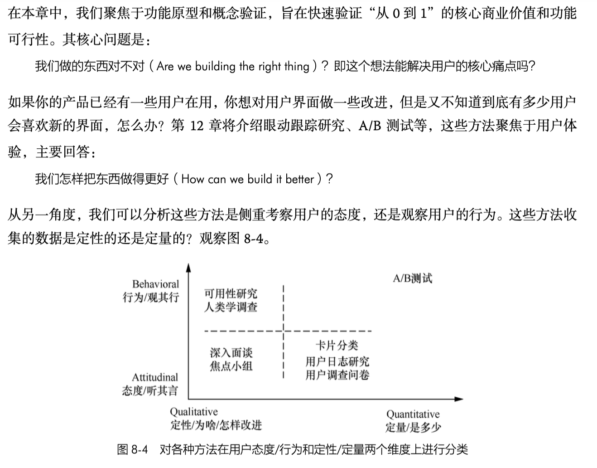
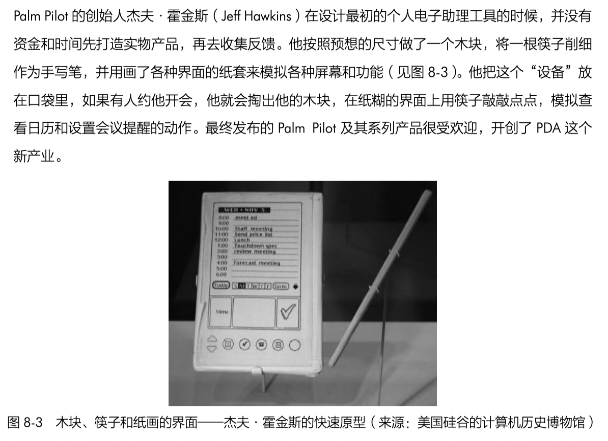
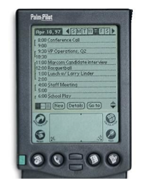
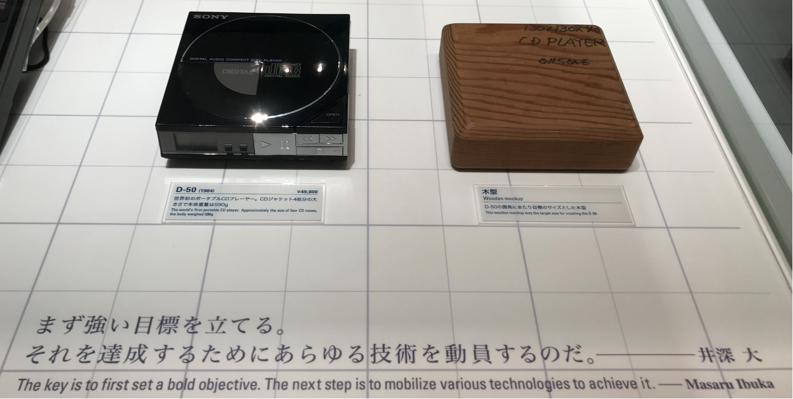
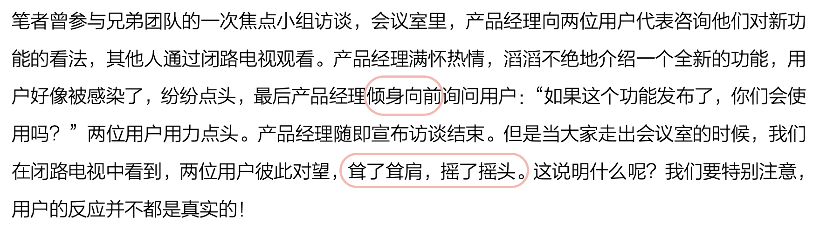

# 智能硬件开发 · 快速物理原型与真实用户调研实操指南

（前期的作业：https://gitee.com/zouxin2025/ASE/blob/master/2026-fall-se/homework1-qa.md ）
## 一、调研前置审查：项目定位与 NABCD 确认

在制作原型与接触用户前，团队成员必须在调研报告起始部分完整陈述并签字确认本项目的基本信息与 NABCD 框架。调研人员必须清楚并高度认同项目的核心定位与物理边界，不得在调研过程中随意漂移产品范围。

**《构建之法》第四版推荐阅读**：第 8 章“需求分析”，其中 8.3 节“获取用户需求——用户调研”与 8.4 节“竞争性需求分析的核心框架”直接支撑本部分的方法论基础。

### 1. 团队基本信息与代码仓库（报告首部必填）

- **团队名称**：[填写团队正式名称]
- **团队 Gitee 仓库链接**：`https://gitee.com/[组织或用户名]/[项目仓库名]`（确保已添加授课教师/助教为协作者，所有原型照片、调研日志及报告源文件均需 commit 至该仓库）。
- 这个作业需求的链接（链接到老师或助教发的 gitee 文章）

### 2. 选题硬性审查

团队成员要确认，本项目是一个能在 11 周内完成软硬件设计、制造并交付给真实用户的工程产品（符合本次课程要求），本项目不是以个人学术兴趣为主、追求前沿算法，无计划完成软硬件闭环交付的理论探索。这类纯学术探索项目没有具体的应用场景，无法通过“纸壳原型与真实用户调研”获得有效反馈与实质帮助（不符合本次课程要求）。

### 3. 团队 NABCD 框架陈述
用户的反馈是什么呢 -- “啊，这就是我一直想要的”， 还是 “我用不着”， 还是 “你说的是啥啊..."? 

- **N (Need 需求)**：明确界定目标人群的核心痛点。说明该痛点属于刚性需求还是辅助性需求，分析其发生频次与具体使用场景。
- **A (Approach 做法)**：说明团队采用的软硬件技术路线与物理形态定义。针对典型形态（如**桌面管家、桌面宠物、桌面对话模型、自行车新码表、桌面机械臂**），明确其尺寸规格、核心传感器、微控制器与执行机构布局。
- **B (Benefit 好处)**：说明方案带给目标用户的直接收益，分析其收益/成本比（Benefit/Cost），阐明用户替换现有替代方案的具体理由。
- **C (Competitors 竞争)**：（这次练习不是重点）
- **D (Delivery & Data 交付与验证数据)**：（这次练习不是重点）

参考《构建之法》第 8 章内容。

用 NABCD 等方法提炼出来的项目核心特点，能帮助我们高效地交流和凝聚共识， 可以在短时间（例如坐电梯的两分钟内）让别人了解。 这也因此得名 “电梯演说”， 当然，口头描绘都是很美好的，我们用各种产品原型来收集用户的反馈，确保我们是 “做了用户想要的事”， 避免下面的故事：

---

## 二、原型的制作要求

我们可以有很多方法来了解用户的需求，用户对我们各个功能的反馈，等等。 我们先要验证， 我们做的东西，对不对？ 能解决用户的核心痛点么？ 光是我们自己兴致勃勃，满怀信心还不行，最好要得到用户真实反馈。 （参见附录，如何避免各种信息污染）

快速物理原型不是“穷人的原型”，而是一种有意识的设计策略 —— 用最低成本锁定产品最核心的物理约束和交互直觉，让后续所有的技术开发和工程投入都围绕一个已经被验证的目标展开。

快速原型的目标是以最低成本建立实体的尺寸、结构和交互流程，供用户实际操作。原型不要求自研电路完全跑通或最终代码就绪。

**《构建之法》第四版推荐阅读**：第 2 章“个人技术和流程”中的 2.1 节“单元测试”与第 13 章“软件测试”中的 13.5 节“嵌入式系统的测试和发布”，可作为理解“原型测试”与“最终系统测试”之间关系的理论参照。更重要的是，**杰夫·霍金斯在 Palm Pilot 设计中的“木块预型”实践**，是物理原型方法论的原型案例，其核心逻辑与本章要求高度一致。

### 杰夫·霍金斯的 Palm Pilot 预型实践（推荐案例）

20 世纪 90 年代中期，杰夫·霍金斯在正式投入工程团队和资金开发 PDA 之前，做了一件当时被同事认为“疯了”的事：他削了一块木头，做成刚好能放进衬衫口袋的大小，把打印出来的用户界面贴在上面，用木筷子当触控笔，然后**随身携带了好几个月**。

他的做法是：

- 如果有人问他“周三有空吃午饭吗”，他就掏出这块木头，在上面点点画画，假装在查日历
- 如果需要查电话号码，他就假装在木头上查找
- 他还会把多种按键图案打印出来粘在木头表面，模拟并比较不同设计界面的效果

这个“预型”的目的**不是测试 PalmPilot 能不能做得出来**，而是测试**人们到底会如何使用、多频繁地使用它**。霍金斯通过这段经历收集到的关键数据包括（估计的数据）：

| 使用行为 | 占比 |
| --- | --- |
| 随身携带（在口袋中） | 95% 的时间 |
| 平均每天掏出使用 | 12 次 |
| 用于日程安排 | 55% |
| 用于查电话号码或地址 | 25% |
| 用于待办事项 | 15% |
| 用于记笔记 | 5% |

他本人真的很愿意拥有这样一款设备，且主要使用四个功能：通讯录、日历、备忘录和任务清单。这个简单的试验提供的证据，**足以指引并证明投入更多资金开发真正原型和最终产品的合理性**。

霍金斯后来在回忆这段经历时说：“要打造一款真正聪明的产品，你必须付出的代价是 —— 有一段时间看起来像个傻瓜。” 这句话点明了新产品开发的一个现实：并不是每一个阶段都会获得好评 （从天使投资开始每个环节都获得赏识？ 不可能）。 早期为了验证想法、摸清用户真实使用方式，往往需要做一些看起来“很傻”、甚至被人嘲笑的事情（比如霍金斯自己拿着一块木头和木筷子到处假装操作）。这些阶段在当时很难得到理解和掌声，但正是它们帮助产品找到正确方向。真正聪明的产品，常常诞生于愿意暂时“看起来很蠢”的勇气之中。

**对本次课程作业的启示**：霍金斯的木块与本次作业要求的“纸壳原型”本质相同——**用最低成本建立物理尺寸、交互流程与使用场景的假说，在投入真实工程资源之前，先验证“这个产品是否值得被做出来”**。

### 索尼 D-50 的“木块目标”故事

1984 年之前，CD 播放器体积庞大，价格贵，市场反应冷淡。为了让 CD 真正普及，索尼通用音响事业部领导给开发团队定了一个近乎不可能的目标。

他拿出的不是技术规格书，而是一块四张 CD 盒叠起来大小的木块（约 13.4 厘米 × 13.4 厘米 × 4 厘米）。他对团队说：“接下来就尝试做这种 CD Player 吧。”当时工程师们甚至怀疑自己听错了，因为以当时的技术条件几乎不可能实现。

但大曾根的逻辑很清晰：这个木盒就代表着使用者的需求。它把“小到能随身携带、让每个人都愿意买”的抽象需求，变成了一个可触摸、可测量的物理目标。开发人员后来说：“将技术汇总起来，能不能做成这种尺寸？看来是不行的。不过只有这个尺寸，才是能让每个人都欣喜的产品。”

**最终结果**

1984 年 11 月，索尼发布 D-50，尺寸与那块木块完全一致，售价 49,800 日元（不到上一代产品的三分之一），一上市便引爆市场。

这次展示的索尼官方说明牌上，还引用了当时负责人的一句话，概括了整个开发哲学：

> “首先要树立一个强大的目标。然后为了达成它，动员一切技术。”

**核心设计哲学**

索尼这块木块最核心的逻辑是：先定义产品应该是什么样子，再让技术去追赶它。它和霍金斯 Palm Pilot 的木块一样，是用最低成本建立产品的物理边界，用实体物件统一团队的认知，而不是让尺寸去迁就当时的技术条件。

在你们的课程项目中，“纸壳原型”本质上就是在复刻这种策略——用最低成本锁定最核心的物理约束，让整个团队围绕一个已经“看得见摸得着”的目标去攻坚。

### 1. 制作材料与载体选择（二选一）

- **方式 A：纸壳与低成本材料自制**：使用纸壳等材料自制 1:1 比例外壳，准确体现产品的尺寸、厚度、摆放倾角与物理开孔。霍金斯用木头，你们用纸壳，逻辑一致。
- **方式 B：使用现有半成品硬件**：
  - **允许范围**：允许直接使用现有的半成品底盘、工程套件或公模外壳（如：桌面履带坦克底盘、开源连杆机械臂套件、带屏开发板外壳等）。
  - **使用要求**：使用半成品是将其作为**物理尺寸、运动行程与空间占用的测量基准**。若半成品缺少屏幕或按键，必须在半成品表面粘贴纸质界面、打孔或外挂纸壳构件，补齐预设的交互点。

### 2. “纸片换屏 / 状态机模拟”机制

我们可以用纸片，示意图等方法，快速模拟屏幕显示或状态变化：

1. **外壳开槽**：在原型屏幕显示区域开设滑槽，或在半成品表面规划出显示视区。
2. **绘制状态纸片**：按实际屏幕显示比例，绘制至少 3 种工作状态的纸片（如：待机状态、主工作状态、异常/设置状态）。
3. **人工响应操作**：调研人员充当底层控制器。当用户按下纸壳上的按键或触发特定操作时，调研人员手动抽换对应纸片或拨动构件，模拟系统的物理与界面响应。**这正是霍金斯把不同按键图案“粘在木头表面模拟不同设计界面”的同构做法**。

---

## 三、现场用户调研实施规范

**《构建之法》第四版推荐阅读**：第 8 章 8.3 节“获取用户需求——用户调研”是本章的直接理论来源。此外，第 10 章“典型用户和场景”中 10.1 节“典型用户和典型场景”可帮助团队在调研前明确目标用户画像。

### 1. 调研现场必备工具包

调研人员前往现场时必须随身携带以下物料：

- 纸壳原型或半成品主体，以及全部预设状态纸片。
- 空白卡纸、黑色与彩色记号笔。
- 剪刀、美工刀、双面胶、美纹纸胶带。
- 影像记录设备（手机，用于拍摄操作过程与关键行为）。

### 2. 调研对象分层覆盖

团队内部必须协同分工，切忌找同质化的熟人（如仅限同学）。调研对象需覆盖不同视角：

- **角色维度**：目标终端用户本人 vs. 间接利益相关方（如长辈、室友、骑行同伴）。
- **使用偏好**：数码重度用户 vs. 低频/非数码用户 vs. 对该功能持怀疑态度的人。
- **环境真实度**：必须在硬件真实工作的场景下测试（真实工位书桌、真实自行车把横梁、家庭客厅等）。

### 3. 三阶段现场调研执行法

**阶段一：无干预静默观察**

- 将原型直接递交用户，给出简短的情境任务（例如：“这是安装在车把上的新码表，请尝试在骑行姿势下查看当前时间”）。
- 调研人员保持静默，不主动介绍使用方法。若用户发问，提示其根据直觉直接操作。
- 记录用户视线第一时间停留的位置、手部初次触碰或抓握的部位，以及产生停顿、迟疑或操作错误的节点（记录至少 3 个具体操作卡点）。

**阶段二：现场调整原型**

- 针对阶段一记录的操作卡点，使用工具包现场对原型进行物理修改（如剪裁外壳、移动按键贴纸位置、重画信息层级纸片）。
- 若使用半成品或界面细节复杂，可采用 AI 快速生成不同排版方案交由用户对比（详见第四部分）。

**阶段三：二次操作验证**

- 将调整后的方案交由用户重新操作，检验修改是否消除了原有卡点，并询问用户在操作瞬间的心理预期。

**霍金斯方法论的直接印证**：霍金斯在木块上反复粘贴不同按键图案来“模拟不同设计界面”，与本次作业“阶段二：现场调整原型”中“移动按键贴纸位置、重画信息层级纸片”在方法上完全同源。

---

## 四、调研真实性佐证与迭代记录要求

报告中必须包含调研过程的客观证据，清晰展示基于用户反馈的原型演变。

### 1. 原型基础照片

- **正面与侧面照**：展示原型（自制纸壳或半成品）的尺寸、厚度及按键/开孔布局。
- **场景摆放照**：将原型放置在预设场景中（如自行车把横梁、工位电脑旁、实验台），并在旁边放置参照物（如人手、水杯、手机）标明物理比例。
- **初始状态清单照**：平铺展示所有初始制作的状态纸片或初始界面截图。

### 2. 现场调研过程照片（佐证调研真实性）

- 报告必须包含至少 2 张在实际场景中与用户进行测试的照片（如用户手持原型操作、用户在车把上试按码表、调研人员现场抽换纸片、用户与半成品硬件互动）。
- **隐私与脱敏处理**：涉及用户面部及敏感背景信息的区域，**必须进行马赛克或模糊化处理**，重点清晰展示用户的手部动作、握持姿势及与原型的接触界面。

### 3. 界面与物理形态的迭代方式（根据载体选择）

**方式 A：物理剪贴与构件调整（适用于自制纸壳或可拆改半成品）**

- 使用工具包现场剪裁外壳、挪动按键位置、调整连杆长度，或用记号笔在卡纸上手绘新的信息排版。
- 报告中需附现场修改记录照（展示剪切、贴补、涂改或重新拼装后的物理状态）。

**方式 B：AI 辅助界面生成与现场选型（适用于半成品外壳固定、或界面排版复杂的场景）**

- 若使用半成品硬件且外壳无法现场切割，或屏幕信息密度较高不便手绘，**允许使用 AI 图像生成工具快速生成 2~3 种不同风格、不同信息密度或排版层级的界面图**。
- **测试操作**：将 AI 生成的不同界面在移动设备上展示，或裁切后贴在半成品/纸壳屏幕区域，由用户对照实体原型进行对比选型与操作测试。
- **报告要求**：在报告中展示 AI 生成的不同候选界面方案、提示词（Prompt）逻辑，以及目标用户选择特定界面的具体原因与反馈。

### 4. 版本迭代记录表

报告需以表格形式明确记录原型的演变链路：

| 迭代版本 | 测试对象特征 | 发现的具体操作卡点 / 认知障碍 | 实施的修改方案（物理拆改 / 界面生成） | 验证改动后的用户操作结果 |
| --- | --- | --- | --- | --- |
| **v1 原型** | *例：重度公路车骑行者* | *例：原按键位于正下方，单手扶把时拇指无法触及* | *例：将纸按键撕下，重新贴至右侧边缘防滑处* | *例：骑行姿势下盲操按键成功率达 100%* |
| **v2 原型** | *例：初学者/家属* | *例：屏幕参数过多，强光下无法快速读取主速度* | *例：使用 AI 重排大字号单指标界面并塞入对比* | *例：用户确认大字号单读数模式符合视距要求* |

未记录具体物理改动、界面演进与验证结果的报告，视为未完成调研闭环。

**霍金斯的“Engagement Logbook”可作参照**：他不仅记录了使用频率和功能分布，还将这些数据作为“是否值得继续投入”的决策依据。你们的版本迭代记录表，本质上就是“迭代版 Engagement Logbook”。

---

## 五、附加题：多维用户调研方法的探索与实践

用户调研存在多种互补形态，纸壳原型重点解决的是“触觉尺寸与物理交互直觉”问题。在本作业的最后章节，请陈述团队在本次项目中除了物理纸壳调研外，还尝试了哪些其他调研形式，并分析它们各自获得的独特洞察：

**《构建之法》第四版推荐阅读**：第 8 章 8.3 节“获取用户需求——用户调研”中讨论了多种调研方法的适用场景。第 12 章“用户体验”中 12.3 节“用户体验设计的步骤和方法”也可作为方法论参照。

### 1. 常见互补调研形式参考

**影子观察法（Shadowing / 浸润式实地观察）**

- **做法**：不携带任何原型，不打扰目标对象，在真实环境（如自行车赛道、骑行通勤路线、深夜实验室黑客松）中连续观察记录目标用户 30~60 分钟。
- **核心获取**：发现用户在极限疲惫、单手操作或强光干扰下的“下意识代偿行为”（如骑行者为看手机导航而单手脱把的危险瞬间）。

**半结构化深度访谈（Contextual Inquiry）**

- **做法**：在用户的真实工作台或居住空间开展访谈，要求用户重演上一次遇到相关问题时的具体情境，重点追问“当时为什么没有使用现有工具”。
- **核心获取**：挖掘深层心理账户与替换现有方案的门槛（如用户为什么宁愿忍受手机发热，也不愿意买传统码表）。

**数字低保真冒烟测试（Smoke Testing / 概念落地页测试）**

- **做法**：制作一张极简的概念说明单页或海报（包含产品核心渲染图与一句话定位），通过微信群或朋友圈投放，统计目标用户的扫码或点击意愿。
- **核心获取**：验证用户在尚未接触实体之前，是否真正愿意为该功能停下脚步并发生交互（验证 Demand 真实性）。

**极端用户访谈（Extreme Users Interview）**

- **做法**：同时寻找“完全不接触数码产品的极简主义者”与“拥有十几种智能硬件的极客装备党”两类极端群体开展对比调研。
- **核心获取**：从两极反馈中反推产品的“底线必需功能”与“冗余功能边界”。

### 2. 附加题报告撰写要求

在报告末尾列出团队额外采用的至少一种调研形式，按以下三栏如实记录：

1. **采用的调研方式与样本数量**；
2. **执行过程的客观记录（文字记录、现场照片或数据截图）**；
3. **该方式产出的、纸壳原型无法获取的关键结论**（例如：证明了某一预设功能完全是伪需求）。

**霍金斯案例的附加启示**：霍金斯在木块预型阶段，本质上同时执行了“影子观察法”和“极端用户访谈”——样本量虽小（他自己就是第一个“极端用户”），但深度足够。他随身携带木块数月，记录的是**真实场景下的自发使用频率**，而非实验室条件下的“我觉得我会用”。这种“自我浸润式观察”也是值得团队在附加题中考虑的一种补充形式。

---

# 附录：智能硬件用户调研：常见困难、误区与预防建议

## 一、调研前：还没出门，就已经跑偏了

### 困难 1：把组员当目标用户

**误区**：团队里有人是骑行爱好者，就默认“我们就是目标用户”，调研对象全是组内成员和隔壁宿舍同学。拿到的反馈高度同质化，全是“还行”“挺方便的”。

**建议**：调研对象必须覆盖不同视角——目标终端用户本人 vs. 间接利益相关方；数码重度用户 vs. 低频/非数码用户 vs. 对该功能持怀疑态度的人。组员只能当“预测试”，不能当“正式样本”。

### 困难 2：原型太丑，不好意思拿出手

**误区**：纸壳剪得歪歪扭扭，屏幕纸片画得潦草，于是不敢拿去给真实用户看，或者提前给自己找台阶：“这只是个草稿，你别当真。”

**建议**：霍金斯的木块也不像 Palm Pilot，大曾根的木块更不像 CD 机。原型的价值不在“像”，在“对”。你越解释，用户越不敢说真话。丑没关系，关键是把尺寸、厚度、摆放角度、交互点做准。

### 困难 3：NABCD 写完了，但没人真的信

**误区**：报告首部的 NABCD 是为了交作业而填的。填完之后，团队自己都没达成共识：目标用户到底是谁？核心痛点到底是刚需还是伪需求？

**建议**：NABCD 不是表格，是团队的“作战地图”。出发前全组必须逐条确认：N 是谁的痛、A 是什么形态、B 凭什么换、C 现在用户怎么凑合、D 怎么验证。地图没统一，出门就迷路。

---

## 二、调研中：现场翻车的典型场景

### 困难 4：用户一提问，就忍不住解释

**误区**：三阶段执行法要求阶段一“无干预静默观察”。但用户拿起原型问“这个键是干嘛的”，调研人员立刻说“这个是开机，长按三秒”。一旦开始解释，静默观察就废了。

**建议**：用户发问的那一刻，恰恰是最有价值的卡点。你解释了，就等于把卡点抹掉了。正确做法是：不介绍，只提示“您按直觉操作就行”，然后记录他卡在哪、为什么卡。

### 困难 5：创新者太热情，用户 （不得不）被感染

**误区**：产品经理（或调研人员）对自己的方案充满热情，滔滔不绝介绍功能多好、解决了什么问题。用户被感染，纷纷点头，说“会用”。
参见：《构建之法》第八章的案例： 

### 困难 6：把“挺好的”当真反馈

**误区**：中国用户尤其容易给面子。问他“这个设计怎么样”，他说“挺好的”。追问“有没有什么问题”，他说“没有没有，挺方便的”。

**建议**：“挺好的”不是数据，是礼貌。真正的数据是：他有没有用错？停顿了几秒？第一次摸的是哪个位置？有没有下意识翻到背面找按钮？记录行为，不要只记录评价。

### 困难 7：现场改原型改不动

**误区**：阶段二要求现场调整原型。但纸壳剪坏了，胶带粘不牢，按键贴纸一撕就烂。或者半成品外壳根本没法现场切割，只能干瞪眼。

**建议**：现场调整不是“必须改成功”，是“必须改”。你改了什么、改完用户反应如何、改完是不是更糟了——这些全是数据。改不动也是数据：说明你的原型载体选错了，下次该选另一种。

### 困难 8：AI 生成界面，生成了一堆好看的废图

**误区**：方式 B 允许用 AI 生成候选界面。但同学容易陷入“生成好看图”的陷阱：图很漂亮，信息层级混乱，用户看了半天说“都挺好”。

**建议**：AI 生成的界面不是拿来“选美”的，是拿来“测信息层级”的。应该生成“大字号单指标” vs “多参数仪表盘” vs “图标为主”这种**结构差异**，不是“蓝色 vs 绿色”这种**风格差异**。

---

## 三、调研后：写报告时的自我欺骗

### 困难 9：照片拍了，但全是摆拍

**误区**：现场调研照片要求“佐证真实性”。但很多同学是事后补拍的：把原型放在桌上，让室友假装操作，拍两张交差。

**建议**：摆拍的照片没有信息量。真正的调研照片应该能看到：用户的手势、握持方式、视线方向、原型的磨损痕迹、现场修改的胶带和笔迹。补拍的时候，这些东西全没了。

### 困难 10：版本迭代记录写成流水账

**误区**：记录表要求写清楚“发现卡点 → 修改方案 → 验证结果”。但容易写成：“v1 用户觉得按键不好按 → v2 把按键挪了个位置 → 用户觉得好按了。”

**建议**：这不是迭代记录，是流水账。真正的迭代记录应该能看出：卡点具体是什么（拇指够不到？力度太大？位置太靠下？）、修改依据是什么（挪到哪？为什么挪到那？）、验证结果是什么（盲操成功率从 60% 到 100%？）。

### 困难 11：附加题随便写一个

**误区**：附加题要求写“纸壳原型无法获取的关键结论”。同学容易随便写个“我们做了访谈，用户说想要 XX 功能”。

**建议**：附加题才是真正拉开差距的地方。纸壳原型测的是“触觉尺寸与物理交互直觉”，它测不了：用户到底愿不愿意为此付钱、真实场景下会不会想起来用、是不是只是“觉得”自己会用。这些只有影子观察、冒烟测试、极端用户访谈才能回答。

---

## 四、最根本的困难：把“驯化”误认为“交付”

### 困难 12：用户说不好用，就教他怎么用

**误区**：这是最隐蔽、也最致命的翻车方式。用户拿到原型，操作卡住了。调研人员的本能反应是：“你应该这样按”“你先点这里再点那里”。教完之后，用户“会用”了，调研人员如释重负：“看，没问题。”

**建议**：这正是把“驯化”误认为“交付”。用户需要被教才会用，说明设计有问题。你教他的那一刻，你就失去了发现问题的机会。正确做法是：记录他卡在哪、为什么卡、他本能地想怎么做，然后改设计，而不是改用户。

### 困难 13：追求“像真机”，反而失去真话

**误区**：有些团队会不自觉地追求“像真机”：屏幕要亮、按键要响、外壳要光滑。结果成本上去了，迭代速度下来了，用户反而不敢提意见 —— “做工精细啊，我说不好是不是不太合适？”

**建议**：纸壳的价值恰恰在于它“不像”。它告诉用户：这是草稿，随便说。霍金斯的木块没有任何电子元件，大曾根的木块连 CD 都放不进去。正因为“不像”，用户才敢说真话。

---

## 五、一句话预防清单

做用户调研之前，检查：

| 检查项 | 是 / 否 |
| --- | --- |
| 调研对象覆盖了不同角色、不同偏好、不同环境吗？ | |
| NABCD 全组达成共识了吗？ | |
| 原型做准了尺寸、厚度、交互点吗？ | |
| 准备好了“不解释、不教学”的现场纪律吗？ | |
| 准备好了记录行为而非评价的工具吗？ | |
| 准备好了现场修改的工具包吗？ | |
| 如果 AI 生成界面，生成的是结构差异而非风格差异吗？ | |
| 照片能拍到手势、握持、磨损、修改痕迹吗？ | |
| 迭代记录能看出“卡点 → 依据 → 验证”吗？ | |
| 附加题选了纸壳测不了的调研形式吗？ | |

**最后一句**：调研最难的不是出门，是出门之后管住自己——**不解释、不教学、不摆拍、不把礼貌当反馈、不把驯化当交付。**