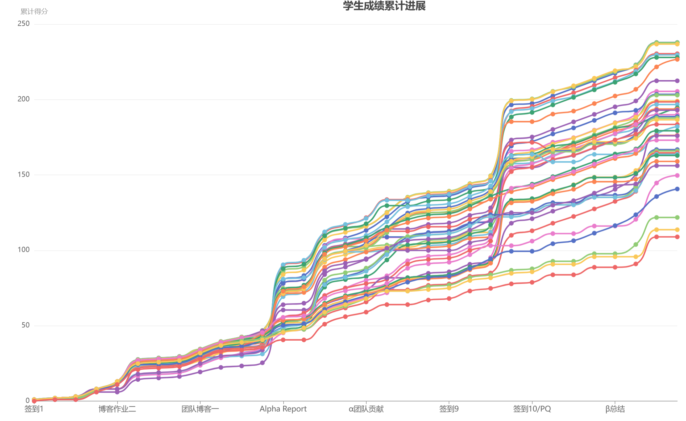
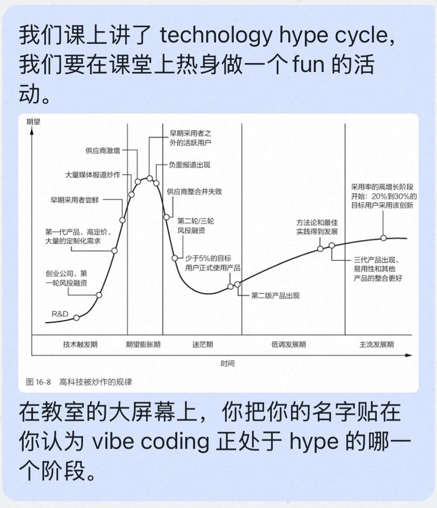
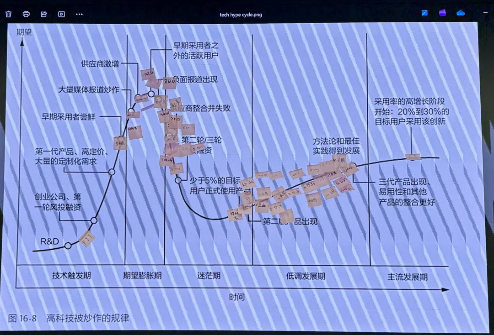
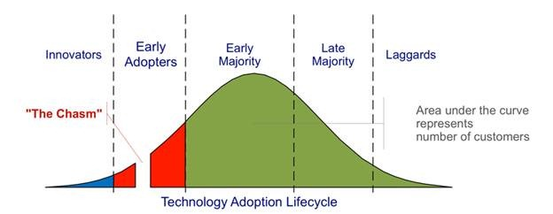
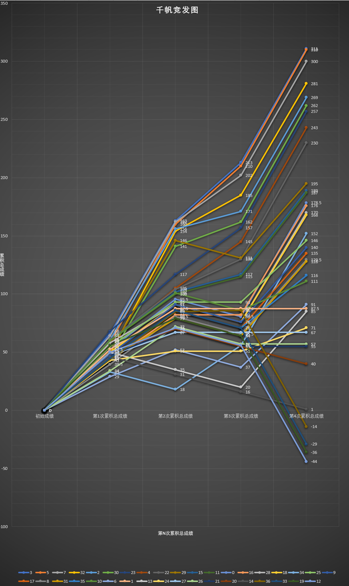

# 四种角度看软件工程

## ——AI 时代的软件工程课，从纯软件到智能硬件

2025 年秋季，我们开了一门“AI 时代的软件工程课”。今年秋季学期，课程继续开设，焦点从纯软件转向“AI 时代的智能硬件”。 课程链接： 
https://gitee.com/vibe-coding-2026-9/zgca_mse_202609

在进入新一季课程之前，回头总结去年四个视角下的教学收获，能帮我们更好地上好今年的课。

我们可以从四个角度来观察软件工程，以及个人在其中能起的作用：**船舱、甲板、山巅、太空**。前三个视角关注“我们在做什么”，第四个视角关注“我们为什么这样做”。

在 AI 时代，这四个角度下有一个必须回答的问题：每个角度下，学生要练什么？学生练的，和有 AI 工具在手时是完全一样的吗？

这个问题不能笼统回答。“有经验的工程师使用 AI 工作的终态”与“学生学习时必要的训练过程”是两个完全不同的阶段。混淆它们，会导致三种错误：

- 用终态否定训练的必要性（“反正 AI 会做，学它干嘛”）
- 用训练过程去要求终态（“AI 必须像我当年那样一步步来”）
- 在学习阶段直接模仿工作中的 AI 使用方式，跳过了“在必要的困难中学习”的过程 —— 结果是拿到了效率，却失去了判断力的培养

下面，我们分析：在每个角度下，学生练的是什么；这些训练，在“有 AI 工具在手”时，是应该被替代、被增强，还是被坚守。在每个视角的末尾，我们会用一行【主动减负】标注该视角下课程主动舍弃的内容。在第四节回望之后，我们将直面一个更艰难的问题：为了让这些训练真正有效，课程在整体上主动舍弃了什么？

## 一、船舱中的水手：扎根细节，锤炼基本功

首先，我们聚焦于“船舱中的水手”——这是学生扎根项目细节、锤炼工程基本功的阶段。

**为何重要：** 学生在具体项目细节中奋斗，体验代码、调试、沟通、交付的真实压力与温度。这是软件工程实践的基础，学生在这里学习将理论知识转化为实际可运行的代码，管理技术细节，并在时间压力下完成交付任务。

### 教学方法与分析

**结对编程的 API 驱动编程**

方法：学生两人一组，在编写任何实现代码之前，必须首先明确约定模块间的接口规范，包括数据格式、调用方式、错误处理等。这种“契约先行”的方式强制开发者将隐性的业务逻辑转化为显性的技术约定。在实现阶段，无论是人工编写还是借助 AI 生成代码，都必须严格遵循预先定义的接口。

**学生练的是什么：** 定义边界——把模糊的想法变成精确的契约，把隐性的理解变成显性的约定。这个能力，在 AI 时代不但没有贬值，反而更值钱了。

**有 AI 工具在手时一样吗：** 不一样，训练价值更高了。在没有 AI 的时代，接口定义错了，你可以在写代码的过程中慢慢修正，代价是返工。在 AI 时代，接口定义错了，AI 会严格按照你的错误定义生成一大堆代码，然后你会在一堆“看起来没问题”的代码中迷失。AI 放大了“定义错误”的代价，因此定义接口的训练变得更加关键。

需要补充的是，AI 在接口定义这件事上并不是只起负面作用。如果在 Prompt 中引入对抗审查——让 AI 扮演一个挑剔的调用方，对接口的边界条件、异常路径、并发场景进行反向质询——AI 恰恰能够**极早发现**人类接口定义中的模糊之处。课程中真正需要训练的，是学生是否具备“让 AI 审查自己”的意识和方法，而不是把 AI 当作一个只会顺着你说话的自动补全器。

**这里需要划定一条清晰的边界：外包样板代码并不等于免除手写。** 学生外包的是没有认知增量的“脚手架”——增删改查、配置文件、常见模式的模板代码。必须亲自动手推演的是核心算法的不变量、状态转移与临界条件。只有亲手推导过边界，才具备审核 AI 生成代码的准绳。这条边界，是“船舱训练”与“AI 协作”之间的分水岭。

> 田同学说：“结对最值钱的阶段不是两个人一起敲键盘，而是一起把 API、边界条件、测试口径说清楚。”

> 何同学则指出：“两个人对着同一个文档，理解能差出十万八千里。由于 API 定义不清晰导致的联调失败，简直是灾难。”

**PQ-问答与当堂测试**

方法：在课堂教学过程中，利用即时问答工具随机或按计划向学生提问，问题覆盖近期讲授的核心概念、技术要点或项目中的典型难题。学生需在规定时间内独立思考并提交答案。   https://pq.lab.bza.edu.cn/manual 

**学生练的是什么：** 在没有外部辅助的情况下，独立验证自己的理解。这是一种元认知能力——知道自己知道什么、不知道什么。

**有 AI 工具在手时一样吗：** 完全不一样，而且恰恰相反。有 AI 在手时，学生最容易陷入的陷阱是“以为自己懂了”——因为 AI 能快速给出看起来正确的答案，学生会产生“我也会了”的幻觉。当堂测试的价值，恰恰在于让学生在无外部工具辅助下验证自己的理解。

> 李同学反馈很直接：“当堂测试提供即时反馈，比‘回去自己觉得懂了’更可靠。”

这是“训练”与“终态”区别最明显的地方：终态中，你当然可以随时问 AI；训练中，你必须先学会不问 AI 也能判断。否则，你永远不会知道自己是真的懂了，还是只是会提问。 有了 AI，我们还要测试一些知识点么？ 是的。 测试并不是不能考记忆 —— 人类学习任何东西，都不可能把所有关键点都交给 AI 去查，自己脑子里空空如也。一定量的记忆是必要的：基本概念、核心原则、常见模式的名字和适用场景，这些东西记不住，你连 “该问 AI 什么” 都抓瞎。

**Alpha 阶段后强制团队人员变动**

方法：在项目完成 Alpha 版本后，课程强制要求部分团队成员在团队间进行交换。原有的项目需要接纳新成员，而新人也要融入新的项目组，接手陌生的代码库。

**学生练的是什么：** 理解知识传承的困难——亲身体会“代码只是载体，可交接的知识才是资产”。

**有 AI 工具在手时一样吗：** 不一样，但恰恰更需要。AI 无法重建已丢失的项目上下文与设计决策。AI 可以帮你读懂一段代码的语法，但无法告诉你“为什么当初这样设计”， “哪个决策是在什么约束下做的”，“哪段代码看起来丑但动不得”。强制换人让学生深刻体会：AI 能加速代码理解，但无法替代知识传承。

> 何同学的感悟令人印象深刻：“当我被迫去接手别人的代码，或者看着别人把我的代码改得面目全非时，我才痛彻心扉地理解了什么是‘可维护性’。”

> 姜同学则说：“它完美模拟了真实大厂中人员离职、新人接手的场景。”

这个环节的代价也需要被正视。 强制换组对原本配合良好的团队可能造成巨大的心理冲击，甚至导致项目半途停滞。往届课程中确实出现过“优秀团队被拆散后，两个新团队都元气大伤”的案例。课程的应对是：换组依据“产品缺口”而非“谁代码写得差”，助教在此环节做心理疏导，允许团队在章程中写下“我们保留异议”。但坦率地说，这个环节的阵痛无法完全消除 —— 它本身就是“摩擦即教育”设计的一部分。

这里还有一层更深的用意。人员流动、团队重组、与不熟悉的人重新磨合，这些是职业生涯的常态，不是例外。把这种常态提前带到训练中，有的学生受不了，这本身就值得他认真想一想：我期待的职业生涯到底是什么样的？ 是一个永远和和气气、直到退休都不变的团队（哪里找？），还是一个不断有人来、有人走、但每次都能重新组织起来把事情做成的团队？每个工程师早晚都要面对这个问题。

**Pre-mortem（预先尸检）**

方法：在项目或一个重要迭代开始之前，组织全体团队成员进行一场“逆向思维” —— “假设这个项目在未来失败了，请列出最可能导致失败的 3-5 个原因。”

**学生练的是什么：** 在行动之前，系统性地思考失败——一种对抗乐观偏见、对抗“快速试错”冲动的理性前置。

**有 AI 工具在手时一样吗：** 不一样，而且更需要了。AI 加速开发的同时也放大了“试错”的速度与潜在破坏力。AI 可以在几秒钟内生成大量代码，如果方向错了，这些代码就全是废品。Pre-mortem 机制迫使团队在编码前系统性、批判性地思考各种失败场景。

> 陈同学分享道：“我们在 Beta 阶段采用了 Pre-mortem 机制，提前识别出数据库迁移可能带来的联调风险。”

**【主动减负】** 船舱视角下，课程主动舍弃的是：纯语法和 API 记忆的考核、样板代码的手写训练、IDE 快捷键和命令行操作的课堂演示时间。这些内容交给速查表和 AI 即时查询，课堂时间留给接口定义、边界推演和失败预演。

## 二、甲板的互相观察：三人行，必有我师

在课程的大部分时间，学生都要走出自己具体的编码小环境，来到“甲板”上进行横向观察与比较。

**为何重要：** 三人行，必有我师焉。择其善者而从之，其不善者而改之。学生跳出自己项目的狭小船舱，走到甲板上，观察并对比其他团队的航行状态、技术选型、团队协作模式以及遇到的风浪。

**跨校甲板：不同学校的同步开课与开源展示**

这门课同时在不同的学校开设。每个学校的团队都在公开的平台上展示自己的进展：代码仓库、博客、演示视频、千帆竞发图。这个时候，“甲板”就不再局限于一个教室、一个班级，而是扩展到了不同学校之间。

不同学校的学生在甲板上互相观察对方，这本身就是很好的学习和驱动因素。

**为什么跨校观察有独特价值：** 同一个班级里的团队，面对的是同样的老师、同样的时间表、同样的评分标准。他们的“航行状态”有很强的同质性。而不同学校的团队，面对的是不同的资源条件、不同的项目方向、不同的团队文化。一个学校可能理论体系更扎实，另一个学校可能产品体验更敏锐；一个团队可能在分布式后端上走得更深，另一个团队可能在交互界面上琢磨得更透。这种差异，恰恰是“三人行”中最有价值的部分——你看到的不只是“别人做得比我好”，还有“别人用另一种方式在做”。

**开源方式如何支撑跨校观察：** 每个团队的代码仓库公开、博客公开、阶段演示公开。这意味着，一个学生不仅能看到自己班同学的项目，还能看到另一所学校同行的项目——他们的代码怎么组织、他们的接口怎么定义、他们的复盘怎么写、他们在遇到同样问题时选择了什么方案。这种“开源甲板”让观察的广度和深度都大大增加。

**对学生的驱动作用：** 当学生知道自己的代码、博客、演示不仅被本班同学看到，还被其他学校的同行看到时，责任感和“作品感”会显著提升。

> 何同学说的“公开处刑”效应，在跨校场景下会更强烈。

同时，看到其他学校的团队在做类似的事情、遇到类似的困难、用不同的方式解决，会让学生获得一种“同行者”的激励——你不是一个人在船舱里挣扎，整片海域上有很多船在同时航行。

**对教师的启示：** 跨校开课本身就是一种“甲板观察”。教师可以看到不同学校的教学节奏、学生反馈、项目质量，从而调整自己的教学策略。这种“教师的甲板”和“学生的甲板”是同一件事的两面。

### 教学方法与分析

**以公开博客来交作业**

方法：课程要求所有阶段性作业、项目反思、技术总结等均以个人博客的形式公开发布在互联网上。

**学生练的是什么：** 思维的强制显性化——把模糊的感受变成清晰的文字，把隐性的理解变成可被审视的表述。

**有 AI 工具在手时一样吗：** 不一样，而且更需要。当 AI 能轻易生成“看似深刻”的文本时，公开博客迫使学生在同侪的真实经验、挫折与叙事中寻找洞见。它培养了在信息泛滥时代，鉴别、比较、整合与批判性吸收真实工程经验的核心能力。

> 何同学的转变很有代表性：“最开始我很抵触，觉得写博客是形式主义。但后来发现，这其实是一种‘思维的强制显性化’，必须把逻辑理顺了才能发出来。”

> 闫同学则说：“当问题被写出来、被公开之后，就不能再靠‘差不多’来混过去了。”

这里有一个关键区别：AI 可以帮你写博客，但 AI 写不出你的经历。博客训练的是从经历中提取认知的能力。这个能力，AI 无法替代。在跨校开源的场景下，博客还多了一层作用：它让不同学校的学生能够互相看见对方的思考过程，而不只是看到最终结果。

**千帆竞发图的进度跟踪**

方法：教师利用可视化工具实时展示全班所有团队的项目进度，形成清晰、直观的横向对比。当多个学校同时开课时，千帆竞发图可以扩展到跨校视图——不同学校的团队在同一张图上展示进度。

**学生练的是什么：** 获得相对坐标——知道自己在全班中处于什么位置，知道别人在做什么、做得怎么样。在跨校场景下，这个坐标系的维度更丰富：不只有“本班最强”，还有“跨校对比”。

**有 AI 工具在手时一样吗：** 不一样，而且更复杂了。在 AI 工具可能抹平部分个体生产力差异的表象下，千帆图揭示了进度、质量、协作效率、文档完整性等多元维度的真实差异。它激励学生超越“用 AI 完成功能”的单一目标，关注工程过程的系统性优化与团队协作的有效性。

> 田同学认为：“千帆竞发图把进度可视化，外界反馈会提前到达，而不是期末才发现落后。”

在跨校场景下，千帆图还能揭示不同学校在资源、节奏、项目方向上的差异，让每个团队都能找到自己的参照系。

**学生自行组队并选择项目**

方法：课程不指定项目题目，也不强制分配团队。学生需根据个人兴趣、技术背景和发展方向，自行寻找队友，并共同确定一个想要在学期中实现的软件项目。

**学生练的是什么：** 在不确定性中定义真实问题、组建互补团队、管理内部期望。

**有 AI 工具在手时一样吗：** 不一样，而且更关键了。AI 降低了实现想法的技术门槛，使得“选择做什么”比“能否做出来”更为关键。

> 田同学的总结很精辟：“自主选择会显著提高责任感（因为项目失败无法甩锅给题目）。”

在跨校场景下，学生还能看到其他学校的团队选了什么样的题目，从而反思自己的选题是否足够有挑战、足够有价值。

**学生自己评价其它同学的项目**

方法：在项目展示环节，评价者不仅是老师和助教，全体学生都参与打分和评价。在跨校场景下，互评可以扩展到跨校互评——不同学校的学生互相评价对方的项目。

**学生练的是什么：** 像投资者、用户或同行专家一样思考——学会用客观证据而非主观感觉来评判项目。

**有 AI 工具在手时一样吗：** 不一样，而且更必要了。AI 能生成酷炫的 demo，但难以评估其真实用户价值、市场可行性及团队执行力。互评训练学生用客观证据评判项目，这是对抗 AI“虚假繁荣”、培养批判性思维的有效训练。

> 何同学的反馈很尖锐：“天使投资评审这个环节把不管不顾的技术自嗨直接打回原形。它强迫我们从‘Maker’视角切换到‘Stakeholder’视角。”

在跨校场景下，互评还多了一层挑战：不同学校的项目方向、资源条件、评价标准可能不同，学生需要学会在差异中给出公正的判断。

**【主动减负】** 甲板视角下，课程主动舍弃的是：对博客排版工整度、字数篇幅的硬性要求；对千帆竞发图“每日必须更新”的机械考核；对互评表格式统一性的苛求。这些形式化的负担被降到最低，学生的时间留给“写清楚自己的思考”和“认真读别人的项目”。

## 三、山巅的远眺：从工匠到领军人物

最后，学生们时不时要登上“山巅”，以更宏观的视角审视行业趋势、伦理责任与个人职业发展。

**为何重要：** 引导学生登上技术和思想的“山巅”：一方面，任何技术的发展都有其生命周期；另一方面，学生需要超越当下课程项目的具体细节，以更宏观、更长远的视角审视软件工程学科的本质、AI 技术浪潮带来的范式变革，以及个人在技术行业中的职业定位与发展路径。

我们做了一个即时统计，鼓励（迫使）同学们把自己正在学的技术和宏大技术发展周期，全行业的趋势，全体开发者、投资者、用户对某个技术的接受度... 结合起来思考。这是同学们投票的结果和分析： https://mp.weixin.qq.com/s/8dvRm9LPzGnehe0rCxsRxQ 

### 教学方法与分析

**天使投资评选**

方法：课程引入模拟的“天使投资”环节，要求每个项目团队不仅展示技术实现，更要像创业公司一样进行“路演”。

**学生练的是什么：** 把技术方案翻译成商业价值——从“我做了什么”转向“这东西值不值得投资”。

**有 AI 工具在手时一样吗：** 不一样，而且更核心了。当技术实现成本因 AI 而趋近于零时，资本与市场关注的焦点彻底转向了可验证的价值创造、清晰的商业模式和可持续的竞争优势。 这也能让同学们深入思考 “如何跨越创新的鸿沟”，成功地把新技术推向更广大的市场：

> 费同学的反馈很到位：“它把评价从‘技术难不难’拉回到‘产品值不值、风险控不控、证据够不够’。”

**用户采访视频 + NPS 打分**

方法：课程强制要求每个项目团队必须找到至少 3-5 名真实的目标用户，对他们进行产品使用的采访，并录制视频。

**学生练的是什么：** 面对真实世界的反馈——接受用户的不耐烦、困惑、失望，并从中提取改进方向。

**有 AI 工具在手时一样吗：** 不一样，而且更不可替代。AI 可以模拟用户行为、生成用户反馈，但无法替代真实人类在使用产品时的情感变化、挫折体验和不可预测的行为。

> 李同学的反馈很有力：“课程方法中最震撼的现实检验是用户采访视频 + NPS 打分。用户在公开视频中的真实反馈直接戳破团队的想象中的酷炫。”

**提出 5 个问题 → 期末自答 + 新问题**

方法：在学期初阅读教材后，每位学生必须提出 5 个自己最困惑或最感兴趣的、关于软件工程本质或实践的问题。在期末总结中，学生需要系统地回答这 5 个问题，并基于一学期的新认知，再提出 3-5 个新的、更深层次的问题。

**学生练的是什么：** 从被动的知识消费者，转变为主动的问题探索者——形成“提问-探索-解答-再提问”的螺旋式上升学习闭环。

**有 AI 工具在手时一样吗：** 不一样，而且更根本。AI 能高效解答已知问题，但无法替代人类发现和定义新问题的能力。

> 宋同学的总结令人深思：“回头看，第一篇博客里的五个问题，并没有被‘彻底解答’，但它们确实把我带进了一个需要持续提问、持续修正、持续承担责任的工程世界。”

> 马同学则说：“它没有教我如何把程序写出来，而是让我开始理解如何让软件真正活下来。”

**个性化自我总结、量化总结**

方法：课程提供一份结构化的软件工程师能力自我评价表，学生在学期初和学期末分别对照此表进行自我评分。

**学生练的是什么：** 建立清晰、客观的个人能力坐标系——知道自己在哪些维度上成长了，在哪些维度上还差得远。

**有 AI 工具在手时一样吗：** 不一样，而且更必要。在 AI 工具可能模糊个人能力边界、甚至造成“能力幻觉”的时代，系统性的、基于证据的自我评估帮助学生识别哪些是 AI 可以增强的能力，哪些是 AI 难以替代、需要重点发展的核心能力。

> 田同学的自我评价很具体：“我选三项变化最明显的：第二维（AI 原生架构）从 2 到 3，第五维（智能开发）从 2 到 3，第六维（工程领导）从 12 到 23。”

**【主动减负】** 山巅视角下，课程主动舍弃的是：对商业计划书格式的刻板要求、对 PPT 动画效果的评分、对演讲辞藻的过度雕琢。重点放在“价值主张是否清晰”“用户证据是否扎实”“自我评估是否有据”。

## 四、太空回望：软件工程七十年，什么在变，什么没变？
## 四、太空回望：这是软件工程的终点，还是更大的机会？

当宇航员从太空回望地球，最强烈的感受是尺度的跃迁：地表纠结的万千细节，在星际尺度下不过沧海一粟。

软件工程走过的近六十年，始终伴随着“程序员即将消亡”的宿命论。今天，当 AI 以毫秒级速度生成海量代码，这个追问再次被逼到悬崖边缘：**这是软件工程的终点，还是软件工程师前所未有的时代红利？**

如果把软件工程狭隘地定义为“敲键盘把需求翻译成语法”，那它确实已经走到了终点；但如果软件工程的本质是**在不确定性中定义问题、驾驭复杂度并对不可逆的后果负责**，那么历史恰恰把真正的舞台交还给了人类。

代码的通胀让生产工具的边际成本趋近于零，而系统级工程的价值暴涨。AI 拥有吞吐历史的知识，但缺位的是承担历史代价的体验。

**我坚信：AI 可以平替我们作为软件工程师大约 90% 的常规能力，但它同时能将我们剩下那 10% 的独特能力放大 1000 倍。**

因此，在 AI 时代，软件工程师依然大有可为。低维的语法记忆、样板代码堆砌与常规增删改查这 90% 的执行层工作正在急速贬值；但当泥瓦匠的砌砖活被自动化，软件工程师必须完成向“总建筑师（Builder）”的跃迁。

关键在于：**我们如何主动培养和打磨那 10% 的独特能力，让 AI 真正成为超级放大器，而不是替代者？** 结合数十年的工程反思与教学实践，现代软件工程教学必须聚焦于三大核心维度的重构：

---

这三项能力在教学中具体表现为三个不可替代的支点：

* **驾驭工程（Harness Engineering）**：核心从“亲手构造”转向“设计约束”。AI 是一匹能瞬时产出海量代码的烈马，工程师的竞争力在于能否通过测试阵列、契约与红蓝对抗，给生成力套上确定性的缰绳。
* **工程审美与质量操守（Taste & Integrity）**：在统计学中位数的平庸代码中鉴别卓越。通过精读经典系统与开源公开审判，建立对极简架构、正交解耦的直觉，坚守安全性与工程伦理的底线，拒绝制造技术垃圾山。
* **穿透真实需求（Empathy & Problem Framing）**：击碎“做出没人要的完美系统”的技术自嗨。AI 无法共情人类的困境与焦虑，唯有通过直面真实用户的残酷反馈（如 NPS 现场测评），工程师才能精准定义真问题与商业价值。

**教育的“慢”对抗工具的“快”：那 10% 的能力只能在充满挑战的实践中熬出来**

然而，这里横亘着一个最残酷、也最让教育者焦虑的悖论：**工具的迭代以天计，代码的生成以秒计，但那 10% 决定生死的高阶能力，其习得过程偏偏是极其缓慢、痛苦且充满挫败的。**

人类大脑认知结构的重塑有其固有的时间常数——正如人类生命的孕育无法加速，对复杂系统的直觉感知、对工程伦理的敬畏、以及对用户隐秘痛点的共情，绝不可能通过几句精妙的 Prompt “即时下载”。

* **系统思考**，只能在无数次推倒重来的架构重构与深夜排障的绝望中内化；
* **需求洞察**，只能在被真实用户一次次冷水泼醒的尴尬与难堪中顿悟；
* **职业道德与质量操守**，只能在亲身体会过数据丢失、系统瘫痪甚至接口事故的惊悚中铸就。

这正是大学与正规工程训练存在的终极理由：**在一个追求无痛、即时反馈的时代，主动为学生守护一片允许试错、允许缓慢、甚至刻意制造摩擦的演练场。**

如果我们因为 AI 的神速，就妄想取消学生在泥泞中跋涉的过程，培养出来的充其量只是在沙滩上熟练拼装预制件的短工；当现实的风暴来临，唯有那些亲手在岩石上开凿过地基的人，才守得住整座大厦。

---

**太空回望的终极启示**

没有一种算法能替你感知美丑，没有一种模型能替你共情人类的困境，更没有一种工具能替你对系统的崩溃承担最终后果。

这正是现代软件工程教育的重构逻辑：主动剔除那 90% 注定被平替的低维记忆与样板苦工，把宝贵的教学摩擦与极其奢侈的探索时间，全部砸在那 10% 的核心能力上——**对复杂问题的系统性思考、对用户真实需求的深刻洞察、对工程质量与职业道德的坚守，以及在不确定环境中持续学习、迭代与领导团队的能力。**

我们不必害怕“慢”。因为在 AI 时代，快的是工具，慢的才是壁垒。

代码可以一键生成，但认知不能，审美不能，责任不能。这绝不是软件工程的终点，而是属于真正工程建造者的黄金时代。

## 五、今年新焦点：桌面智能硬件对四种视角的刚性测试

以上四节讨论的是软件工程的通用框架，也是去年课程的总结。今年秋季学期，课程焦点转向“AI 时代的智能硬件”。硬件场景是对通用框架的一次极端测试——当软件工程的核心技能面对物理世界时，哪些依然成立，哪些被放大，哪些被逼到了极限。

**接口定义被物理约束逼到极限。** 纯软件项目中，接口定义错了，改代码就行。硬件项目中，接口定义错了，可能是电路板重新设计、传感器重新选型、结构件重新开模。API 驱动编程在硬件场景下的重要性被放大了数倍。

**知识传承被物理知识叠加。** 纯软件项目中，可交接的知识主要是代码、文档、测试。硬件项目中，可交接的知识还包括硬件调试经验、传感器标定参数、供电方案的选择理由、结构件的公差处理。强制换组在硬件项目中变得更加残酷，也更加有价值。

**用户反馈被物理设备放大。** 纯软件项目中，用户反馈主要关于功能和界面。硬件项目中，用户反馈还包含“这个设备放在桌上好不好看”“摸起来手感如何”“噪音大不大”“灯太亮吗”。真实的物理设备让用户反馈变得更加直接，也更加不可预测。

**商业价值被供应链和成本约束。** 纯软件项目中，成本主要是人力。硬件项目中，BOM 成本、模具费用、量产良率、供应链周期都成为商业价值的关键变量。天使投资环节在硬件项目中必须回答一个更硬的问题：这东西真的能做出来吗？做出来之后卖多少钱？能不能量产？

这就是为什么硬件场景对软件工程教育有特殊价值：**它让很多在纯软件项目中可以被暂时忽略的问题，变得不可回避。** AI 可以帮你写代码，但无法帮你把硬件做出来、把成本降下来、把供应链跑通。物理世界的不可逆性，是对软件工程判断力的终极检验。

去年纯软件课程积累的四个视角的训练方法，今年将在这个更硬、更不可逆的场景中接受检验。这也是我们把去年的收获写下来的原因——**知道哪些训练在纯软件中有效，才能判断它们在硬件中是否依然有效、需要怎样调整。**

## 六、总结：每个角度下，“终态”与“训练”的分野

现在，我们可以回答那个核心问题了：**每个角度下，学生练的，和有 AI 工具在手时是完全一样的吗？**

**船舱角度：** 训练的是定义边界、独立验证、理解知识传承、系统性思考失败。有 AI 在手时，这些能力不但没有被替代，反而被放大——因为 AI 会加速错误定义的后果、会制造“我懂了”的幻觉、会掩盖知识传承的困难、会放大快速试错的破坏力。船舱的训练必须坚守，而且要比 AI 时代之前更严格。

**甲板角度：** 训练的是思维显性化、获得相对坐标、定义真实问题、像投资者一样思考。有 AI 在手时，这些能力变得更关键——因为 AI 能生成看似深刻的内容、能抹平表面生产力差异、能降低实现门槛、能制造“虚假繁荣”。跨校开源展示让甲板的范围从班级扩展到学校之间，观察的广度和深度都大大增加。甲板的训练必须坚守，而且要比 AI 时代之前更强调“真实经验”。

**山巅角度：** 训练的是翻译商业价值、面对真实反馈、主动探索问题、建立能力坐标系。有 AI 在手时，这些能力变得更加不可替代——因为 AI 无法替你判断值不值得做、无法替你面对用户的不满、无法替你发现新问题、无法替你评估自己的成长。山巅的训练必须坚守，而且要比 AI 时代之前更早开始。

**太空角度：** 训练的是回望的能力——从历史中理解现在，从更大的尺度理解什么是重要的。有 AI 在手时，这个能力是唯一能让你不被 AI 淹没的能力。因为 AI 拥有历史数据，却缺乏承担历史代价的体验。它能够检索出七十年来的所有范式，却无法替人在历史潮汐与技术沉浮中感知“为什么某些妥协是不可避免的”。只有人，才能从七十年、一百年、甚至更长的尺度，理解软件工程的本质。

### 课程主动舍弃了什么？

教学改革不能只有加法。为了给上述核心训练腾出认知带宽，这门课在 AI 时代主动做了以下减法：

**降级纯语法和 API 记忆。** 不需要学生记住所有函数签名，AI 和文档就是最好的“第二大脑”。课堂时间不花在语法细节上。

**外包样板代码的编写。** 增删改查、常见设计模式的实现、测试骨架、配置文件——这些交给 AI 生成，学生只做审核和集成。但外包不等于免除手写：核心算法的不变量、状态转移与临界条件，学生必须亲手推演。

**简化环境配置和工具操作。** Git 命令、IDE 快捷键、云平台控制台操作——发一份速查表就够了，不专门占用课堂时间。

**降低对“从零手写完整系统”的要求。** 重点从“你能不能一行行写出来”转向“你能不能判断 AI 写出来的东西对不对、好不好、值不值得用”。

**减少形式化的交付物负担。** 博客排版、PPT 动画、周报格式、互评表格的工整度——这些被降到最低，学生的时间留给“真实的思考”和“扎实的证据”。

**这些减法的共同逻辑是：把训练时间从“AI 已经能做得比你快”的事情上，转移到“AI 无法替你判断”的事情上。**

**一句话总结：AI 越强，“怎么做”越便宜，“做什么”和“为什么做”就越值钱。而“做什么”和“为什么做”的判断力，只能通过亲身经历摩擦来获得。**

AI 不能替你在 V1 演示翻车后面对质疑、重写核心模块。AI 不能替你在被换组后接手别人代码、在痛苦中领悟可维护性。AI 不能替你完成从“我以为很简单”到“我懂了什么是难”的认知跃迁。

**代码可以生成，但认知不能。体验不能。使命不能。**

那些经历了这一切，并在学期末回答了学期初提出的问题的学生——他们可能忘记课上学过的所有具体技能，但他们永远不会忘记那种“在摩擦中活下来”的感觉。而这，恰恰是这门课最想传递的东西，也是 AI 时代软件工程教育最不可替代的价值。

## 既然你看到了这里
这是几年前的千帆竞发图的一个例子，有些同学因为不按时交作业，获得负分，他们的学习小帆船沉到了水平面下。学习是一个困难而充满挑战的过程，并不是 “每次都签到” 就能学到东西，在 AI 时代，我们还要分清， 是 AI 淘汰了某些同学， 还是他们自己放任自流淘汰了自己？ 

