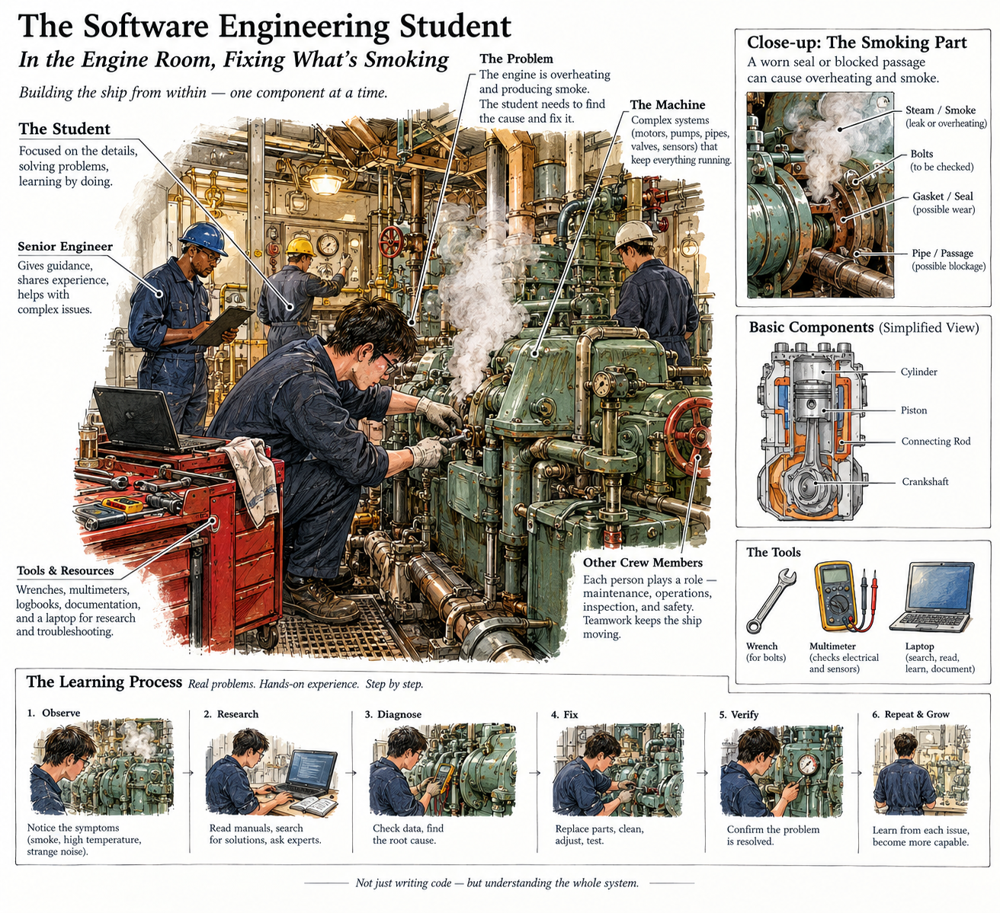
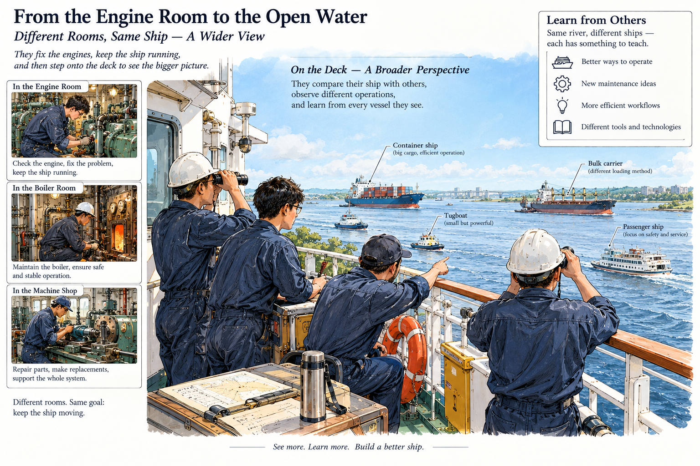

# 四种角度看软件工程课

## ——AI 时代的软件工程课，从纯软件到智能硬件

2025 年秋季，我们开了一门“AI 时代的软件工程课”。也有一些总结：
软件工程的 “船舱、甲板、山巅”：  
https://mp.weixin.qq.com/s/ChGA05sc-s7I1foW9HFrQg  

把 “发布会” 开到了教室：  
https://mp.weixin.qq.com/s/Rls8GpojX0ftYpMxgZ5m9g  

今年秋季，课程继续开设，焦点从纯软件转向“AI 时代的智能硬件”。课程链接：  
https://gitee.com/vibe-coding-2026-9/zgca_mse_202609 
还有其它院校（如 福州大学）也开辟了公开的软件工程课： 
https://bbs.csdn.net/forums/FZU_university_2026  
https://bbs.csdn.net/forums/2601_CS_SE_FZU  
https://bbs.csdn.net/forums/2601_MU_SE_FZU 

在进入新一季课程之前，回头总结去年多个视角下的教学收获，能帮我们更好地上好今年的课。

我们可以从四个层层递进的视角来观察软件工程，以及个人在其中能起的作用：**船舱、甲板、山巅、总观**。前三个视角关注“我们在做什么”，第四个视角关注“我们为什么这样做”。

在 AI 时代，这四个视角下有一个必须回答的问题：每个角度下，学生要练什么？学生练的，和有 AI 工具在手时是完全一样的吗？

这个问题不能笼统回答。“有经验的工程师使用 AI 工作的终态”与“学生学习时必要的训练过程”是两个完全不同的阶段。混淆它们，会导致三种错误：

- 用终态否定训练的必要性（“反正 AI 会做，学它干嘛”）
- 用训练过程去要求终态（“AI 必须像我当年那样一步步来”）
- 在学习阶段直接模仿工作中的 AI 使用方式，跳过了“在必要的困难中学习”的过程——结果是拿到了效率，却失去了判断力的培养

下面，我们逐个视角分析：每个视角下，学生练的是什么；这些训练，在“有 AI 工具在手”时，是应该被替代、被增强，还是被坚守。在每个视角的末尾，我们会用一行【主动减负】标注该视角下课程主动舍弃的内容。最后，我们将直面一个更艰难的问题：为了让这些训练真正有效，课程在整体上主动舍弃了什么？

## 一、船舱：让学生亲手经历什么？

“船舱中的水手”是学生扎根项目细节、锤炼工程基本功的阶段。学生在具体项目的细节中奋斗，体验设计、代码、调试、沟通、交付的真实压力，这是软件工程实践的基础。在 2026 年，我们还有基于桌面智能硬件的创新设计。 有下面这些门类：
- 智能台灯 / 桌面机械臂
- 桌面聊天伙伴
- 电子小狗，桌面小坦克 + 摄像头
- 智能推送信息的墨水屏/信息屏
- 其它

### 核心方法

（一）**结对设计/编程 + API 驱动编程**：两人一组，在编写任何实现代码之前，必须首先明确约定模块间的接口规范。这种“契约先行”的方式强制开发者将隐性的业务逻辑转化为显性的技术约定。在实现阶段，无论人工编写还是 AI 生成代码，都必须严格遵循预先定义的接口。

- 学生练的是什么： 定义边界——把模糊的想法变成精确的契约，把隐性的理解变成显性的约定。这个能力，在 AI 时代不但没有贬值，反而更值钱了。

- 有 AI 工具在手时一样吗：** 不一样，训练价值更高了。在没有 AI 的时代，接口定义错了，你可以在写代码的过程中慢慢修正，代价是返工。在 AI 时代，接口定义错了，AI 会严格按照你的错误定义生成一大堆代码，然后你会在一堆“看起来没问题”的代码中迷失。AI 放大了“定义错误”的代价。

> 田同学说：“结对最值钱的阶段不是两个人一起敲键盘，而是一起把 API、边界条件、测试口径说清楚。”

> 何同学则指出：“两个人对着同一个文档，理解能差出十万八千里。由于 API 定义不清晰导致的联调失败，简直是灾难。”

- 这里需要划定一条清晰的边界：外包样板代码并不等于免除手写。** 学生外包的是没有认知增量的“脚手架”——增删改查、配置文件、常见模式的模板代码。必须亲自动手推演的是核心算法的不变量、状态转移与临界条件。只有亲手推导过边界，才具备审核 AI 生成代码的准绳。

（二）**PQ-问答与当堂测试**：利用即时问答工具随机或按计划向学生提问，学生需在规定时间内独立思考并提交答案。  
链接：https://pq.lab.bza.edu.cn/manual

- 学生练的是什么： 在没有外部辅助的情况下，独立验证自己的理解。这是一种元认知能力 —— 知道自己知道什么、不知道什么。

- 有 AI 工具在手时一样吗：** 完全不一样，而且恰恰相反。有 AI 在手时，学生最容易陷入的陷阱是“以为自己懂了”——因为 AI 能快速给出看起来正确的答案，学生会产生“我也会了”的幻觉。当堂测试的价值，恰恰在于让学生在无外部工具辅助下验证自己的理解。

> 李同学反馈很直接：“当堂测试提供即时反馈，比‘回去自己觉得懂了’更可靠。”

有了 AI，我们还要测试一些知识点么？是的。测试并不是不能考记忆——人类学习任何东西，都不可能把所有关键点都交给 AI 去查，自己脑子里空空如也。一定量的记忆是必要的：基本概念、核心原则、常见模式的名字和适用场景，这些东西记不住，你连“该问 AI 什么”都抓瞎。

（三）Alpha 阶段后强制团队人员变动：在项目完成 Alpha 版本后，课程强制要求部分团队成员在团队间进行交换。原有的项目需要接纳新成员，而新人也要融入新的项目组，接手陌生的代码库。

- 学生练的是什么：理解知识传承的困难——亲身体会“代码只是载体，可交接的知识才是资产”。

- 有 AI 工具在手时一样吗： 不一样，但恰恰更需要。AI 无法重建已丢失的项目上下文与设计决策。AI 可以帮你读懂一段代码的语法，但无法告诉你“为什么当初这样设计”“哪个决策是在什么约束下做的”“哪段代码看起来丑但动不得”。

> 何同学的感悟令人印象深刻：“当我被迫去接手别人的代码，或者看着别人把我的代码改得面目全非时，我才痛彻心扉地理解了什么是‘可维护性’。”

> 姜同学则说：“它完美模拟了真实大厂中人员离职、新人接手的场景。”

这个环节的代价也需要被正视。强制换组对原本配合良好的团队可能造成巨大的心理冲击，甚至导致项目半途停滞。往届课程中确实出现过“优秀团队被拆散后，两个新团队都元气大伤”的案例。课程的应对是：换组依据“产品缺口”而非“谁代码写得差”，助教在此环节做心理疏导，允许团队在章程中写下“我们保留异议”。但坦率地说，这个环节的阵痛无法完全消除——它本身就是“摩擦即教育”设计的一部分。

这里还有一层更深的用意。人员流动、团队重组、与不熟悉的人重新磨合，这些是职业生涯的常态，不是例外。把这种常态提前带到训练中，有的学生受不了，这本身就值得他认真想一想：我期待的职业生涯到底是什么样的？是一个永远和和气气、直到退休都不变的团队（哪里找？），还是一个不断有人来、有人走、但每次都能重新组织起来把事情做成的团队？每个工程师早晚都要面对这个问题。

（四）**Pre-mortem（预先尸检）**：在项目或一个重要迭代开始之前，组织全体团队成员进行一场“逆向思维”——“假设这个项目在未来失败了，请列出最可能导致失败的 3-5 个原因。”

- 学生练的是什么：在行动之前，系统性地思考失败——一种对抗乐观偏见、对抗“快速试错”冲动的理性前置。

- 有 AI 工具在手时一样吗： 不一样，而且更需要了。AI 加速开发的同时也放大了“试错”的速度与潜在破坏力。AI 可以在几秒钟内生成大量代码，如果方向错了，这些代码就全是废品。

> 陈同学分享道：“我们在 Beta 阶段采用了 Pre-mortem 机制，提前识别出数据库迁移可能带来的联调风险。”

## 二、甲板：学生如何从同伴与社区中学习？

“甲板上的互相观察”是学生走出自己具体的编码小环境，进行横向观察与比较的阶段。三人行，必有我师焉。择其善者而从之，其不善者而改之。

**跨校甲板：不同学校的同步开课与开源展示**

这门课同时在不同的学校开设。每个学校的团队都在公开的平台上展示自己的进展：产品设计、代码仓库、博客、演示视频、千帆竞发图。这个时候，“甲板”就不再局限于一个教室、一个班级，而是扩展到了不同学校之间。

不同学校的学生在甲板上互相观察对方，这本身就是很好的学习和驱动因素。

同一班级的团队面对相同的老师、时间表和评分标准，同质性较强。不同学校的团队则在资源条件、项目方向、团队文化上各有差异，能看到别人用不同的方式解决问题 —— 这正是 “甲板观察” 中有独特价值的部分。

开源展示让这种观察更为方便。代码仓库、博客和阶段演示都公开，学生不仅能看到本校同学的项目，还能看到其他学校同行的项目。当学生知道自己的代码、博客和演示会被其他学校的同行看到时，责任感和“作品感”会显著提升。

> 公开了源代码和其它资料，大家感觉到了 “公开处刑” 效应，在跨校场景下会更强烈。

同时，看到其他学校的团队在做类似的事情、遇到类似的困难、用不同的方式解决，会让学生获得一种“同行者”的激励——你不是一个人在船舱里挣扎，整片海域上有很多船在航行。

### 核心方法

（一）**以公开博客来交作业**：课程要求所有阶段性作业、项目反思、技术总结等均以个人博客的形式公开发布在互联网上。

- 学生练的是什么：思维的强制显性化——把模糊的感受变成清晰的文字，把隐性的理解变成可被审视的表述。

- 有 AI 工具在手时一样吗： 不一样，而且更需要。当 AI 能轻易生成“看似深刻”的文本时，公开博客迫使学生在同侪的真实经验、挫折与叙事中寻找洞见。

> 何同学的转变很有代表性：“最开始我很抵触，觉得写博客是形式主义。但后来发现，这其实是一种‘思维的强制显性化’，必须把逻辑理顺了才能发出来。”

> 闫同学则说：“当问题被写出来、被公开之后，就不能再靠‘差不多’来混过去了。”

AI 可以帮你写博客，但 AI 写不出你的经历。博客训练的是从经历中提取认知的能力。

（二） **千帆竞发图的进度跟踪**：教师利用可视化工具实时展示全班所有团队的项目进度，形成清晰、直观的横向对比。当多个学校同时开课时，千帆竞发图可以扩展到跨校视图。

- 学生练的是什么： 获得相对坐标——知道自己在全班中处于什么位置，知道别人在做什么、做得怎么样。

- 有 AI 工具在手时一样吗： 不一样，而且更复杂了。在 AI 工具可能抹平部分个体生产力差异的表象下，千帆图揭示了进度、质量、协作效率、文档完整性等多元维度的真实差异。

> 田同学认为：“千帆竞发图把进度可视化，外界反馈会提前到达，而不是期末才发现落后。”

（三）**学生自行组队并选择项目**：课程不指定项目题目，也不强制分配团队。学生需根据个人兴趣、技术背景和发展方向，自行寻找队友，并共同确定一个想要在学期中实现的软件项目。必要的时候，可以合并两个 “二人结对” 的项目到一个团队项目。 

- 学生练的是什么： 在不确定性中定义真实问题、组建互补团队、管理内部期望。

- 有 AI 工具在手时一样吗：不一样，而且更关键了。AI 降低了实现想法的技术门槛，使得“选择做什么”比“能否做出来”更为关键。

> 田同学的总结很精辟：“自主选择会显著提高责任感（因为项目失败无法甩锅给出题人）。”

（四）**学生自己评价其它同学的项目**：在项目展示环节，评价者不仅是老师和助教，全体学生都参与打分和评价。在跨校场景下，互评可以扩展到跨校互评。

- 学生练的是什么： 像投资者、用户或同行专家一样思考——学会用客观证据而非主观感觉来评判项目。

- 有 AI 工具在手时一样吗： 不一样，而且更必要了。AI 能生成酷炫的 demo，但难以评估其真实用户价值、市场可行性及团队执行力。

> 何同学的反馈很尖锐：“天使投资评审这个环节把不管不顾的技术自嗨直接打回原形。它强迫我们从‘Maker’视角切换到‘Stakeholder’视角。”

## 三、山巅：如何以宏观视角审视行业、伦理与职业发展？

学生们时不时要登上“山巅”，以更宏观的视角审视行业趋势、伦理责任与个人职业发展。

任何技术的发展都有其生命周期。从山巅俯瞰，目前很火热的技术在整个生命周期中处于什么位置？

我们做了一个即时统计，鼓励（迫使）同学们把自己正在学的技术和宏大技术发展周期，全行业的趋势，全体开发者、投资者、用户对某个技术的接受度……结合起来思考。这是同学们投票的结果和分析：  

https://mp.weixin.qq.com/s/8dvRm9LPzGnehe0rCxsRxQ

### 核心方法

（一）**天使投资评选**：课程引入模拟的“天使投资”环节，要求每个项目团队不仅展示技术实现，更要像创业公司一样进行“路演”。

- 学生练的是什么：把技术方案翻译成商业价值——从“我做了什么”转向“这东西值不值得投资”。

- 有 AI 工具在手时一样吗： 不一样，而且更核心了。当技术实现成本因 AI 而趋近于零时，资本与市场关注的焦点彻底转向了可验证的价值创造、清晰的商业模式和可持续的竞争优势。这也能让同学们深入思考“如何跨越创新的鸿沟”，成功地把新技术推向更广大的市场：

> 费同学的反馈很到位：“它把评价从‘技术难不难’拉回到‘产品值不值、风险控不控、证据够不够’。”

（二）用户采访视频 + NPS 打分**：课程强制要求每个项目团队必须找到至少 3-5 名真实的目标用户，对他们进行产品使用的采访，并录制视频。

- 学生练的是什么： 面对真实世界的反馈——接受用户的不耐烦、困惑、失望，并从中提取改进方向。

- 有 AI 工具在手时一样吗： 不一样，而且更不可替代。AI 可以模拟用户行为、生成用户反馈，但无法替代真实人类在使用产品时的情感变化、挫折体验和不可预测的行为。

> 李同学的反馈很有力：“课程方法中最震撼的现实检验是用户采访视频 + NPS 打分。用户在公开视频中的真实反馈直接戳破团队的想象中的酷炫。”

（三） **提出 5 个问题 → 期末自答 + 新问题**：在学期初阅读教材后，每位学生必须提出 5 个自己最困惑或最感兴趣的、关于软件工程本质或实践的问题。在期末总结中，学生需要系统地回答这 5 个问题，并基于一学期的新认知，再提出 3-5 个新的、更深层次的问题。

- 学生练的是什么： 从被动的知识消费者，转变为主动的问题探索者——形成“提问-探索-解答-再提问”的螺旋式上升学习闭环。

- 有 AI 工具在手时一样吗： 不一样，而且更根本。AI 能高效解答已知问题，但无法替代人类发现和定义新问题的能力。

> 宋同学的总结令人深思：“回头看，第一篇博客里的五个问题，并没有被‘彻底解答’，但它们确实把我带进了一个需要持续提问、持续修正、持续承担责任的工程世界。”

> 马同学则说：“它没有教我如何把程序写出来，而是让我开始理解如何让软件真正活下来。”

（四）**个性化自我总结、量化总结**：课程提供一份结构化的软件工程师能力自我评价表，学生在学期初和学期末分别对照此表进行自我评分。

- 学生练的是什么： 建立清晰、客观的个人能力坐标系——知道自己在哪些维度上成长了，在哪些维度上还差得远。

- 有 AI 工具在手时一样吗： 不一样，而且更必要。在 AI 工具可能模糊个人能力边界、甚至造成“能力幻觉”的时代，系统性的、基于证据的自我评估帮助学生识别哪些是 AI 可以增强的能力，哪些是 AI 难以替代、需要重点发展的核心能力。

> 田同学的自我评价很具体：“我选三项变化最明显的：第二维（AI 原生架构）从 2 到 3，第五维（智能开发）从 2 到 3，第六维（工程领导）从 12 到 23。”

## 四、总观：如何以“星辰大海”的胸怀，看待我们目前课程中做的“小项目”？

本学期课程做的是“智能硬件+软件”的创新。项目虽小，但它是我们训练核心能力的好机会。今天，当 AI 可以快速生成海量代码和优美的 PPT，设计图，大家追问：**这是软件工程的终点，还是软件工程师前所未有的时代红利？**

如果把软件工程狭隘地定义为“敲键盘把明确的需求翻译成代码”，那它确实已经走到了终点；但如果软件工程的本质是**在不确定性中定义问题、驾驭复杂度并对不可逆的后果负责**，那么人类迎来了更大的机会。

**AI 可以平替我们作为软件工程师大约 90% 的常规能力，但它同时能将我们剩下那 10% 的独特能力放大 1000 倍。**

因此，在 AI 时代，软件工程师必须完成向 “总工程师（Architect/Builder）”的跃迁。

关键在于：**我们如何主动培养和打磨那 10% 的独特能力，让 AI 真正成为超级放大器，而不是替代者？**

这三项能力在教学中具体表现为三个不可替代的支点：

* **驾驭工程（Harness Engineering）**：核心从“亲手构造”转向“设计约束”。AI 是一匹能瞬时产出海量代码的烈马，工程师的竞争力在于能否通过测试阵列、契约与红蓝对抗，给生成力套上确定性的缰绳。
* **工程审美与质量操守（Taste & Integrity）**：在统计学中位数的平庸代码中鉴别卓越。通过精读经典系统与开源公开审判，建立对极简架构、正交解耦的直觉，坚守安全性与工程伦理的底线，拒绝制造技术垃圾山。
* **穿透真实需求（Empathy & Problem Framing）**：击碎“做出没人要的完美系统”的技术自嗨。AI 无法共情人类的困境与焦虑，唯有通过直面真实用户的残酷反馈（如 NPS 现场测评），工程师才能精准定义真问题与商业价值。

**教育的“慢”对抗工具的“快”：那 10% 的能力只能在充满挑战的实践中熬出来。**

工具的迭代以天计，代码的生成以秒计， PPT 可以瞬间做好， 但那 10% 决定生死的高阶能力，其习得过程偏偏是极其缓慢、痛苦且充满挫败的。人类大脑认知结构的重塑有其固有的时间常数——对复杂系统的直觉感知、对工程伦理的敬畏、以及对用户隐秘痛点的共情，绝不可能通过几句精妙的提示词（Prompt）快速搞定 。

* 系统思考，只能在无数次推倒重来的架构重构与深夜排障的绝望中内化；
* 需求洞察，只能在被真实用户一次次冷水泼醒的尴尬与难堪中顿悟；
* 用户体验设计，要通过 “设计思维” 和多次和真实人物和世界打交道才能提高能力； 
* 职业道德与质量操守，只能在亲身体会过数据丢失、系统瘫痪甚至接口事故的惊悚中铸就。

这正是大学与正规工程训练存在的理由：在一个追求无痛、即时反馈的时代，主动开辟一片允许试错、允许缓慢、甚至刻意制造摩擦的演练场。

**本学期“智能硬件+软件”的小项目，正是这样一个演练场。** 硬件场景对四个视角进行了一次极端测试：

- **接口定义被物理约束逼到极限。** 纯软件项目中，接口定义错了，改代码就行。硬件项目中，接口定义错了，可能是电路板重新设计、传感器重新选型、结构件重新开模。
- **知识传承被物理知识叠加。** 可交接的知识还包括硬件调试经验、传感器标定参数、供电方案的选择理由、结构件的公差处理。
- **用户反馈被物理设备放大。** 用户反馈包含原始的： “这个设备放在桌上好不好看”“摸起来手感如何”“噪音大不大”“灯太亮吗” 信息， 还有我们提炼的：本能（Visceral）， 行为（Behavioral），反思（Reflective）层的反馈。 
- **商业价值被供应链和成本约束。** BOM 成本、模具费用、量产良率、供应链周期都成为商业价值的关键变量。

项目虽小，但它让很多在纯软件项目中可以被暂时忽略的问题，变得不可回避。AI 可以帮你写代码，但无法帮你把硬件做出来、把成本降下来、把供应链跑通。物理世界的不可逆性，是对软件工程判断力的终极检验。

**太空回望的终极启示：** 没有一种算法能替你感知美丑，没有一种模型能替你共情人类的困境，更没有一种工具能替你对系统的崩溃承担最终后果。这正是现代软件工程教育的重构逻辑：主动剔除那 90% 注定被平替的低维记忆与样板苦工，把宝贵的教学摩擦与极其奢侈的探索时间，全部砸在那 10% 的核心能力上。

我们不必害怕“慢”。因为在 AI 时代，快的是工具，慢的才是壁垒。

代码可以一键生成，但认知不能，审美不能，责任不能。这绝不是软件工程的终点，而是属于真正工程建造者的黄金时代。

**一句话总结：AI 越强，“怎么做”越便宜，“做什么”和“为什么做”就越值钱。而“做什么”和“为什么做”的判断力，只能通过亲身经历摩擦来获得。**

AI 不能替你在 V1 演示翻车后面对质疑、重写核心模块。AI 不能替你在被换组后接手别人代码、在痛苦中领悟可维护性。AI 不能替你完成从“我以为很简单”到“我懂了什么是难”的认知跃迁。

**代码可以生成，但认知不能。体验不能。使命不能。**

那些经历了这一切，并在学期末回答了学期初提出的问题的学生——他们可能忘记课上学过的所有具体技能，但他们永远不会忘记那种“在摩擦中活下来”的感觉。而这，恰恰是这门课最想传递的东西，也是 AI 时代软件工程教育最不可替代的价值。

> 注：“总观效应”（Overview Effect，或俯瞰效应）。当宇航员在太空亲眼目睹地球是一颗悬浮在浩瀚虚空中、没有国界线且无比脆弱的蓝色星球时，会经历深刻的认知与心理转变。其核心影响体现在以下三个方面：

> - 打破认知局限： 这种宏观视角让宇航员超越了国家、种族和地缘政治的狭隘界限，意识到人类社会的纷争在宇宙尺度下微不足道。

> - 觉醒共同体意识： 深刻体会到全人类同处一艘“地球飞船”上，生态系统紧密相连，地球是我们唯一且极其脆弱的家园。

> - 重塑价值观与使命感： 回归地面后，许多宇航员的世界观会发生根本性改变，从关注世俗功利转向更宏大的议题，产生强烈的同理心，并致力于推动世界和平、环境保护以及全人类的长远福祉。

我们期待经过一学期或几个学期的大大小小的实践， 同学们能分享他们的 “总观” 或 “俯瞰” 的心得体会。 

## 既然你看到了这里

下面是几年前的千帆竞发图的一个例子，有些同学因为不按时交作业，获得负分，他们的学习小帆船沉到了水平面下。学习是一个困难而充满挑战的过程，并不是“每次都签到”就能学到东西。在 AI 时代，很多人忧心忡忡，担心 AI 抢夺了人类的工作， 我们还要仔细看戏，分清楚：是 AI 淘汰了某些同学，还是他们自己放任自流淘汰了自己？

