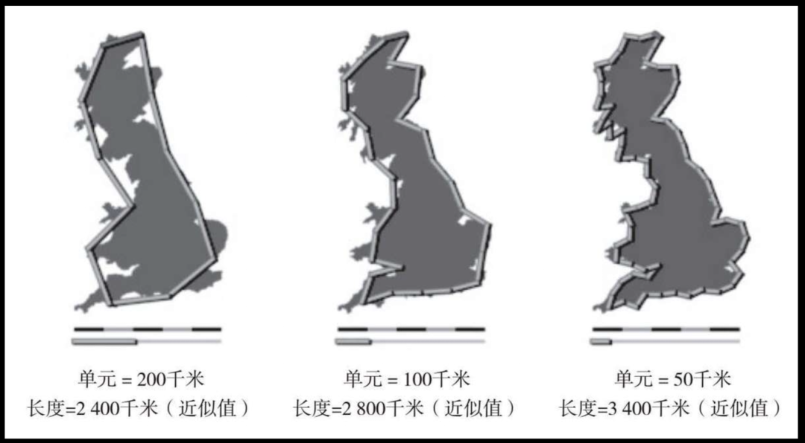
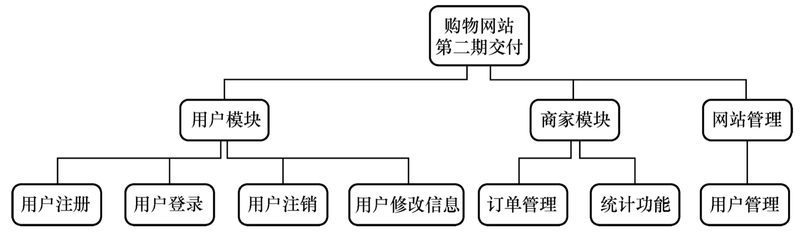
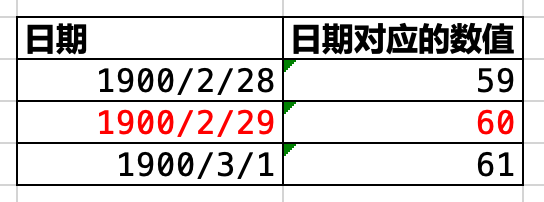
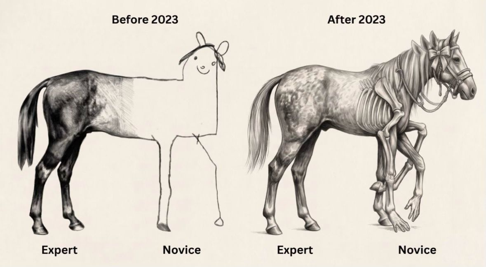

# 漫谈 AI 时代的软件复杂度

## —— 一堂关于软件复杂度的课 （2026-9-29 长沙行）

## 开场：三个问题

**问题一（现场举手）** ：你们班级选 20 个人，要集体绕中国陆地边境步行走一圈。

**先别急着算时间。第一个问题：中国陆地边境有多长？**

——来，现场估一个数字。

**追问**：你是怎么估出来的？是背过的，还是推算的？

（等学生回答）

**追问**：如果不知道总长度，你能算出要走多久吗？

——不能。所以第一步，先把距离估出来。

**现在，给你们 30 秒，和旁边同学讨论一下：中国陆地边境大概多长？**

**追问**：等一下。在继续之前，我们要先定义一件事——

**什么叫“绕中国陆地边境走一圈”？**

- 是沿着有公路的地方走，就算绕边界了？
- 还是必须从界碑走到下一个界碑？
- 还是沿着海边海水和陆地交界的地方，涨潮落潮都按当时海水边界线走？

（等学生反应。会有人笑，有人觉得“这也太较真了”）

**这三个定义，量出来的距离一样吗？**

——不一样。而且可能差很多。

**为什么差很多？**

——先不回答。记住这个问题，我们第二节会回来讲。

**但这里有一个更深的类比，你们现在就可以记住：**

> 当你说“沿着海边走”时，你的大脑调用了一个函数：`WalkThruABeach()`。
>
> 当你说“在森林里走到下一个界碑”时，你的大脑调用了另一个函数：`WalkThruForest()`。
>
> 当你说“翻过前面那条河”，你又调用了一个：`WalkThruRiver()`。
>
> **这就是“分而治之”的抽象设计：把一段复杂的路，拆成几个函数调用。**
>
> 你不需要在脑子里模拟每一步踩在哪块石头上、每一脚陷进多深的泥里。你只需要把任务拆成 `WalkThruABeach()`、`WalkThruForest()`、`WalkThruRiver()`，然后依次调用它们。
>
> **人类用抽象，把无限细节压缩成了有限几个函数。**

**但问题是——**

> **CPU 没有“函数”这个概念。**
>
> 它会把 `WalkThruABeach()` 展开成一条条指令：从第一个像素点开始，比较“这是海水还是陆地”，移动到下一个像素点，再比较，再移动……遇到涨潮，边界线变了，重新比较；遇到落潮，边界线又变了，再重新比较。
>
> 它会把 `WalkThruForest()` 展开成另一堆指令：判断前面那棵树能不能绕过去、脚下的落叶下面有没有坑、藤蔓会不会绊倒你……
>
> 它会把 `WalkThruRiver()` 再展开成另一堆指令：……
>
> **CPU 要把每一个函数里的每一个像素、每一次潮汐变化、每一块石头、每一根藤蔓，全部执行完。**
>
> **你按一下回车，CPU 走完所有细节。**

**这就是软件工程的核心矛盾：人脑用抽象跳过的，CPU 要一步步走完。**

而且，**任何一个字节出错，CPU 都有可能崩溃。**

不是“大概会出问题”，不是“可能性能下降”——是**直接崩溃**。

- 一个未初始化的指针 → 段错误，进程终止
- 一个数组越界 → 内存踩踏，随机行为
- 一个字节的编码错误 → 解析器异常，整条流水线停摆
- 一个字节的竞态 → 死锁，系统假死

**人类抽象跳过的细节，CPU 一个都不会跳过。它不会“大概对就行”，它只会“要么对，要么崩”。**

**所以，软件工程覆盖了一个非常宽广的区域：**

- **一端是 CPU 指令在各种情况下执行完全正确**——每一个字节、每一个时序、每一个边界条件，都不能出错
- **另一端是人类的体验在各种情况下足够好**——手感、流畅度、直觉、信任，没有唯一标准答案
- **想法翻译成代码 （AI 编程），只是这个区域里很小的一部分**

**问题二（再举手）** ：知道了距离，也定义了“走完”，现在估算时间。

如果这 20 个人在跑步机上跑，累计 2.2 万公里就行。要多久？

——再喊几个数字。

**追问**：等一下。跑步机上的“走完”，和实地走边境的“走完”，是同一个“走完”吗？

- 跑步机：累计 2.2 万公里 → 里程表到了，就算完成
- 实地走：必须从起点连续走到终点 → 中间断了，算不算完成？

**同样的“走完”，定义完全不同。**

**问题三（再举手）** ：如果这 20 个人必须一起，实地走完这条边境线，按你们刚才定义的最严格版本。又要多久？

——再喊几个数字。

**同样 2.2 万公里，为什么第二个问题很快有共识，第三个问题大家又吵翻天？**

先不回答。这一节课，我们从这个问题出发，一步步走到软件工程的核心。

---

**关键词**：Cynefin（克奈文）框架、Dave Snowden、Clear / Complicated / Complex / Chaotic、估算、定义、足够好、分而治之、抽象、执行分形、字节级崩溃

---

## 第一节：为什么"跑步机累计里程"比"实地走边境"简单？

**先看四个任务。**

| 任务 | 约束 | 大概多久 |
|:---|:---|:---|
| 20 人每人走 10 公里 | 距离 | 2 小时 |
| 跑步机累计 2.2 万公里 | 距离 + 总量 | 可排班，可算 |
| 实地走，可分开，覆盖即可 | 距离 + 实地 | 不确定 |
| 实地走，不可分开，必须按边界自然次序 | 距离 + 实地 + 连续 | 几乎完不成 |

**为什么任务 2 有共识，任务 3 和 4 没有？**

因为任务 2 的边界是封闭的：总里程固定、跑步机不变、环境可控。任务 3 和 4 的边界是开放的：路况、天气、签证、身体状态，全都在变。

**管理学里有一个框架叫 Cynefin（念"kuh-NEV-in" 克奈文），由 Dave Snowden 提出，专门用来区分这四种情况：**

- **Clear（显而易见）**：目标明确，路径明确，执行就行
- **Complicated（繁杂）**：目标明确，但需要分析和专家
- **Complex（复杂）**：目标模糊，只能通过试错来感知
- **Chaotic（混乱）**：因果关系断裂，没有清晰的正确路径

**对应到软件：**

- 用你熟悉的计算机语言，写 Hello World 程序 → Clear
- 实现 `ls` 命令 → Complicated
- 在 macOS 上实现 Windows 上的 Paintbrush 程序 → Complex
- 维护一个有 10 年历史、正在持续发布的开源软件 → Chaotic

**关键判断**：如果这个任务的 "完成" 能被一个明确的指标定义，它就在 Complicated 或以下；如果不能，它就在 Complex 或以上。

> **关键词**：Cynefin framework、Dave Snowden、Sense-Analyze-Respond、Probe-Sense-Respond、Act-Sense-Respond
>
> **扩展思考**：Cynefin 框架最早用于知识管理和组织决策，后来被广泛用于软件工程、产品管理、危机应对。它的核心不是分类，而是**不同象限需要不同的应对策略**。

## 第二节：为什么海岸线的长度量不准？

**换个任务：你们去量中国海岸线的长度。能给出一个准确的数字吗？**

有人说 1.8 万公里，有人说 2.2 万公里。追问：**这个数字是用多长的尺子量出来的？**

- 用 200 公里尺子量 → 长度 = X
- 用 100 公里尺子量 → 长度 = 1.2X
- 用 50 公里尺子量 → 长度 = 1.4X
- 用 1 米的尺子量 (人类步行) ?

**尺子越短，量出的长度越大。因为每一段海岸线放大看，还有更多的曲折。**

1967 年，数学家曼德勃罗（B.B. Mandelbrot）在《科学》杂志上发表论文《英国的海岸线有多长？》，结论是：**海岸线的长度无法精确测量。** 因为它是分形——尺度越小，细节越多，长度不收敛。

**软件也是这样。**

你把一个模块放大看，里面有子模块；子模块放大看，里面有函数；函数放大看，里面有分支和循环。每一层都有它自己的"需求扯皮、架构设计、脏数据清洗、测试环境崩溃"。

**你放大任何一个微观任务，它都包含了整个软件生命周期。细节之下，永远有细节，永不收敛。**

**这就是为什么软件估算永远不准**：估算的时候，人脑在用认知尺度丈量地图；交付的时候，CPU 在用微观尺度一步步走完所有地貌。**抽象只压缩了理解，从未压缩执行。**

**回到开场的问题**：现在你们明白为什么 "实地走边境" 比 "跑步机累计里程" 难了吗？ 跑步机的路程，经过了抽象和等价交换：把复杂地形替换成“1 公里”这个标量。实地边境不是一条平滑的线，它是有分形的 —— 你走的每一步，都在遇到新的细节。 你必须绕过礁石、沿着蜿蜒的沙地水面分界线走、可能会陷入沙里、脚会被刺破。

人脑用抽象跳过的（保存到云端数据库），CPU + 网络 + 云端数据库处理要一步步走完。

> **关键词**：分形（fractal）、曼德勃罗（Benoit Mandelbrot）、自相似性（self-similarity）、分数维度、海岸线悖论
>
> **扩展思考**：分形几何在自然界中随处可见——山脉、河流、血管、闪电。在软件工程中，"分形"被用来描述复杂度在尺度、依赖、执行三个维度上的自相似特性。

## 第三节：为什么"每个功能都简单"，但"整个软件很复杂"？

**假设你要做一个 Paintbrush。你可能会想：我一个一个功能做不就行了？先把"保存文件"做好，再把"读取文件"做好，再把"画线"做好……每个功能单独看都很简单，加起来不就完了？**

**先看两个功能：**

- 保存文件：输入画布内容，输出一个文件。边界清晰，可验证。AI 能独立做。
- 读取文件：输入一个文件，输出画布内容。边界清晰，可验证。AI 也能独立做。

**但如果这两个功能放在一起，会发生什么？**

- 保存的格式，必须能被读取解析
- 读取的旧版本文件，必须能被新版本兼容
- 如果保存到一半崩溃了，文件会不会损坏？
- 如果读取一个损坏的文件，程序会不会崩溃？
- 如果两个窗口同时保存同一个文件，谁赢？

**这些问题的数量，不是 1+1 = 2，而是 1.2 × 1.3 × 2.1 × 1.2 × 1.5 ……**

**为什么复杂度是乘法，不是加法？**

因为功能之间存在**交互状态**。单个功能的状态空间是有限的，但功能与功能之间的组合状态空间，是各自状态空间的乘积。

- 保存有 5 种状态
- 读取有 5 种状态
- 画线有 5 种状态
- 撤销有 5 种状态

**单独看，每个功能只有 5 种状态，很简单。但四个功能组合起来，理论状态空间是 5×5×5×5 = 625 种。**

真实软件里，每个功能可能有几十种状态，组合起来就是几十万、几百万种状态。

**这就是为什么"每个功能都简单"，但"整个软件很复杂"。**

**回扣海岸线分形**：功能之间的交互，就是那些被放大的弯道。你越深入看，发现的状态组合越多。

> **关键词**：状态空间爆炸、组合爆炸、交互复杂度、WBS（工作分解结构）、分而治之的局限
>
> **扩展思考**：这也是为什么"分而治之"在软件工程中有极限 —— 你可以把任务拆开，但拆不开功能之间的交互。Fred Brooks 在《人月神话》中说："软件的复杂性是一个本质属性，而非偶然属性。"

## 第四节：为什么用户要的不是"功能列表"？

**你身边一定有从 Windows 换到 Mac 的同学。他们最常抱怨什么？**

假设抱怨之一是： "Mac 上没有好用的 Paintbrush。"

**现在你说：我们要做一个 Mac 上的 Paintbrush，功能完全对标 Windows 版本。他们会怎么反应？**

"太好了！终于有了！"

**但问题是：他们要的，真的是"功能完全对标 Windows 版本"吗？**

不是。

- 他们要的是**在 Windows 上那种熟悉的感觉**
- 他们要的是**不用重新学一套操作**
- 他们要的是**打开就能用，不用看说明书**
- 他们同时也希望 **有 Mac 的风格** 

**这就是生态依赖性**：用户不是在选择一个"功能列表"，而是在选择一个**他们已经习惯的生态**。Windows Paintbrush 的每一个细节——菜单的位置、快捷键的组合、撤销的行为、颜色选择的方式 —— 都已经成为他们肌肉记忆的一部分。

**所以这个任务的真正难点是**：你不仅要复刻功能，还要复刻**用户的使用习惯**。但 macOS 的交互规范又和 Windows 不同。你如果完全照搬 Windows，macOS 用户觉得违和；你如果完全按 macOS 风格重新设计，Windows 迁移过来的用户觉得陌生。

**这是一个没有唯一正确答案的问题。**

**用户的抱怨，也是一种分形。** 你解决了一个抱怨，他们会提出新的抱怨。"这个按钮位置不对""这个快捷键不习惯""这个撤销行为不一样"……你越深入看，抱怨越多，永不收敛。

> **关键词**：Hyrum 定律、生态分形、隐性契约、用户期望漂移、兼容性成本
>
> **扩展思考**：Hyrum 定律说："当你的 API 拥有了足够多的用户，代码就不再是你的代码了 —— 它是别人业务流程的一部分。" 这也是为什么 Excel 必须保留 1900 年的闰年 Bug，为什么 Windows 要为 SimCity 的内存泄漏买单。

上世纪 80 年代，Lotus 1-2-3 统治着电子表格市场。它的程序员犯了一个低级错误：将 1900 年误判为闰年，即把 1900 年 2 月 29 日这个不存在的日期记录为"第 60 天"。这个 Bug 随着 Lotus 文件格式流毒天下。Excel 作为后来者，为了能"正确打开"市面上所有的 Lotus 数据文件，不得不咬着牙在自己的引擎里完整复刻了这个 Bug。在 Excel 中直接输入日期 1900-2-29（或将数字 60 设置为日期格式），Excel 会错误地将其显示为 1900年2月29日；而输入 =DATE(1900,2,28) 的数字序号是 59，=DATE(1900,3,1) 的数字序号是 61。这个“第 60 天”的幽灵日期导致 1900 年 3 月 1 日之前的所有日期序列号全错了一天。 

无数人指出过这个 bug，微软也心知肚明，但没有人计划修复——因为修复了这个 bug 的 Excel 发布后，全球所有依赖日期计算的财务报表将集体偏移，无数利率计算、合同到期日判断将出现细微而违规的偏差，市场上会出现无数细微但恼人的日期（一样的日期在会不相等）冲突，导致业务混乱。Lotus/Excel 的闰年日期 Bug 之所以改不了，根本原因不是技术，而是经济学。修正一行代码只需五分钟，但要修正它引发的海量数据资产的合规性校验，成本无限趋近于无穷大。当修复成本高于 Bug 造成的实际损害时，Bug 就变成了 Feature。这便引出了生态分形的铁律：在软件生态里，错误的广泛传播，会使其升格为不可修改的"基准事实"。

下面这个图更是说明了 Excel 的 “自动把看起来像日期的字符转为日期” 的 bug/feature 如何迫使生物信息整个专业改变了基因的表达： 

## 第四节（再思考）为什么 AI 写"贪吃蛇"手到擒来，写 Paintbrush 却不行？

**你可能会想：AI 连贪吃蛇都能几分钟写出来，为什么写一个 Paintbrush 就这么难？**

**因为贪吃蛇和 Paintbrush，有着本质的不同。**

先看一个对比：

| 维度 | 贪吃蛇（网页版） | Paintbrush |
|:---|:---|:---|
| **交互方式** | 离散事件驱动——用户按方向键（上下左右），游戏状态更新，然后渲染下一帧 | 连续实时交互——用户持续移动鼠标、拖动画笔，系统需要每帧响应 |
| **状态空间** | 有限且可枚举——蛇的位置、食物的位置、方向、分数，全部是离散的整数坐标 | 无限且连续——鼠标可以落在屏幕的任何一个像素上，用户的轨迹、速度、加速度都是连续的 |
| **反馈信号** | 明确——"吃到了食物"是布尔值，"撞墙"是布尔值，"得分"是整数 | 模糊——"手感好不好"、"线顺不顺"、"颜色对不对"都是主观判断，没有唯一答案 |
| **判断标准** | 功能正确即可——蛇按方向移动、食物随机出现、游戏结束判定正确，就"完成了" | 体验必须达标——功能即使全实现了，用户一句"感觉不对"，就得重来 |

**更重要的是：贪吃蛇的用户交互是离散的。**

用户按一下方向键，蛇移动一格。在两次按键之间，系统不需要做任何事。

这种离散的事件驱动模式，本质上仍然是"输入→输出"的映射——每一次按键都是一个独立的输入，输出是更新后的游戏状态。

**所以，AI 能轻松写出贪吃蛇，是因为它仍然在 Complicated 映射世界里工作。**

即使它涉及图形渲染和键盘事件，但它的核心逻辑依然是"离散输入 → 确定输出"。

**而 Paintbrush 的核心是"连续交互循环"，这超出了映射世界的边界。**

**回到海岸线分形**：贪吃蛇像跑步机——光滑、离散、可验证；Paintbrush 像实地走边境——连续、分形、没有清晰的终点。

**回扣 Cynefin 框架**：

- 贪吃蛇：Complicated（目标明确、可分析、可验证）
- Paintbrush：Complex（目标模糊、需要试错、体验标准无法被 spec 捕获）

> **关键词**：离散事件驱动、连续交互循环、映射世界、Complicated vs Complex、状态空间、反馈信号
>
> **扩展思考**：为什么 AI 在 CLI 世界表现强大，在 GUI 世界却力不从心？因为 CLI 是"映射链"——每一步都是确定的、可验证的；GUI 是"交互循环"——核心是持续的双向实时反馈，无法被简化为任何映射组合。

## 第五节：当 AI 成为系统依赖，它输出的每一种特征都会被下游固化

**你可能会想：既然 AI 这么强，那我直接把 AI 接入后端管道，让它处理业务逻辑不就行了？**

**问题恰恰出在这里。**

假设下游订单模块正在等待一个包含强类型价格与状态码的 JSON。AI 模型在处理过程中，突然触发了安全词，礼貌地输出了一段自然语言：

> "抱歉，作为一个人工智能模型，我无法回答该问题。"

这在聊天场景里叫"合规对齐"，看起来很正常。但在这条后端管道里，它是一个灾难：

- 解析器期望的是结构化 JSON，收到的是一段自然文本
- 整条流水线抛出不可恢复的运行时异常
- 下游服务原本定义了明确的错误码（403 或 500）与降级重试逻辑
- 结果被一串无法解析的自然语言直接噎死

**因果关系链条是这样的**：

1. AI 的训练目标包含"安全对齐" —— 遇到敏感内容要拒绝
2. 这个拒绝行为在聊天场景里是**正确的**
3. 但当 AI 被当作后端管道的核心依赖时，拒绝行为变成了**契约破坏**
4. 下游的异常处理机制假设"输入一定是结构化的"，无法处理自然语言
5. 整个系统崩溃

**这就是把带有随机文本中断的黑盒，扔进了精密对齐的刚性系统里。**

在精密分层的离散软件中，无法预测的拒绝回答（Refusal）本质上就是一种破坏系统契约的异常中断，让上层的异常处理机制彻底失效。

**更深一层的问题**：AI 输出的每一种特征，都会被下游固化。今天它在某个边界情况下返回了自然语言，明天就可能有下游代码专门处理这个"情况"。久而久之，这个"意外行为"就变成了**隐性契约**——和 Excel 保留 1900 年闰年 Bug 是同一个机制。

> **关键词**：Refusal、契约破坏、类型系统、解析器异常、RLHF 对齐、隐性契约、Constrained Decoding
>
> **扩展思考**：如果 AI 是后端依赖，如何设计容错机制？能否在架构层面强制 AI 输出结构化数据？如果 AI 的输出是概率性的，"契约"还能被定义吗？

## 第六节：为什么 AI 写的代码"看起来对，实际错"？

**你可能会问：AI 写的代码，为什么有时候看起来逻辑通顺、注释完整，但运行起来就是错？**

**根本原因在于：AI 的训练目标和软件工程的目标，可能不是一回事。**

过去几年，大模型主要依赖**基于人类偏好的强化学习（RLHF）**。它的优化目标是：让输出"看起来"符合人类喜好 —— 礼貌、自信、结构清晰、有详细注释。

但软件工程不是聊天客服。机器代码没有"看起来写得很礼貌、注释写得很详尽"的中庸选项。

**迎合人类标注员主观喜好的结果是**：模型学会了在生成错误代码时**自信地自圆其说**，引发严重的模式坍缩（Mode Collapse）与概率校准失真。

**因果关系链条是这样的**：

1. RLHF 奖励"人类觉得好"的输出
2. 人类标注员倾向于给"自信、结构完整、注释详细"的回答打高分
3. 模型学会：即使逻辑错了，只要看起来自信，就能拿到高分
4. 结果：模型生成错误代码时，不会说"我不确定"，而是自信地编造理由

**工业级软件需要的是对机器物理运行规律保持敬畏的执行逻辑。**

软件工程 AI 必须从 RLHF，转向**依托可验证奖励的强化学习（RLVR，Reinforcement Learning with Verifiable Rewards）**。

软件世界的客观真值由以下构成：

- 编译器报错
- 类型系统检查（Static Typing）
- 死锁检测工具
- 大规模测试用例的断言

**只有将这些物理边界作为奖励信号，AI 才能在反复编译失败与运行时崩溃中，真正理解离散状态机的边界。**

然而，即便模型经过了 RLVR 训练，面对未能在测试集里穷尽的生产环境隐性时序与网络竞态，系统的**验证赤字**依然无法凭空消除。

> **关键词**：RLHF、RLVR、模式坍缩、概率校准、可验证奖励、编译器等客观真值、验证赤字
>
> **扩展思考**：RLVR 能解决所有问题吗？它有什么局限？如果测试集覆盖不了生产环境的所有情况，验证赤字如何消除？

## 第七节：跑通 4.6 万条测试，为什么还是不敢上线？

**你可能会想：如果 AI 能跑通所有测试，那总该可以上线了吧？**

**答案依然是：不一定。**

2026 年开源社区的 **pgrust** 项目（由专业内核开发者借助 AI 将 PostgreSQL 移植至 Rust），完整展示了这个问题。

### 第一版：从零重写的失败

项目发起人是具备多年分布式数据库维护经验的内核工程师。初期他利用多个高级 AI 编码账号，在两周内合并了 280 个 PR，从零编写 Rust 代码，官方回归测试的通过率一度提升至 **96%**。

然而在两个月后，该技术路线因多处深层不兼容被终止并归档。

**为什么 96% 通过率还是失败了？**

因为大型系统内部的知识沉淀有四层结构，而测试只覆盖了第一层：

| 层次 | 内容 | 测试能否覆盖 |
|:---|:---|:---|
| 1. 显式测试集 | PostgreSQL 包含的 46066 条官方核心 SQL 回归测试 | ✅ 能覆盖 |
| 2. 代码微观防御结构 | 特殊时序下的锁获取顺序、异常边界处理、规避特定操作系统缺陷的容错代码 | ❌ 不能 |
| 3. 历史工程档案 | 邮件列表中关于特定方案存在死锁隐患的历史论证记录 | ❌ 不能 |
| 4. 专家的工程经验直觉 | 面对异常竞态条件时的风险判断 | ❌ 不能 |

从零重写方案遗失了后三层中未经文档化的隐性逻辑。

### 第二版：机械转译的成功

项目第二版之所以在 13 天内产出 240 万行代码并跑通官方测试，核心原因在于转向了**机械转译路线**——利用 c2rust 将原本的 C 语言代码转换为保留大量 unsafe 块的 Rust 代码，进而做局部渐进式重构。

该方案的跑通，本质上是因为**直接继承了原有代码体系中沉淀的历史约束**。

### 测试集通过不代表具备生产就绪度

通过了数万条现有测试，无法等同于达到生产可用标准：

| 问题 | 说明 |
|:---|:---|
| 验证调度条件的弱化 | 公开测试脚本以单进程串行方式执行，为提高运行速度通常关闭了物理持久化检查（关闭 fsync），没有覆盖高并发事务竞争与异常断电恢复工况 |
| 静态测试无法穷尽运行时竞态 | 历史上针对 Linux fsync 错误处理机制的认知偏差在核心代码中潜伏了二十年才被完全定位；Jepsen 框架依然能在运行多年的稳定版本中捕获并发隔离级别的异常调度路径 |

**结论**：在确定性系统工程中，代码生成边际成本大幅下降，系统验证成本与生产信任的积累周期依然保持客观刚性。测试考卷可以被快速复印，评估系统生产可用性的阅卷机制无法被简单缩短。

> **关键词**：pgrust、c2rust、机械转译、fsync、Jepsen、隐性契约、测试覆盖的边界、PostgreSQL 回归测试
>
> **扩展思考**：测试覆盖的边界在哪里？如何设计"揭露冲突"的测试？为什么"从零重写"比"机械转译"更容易失败？

为什么后三层测试覆盖不了？因为它们都是隐性知识。

隐性知识（Tacit Knowledge）是迈克尔·波兰尼（Michael Polanyi）在 1958 年提出的概念：我们知道的东西，比我们能说出来的多。

你能骑自行车，但你说不清"怎么保持平衡"——那是隐性知识

老工程师看一眼代码说"这里有问题"，但他说不清"为什么感觉不对"——那也是隐性知识

PostgreSQL 的代码里那些"特殊时序下的锁获取顺序""规避特定操作系统缺陷的容错代码"——同样是隐性知识，它们从未被写入文档，但它们是系统能跑起来的关键

因果关系：

隐性知识无法被文档化，所以无法被写进测试用例

测试用例只能覆盖显性知识（能说出来的部分）

AI 从文档和代码里学习，但文档和代码里只有显性知识

结果：AI 跑通了所有测试，却遗失了那些"说不清但很重要"的东西

系统在生产环境崩溃

这就是为什么"从零重写"比"机械转译"更容易失败：从零重写只能复刻显性知识，机械转译保留了原始代码里的隐性约束。

补充一句：迈克尔·波兰尼的原话是："我们知道的，比我们能言说的多。"（We know more than we can tell.）这句话在软件工程里格外真实——每一行"看起来多余"的防御代码，背后可能都是某次凌晨三点的故障换来的隐性知识。

## 第八节：为什么 50 个 Agent 不一定比 5 个更快？

**你可能会想：Paintbrush 这么难，那我不用一个 AI，我用 50 个 Agent 同时写，总该快了吧？**

**未必。而且很可能相反——Agent 越多，效率越差。**

**为什么？**

**第一，任务本身不可并行。** 保存和读取必须用同一个文件格式，撤销逻辑必须和所有工具的行为对齐，UI 风格必须全局一致。这些是强耦合的决策，不能拆给 50 个 Agent 各自做。

**第二，通信成本随 Agent 数量平方增长。** 2 个 Agent 需要 1 条沟通通道，5 个需要 10 条，50 个需要 1225 条。每一条通道都需要同步、对齐、解决冲突。这些协调成本不是加法，是乘法。

**第三，验证瓶颈不变。** 50 个 Agent 可以一天生成几万行代码，但人类审查代码的速度没有变。而且代码越多、越不一致，审查成本越高。

**生成快了，验证没快。结果是：生成的垃圾更多了。**

**效率曲线是先升后平再降：**

- 1-5 个：效率上升（并行处理独立任务）
- 5-10 个：效率持平（协调成本开始抵消并行收益）
- 10 个以上：效率下降（协调成本 + 验证瓶颈 + 冲突爆炸）

**回到"50 个人一起走边境"**：不是"50 倍效率"，而是"50 倍麻烦"。人越多，协调成本越高，单点故障越多，验证越难。

新手加上很多 AI Agent 的帮助，不也是可以做很多复杂工作了么？ 
- AI 可以快速生成 ‘足够好’ 的demo， 但是几十个 AI Agent 如果没有对齐和驾驭工程 （Harness Engineering）， 那就会出乱子。

**任务的性质，决定了规模是助力还是负担。**

> **关键词**：多 Agent 协作、协调成本、Amdahl 定律、布鲁克斯法则（Brooks's Law）、死于丰盈、西蒙（Herbert A. Simon）
>
> **扩展思考**：西蒙在 1971 年写道："信息的丰盈造成了注意力的贫困。" 威尔逊（E.O. Wilson）后来补了一句："我们溺死于信息的丰盈之中，却饥渴于智慧。"

## 第九节：数字员工能替代工程师吗？

**你可能会想：现在很多大厂都在推"数字员工"——有虚拟工号、企业 IM 账号，能参加需求评审、读文档、认领任务、跨部门提工单。它们能把人类工程师的岗位平替掉吗？**

**答案是不能。核心原因有三个。**

### 第一：极其残酷的非对称算术题（4 分钟生成，40 分钟拒绝）

数字员工生成一个表面合规、测试看似全绿的代码补丁，只需消耗几分钱的算力和几分钟。

但人类维护者审查一个可能包含微妙竞态、削弱了全局锁或破坏了隐性契约的 PR，需要逐行推演和长周期验证，耗时数十分钟甚至数小时。

**因果关系链条**：

1. 数字员工缺乏生理摩擦力与社交羞耻感
2. 它会以工业级的通量倾倒代码噪音
3. 向系统提出未经深度验证的变更，本质上是向整个组织开出一张"请你无偿捐献注意力与审查带宽"的债务账单
4. 结果：不仅不会降低组织内耗，反而迅速击穿人类审查者的认知极限

开源社区已经在承受这种冲击：curl 作者 Daniel Stenberg 被迫修改规则公开封禁无脑用 AI 刷声誉的账号；Rust 社区甚至专门制定规则（RFC 3950），明文禁止直接提交未经审查的 AI 生成内容。

### 第二：责任与后果的物理真空

工业岗位的本质是为特定系统在物理和商业世界的后果承担**终极责任**。

核心服务在线上发生灾难性故障时，人类架构师和技术负责人必须签字确认回滚、承担审计调查与商业损失。

数字员工无法被问责——它没有生存压力，也无法承受法律与商业后果。

**一个无法承担责任的实体，永远无法在关键工程链条上获得最终签核权（Final Sign-off Authority）。**

如果审查一个数字员工的产出，比自己带着清晰思路写一遍还要耗费心力，那么这种"员工"在经济学上就不是资产，而是**纯粹的管理负债**。

### 第三：打破规则的直觉缺失

Unix 的诞生源于肯·汤普森和丹尼斯·里奇违背宏大规划私自拉走废弃的 PDP-7；Windows 95 为了兼容《模拟城市》在内核层违规打补丁；架构师在崩溃边缘拍板放弃数百万行代码重置基线。

优秀的软件工程决策往往是**反既有流程、反概率分布甚至具有破坏性的**。

数字员工的核心机理是拟合历史概率分布，它的安全边界被严格锁死在合规模仿内，永远无法具备在失控边缘打破规则、重塑秩序的决断力。

**结论**：它不是什么拥有独立意志的"新员工"，而是一个披着人类面具、挂在企业总线上的重型交互接口。真正的演化方向，是人类工程师驾驭的重型外骨骼——低价值、流程明确的搬运工作被固化为自动化后台服务；但系统边界的定义、极端状态下的价值权衡、未定义故障的白盒调试，依然牢牢锚定在人类工程师的身上。

> **关键词**：数字员工、责任真空、最终签核权、PR Slop DoS、Rust RFC 3950、curl 封禁、管理负债
>
> **扩展思考**：如果 AI 出错了，谁负责？法律上如何界定？如果审查 AI 的产出比自己做还累，AI 的价值在哪里？

## 第十节：当对错退化为概率，怎么测？

**你可能会想：如果 AI 的输出是概率分布，没有绝对的标准答案，那怎么测试？**

传统测试驱动开发（TDD）依赖布尔断言：`assert actual == expected`。但在连续语义输出面前，这个基准失效了。

**概率推理服务属于典型的 Complex 系统，局部扰动容易导致系统进入 Chaotic 状态。**

### 统计驱动系统的三大工程挑战

| 挑战 | 说明 |
|:---|:---|
| 回归验证的非正交性（锯齿状边界） | 修复某一特定边界用例时，由于全序列注意力的权重微调，往往会在此前运行正常的其他用例中引入静默退化 |
| 模型自评估的系统性偏差 | 利用大语言模型评估模型输出（LLM-as-a-Judge）容易引入长度偏好、选项顺序偏好以及模型家族认同倾向，评估方与被测方同构会导致测试环境演变为自我确认的回音室 |
| 随机性与偶发缺陷的复现阻碍 | 即便固定随机种子，底层硬件并行计算中的微小浮点累加误差依然可能导致生成 Token 发生偏移，难以稳定重现边缘缺陷 |

### 统计系统的工程验证路径

**Verification（验证：构建硬性执行约束）**

- **解码期语法强制约束（Constrained Decoding / JSON Schema）**：在模型输出阶段接入有限状态自动机进行解码剪枝，将开放自然语言强制约束为确定性的强类型数据格式
- **分层级自动化评测流水线**：基础层执行数据结构完整性校验与正则硬断言；中间层计算特征向量余弦相似度与语义覆盖率；决策层通过候选位置置换与多模型协同打分来抑制单一评估源的方差

**Validation（确认：追踪真实业务结果）**

- **影子流量双跑比对（Shadow Mode）**：将生产环境的实际请求并发分流给候选模型，脱离静态测试集，基于线上真实场景比对两个版本在输出统计分布上的实际偏移
- **真实因果指标追踪**：以最终任务完成率、人工干预介入率、异常投诉率等外部业务指标作为系统演进的评估准则

**结论**：测试也在演化。未来的测试工程师需要新的工具箱——不是布尔断言，而是统计断言；不是单次验证，而是持续追踪。

> **关键词**：Constrained Decoding、JSON Schema、LLM-as-a-Judge、Shadow Mode、统计断言、余弦相似度、语义覆盖率
>
> **扩展思考**：统计系统的"正确性"如何定义？如果 AI 的输出是概率性的，如何设计回归测试？LLM-as-a-Judge 的偏差如何消除？

## 第十一节：AI 时代，软件工程还有什么困难？

**Brooks 在《人月神话》中将软件工程的困难分为两类：**

- **偶然困难**：语法规则、环境构建、样板代码
- **本质困难**：业务规则的边界交织、并发状态机的时序仲裁、分布式环境下的幂等性保证

**后来，在 Conway 等人关于"系统设计反映组织沟通结构"的观察基础上，我们补上第三类：**

- **社会学困难**：开发侧——团队组织结构、协作流程、权力关系；需求侧——客户组织的科层制、合规要求、历史流程

**三类困难，AI 能消除哪一类？**

| 困难类型 | 来源 | AI 能消除吗 |
|:---|:---|:---|
| 偶然困难 | 实现过程 | ✅ 大部分可以 |
| 社会学困难 | 组织形态 | ⚠️ 部分可以，部分加剧 |
| 本质困难 | 问题本身 | ❌ 不能 |

**AI 让代码生成变快了，但理解代码、验证代码、协调组织，一样都没有变快。**

**未经严格验证的新增代码，正在以更快的速度变成维护负债。**

**一个 AI 时代的反例**：医疗保险公司用 AI 驳回保单，医院用 AI 反驳。双方都比人力更持久，但行政成本上升，病人没有受益。

**课堂也一样**：老师用 AI 出题，学生用 AI 写作业，老师用 AI 批改。三方都省了时间，但学生学到了多少？

> **关键词**：Fred Brooks、No Silver Bullet、偶然困难 vs 本质困难、Conway 定律、社会学困难、技术债
>
> **扩展思考**：Brooks 认为本质困难包含四个子类：复杂性、一致性、可变性、不可见性。这些困难无法通过任何"银弹"消除。

## 第十二节：AI 时代，你们到底该学什么？

**你们要学的，不是"怎么写出 AI 写不出的代码"，而是"怎么判断 AI 写得对不对、该不该写、写完了怎么办"。**

**三类能力，对应三类困难：**

**能力一：赤脚行走的能力（对应偶然困难）**

- 学什么：数据结构、操作系统、网络、编译原理、数据库
- 练什么：用底层语言写小项目，用调试器排查真实 bug，读内存快照、线程栈
- 一句话：能潜入底层，才能不被 AI 的表面正确骗到

**能力二：白盒验证的能力（对应本质困难）**

- 学什么：软件测试、形式化方法、并发编程、分布式系统
- 练什么：写测试用例覆盖边界，用压力测试暴露问题，读别人的代码找隐藏假设
- 一句话：AI 说"通过"不算通过，你能证明它"不会失败"才算

**能力三：拿捏的能力（对应社会学困难）**

- 学什么：需求工程、软件架构、项目管理、软件生态
- 练什么：做真实项目接触真实用户，参与开源社区，写设计文档，复盘项目
- 一句话：AI 能写代码，但 AI 不知道这个代码该不该写、给谁写、写完谁买单

**一个可以带走的判断框架：**

1. 这个任务，AI 能独立做吗？（判断复杂度）
2. 如果 AI 做了，我怎么验证它是对的？ 什么是 ‘足够好’，可以发布？（验证能力）
- 学生项目，创业公司的 MVP：能跑就行
- 银行核心系统：必须通过所有审计，有回滚能力
- 十年历史的老系统：改一行要考虑三天

3. 如果 AI 做错了，谁来承担后果？（责任判断）

**这三个问题，就是软件工程的核心。**

> **关键词**：认知带宽、米勒定律（Miller's Law）、Harness Engineering、双重视角、本质困难、社会学困难
>
> **扩展思考**：Fred Brooks 说："软件的复杂性是一个本质属性，而非偶然属性；因此，如果一个软件实体的描述抽象掉了其复杂性，往往也就抽象掉了它的本质。" AI 消灭了偶然困难，却让本质困难在更高的抽象层次上以更隐蔽的方式浮现出来。

## 收束：复杂性是机会，不是威胁
## 收束：复杂性是机会，不是威胁

如果软件不复杂，它早就被外包给 AI 了。

我们小学时学四则运算，是为了理解数学的入门逻辑。但在后来的工作和生活中，我们把它外包给了计算器 app——没有人觉得这是问题。

我们仍然要学数据结构与算法。但它们的价值，不是“手算得比计算器快”，而是“知道该用哪个工具、为什么用、什么时候不该用”。

这种任务，从来就不是软件工程的核心。

正因为软件依然复杂——有本质困难，有社会学困难，有 Complicated 的强耦合，有全新领域中 Chaotic 的不可预测——才需要有人去判断、去协调、去在泥泞中走出下一步。

写代码只是软件工程学习的一部分。甚至可以说，是最容易被替代的那一部分。

你们真正要学的，是“怎么在 AI 写得很快的世界里，判断什么值得写、什么不能写、什么写完了要盯着”。

学软件工程和 AI，不是为了成为“写代码的人”，而是为了成为 **“能把想做的事做出来的人”**。

这就是 **AI + X**。

你们的 X 可以是任何东西——生活里的小工具、生物科研里的数据分析、音乐创作里的辅助编曲、城市治理里的调度系统。

而软件工程本身，贯穿了下面这 10 层技术栈，同时有主战场：

| 层次 | 核心问题 | 对应课程 | 你需要达到的程度 |
|:---|:---|:---|:---|
| **10. 人类觉得“足够好”** | 用户是否满意？体验是否流畅？ | 人机交互、心理学、产品管理 | 大致了解——但这是所有工程决策的最终裁判 |
| **9. UI/UX** | 界面是否直觉？操作是否顺手？ | 人机交互、界面设计、前端开发 | 主战场之一（产品/前端方向） |
| **8. 代码** | 逻辑是否正确？边界是否处理？ | 程序设计、数据结构、算法、软件工程 | 主战场——你们的立身之本 |
| **7. 深度神经网络** | 模型是否准确？推理是否可靠？ | 机器学习、深度学习、NLP | 至少能看懂——未来大部分软件都会接入 AI |
| **6. 计算机网络** | 数据是否到达？故障是否隔离？ | 计算机网络、分布式系统、网络安全 | 至少能看懂——云端、微服务的基础 |
| **5. 云端容器细节** | 服务是否可扩展？部署是否可回滚？ | 云计算、容器技术、DevOps | 大致了解（后端/运维方向需精通） |
| **4. CPU/GPU 细节** | 指令是否执行？并行是否安全？ | 计算机组成原理、操作系统、并行计算 | 至少能看懂——否则无法理解“1MB 内存死锁” |
| **3. 指令集与微架构** | 分支是否预测？内存是否对齐？ | 计算机体系结构、编译原理、汇编 | 大致了解 |
| **2. 电路与逻辑门** | 逻辑是否正确？时序是否满足？ | 数字逻辑、数字电路 | 大致了解 |
| **1. 微电子与物理** | 电子是否迁移？电压是否稳定？ | 半导体物理、微电子学 | 大致了解——知道“硬件也会出错”就够了 |

← 需求分析：从第 10 层往下翻译，一直翻译到第 7/8 层
← 项目管理：横向协调所有层的人力、时间、资源
← 架构设计：决定层与层之间的接口和边界
← 质量管理：在每一层定义“足够好”
← 风险管理：识别哪一层最可能出问题

**你们需要精通其中一两层，看懂另外两三层，知道剩下几层的存在。**

**这就是为什么软件工程本身还有工作机会 —— 因为层次足够多，每一层都需要人的创意和判断。**

而且，AI 可以嵌入任何一个层次：

| 方向 | 你精通的层 | AI 嵌入的层 | 你要做的事 |
|:---|:---|:---|:---|
| **AI + CS** | 第 7、8 层 | 第 7 层（模型） | 研究新算法、新架构、新训练方法 |
| **AI + Infra** | 第 4、5、6 层 | 第 5、7 层 | 让 AI 跑得更快、更稳、更便宜 |
| **AI + 软件工程** | 第 8、9、10 层 | 第 7 层（作为组件） | 把 AI 接入系统，并保证它不出乱子 |
| **AI + 生物** | 第 8 层 + 生物 | 第 7 层 | 用 AI 分析基因、影像、药物 |
| **AI + 音乐** | 第 8 层 + 音乐 | 第 7 层 | 用 AI 辅助编曲、音色设计 |
| **AI + 城市** | 第 8 层 + 城市治理 | 第 5、7 层 | 用 AI 调度交通、能源、应急 |

**这就是 AI + X 的真正含义。**

X 可以是任何一个层次，也可以是任何一个领域。AI 是工具，软件工程是工具箱，X 是你想做的事。

AI 可以帮你写代码，但 AI 不知道你想做什么，也不知道做到什么程度算“足够好”，更不知道出了问题谁来负责。

这些判断，只有你能做。 “AI + 软件工程”是一个工具箱，不是一份工作。工作，是你用它去做的那个 X。

所以，不要问“AI 时代软件工程还有没有前途”。要问的是：

**“我想做什么 X？我有没有能力把它做出来？”**

如果答案是“有”，那你的前途就在你自己手里。你通过 learning by doing 的方式，在真实的 X 里了解并克服各个领域的复杂度，学会驾驭 AI 和软件工程，把它们变成你工具箱的一部分。

**这就是软件工程。这就是你们的工作机会，有些机会要靠你们自己创造出来。**

## 附录一：深入研究的关键词

**Cynefin 框架**

- Dave Snowden、Cynefin framework、Clear / Complicated / Complex / Chaotic / Disorder
- Sense-Analyze-Respond、Probe-Sense-Respond、Act-Sense-Respond

**软件复杂度**

- Fred Brooks、《人月神话》、No Silver Bullet、偶然困难 vs 本质困难
- 分形（fractal）、曼德勃罗（Benoit Mandelbrot）、自相似性、海岸线悖论
- 状态空间爆炸、组合爆炸、交互复杂度
- Hyrum 定律、生态分形、隐性契约

**组织与协作**

- Conway 定律、社会学困难
- 布鲁克斯法则（Brooks's Law）、Amdahl 定律
- 多 Agent 协作、协调成本

**AI 与信息**

- Herbert A. Simon、注意力经济、信息丰盈与注意力贫困
- E.O. Wilson、《知性统一》
- 死于丰盈、垃圾手榴弹（Slop Grenades）

**AI 工程化**

- RLHF、RLVR、模式坍缩、可验证奖励
- Refusal、契约破坏、Constrained Decoding、JSON Schema
- pgrust、c2rust、fsync、Jepsen
- 数字员工、责任真空、最终签核权、PR Slop DoS、RFC 3950
- LLM-as-a-Judge、Shadow Mode、统计断言

**软件工程能力**

- 认知带宽、米勒定律（Miller's Law）
- Harness Engineering、双重视角
- 白盒验证、赤脚行走、拿捏

## 附录二：可以自己用 AI 追问的问题

1. Cynefin 框架的五个象限分别对应什么决策模式？为什么 Disorder 在中间？
2. 曼德勃罗的海岸线悖论和软件估算有什么关系？
3. 为什么功能之间的复杂度是乘法而不是加法？能不能举一个具体的例子？
4. Hyrum 定律在 API 设计中意味着什么？为什么 Excel 必须保留 1900 年的 Bug？
5. 多 Agent 协作的效率曲线是什么样的？什么情况下 Agent 越多越慢？
6. Brooks 说的"本质困难"具体包含哪四个子类？AI 能消除其中哪一个？
7. 什么是"社会学困难"？它和 Brooks 的框架是什么关系？
8. 为什么说"AI 消灭了偶然困难，却让本质困难更隐蔽"？
9. 如果 AI 是后端依赖，如何设计容错机制？Refusal 如何破坏契约？
10. RLHF 和 RLVR 的区别是什么？为什么软件工程需要 RLVR？
11. 跑通 4.6 万条测试，为什么还是不敢上线？测试覆盖的边界在哪里？
12. 数字员工能替代工程师吗？"最终签核权"意味着什么？
13. 当 AI 输出是概率分布，怎么设计测试？Constrained Decoding 和 Shadow Mode 是什么？
14. 在 AI 时代，软件工程师的核心能力是什么？如何训练？
15. 如果你要设计一个 AI 辅助的软件工程课程，你会怎么设计？

---
