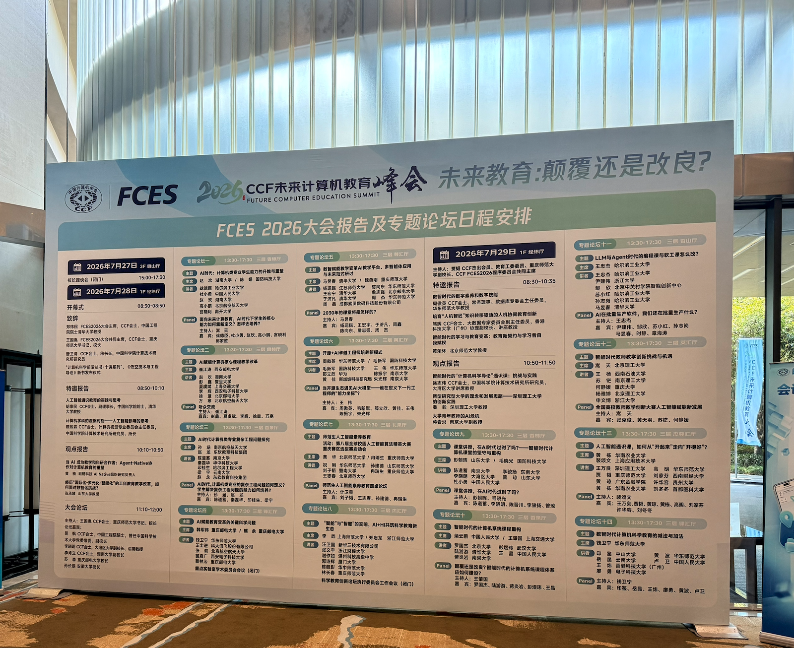

# 大学再出发：在 AI 时代重构计算机与软件工程教育框架

> **导语：从“教什么”到教育的第一性原理**
> 当不断更新的 AI 工具将代码生成与表象交付的边际成本推向趋近于零，计算机与软件工程教育究竟面临颠覆还是改良？
> 过去谈论 AI 教育改革，人们习惯于探讨“工具怎么用、作业怎么改、AI 怎么辅助批改”。但如果只停留在工具层面，所有的改革都会在摇摆中迷失。我们需要剥离所有的技术噪音，重向教育的第一性原理发问：**在 AI 可以替代大部分知识与代码生成的今天，大学存在的理由到底是什么？**
> 本文立足多年软件工程教学与系统开发实践，将复杂的教育变革提炼为**四个基本原理**：
> * **原理一（教育本质）**：教育塑造的是人的内部认知结构，而不是知识库存。
> * **原理二（AI 边界）**：AI 降低的是“生成与表达”的成本，而不是“判断与决策”的成本。
> * **原理三（能力来源）**：真正的判断力与主人翁意识，只能在真实责任、真实反馈与必要摩擦中形成。
> * **原理四（大学使命）**：凡是可以轻易外包给 AI 的，不应成为大学的培养目标；凡是不能外包的，才是大学存在的终极理由。
> 
> 
> 大学教育依然大有可为，但前提是颠覆早就腐化的旧框架，改良培养方向，从实践中获得反馈。

---

## 引言：当表达成本趋近于零，大学的核心价值在哪里？

最近两年，我参加了很多创新创业比赛、课程展示与毕业设计展览，观察到一种值得关注的现象：**初二、高二、大二、研二的学生，他们的创新提案仅从 PPT 结构、商业叙事到 UI 原型与代码片段的展示来看，不同教育阶段之间的交付物已经看不出什么明显区别。**

凭借几句提示词，初中生也能在几分钟内生成极其专业的架构图，写出逻辑严密的商业计划书。甚至在不少路演现场，低年级学生凭借更发散的想象力与未经驯化的原生创意，比起研究生严谨却显得拘泥、沉闷的汇报风格，更容易赢得观众与评委的偏好。

**甚至更荒诞的场景正在频繁上演**：学生使用多种 AI 工具和模型版本，精雕细琢、不断打磨项目提案；疲惫的评委用 AI 工具批量生成评语和评分；而比赛最终颁发的奖励往往是一包大模型的 API Token。**甚至这个闭环向上延伸，还包括了教师用 AI 批量批改作业、教务处用 AI 自动生成课程评估报告与教改总结。** 整个过程形成了一个完美的 **“AI-to-AI 虚假繁荣闭环”** ——看似从行政到教学人人都在高强度付出，唯独没有人类深层工程认知的碰撞，也没有真实场景的反馈。

**这种现象的背后，与人类心理机制密不可分。** 在高负荷、短周期的工作中，大家精力有限，大脑会自然切换到“系统一（快思考）”模式。系统一极易受到表象流畅偏见（Fluency Heuristic）的影响，将精美的 UI、流畅的表达和花哨的概念误判为项目的可行性；而负责逻辑推演、结构审计与复杂度校验的“系统二（慢思考）”则因认知资源耗尽而处于休眠状态。一些发散的创意配合 AI 渲染的视觉表象，恰好迎合了部分老师和评委的快思考。

面对这尴尬的一幕，我不禁反思：这是否意味着高年级学生多年学习的深奥课程失去了价值？大学几年，难道只是用套路化的规训消磨了学生的灵性？

答案取决于一个本质问题：**AI 首先抹平的是表达成本与表象交付，而不是认知深度与领域掌控。**

如果大家只是把 AI 当作一个“快速 PPT 生成器”或“快速代码堆砌工具”，不同阶段的差距确实被大幅压缩了；但我们要追问的是——**高年级的学生，你究竟在哪个领域成为了真正的“Owner（责任承担者）”？你是否拥有那个能够被 AI 放大百倍的核心能力，而这正是缺乏底层训练的人仅凭‘发散脑洞’所无法触及的？**

这也给教育管理者与教师带来了深层反思：我们的培养计划，究竟是在教学生搭建能够被 AI 放大千倍的 “核心能力”，还是在用套路化的作业，把充满张力，摩擦和师生互动的大学教学退化成了 “如何用 AI 完成一些表面工作”？ 

2026年7月29日，在 CCF 未来计算机教育峰会（FCES）“LLM 与 Agent 时代的编程课与软工课怎么改”专题论坛上，来自全国的高校教师与专家对此展开了极其热烈的讨论。结合我在中关村学院的教学实践与多年的软件工程教学、创业经验，本文将提炼出一个关于 AI 时代计算机与软件工程教育重构的框架。

### 本文思考融合自以下系列文章：

* [第一篇：AI赋能千行百业，但专家在何处？](https://gitee.com/zouxin2025/ASE/blob/master/chapter0/edu01.md)
* [第二篇：手写代码、以终为始、设计摩擦——训练的本质](https://gitee.com/zouxin2025/ASE/blob/master/chapter0/edu02.md)
* [第三篇：大学精神的回归 —— 从“职业短训班”到“未来的主人翁培养”](https://gitee.com/zouxin2025/ASE/blob/master/chapter0/edu03.md)
* [第四篇：构建新关系：老师 - AI - 学生的协同](https://gitee.com/zouxin2025/ASE/blob/master/chapter0/edu04.md)
* [我在中关村学院的经验总结](https://gitee.com/zouxin2025/ASE/blob/master/chapter0/zgc-edu-2026-07.md)

---

## 第一篇：认知结构与“原理决定的四件不可外包”

### 一、 重新定义能力与教育的第一性原理

在讨论“教什么”之前，必须先定义**何为能力**。

知识可以遗忘，技能可以过时，工具可以更新。如果把教育的目标设定为“学会某种工具或框架”，大学就会降级为职业培训班。

> **能力（Capability），不是知识库存的数量，而是面对未知情境时持续做出高质量决策的内部认知结构。**

教育的第一性原理，就是重塑人的内部认知结构。AI 可以快速搜索知识、生成范式代码，但它无法替代人的认知重塑过程。认知塑造是一个具有物理时间常数的生理与心理过程 —— 正如培育一个健康的人类生命需要固定的时间，AI 无法加速大脑神经元的重构。

### 二、 从原理出发：AI 时代教育绝对不能外包的四件事

根据前述四条原理，我们可以推演出来绝对不能外包给 AI 的四类认知活动 —— 它们共同构成了大学教育不可侵犯的“能力保护区”：

#### 1. 教育本质-> 不能外包“定义问题”

2026 年 7 月，数学家 Levent Alpöge 利用 Claude 模型找到了雅可比猜想的一个三元多项式反例。媒体宣传“外行用 AI 也能做数学突破”，但关键细节是：提出“去雅可比猜想里找反例”这一决定性问题的是专业数学家；判断 AI 跑出的结果是否成立、评估其在 87 年数学史中地位的，依然是普林斯顿的数学博士。

AI 做的事情是空间搜索与组合生成——这好比在沙滩上捡到一颗贝壳；而专家的工作是“知道这片沙滩属于哪个地质层、这颗贝壳为什么能改写古生物学”。**提出值得研究的问题，才是重塑内部认知结构的关键。**

#### 2. AI 边界 -> 不能外包“形成判断”

当 AI 可以在几秒钟内给出 10 个架构方案或 100 行不同实现时，工程的硬核挑战就从“生成”转移到了“判断”：为什么选择方案 A 而非方案 B？为什么要在延迟与一致性之间做出这样的折中（Trade-off）？

AI 降低的是生成与表达成本，但它无法降低判断的成本。成熟工程师的价值在于决策，而非敲打键盘不出错。

#### 3. 能力来源 -> 不能外包“承担责任”

当系统崩溃、数据泄露、医疗设备失灵或航天器偏离轨道时，AI 不会承担任何后果。最终签字、面对用户、对系统长期演进与生命周期负责的，永远是人。

能力源于真实责任。没有 Owner（责任承担者）意识的训练，培养出来的充其量是 Prompt 操纵员，而不是工程师。

#### 4. 大学使命 -> 不能外包“经历失败”

AI 可以提供无摩擦的“正确答案”，但人的认知重塑恰恰来自于预测错误（Prediction Error）与真实失败后的顿悟。

从 Apple Lisa 的失败中走出来的史蒂夫·乔布斯，才学会了平衡艺术与工程约束。如果教育将所有的失败摩擦全部用 AI 过滤掉，学生得到的只是静态的答案照片，而永远长不出建造系统的肌肉。

### 三、 代码是成本：CS 专家的认知地基

代码不是资产，而是软件系统的维护成本。优秀的设计师追求用最少的代码解决最核心的问题。每个多余的模块，定义不清的算法，都是日后维护成本与故障的温床。

AI 可以快速生成海量的“成本与钢铁”，但生成不出“解决方案与飞机”。在计算机科学中，形式语言、可计算性、系统架构共同构成了专家的认知地基：

* **边界感**：知道什么是可计算的，什么是逻辑极限。
* **层次感**：清楚问题如何分层拆解，每一层挡掉了什么、暴露了什么。
* **代价感**：明白任何技术选择在时间和空间上的真实代价。
* **敬畏感**：深知系统在何时会失效，对复杂度保持敬畏。

### 四、 检验：AI 加初学者能接管 Linux 内核吗？

如果有人认为“所有 Linux 代码和讨论都是公开的，AI 都能读懂，初学者在学习了 C 语言和 Linux 后，配上 AI 就能接管开源的 Linux 内核开发”，这是一种典型的认知断裂。

初学者可以通过 AI 快速掌握显性知识（语法、API、规范），但他永远无法直接获取深耕者的**隐性知识**：对系统深层结构的直觉、对风险的预判、服务众多厂商（云厂商、嵌入式、桌面）后的洞察力，以及长期协作中建立的**信任**。

AI 可以生成代码，但 AI 无法赢得信任。Linux 维护者不可替代的原因，恰恰是有实战经验 CS 和软件工程专家很难可替代的原因。

### 五、 双轨制：独立而互相支援的培养通道

计算机与软件工程培养计划应当包含两条独立而互相支援的轨道：

* **Track 1（工程应用轨）：** 培养能够驾驭复杂性、在约束下交付确定性的人，他们深度掌握了各种 AI 工具和基本的 CS/软件能力，核心使命是去聚焦解决 **“AI + X”** 的真实世界问题（如医疗、能源、气候、航天）。
* **Track 2（根因科学轨）：** 培养能够突破计算边界、创造新范式与新知识的 CS 专家。他们深耕形式语言、可计算性、系统架构——不是为了“会用 AI”，而是为了**判断 AI 对不对、设计 AI 做不到的事、在 AI 失效时徒手修复**。他们要让 CS/软件 和 AI 本身变得更强大。

两条轨道并非孤立存在：Track 2 为 Track 1 提供底层基础设施与算力杠杆；而 Track 1 在真实场景中撞到的工程边界，又反过来为 Track 2 提供了源源不断的本质科学问题。

---

## 第二篇：手写代码与必要摩擦——训练的本质

### 一、 为什么专家不看代码，初学者仍要手写？

软件工程老法师，《代码整洁之道》作者 Uncle Bob Martin 最近公开了他使用 AI 的新策略：**彻底放弃阅读 AI 生成的代码**，转而设计一套极端的约束阵列——单元测试、验收测试、覆盖率工具——来 “驾驭” AI。

如果这是 “以终为始” 的终局，初学者手写代码的意义何在？

答案在于：**不要混淆 “工具的终局使用场景” 与 “能力的习得过程”。**

**程序 = 算法 + 数据结构**；**软件 = 程序 + 软件工程**。Uncle Bob 能转型为“约束架构师”，是因为他当过四十年“手艺人”，深知什么是好、什么是坏，他的大脑中早已完成了“脑内编译”与“底层手感”的构建，而且在 AI 工具出现的早期，他对 AI 的代码警惕得很。 

初学者没有这个坚实的底座，直接模仿其终局行为，是 “得其形而失其神” 的拔苗助长。马拉松运动员的终态是跑完 42 公里，但训练必须拆解为各种专项练习。

### 二、 手写训练到底在训练什么？

1. **逻辑链的完整性**：没有 AI 的辅助，大脑必须推演每一个边界条件，暴露逻辑断裂点。
2. **脑内编译与诊断力**：在没有运行环境时大脑模拟系统行为的能力。深夜系统崩溃时，这是唯一的救命手段。
3. **对抽象层次的感知**：清楚每一层抽象暴露了什么，遮蔽了什么代价。
4. **四类能力原点**：脑内编译、代价感知、约束设计、隐性知识。

### 三、 学习科学：为什么教育需要“必要摩擦”？

教育的艺术不是消除所有困难，而是在正确的位置设计正确的摩擦。

从学习科学（Learning Sciences）的角度来看，大脑神经元的更新与认知结构的重构，必须依赖于**认知冲突（Cognitive Conflict）**与**预测错误（Prediction Error）**。没有痛苦的调试、推演与失败修正，大脑就不会建立深层连接。

必须精确区分四种困难：

* **本质困难**：竞态条件、一致性、性能瓶颈。这是学科本质，**必须保护**。
* **偶然困难**：不直观的 API、晦涩的报错信息。应被工具消除。
* **琐碎困难**：各种细节的环境配置、依赖冲突。可通过合作伙伴的互相帮助来分担。
* **不必要的困难**：背诵陈旧语法、自己找罪受要学习纸带编程。应坚决放弃，除非是学习 CS 历史。

宾夕法尼亚大学 Hamsa Bastani 团队针对近千名高中生的实验清晰地证明：使用无护栏 AI 的学生作业分数极高，但撤走 AI 后独立能力下降 17%；而使用带教学护栏（提问引导）AI Tutor 的学生成绩大幅提升且能力无倒退。**无护栏的 AI 带来的是认知卸载，它让作业更好看，却让脑子变懒。**

### 四、 外行做 Demo，CS 专家建系统

今天很多人津津乐道于“AI 让非程序员也能开发 App”。但设计师做 App 的终局是验证设计，产品经理做 App 的终局是验证需求；而 CS 毕业生的终局是**在深夜追查并发 Bug、重构遗留系统、设计支撑千万并发的架构**。

外行用 AI 做 Demo 是他们 “AI+X” 能力的完整闭环，但对 CS 学生来说，那只是起点。当 AI 生成的海量代码需要被验证、被集成、被运维、被修复时，那些能徒手诊断系统、能在故障中定位根因的人，才具备绝对的护河网。

---

## 第三篇：从“职业短训班” 到 “主人翁责任承担者” 的培养

### 一、 焦虑与真相：被掩盖的失职

如果一所一流大学计算机系的毕业生，最终和培训班毕业生一样只能做 AI 可以高效替代的基础开发工作，那这里的培养计划还值得读吗？

马克·吐温曾说：*“不要让 schooling（上学）妨碍了你的 education（教育）。”* 当大学充斥着签到打卡、背诵考点、写“一次跑通即交差”的作业时，上学本身就成了心智长大的障碍。

#### 没有“变化轴线”的作业，正在批量培养“明智的短工”

为什么过去很多学生觉得软件工程课“水”？

《敏捷软件开发》明确指出：*“变化的轴线仅当变化实际发生时才具有真正的意义。”* 软件设计的价值只有在需求发生变化时才显现。

但在传统大学作业中，需求在布置的那一秒就冻结了，没有任何维护压力。学生把所有代码写在一个 `main()` 函数里通宵跑通交差，恰恰是极度“明智”的选择。

**这是传统培养体系最大的失职**：从未在教学中构建反映真实变化的场景。没有需求的演进，学生就永远体会不到软件设计的必要性；没有维持系统生命周期的痛苦，他们就无法成为对系统负责的建造者。

### 二、 什么是真正的 Owner（责任承担者）？

为避免中文“主人”一词偏向政治经济学色彩的误解，本文强调 **Owner（责任承担者）** 并不是某种行政职位或管理权限，而是一种工程与管理领域的**责任结构**：

> **Owner（责任承担者）：** 指能够定义问题、理解工程折中、敢于最终签字，并对系统的演进、安全与生命周期失败承担最终后果的人。

| 维度 | “短工”思维 | Owner（责任承担者）思维 |
| --- | --- | --- |
| **与系统的关系** | 交付即断开，只对当前任务负责 | 长期维护，对系统的演进与生命周期负责 |
| **面对新技术/AI** | 焦虑——AI 正在接管纯执行 | 欢迎——AI 释放重复劳动，放大判断力 |
| **核心价值** | 代码产出的速度与数量 | 问题的精准定义、方案的折中判断与风险审计 |

#### Build To Learn, Show, Serve, Win

Owner 精神表现在四种构建实践中：

* **Build To Learn**：通过做实验和调试发现规律（科研训练）。
* **Build To Show**：快速证明技术可能性，展示与迭代。
* **Build To Serve**：创造可复用的基础设施与工具，承担工程伦理与责任。
* **Build To Win**：在真实市场与复杂场景中检验自己，解决医疗、能源、航天等真实问题。

### 三、 评价的时机与 Goodhart 定律

评价一门课的质量，发生的时间点决定了评价的真实性：

| 维度 | 第一时间点：课程中 | 第二时间点：得到成绩后 | 第三时间点：毕业一年后 |
| --- | --- | --- | --- |
| **评价内容** | 体验和感受 | 分数满意度 | 长期价值、能力迁移 |
| **与真实能力的关系** | 弱相关甚至负相关 | 弱相关（受情绪扭曲） | **强相关** |

**当“即时满意度”成为核心考核指标，它就脱离了真正的教学质量（Goodhart's Law）。** 水课降低了学生的预期，放水获得了高分好评；而严格要求的硬课反而招致差评。

一流本科大学承诺的是长期成长。如果用“课程中”或“考试后”的满意度评价课程，就是在用评估培训班的尺子衡量自己。大学必须愿意为“长期评价”支付成本。

---

## 第四篇：构建新关系——老师 - AI - 学生的协同

### 一、 “上课妨碍我学习了”与两种学生的识别

当学生说出“上课妨碍我学习”时，背后站着两种完全不同的人：

1. **真正在创造的偏才**：处于自学和创造的心流状态，不想被机械的具体课程要求拖慢节奏。
2. **正在逃避的混子**：不想去上课， 想用 AI 快速生成作业，追求最低能耗偷懒。

**大学容忍偏才的前提，是偏才能够用实际产出证明自己的价值。**

必须建立机制：

* **基于产出的豁免**：学生能提交超出课程要求的作品，并通过深度质询答辩，那就给予免修与自由空间。
* **基于产出的问责**：拿不出说服力产出者，严格审查，设计“即使全用 AI 也要付出巨大努力”的考核标准。

### 二、 师生关系：从“保姆”到“健身教练”与“合作者”

* **传统病态关系**：园丁与树苗（强行修剪）、餐馆与食客（讨好求好评）、保姆与幼儿（喂嚼烂的知识）、狱警与犯人（死抓点名抬头率）。
* **理想关系**：本科阶段是“健身教练与学员”（教练严格设计训练，AI 承担 80% 的基础答疑与语法排查，老师做 20% 的个性化指导与认知拉拔）；研究生阶段升级为共同承担风险的 **“合作者（Co-founder）”**。

### 三、 师 - AI - 生三元协同结构

| 角色 | 核心任务 | 不可替代的价值 |
| --- | --- | --- |
| **学生** | 逐步承担定义问题、提出需求、做决策的责任 | 好奇心和主动性——只有学生自己知道想成为什么 |
| **AI** | 提供知识、生成方案、加速迭代、即时反馈 | 速度、广度、耐心——但会讨好用户，出现幻觉 |
| **老师** | 设计情境、制造认知冲突、引导反思、评估成长 | 对人的判断——知道学生卡在哪里、什么时候推一把 |

### 四、 把标准提高到“即使全用 AI，也要付出巨大努力”的高度

如何防止学生用 AI 短视通关？方法不是禁止 AI，而是把标准提高到 **AI 无法代劳的高度**：

1. **数据与需求扩展**：从理想数据扩展到真实噪声数据；从静态需求引入动态增量需求。
2. **红蓝对抗与相互测试**：分组交叉测试，引入 AI 生成的极端用例与变异测试。发现 Bug 越多得分越高，被发现 Bug 越多得分越低。
3. **协作与结对编程**：在并肩编写与评审中实现隐性知识的流动与规范的生长。
4. **硬性指标约束（如 100% MC/DC 覆盖率）**：AI 可以生成测试用例，但学生必须解释“为什么该分支逻辑上不可达，系统凭什么相信是安全的”。

### 五、 三个公式与管理层变革

* **程序 = 算法 + 数据结构**（跑得起来吗？—— AI 自动生成，人审查正确性）
* **软件 = 程序 + 软件工程**（靠得住吗？—— AI 建议架构，人定义标准与取舍）
* **软件企业 = 软件 + 商业模式**（值得做吗？—— AI 分析数据，人定义价值并承担决策）

**管理层变革**：放弃对“签到率、抬头率”等低成本行政合规指标的依赖（古德哈特定律），转向改变态度产生的土壤，改变评价指挥棒，为教学改革提供容错空间。

### 六、 正向回应反方与制度困境（Steelman Counterarguments）

面对真实的教学一线，我们必须正面回应反方质疑：

* **反方 1：大班教学（如 400 人）与 TA 缺乏怎么落地？**
* *回应*：这正是 AI 的用武之地。让 AI 承担 80% 的代码初审、语法排查和基础测试生成，把助教和教师从机械劳动中解放出来，专注于 20% 的架构质询、对抗测试与答辩抽查。

* **反方 2：学生面试只考“八股文”怎么办？**
* *回应*：企业八股文面试是信息不对称时代的产物。当面试官也开始用 AI 质询真实的工程演进时，能讲清“为什么这个架构要这样折中”的 Owner 型学生，将全面碾压只会背诵八股文的 Coder。

* **反方 3：为什么过去互联网、MOOC、GitHub 时代没改，现在必须改？**
* *回应*：过去的技术工具只是提高了信息获取效率，并未触及“表象交付”。大学依然可以靠“教学生写跑通的代码”完成招就业指标。**而 AI 彻底抹平了表象交付**，暴露了传统教学放水的恶果 —— 如果不改，大学将彻底失去与 AI 工具和短训班竞争的合法性。这是逼到绝路后的必然重构。

---

## 一个诚实的追问：为什么改革无法在旧体系内部自动发生？

许多深陷教学一线的高校教师，看到 “大学要系统改革”时往往会升起强烈的无力感：“道理我都懂，但我的职称论文还没着落，教改只能是低优先级。”

用 **5-Why** 追问这一无力感，我们可以剥开旧体系的评价残局：

1. *Why 1：为什么一线教师不敢花精力设计红蓝对抗与复杂工程？*
-> 因为教学投入在职称晋升与绩效考核中权重极低，甚至不如一篇低区 SCI。
2. *Why 2：为什么学院不能提高教学考核权重？*
-> 因为大学的排名、资源划拨与学科评估，核心指标仍然是科研论文（NSFC/CCF A）与项目经费。
3. *Why 3：为什么科研指标会凌驾于培养质量之上？*
-> 因为论文与经费是“客观易测量”的指标，而教学质量与学生长期的判断力难以在短期内量化。
4. *Why 4：为什么管理者不去测量长期的教学质量？*
-> 因为测量“毕业一年后的能力”成本极高，且无法立刻转化为本年度的行政业绩。
5. *Why 5（根因）：为什么大学教改始终陷入“试点是盆景，全院是虚无”的怪圈？*
-> **因为培养出多少能独立判断、承担责任的 Owner（责任承担者），从未成为高校管理者的核心 KPI。**

认识到这一点，一线改革者的无力感就不再是个人的失败，而是旧评价体系结构性腐化的自然表现。

改革不可能靠教师的无私奉献在旧体系内自动发生，它必须是一场由管理层重新定义评价指挥棒、破除古德哈特定律羁绊的自上而下的解构，或者是另起炉灶。

---

## 结语：重向大学的本源发问

 
“初二与研二学生的创业项目在 PPT 上看起来几乎没有区别” —— 它剥离了那些依靠“信息不对称、格式化表达、静态演示”而滋生的伪能力，把最本质的问题摆在了我们面前。

[在中关村学院的一些实践总结中](https://www.cnblogs.com/xinz/p/19379491)，在 AI 时代，单纯的代码编写者（Coder）这个职业正在隐退，但[“构建者（Builder）”这个职业迎来了更多的机会与闪耀的舞台](https://mp.weixin.qq.com/s/sqiZPG_3r3te4KPEhtiTLw)。大学和老师应该培养更多的构建者 —— 这也是大学的“初心”吧？

**AI 时代真正的问题，并不是大学还能不能教学生写代码，而是大学还能不能培养出那些能够定义问题、理解复杂系统、承担长期责任的人。**

如果大学仍然停留在教学生“按指令写代码、按模板做汇报”，那它不仅会在表象交付上被 AI 碾压，甚至会在灵性与想象力上被初中生击败，最终培养出一批平庸、拘泥且随时会被替换的“打短工者”；

**大学必须回归本源：保住学生天马行空的想象力，同时通过深度的理论训练、必要的认知摩擦、动态的真实工程场景与社会反馈回路，将学生培养成某个领域的“Owner（责任承担者）”。**

现在很多人陷入悲观，认为“该写的软件产品都已经写完、软件工程似乎失去了用武之地”。事实恰恰相反 —— 在自动驾驶、医疗、能源、健康、气候、航天、AI 系统等关乎人类未来的重大挑战面前，系统化的软件工程需要大量人才 -- 他们在哪里培养呢？ 

> **大学教育依然大有可为，但前提是颠覆早就腐化的旧框架，改良培养方向，从实践中获得反馈。**  AI 工具暴露的不仅不是大学的危机，而是其宗旨与教学体系重塑与精神复兴的起点。

---

## 附录与延伸资源

### 核心教材与课程资源：

* [《构建之法》网上资源 (Gitee)](https://gitee.com/zouxin2025/ASE/blob/master/README.md) —— 《构建之法》配套开源教学资源与指导
* [《构建之法》GitHub 资源](https://github.com/xinase/ASE/) —— 《构建之法》教学项目与实践案例
* [船舱，甲板，山巅](https://www.cnblogs.com/xinz/p/19379491) —— 现代软件工程教学方法的三种视角分析
* [程序员即将隐退，建造者继续闪耀](https://mp.weixin.qq.com/s/sqiZPG_3r3te4KPEhtiTLw) —— AI 时代软件工程师向 Builder 的定位转变

### 软件复杂度深度讨论系列：

* [软件工程的第一性原理是什么？](https://mp.weixin.qq.com/s/SvzD7groV4LT33wpqoMV0g) —— 人类认知带宽是软件工程的刚性约束；AI 时代工程师需要“双重视角”
* [需求的自相似分形，逃不掉的本质复杂度？](https://mp.weixin.qq.com/s/jkkSJ7DNgRrX5fGzKdG1pQ) —— 需求具有自相似分形特性；AI 降低了制造代码的成本，但未降低管理复杂度的成本
* [为什么软件不能像搭积木一样盖起来](https://mp.weixin.qq.com/s/2kQT3yo8OAPwMPGxhFy9pA) —— 软件是离散状态机，组件化无法抹平复杂度；底层二进制边界是真实约束
* [软件的分形维度](https://mp.weixin.qq.com/s/ie1lvOmT366AEdhAk5bzIQ) —— 复杂度在尺度、依赖和执行三个维度上具有分形特性；抽象只压缩了理解，未压缩执行
* [软件的本质挑战：Hyrum 定律与软件生态的分形](https://mp.weixin.qq.com/s/rKuehNPLduzIwgV_r6Gl7g) —— API 的所有可观察行为都会被用户依赖；版本升级的本质成本是生态兼容性
* [软件工程的终极目的：创造一个没有冲突的乌托邦？](https://mp.weixin.qq.com/s/ItTqtf5LySDmIYwzp3R4_w) —— 冲突是系统的反馈信号；工程的目标不是消灭冲突，而是让信号有序被捕获和处理