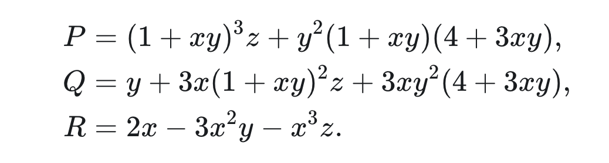

# AI 时代的大学计算机专业教育思考

2026年7月29日，我参加了CCF未来计算机教育峰会，并在"LLM与Agent时代的编程课与软工课怎么改"专题论坛上做了交流。会上的讨论很热烈，据听众反映这是当天下午最吸引人的论坛。会后大家在论坛组织者王忠杰老师的微信群里继续讨论，下面的系列文章，是我的一些思考。

## 第一篇：AI赋能千行百业，但专家在何处？

### 一、一个必须回答的前提问题

"AI都能写代码了，CS专业的学生为什么还要学那么深的理论和手搓代码？"过去一年，这是我在大学教师群体中听到频率最高的问题。它背后潜藏的焦虑是：如果AI已经可以生成程序、解释算法、甚至完成系统设计，那我们的四年本科教育，究竟还有什么不可替代的价值？这个问题比许多教师意识到的更根本——它不是在问"怎么教"，而是在问"教什么"和"为什么教"。如果这个前提问题回答不了，后面所有的课程改革、教学设计、评价体系调整，都将在摇摆中失去方向。

让我们先把目光从CS教育内部移开，看看一个更大范围的、已经发生的事实。

### 二、AI for Science的启示：谁在创造突破？

过去几年，AI for Science取得了令人目眩的成就。AlphaFold预测了几乎所有已知蛋白质的结构，AI辅助药物设计大幅缩短了研发周期，机器学习在材料科学、气候模拟、基因组学等领域全面渗透。一个流行的叙事是"AI正在赋能千行百业，不懂AI就会被淘汰"，这个叙事本身没有错，但它掩盖了一个关键细节：所有这些突破的创造者，都不是"AI初学者加领域初学者"的组合。

用AlphaFold做出蛋白质结构预测的人，是分子生物学家。他们知道蛋白质折叠的物理原理，知道哪些氨基酸组合在生物学上有意义，知道什么样的预测结果值得验证、什么样的只是算法噪声。换句话说，他们非常懂分子生物学，所以知道"什么问题值得问"。现在设想一个对照实验：一个AI初学者，加上一个分子生物学初学者，给他们同样的AI工具。AI可以给他们科普分子生物学的入门知识，可以生成代码，可以画出漂亮的预测图，但他们问不出前沿问题——他们连"什么是好的问题"都未必知道。这不是工具的差距，是认知地基的差距。

AI for Science的成功有一个容易被忽视的前提条件：人要先成为那个领域的专家。望远镜再先进，也需要天文学家才知道往哪里看。AI是望远镜，专家是天文学家。类似地，AI可以快速生成各种文章和短视频，但那些成功的文章和短视频的作者，非常懂得"目标用户的痛点"和"如何大量快速试错"——并不是所有AI初学者加"流量运营初学者"都能成功，对吧？

### 三、回看CS教育：同样的逻辑

如果这个逻辑对分子生物学和流量运营成立，那对计算机科学成不成立？AI for Science需要Science专家，这似乎没有人反对；AI for 流量需要懂流量的专家。那AI for CS，需不需要CS专家？奇怪的是，许多人在这个问题上突然变得犹豫了。"AI能生成代码了，学生为什么还要学那么深的CS理论？"这个问题本身就在暗示：CS可能是个例外，AI可以跳过对CS的深度理解，直接产出结果。这是一个危险的认知断裂。

目前的AI不能——也不可能——让一个不懂CS的人，通过"使用AI"就变得真正懂CS。它可以让一个CS专家的产出效率提高十倍，但它无法让一个CS初学者跳过"成为CS专家"的过程，直接拥有专家的判断力。

有人会反驳：AI for Science的成功案例中，确实有一些是"AI专家加领域初学者"的组合，AI专家用通用算法在某个科学领域做出了突破。这个观察是真实的，但它恰恰验证了我们的论点，而非反驳。第一，这些案例中的"领域初学者"只是相对于该领域的顶尖专家而言，他们通常拥有相关学科的博士学位，具备阅读前沿论文、设计实验、解释结果的能力——只是把这个能力迁移到了一个新的子领域，他们不是"什么都不懂"的初学者。第二，这些突破大多是"低垂的果实"——某个领域的经典问题，用新的AI工具重新审视，发现原来困难的模式识别变得容易了。但能摘到这些果实的人有一个共同特征：他们对他们的那片土地极其熟悉，知道哪些果实是熟的、哪些是烂的、哪些看起来是果实其实是虫瘿。只懂AI不懂领域的人，连果实在哪都看不见。

#### 雅可比猜想反例的启示

就在2026年7月，数学家Levent Alpöge在社交平台公布了一个三元多项式映射，它满足了雅可比猜想的前提条件却违背了结论——一个可能推翻这个百年难题的反例。Alpöge将这一发现归功于Anthropic的Claude Fable 5模型，是模型在他观看世界杯决赛期间持续搜索，最终找到了这个构造。社交媒体上迅速流传的叙事是"AI独立做出了数学突破，外行用AI也能搞定数学"，但这个叙事是错的。

让我们仔细看看这个故事中两个被广泛忽略的细节。首先，是谁向AI提出了"去雅可比猜想里找反例"这个问题？Alpöge明确表示，是他的朋友Akhil首先向模型提出了这一问题。Akhil向AI发问，AI才开始了搜索。这个"谁向AI提问"的细节至关重要——提出正确的问题，是一切的前提。其次，收到AI输出结果的人是谁？Alpöge本科毕业于哈佛大学数学系，在剑桥完成数学高级研究，2020年在普林斯顿获得数学博士学位，导师是菲尔兹奖得主Manjul Bhargava。他是职业数学家，后来才加入Anthropic做AI研究。

这意味着：提出"雅可比猜想值不值得找反例"这个问题的，是他（以及Akhil——一个至少知道这个猜想存在、知道它值得问的人）；判断"AI找到的这个构造是否真的满足所有前提条件"的，是他；评估"这个反例是否真的推翻了猜想还是只是一个边缘退化情况"的，还是他。AI做的事情是搜索——在巨大的多项式空间中穷举，找到满足特定代数条件的映射，这是AI擅长的：快速遍历、模式匹配、组合生成。但Alpöge做的事情——定义问题、知道向AI问什么、判断结果的意义、将发现嵌入87年的数学史脉络——每一件都需要数学家的隐性知识。如果把AI发现反例的过程比作"在沙滩上捡到了一颗特别的贝壳"，那么Alpöge的工作是"知道这片沙滩属于哪个地质层、这颗贝壳为什么推翻了古生物学界的一条定论"。AI捡到了贝壳，但只有专家知道它意味着"改写教科书"还是"只是好看而已"。

这恰恰验证了我们的论点：AI加速了专家的发现，但没有让一个非专家做出这个发现。连"向AI提出这个问题"这一步，都需要一个知道"雅可比猜想是什么、它为什么重要、从哪里找反例"的人来完成。数学（不是算术）的初学者，能看懂下图这个雅可比猜想的反例么？能读懂公式中的字母和数字，但其他就难说了，我承认我不行。

同理，成为CS专家也绝非看懂几段 AI 生成的代码解释。它需要你在操作系统底层、编译器优化或分布式一致性协议中亲手调试、反复崩溃、最终重建认知模型。这就是CS和软件专业需要四年本科的原因，认知重塑这个物理过程有自己的时间常数，AI 不能颠覆。正如生下一个健康的人类宝宝需要 9 个月的时间，作为父母，你想让 AI 加速么？ 

### 四、代码是成本：CS专家的认知地基

现在我们可以回到最初的问题："AI都能写代码了，CS专业的学生为什么还要学那么深的理论？"答案已经很清晰了：因为AI for CS同样需要CS专家。我们不能用"AI可以生成代码"来论证"CS不需要深度理解"，恰恰相反——正因为AI可以快速生成海量代码，我们才更需要能判断代码好坏、驾驭系统复杂度、在AI犯错时及时修正的CS专家。

代码不是资产，而是软件项目的成本。我们在设计和制造飞机的时候，并不是用的钢铁越多越好、越重越好。优秀的飞机设计师追求的，是在满足强度和安全的前提下，把每一克钢铁用在最关键的地方。代码也是一样，每一行多余的代码都会转化为维护成本的增加、理解负担的加重、潜在bug的滋生地。AI可以海量生成代码，但生成的是 "成本/钢铁"，不是 "解决方案/飞机"。软件工程师要在 AI 生成的代码代码的基础上，考虑未来的维护、五年后的软硬件依赖、团队里其他人的认知负担。

在 CS 领域，形式语言与自动机理论、可计算性、计算复杂性等知识共同构成了CS专家的认知地基：边界感，知道什么是可计算的、什么不是；层次感，知道一个问题可以拆解为哪些层次、每一层有什么样的抽象和代价；代价感，知道一个方案在时间和空间上需要付出什么、瓶颈在哪里；敬畏感，知道系统在什么情况下会失效、自己的判断在什么范围内成立。这些，是任何 AI 工具都无法替代的底层思维。

### 五、一个检验：AI加初学者能接管Linux内核吗？

以上的论证是逻辑层面的，但有人可能会说"这些都是道理，有没有一个具体的、可检验的命题？"有。如果有人反驳："所有Linux代码、bug记录、PR评论和邮件讨论都是公开的，AI都能读，那一群热情的学了C语言和Linux入门的人，配上AI，能不能接管Linux项目，赶走所有现有维护者？" 直觉告诉我们这不可能，但直觉需要被转化为论证。

Linux所有代码、文档、讨论都是公开的，AI都能"读懂"。那些被AI赋能后热情高涨的初学者可以快速学习Linux的巨量显性知识——代码结构、数据结构、API接口、提交规范——学得比任何前辈都快。但是，他们永远学不到最关键的资产：隐性知识。这些知识从未被写进任何文档、邮件或PR评论：对系统深层结构的直觉、对风险的预判、对数十万行代码间微妙依赖关系的感知。深耕者还拥有另一种隐性知识：服务众多"客户"后养成的洞察力——云厂商、嵌入式厂商、桌面用户、各架构维护者，他们的真实需求是什么？什么功能是伪需求？什么改动会在意想不到的地方引发连锁反应？

AI能看到的只是"代码是什么"，深耕者知道的是"为什么在这个时间点做这个选择是理性的"、"这个改动的真正受益人是谁"、"那个看起来完美的方案为什么五年前被否决了"。项目是活的，明天的安全漏洞和新硬件需求需要的是判断力，不是记忆力。Linux是人类协作系统，commit权限不是对代码能力的认可，是对判断力的信任——而判断力的根基，正是长期浸泡中长出的、服务众多客户后沉淀的隐性知识。AI可以写代码，但AI不能赢得信任。这些是"专家判断力"，不是"信息处理能力"。Linux维护者不可替代的原因，恰恰是CS和软件工程专家不可替代的原因。

### 六、双轨制：两条路，互相滋养

我认为，AI时代CS教育不能只有一条路。  
Track 1是工程导向——培养能够驾驭复杂性、在约束下交付确定性的人。这条路服务于所有"AI加X"场景：一个生物系学生需要基本的 CS 知识和技能，才能在 AI 辅助下做出分子生物学的突破；一个物理系学生需要软件工程能力，才能用AI加速模拟计算。Track 1不是培养CS专家，而是为跨领域的人提供工具和框架，让他们在自己的主场用好AI，我们可以称之为应用型轨道。  
Track 2是科研导向——培养能够突破计算边界、创造新范式与新知识的人，这才是CS专家。他们深耕形式语言、可计算性、系统架构、算法设计——不是为了"会用AI"，而是为了"判断AI对不对、设计AI做不到的事、在AI失效时徒手修复"，我们可以称之为根基型轨道。Track 2是CS学科的根基。

两条轨道不是隔离的，而是相互滋养的。Track 1带来了真实世界的问题和场景，Track 2提供了更锋利的思想工具。没有Track 2，Track 1会沦为浅层操作；没有Track 1，Track 2会失去现实触感。事实上，Track 2的专家如果完全脱离Track 1的场景，会陷入为问题找工具的窘境；而Track 1的应用者如果完全不理解Track 2的底层逻辑，会在AI给出的错误结论面前毫无防御力。但必须清醒地认识到：Track 1不能替代Track 2。让AI加生物学家去突破生物学问题是对的，让AI加只会调库的人去定义下一代计算范式，那是不可能的。

### 七、收束

AI可以加速知识的传播，但它无法颠覆 "认知重塑" 所需的痛苦成长。

**AI 赋能千行百业** 这个美妙前景有一个被忽视的前提 —— 人要先成为那个领域的专家。 AI for CS同样如此，真正做出好软件、好架构、好系统的，是真正懂CS的人，不是只会用AI的人。对CS教育来说，这意味着我们不能用"AI可以生成代码"来逃避培养真正的CS专家。AI时代 CS 教育的起点，不是更快的键盘手，而是更好的决策者——那些在信息不完整时能做出正确判断的人，在任何时代都是稀缺的。那些决定"往哪里走"的人，永远不会被取代。

---

*下一篇预告：既然"培养CS专家"是目标，那"手写代码"还是必要的训练吗？"以终为始"的正确理解是什么？第二篇《手写代码、以终为始、设计摩擦——训练的本质》，我们将直面教学一线最具体的困境。*