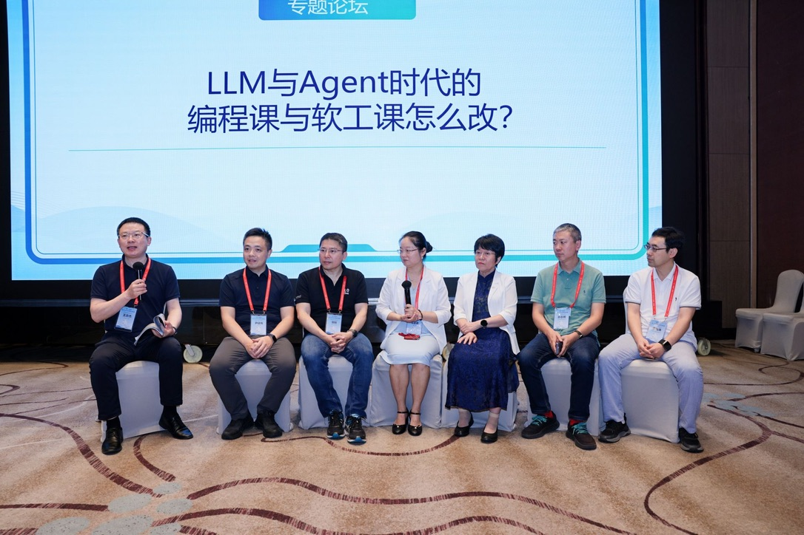
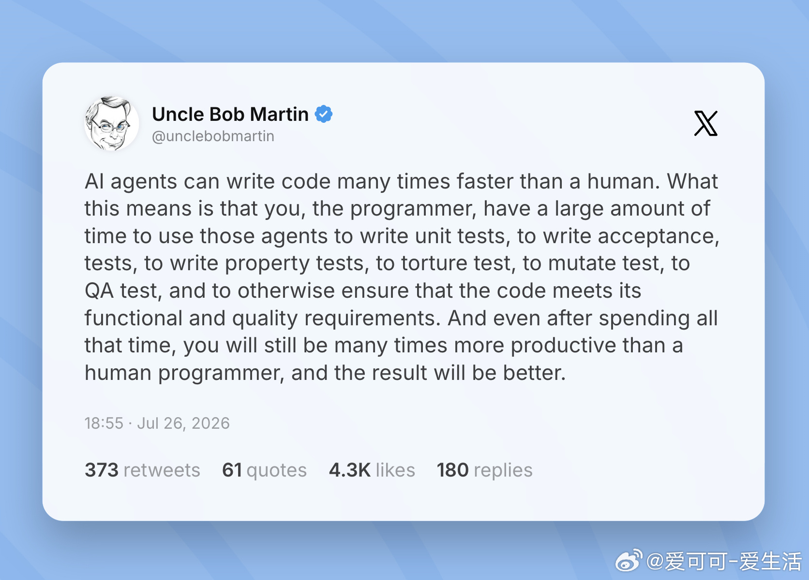
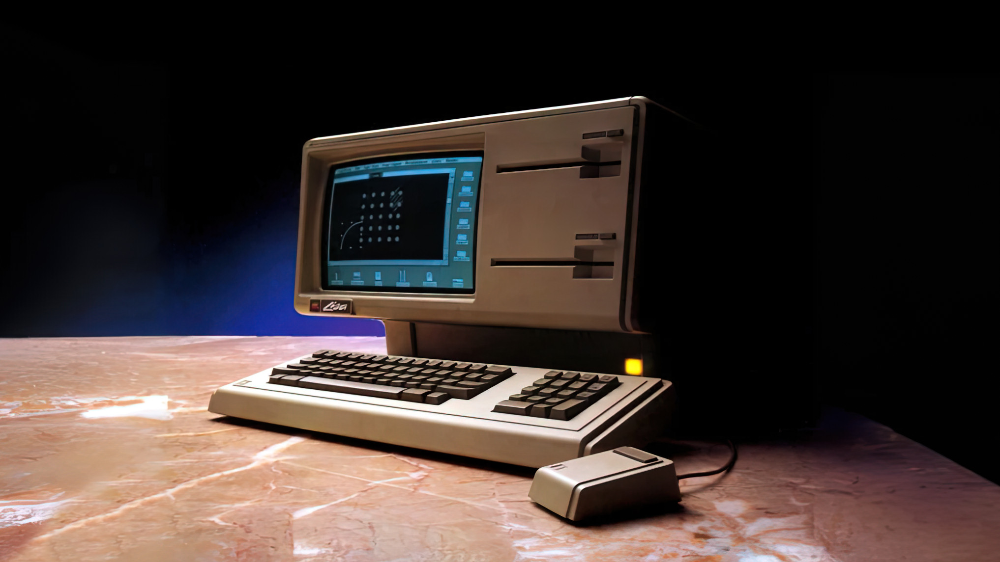

# AI 时代的大学计算机专业教育思考

## 第二篇：手写代码、以终为始、设计摩擦——训练的本质

这是 2026/7/29 CCF 未来计算机教育峰会的系列文章之二:  
   

[系列文章 1](https://gitee.com/zouxin2025/ASE/blob/master/chapter0/edu01.md)  
[本文](https://gitee.com/zouxin2025/ASE/blob/master/chapter0/edu02.md)  
[系列文章 3](https://gitee.com/zouxin2025/ASE/blob/master/chapter0/edu03.md)   
[系列文章 4](https://gitee.com/zouxin2025/ASE/blob/master/chapter0/edu04.md)  

### 一、一个让一线教师失眠的问题

“既然 AI 能生成完美代码了，我还让学生手写，不是浪费时间吗？”

这个在 FCES 论坛上的提问也每天出现在课堂上、作业批改中、课程设计讨论里。而最近，这个焦虑被新的“证据”不断放大——AI 前沿公司开始大量用 AI Agent 编程，软件工程泰斗、《Clean Code》作者 Uncle Bob 公开了他使用 AI 的策略：**彻底放弃阅读 AI 生成的代码。**

他认为这是榨取 AI 生产力的唯一路径——不再纠结于每一行逻辑，而是用一套极端的约束阵列——单元测试、Gherkin 验收测试、变异测试、质量指标和覆盖率工具——来“包围”AI。只要代码能闯过这套严苛的关卡，他就有信心交付。面对“不看代码还是不是工程师”的质疑，他的逻辑很硬：“我是工程师，因为我承担最终责任。”

如果这是终局 —— 专家不再看代码，而是设计约束系统来验证代码 —— 那初学者手写代码的意义何在？“以终为始”也是一种先进的教学方法，对吗？

与此同时，另一种声音加入：“计算机软件的发展就是不断抽象 —— 纸带、汇编、C、Java、框架……AI 为什么不是抽象自然而然的下一步？学习 CS 专业为什么不从这里开始？”

这两个问题指向同一个困惑：**如果专家已经不看代码了，如果 AI 就是最新的抽象层，那 CS 初学者为什么还要从底层开始？**

让我们先试着用两个公式来定位这个变化。

**程序 = 算法 + 数据结构**，这是每个 CS 学生都熟悉的公式。

而 **软件 = 程序 + 软件工程**——测试、CICD、质量门禁、架构约束，这些“软件工程”的部分，在 Uncle Bob 的新工作流中，恰好是他仍然亲自定义、亲自设计的部分。他把“程序”的生成完全交给了 AI，但他把“软件工程”的约束牢牢握在自己手里。他用测试用例定义“什么是正确”，用质量指标定义“什么是可接受”，用架构约束定义“什么是安全”。

这意味着，工程师的角色正在从“手艺人”转变为“约束架构师”。当代码生成变得廉价且海量，人类的评审体力已无法跟上，真正的工程挑战变成了如何设计一套让 AI 无法作弊、无法产生副作用的验证系统。**如果 AI 生成的代码变乱了，那是因为你设置的复杂度约束还不够狠。**

但这里有一个致命的跳跃：**Uncle Bob 能设计约束，是因为他四十年前手写了无数代码，深知什么是“好”、什么是“坏”、什么约束能拦住“坏”的而放过“好”的。初学者没有这个“深知”。** 他能转型为“约束架构师”，是因为他已经当过四十年“手艺人”。

问题背后还有一串追问：学生用 AI 十分钟完成作业，我该怎么办？AI 让学习越来越顺滑，这不好吗？难道我们非要让学生难受？

这些问题的共同误区是：**把“工具的终局使用场景” 和 “能力的习得过程”混为一谈。**

如果继续用足球这个比喻，我们会发现一个更耐人寻味的现象：**那些伟大的足球教练，在球员时代大多踢的是中场或后场，而不是那些靠惊人天赋解决问题的天才前锋。**

热爱足球的读者可能了解，大多数有成就的足球教练都是都是中场或后场球员出身。原因在于：**前锋的成功往往是“不可重现的瞬间灵感”。** 而中场和后场的工作本质上是**组织、协调、预判、抢险、和系统构建**。他们必须在混乱中保持站位，必须在攻防转换中看到全局，必须通过传球把队友串联成一个整体。这种能力不是天赋，而是通过大量实战、复盘和系统思考逐步长出来的。

软件工程也是如此。天才前锋式的程序员依然存在，但软件工程的核心挑战不是“等待天才”，而是**系统性地培养能够看清全局、在混乱中组织代码、协调团队、设计系统演进路径的 “中场大脑”。**

如果学生没有经历过中场的组织训练，没有在复杂的系统依赖中学会调度资源，没有在需求的不断变化中保持站位 —— 他们不仅无法成为伟大的软件工程师，甚至无法理解那些 “看似平庸但能持续稳定赢球” 的工程系统是如何构建的。 软件工程教育的使命，是培养能够“阅读比赛”的软件中场大脑。而这种能力，必须依靠亲身经历、真实摩擦和反复的认知撕裂来建立。

这正是为什么，Uncle Bob 今天能成为 AI Agent 的“教练” —— 是因为他的身体里刻着四十年在各种变化中摸爬滚打积累的“球感”。他经历过无数次认知撕裂，见过无数种崩溃形态，知道如何阅读系统的“比赛走势”。AI对他来说不是替代品，而是他四十年功力的放大器。

而一个从未亲自下场踢过球的人，即使拿着他的战术板，也无法判断AI这个“前锋”是在创造机会还是在浪费机会——他连“哪里错了”都看不出来，只能对着 AI 输出的幻觉干着急。

这就是终局使用场景与能力习得过程之间不可逾越的鸿沟。你不能因为看到教练员在场边举着战术板指挥若定，就认为球员不需要训练了。

### 二、马拉松的启示：比赛不是训练

马拉松运动员的终态是 -- 高速跑完 42 公里。但你见过哪个教练让运动员每天跑 42 公里来备战？

不会。专业训练做的是分解：间歇跑、节奏跑、力量训练、长距离慢跑 —— 把“跑完42公里” 这个终局能力拆成组件，逐一建构。业余跑者才堆距离，尽力跑 5公里、10公里、15公里…… 一路堆到42公里，看起来很爽，结果受伤、厌跑。

对应到 CS 和软件教育：如果只是不断用AI生成越来越大的软件 —— 贪吃蛇、俄罗斯方块、简易数据库、电商平台 —— 当项目复杂度指数级增长时，没有亲手建构过的判断力会卡在某处，因为那些关键决策 —— 模块边界、数据流、异常处理、性能瓶颈 —— AI都替你做了，而你从未经历过那个“抉择与代价”的过程。

更要命的是，AI写出的电商平台只是一个“从未经历过真实考验的系统”。当这个系统在真实环境中出问题时，你将无从下手 —— 你没有建立对系统整体结构的 “手感” 和隐性知识，AI也无法理解问题发生的上下文。结果就是：代码能demo，但系统不敢上线。

回看 Uncle Bob。他写了四十年代码，积累了四十年“手感”。他“不看代码”是在调用内化的直觉。初学者没有这个系统。让初学者模仿他的终局行为，不是“以终为始”，是“以形为始”。

“以终为始”的“神”是用终局能力结构倒推训练组件；神要自己慢慢培养生长，形可以模仿。

### 三、手写训练在训练什么？

如果手写代码的目的不是“将来手写”，那它在训练什么？

**逻辑链的完整性。** 用 AI 得到的是“结果”，看不到自己思维链条上的断裂点 —— 因为 AI 替你补了。手写时，代码不工作，你一行行推演：这个条件覆盖所有情况吗？边界条件对吗？在这个非常费脑子的推演中，你看到的是自己思维的盲区。

**脑内编译与诊断力。** 熟练程序员读代码，是在脑中“模拟执行”。这种能力是在无数次手写和调试中长出来的“手感”。AI 跳过这个环节，学生失去了“没有实际执行环境时推演系统行为”的能力。而深夜系统崩溃时，这能力是唯一的救命稻草。

**对抽象层次的感知。** 每一层抽象都挡掉一些复杂性，暴露一些接口。经历过底层训练的人知道“挡掉了什么、暴露了什么、代价是什么”。只用最高层 AI 工具的人，只知道“它能做什么”，不知道“它为什么不能做某些事”——直到系统崩溃才第一次意识到抽象的边界。

**判断力的来源。** 史蒂夫·乔布斯的品味并非凭空而来。他年轻时在Atari做硬件组装，看不惯粗糙的焊接，主动提出改进建议 —— 第一层判断力，是从亲手摸过电路板、见过焊点脱落长什么样开始的。但判断力不是一旦获得就能终身受用的。Apple II大获成功后，乔布斯在 Lisa 项目中纵容创意凌驾于工程原理之上，导致Lisa成为一款灾难。这次惨败让他明白：判断力需要不断被现实校正，这段失败教育了他，让他领导的 Mac 团队平衡了工程、艺术和商业需求，取得了成功。

Apple Lisa - 只卖了一万台就停产。

更有意思的是，当他重返 Apple 取得成功并成为皮克斯（Pixar）公司的 CEO 后，他在电影创意会上主动说：“我不是专家，你们可以忽略我的话。” 在消费者电子科技领域，他的创意和判断力无人能及；在电影创意领域，他没有亲手做过、没有踩过坑，他选择了退让。即便是乔布斯，**判断力也有严格的边界，这个边界由 “你在这个领域深耕过吗” 划定。**

### 四、辨明四种困难

教育者最容易犯的错误是分不清“必要摩擦”和“无效摩擦”。先区分四种困难：

**本质困难**——软件行业存在的基础。竞态条件、一致性、性能瓶颈。问题本身就是复杂的。**本质困难的存在，恰恰是软件行业需要专家的原因。**

**偶然困难**——技术选择带来的，如 API 不直观、错误信息晦涩。应被消除。

**琐碎困难**——环境配置、路径找不到、依赖冲突。没有认知价值，可通过协作分担。

**不必要的困难**——教育者强行制造的，如“必须用纸带编程”。与核心认知无关，应放弃。

教育者的任务：**保护本质困难，消除偶然困难，分担琐碎困难，放弃不必要的困难。**

这四种困难的区分，与足球教练的比喻一脉相承：**前锋的天赋无法复制，但中场的组织能力可以通过训练获得。** 软件工程教育的目标，是让学生在“本质困难”的反复搏斗中长出组织与判断的“肌肉记忆”，而不是用AI把所有的困难全部抹平。

好的判断方式是：学生感到困难时问自己 —— 这困难是因为没理解核心概念，还是工具不好用？AI 工具消失后学生失去什么？失去的东西能通过其他方式获得吗？什么样的困难是“必要”的？这个问题我们会在第三篇中详细展开。

### 五、一项实证：无护栏的 AI 让作业更好看，让脑子更懒

2025 年，宾夕法尼亚大学 Hamsa Bastani 团队完成了一项大规模随机对照实验。[近千名高中生分组用不同 AI 工具学数学](https://mp.weixin.qq.com/s/Hj5GUDXTm6OCYRyyhCtazQ)：

- 用**无护栏 GPT** 的学生，练习时成绩飙升约 48%；
- 但**拿走 AI 后**，独立测试表现比从未用过 AI 的对照组 **低了 17%**；
- 用**带教学护栏的 GPT Tutor**（引导式提问）的学生，成绩提升 127%，撤走后无倒退。

Andrew Ng 在宣布其教育产品 LearnVector 时写道：“研究表明，没有护栏的聊天机器人妨碍人类学习。它们让你作业分数更高。但把认知过程卸载给机器人，结果是学生技能更差。”

这叫 **“认知卸载”**——计算器卸载算术，搜索引擎卸载记忆，生成式 AI 正在卸载推理过程本身。有工具时产出增加，工具撤走后独立能力的缺口便显现。

**AI 的强大力量足以毁掉学习能力的培养，除非你精确地控制它释放力量的方式。**

### 六、劈柴与壁炉：两个“暖”

梭罗在《瓦尔登湖》中写道：

> “我身体变暖了两次，一次在我劈它们的时候，一次在它们燃烧的时候。”

亨利·福特将这句话刻在壁炉上：“Chop your own firewood and it will warm you twice.”

这句老话揭示了一个被 AI 时代逐渐遗忘的真理：**底层劳动的艰苦体验本身具有不可替代的认知价值，而工具的便捷使用是另一重独立的认知跃迁。两回“暖”，缺一不可。**

Uncle Bob 现在享受的是第二回“暖” —— 他燃烧的是 AI 生成的代码。但他在四十年的职业生涯中，早已完成了第一回“暖”—— 现在他设计约束系统时调用的，正是那四十年劈柴积累的“手感”。

但今天的 AI 初学者容易产生一种错觉：看到别人家的壁炉烧得正旺，就以为自己也有了壁炉。AI 生成的代码、AI 完成的作业、AI 跑通的 demo——那些温暖都是别人家的。自己推开家门，仍然是家徒四壁，没有劈好的柴，没有砌好的炉膛，连火种都没有。

**AI 给了你一张壁炉的照片，但没有给你建造壁炉的能力。** 而真正的寒冬来临时，照片不会发热。

[参考文章：暖两回](https://mp.weixin.qq.com/s/mNmip7Za5zpRYxZw4yNU5g)

### 七、以终为始的形与神

“以终为始”可能是被误用最多的教育概念。

它的“形”是：学生将来用 AI 写代码，所以现在也应该用 AI 写代码。

它的“神”是：学生将来需要定义问题、拆解任务、判断 AI 输出质量、在 AI 失效时徒手修复——训练应倒推：这些能力如何按认知时序生长？

执着于“形”，学生学会“用 AI”但学不会“判断 AI 对不对”，变成 AI 的附庸而非主人。追求“神”，设计拆解训练：裸奔训练（暴露认知边界）→ 判断力训练（批判 AI 输出）→ 整合训练（驾驭 AI，对结果负责）。

**裸奔训练尤其重要：只有在没有 AI 时，你才能看到自己逻辑链的断裂点。**

AI 在训练中的角色是让学生走更远的路，看到更多的模式。一个螺旋上升的框架：

| 阶段 | AI 的角色 | 学生的任务 |
|---|---|---|
| raw skill 训练 | 禁用 | 手写逻辑推演，暴露认知边界 |
| 判断力训练 | 生成方案 | 批判 AI 输出，指出隐患 |
| 整合训练 | 协作者 | 定义问题，驾驭 AI，对结果负责 |

### 八、外行用AI做demo，CS专家用AI建系统

设计师用AI做App，是AI跨越了技术障碍，让他直接验证设计想法；产品经理用AI做原型，是把精力集中在需求定义和快速反馈上。他们的终局是设计或产品，不打算深夜追查并发Bug，也不打算重构遗留系统。

**但CS专业毕业生的终局，恰恰应该是这些。** 外行的成功来自他有一个**非CS的核心能力**，AI帮他放大了这个能力。而 CS 学生的核心竞争力就是 CS 本身——如果只教“用AI生成代码”，他毕业后会发现设计师、产品经理、甚至任何一个会用AI的人都能做他的工作。他没有护城河。

**AI让外行能触达编程，但让真正的CS专家更加稀缺。** 当AI生成的海量代码需要被验证、集成、运维、修复时，能徒手诊断系统、设计约束架构、在深夜故障中定位根因的人，才真正不可替代。

课程早期让学生用AI快速做出原型——这是“先看到海”，点燃方向感。但之后手写、调试、重构、裸奔——是“游到对岸”的必要过程。

市场的检验最直接：两个CS毕业生，A亲手用传统编程语言和框架写了10个经典游戏，B用 AI 重写了 10 个经典游戏。老板让 A 开始学 AI工具，一个下午就够了，他的能力被放大很多倍；如果让 B 学手动 debug 底层问题，需要多久？Debug需要的是“手感”，只能亲手做、亲手错、亲手改来生长。**差距不是“知识差”，是“体质差”。知识可快速补齐，体质只能慢慢练。**  注意， 同学B 可以是一个不错的游戏设计策划人员， 但是他有什么独特的策划能力呢？这就是另一个专业领域的问题了。 

### 九、收束

Uncle Bob 已经转型为“驾驭 AI 的架构师”——用测试、质量门禁、CICD 来让 AI 不犯错，他深知什么是“好”的代码、什么是“坏”的代码、什么约束能拦住“坏”的而放过“好”的。**这个“深知”，来自四十年亲手劈柴的积累。**

对初学者来说，**程序 = 算法 + 数据结构** 需要亲手写、亲手错、亲手改来内化；**软件 = 程序 + 软件工程** 中的测试、CICD、约束设计，同样需要先理解“为什么要这样约束”才能设计出有效的约束。

AI 是一种新抽象，但它和之前所有抽象有本质区别：**之前的抽象是确定性的，人可理解其机制；AI 的 “正确性” 是统计意义上的，不透明。** 使用不透明的抽象，比任何之前抽象都更需要底层判断力——因为它出错时，你只能靠自己对系统本质的理解来诊断。

手写训练的价值，在于大脑被迫完成的“逻辑闭合”和“自我诊断”。AI 越强，“裸奔”环节越重要——那是唯一能让认知结构显形的地方。

**教育的艺术，不是消除所有摩擦，而是在正确位置设计正确摩擦。** 让学生与本学科的本质困难不断搏斗，帮他们快速征服琐碎障碍，把认知能量用在主战场。

当 CS 学生走出课堂，他们带走的不是“用过 AI”的经历，而是“没有 AI 时也能独立判断”的底气。这底气，才是所有训练的终点。

---
下一篇预告：当“培养 CS 专家”成为共识，当“设计必要摩擦”成为方法，大学本身如何定位？第三篇《大学的回归——从“职业培训班”到“决策者培养”》，回答一个更根本的问题：大学的价值在哪里？ --> [系列文章 3](https://gitee.com/zouxin2025/ASE/blob/master/chapter0/edu03.md)