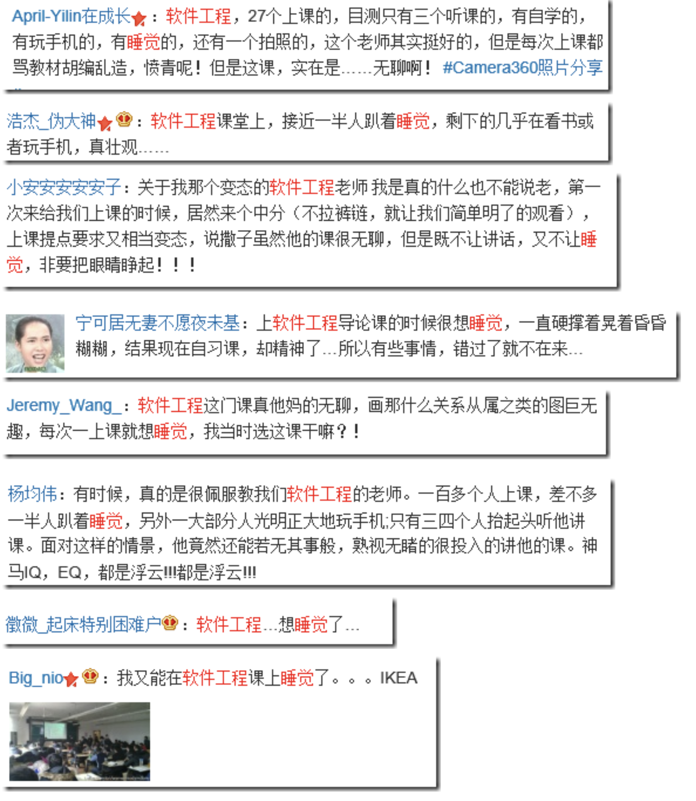
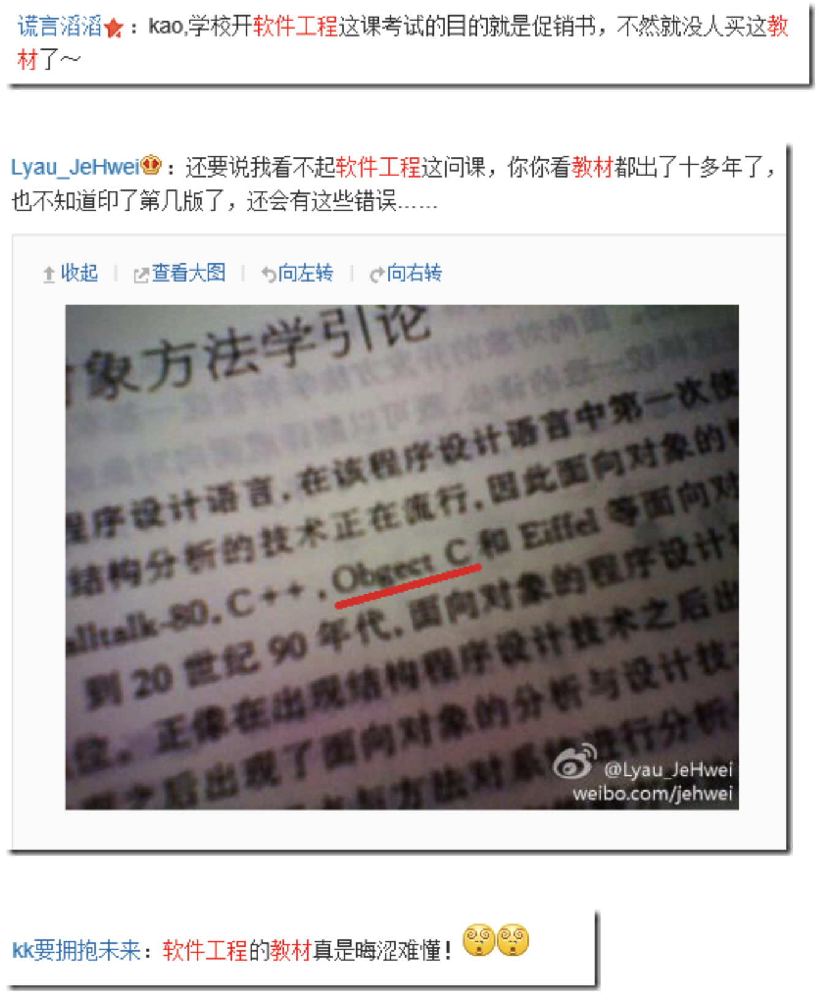
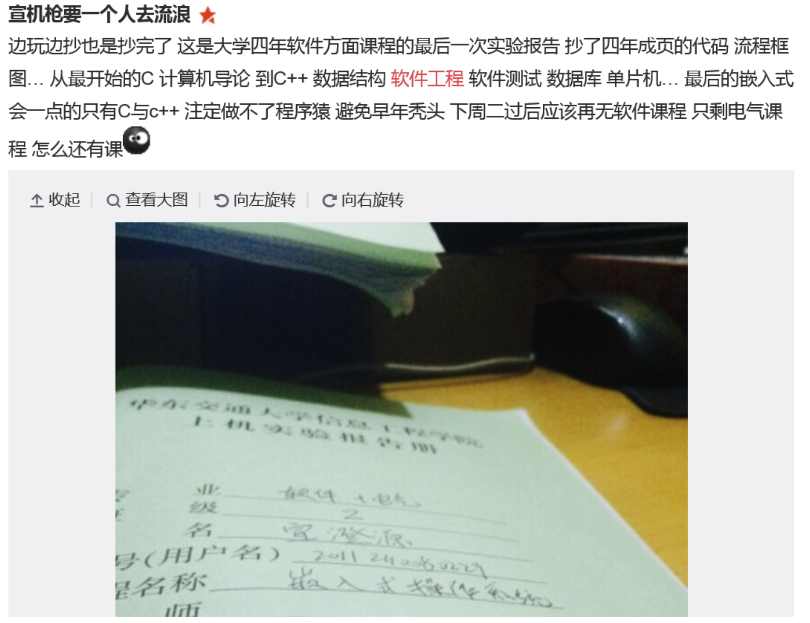
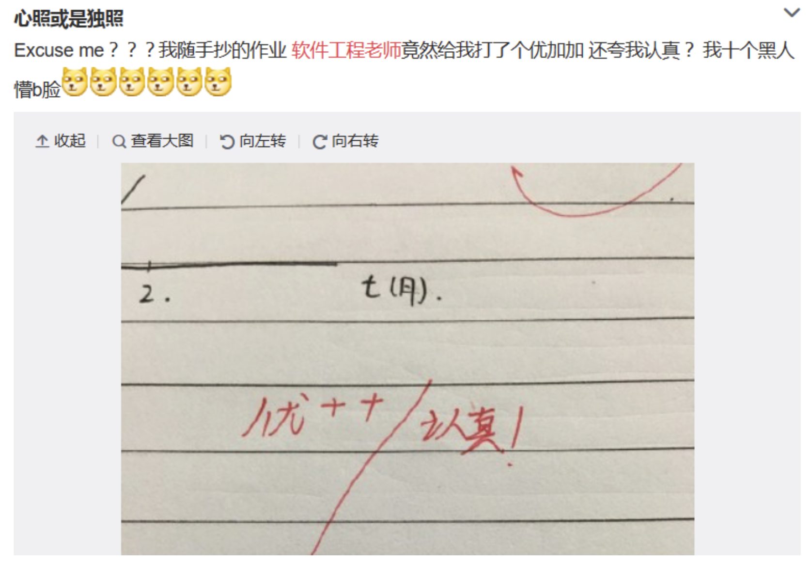
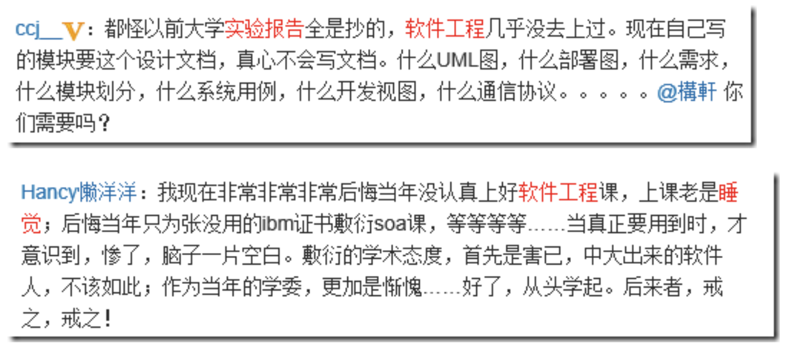

# 大学精神的回归 —— 从“职业短训班”到“未来的主人翁培养”

这是 2026/7/29 CCF 未来计算机教育峰会的系列文章之三:  
  与会者反映，我们的论坛是当天下午讨论最热烈和最拥挤的会场。   
[系列文章 1](https://gitee.com/zouxin2025/ASE/blob/master/chapter0/edu01.md)  
[系列文章 2](https://gitee.com/zouxin2025/ASE/blob/master/chapter0/edu02.md)  
[本文](https://gitee.com/zouxin2025/ASE/blob/master/chapter0/edu03.md)   
[系列文章 4](https://gitee.com/zouxin2025/ASE/blob/master/chapter0/edu04.md)  

## 一、 焦虑与真相

如果一所一流大学计算机系或软件学院的毕业生，最终和培训班毕业生一样，只能去做 AI 可以高效替代的基础开发工作 —— **那这里的培养计划还值得读吗？**

过去二十年，IT 行业的爆发式红利掩盖了深层矛盾：很多高校的计算机系与软件学院，号称教“核心科学与先进的工程”，实则在相当数量的课程中，将教学降级为“基础应用开发”——语言、框架、工具、CRUD。因为市场需求旺盛，学生毕业就有高薪，一些教学质量平庸的院系也享受到了时代红利。

**现在，经济并没有持续扩张，AI 又带来了一批有用的工具。** 写代码，写文案的门槛被大幅拉低，行业对 “纯执行型程序员” 的需求发生了结构性收缩。如果学院的培养目标依然是“能按指令写基础代码的人”，AI 做得更好、更快、更便宜。

马克·吐温在一个多世纪前说过一句话，在今天听来格外刺耳：

> 不要让 schooling 妨碍了你的 education。   
> Don't let schooling interfere with your education. 

*schooling* 是制度化的“上学”——按课程表完成学分、通过考试、拿到文凭；*education* 是真正的“教育”——让心智成长、让判断力形成、让一个人成为能够独立思考的完整的人。

如果大学正在让学生忙于应付打卡、签到、刷分、背考点、写 “一次跑通即交差”的作业，那“上学”本身，是否正在成为“心智成长”的最大障碍？

2026 年，一批办学务实、紧贴产业需求的高职院校迎来了大量高分考生。这是学生和家长用脚投票的结果。如果本科院校不能提供真正有价值的“心智成长”，而只是让学生走过场的“上学”，学生自然会去寻找更值得投入的路径。

**但“基础编码岗位减少”不等于“计算机专业毕业生不再被需要”。** 历史反复证明，技术革命消灭低价值的重复劳动，创造更高价值的判断性工作。放射科医生没有因为 AI 读片而失业，反而更忙了；汽车工人没有因为自动化而消失，反而催生了更多高技能岗位。一流大学的任务，不是守住旧门槛，而是帮助学生跨过新门槛，进入更高价值的领域。

## 二、 根因与陷阱

如果把当前的就业压力完全归结于 AI，就忽略了一个事实：**早在 ChatGPT 爆火之前，传统 CS/SE 培养体系的深层矛盾就已经显现。**

十多年前，微博上曾有不少学生对软件工程课的吐槽：*“一百多个人上课，一半人趴着睡觉，剩下大半在玩手机”*，内容 *“空洞乏味”*；而老师面对这一片睡倒的死寂，*“竟然还能若无其事般、熟视无睹地讲他的课”*。还有明目张胆地抄袭，老师敷衍了事：

部分同学也发出了真心的后悔：

### 为什么好的培养体系没有尽快扩散？

有人会说：*“姚班、图灵班、ACM 班本来就是拔尖培养计划，不可能人人都上。”* 但值得深思的是：**对于以优异成绩考入一流大学的学生，是否至少应该拥有接受先进培养理念的机会？**

真实项目、前沿尝试、开放社区、导师制、科研训练……这些培养理念经过二十多年实践，已证明能培养出 AI 时代最具竞争力的人才。它们不一定覆盖所有学生，但不应永远停留在极少数试点班级。

**真正值得追问的，是这些成功经验为什么没有更快地扩散？** 很多学校的培养体系在过去 15 年都没有变化。 为什么？ 一个令人不安的解释是：**现有做法已经足够完成考核指标。** 学生能毕业，招生没下降，就业数据在繁荣期也足够好。与其承担改革的高成本和高风险，不如继续沿用熟悉的旧体系。

### 水课教会了学生“软件工程的原则是多余的”

前文提到，很多院系的教学降级为 “入门应用开发”，用玩具项目替代了真实的工程实践。但这不仅仅是“内容太简单”的问题 —— 更深层的危害在于：**即使学生完成了作业，他们获得的也是一种扭曲的工程认知。**

软件工程的核心原则——如单一职责原则（SRP）、开放-封闭原则（OCP）——在实际作业中几乎得不到锻炼。原因很简单：《敏捷软件开发》明确指出：

> *“变化的轴线仅当变化实际发生时才具有真正的意义。如果没有征兆，应用 SRP 或其他原则都是不明智的。”*

换句话说，软件设计原则的价值，只有在需求发生变化时才显现。但大学作业中，软件需求在布置的那一刻就冻结了，生命周期在演示结束时就终结了。没有任何后续变化、没有任何维护压力、没有任何新需求需要兼容。既然不用考虑任何后续变化，学生为何不把所有功能写在一个 `main()` 里，尽快交差？

**这说明学生是极其“明智”地完成了作业。** 在“没有变化”的环境里，遵守设计原则的确是多余的。于是，学生陷入了“我有银弹”的误区：“你看我一个通宵写完了程序得了高分。不用啥设计原则，软件容易得很！”

在软件专业培养体系，这样的没有“变化轴线”的作业要求，恰恰是对软件工程核心原则的否定。

**这是 CS/软件工程培养体系最大的失职：** 从未在培养体系中构建反映真实变化的教学场景。没有“需求的演进”，学生就永远体会不到软件设计的必要性；没有“维持系统生命周期的痛苦”，他们就无法成长为对系统生命周期负责的建造者。一个从未经历过需求变更的学生，如何理解软件的可维护性？一个从未面对过技术债务的学生，如何理解架构设计的分量？

失职的培养体系 -> 偏差的评价体系 -> 水课 -> 它不仅没有教会学生工程能力，反而让他们学会了错误的结论：“软件工程的原则都是多余的，程序能演示一次就行。” 谁要对此负责？ 

## 三、 这不是 CS 的问题

这个问题远远超出 CS。2026 年，AI 可以写论文、解微分方程、做市场分析、读 CT 片、检索判例、生成法律文书。

**如果一个专业最核心的“产出”——论文、计算、报告、诊断——都可以被 AI 以更高效率完成，这个专业的“毕业标准”还成立吗？**

| 专业 | 旧标准（被 AI 覆盖） | 新标准（AI 无法覆盖） |
|:---|:---|:---|
| 历史学 | 写一篇论文 | 对一手史料的批判性解读；在真实史学争论中做出独立判断 |
| 物理学 | 解出正确答案 | 设计实验证明假设；解释近似成立或不成立的理由 |
| 商科 | 写商业计划书 | 在真实市场环境中做出决策并承担后果 |
| 医科 | 读片、诊断 | 面对病人的不确定性判断；与患者沟通并做出伦理决策 |
| 法科 | 检索判例、写文书 | 在真实法庭辩论中捍卫观点；在模糊法律边界中做出判断 |

问题的本质是：**“能完成确定性的任务”已不再是专业毕业生的核心价值。** 真正的价值，正在转移到另一个方向。

**所有专业的共同底线：在不确定性中做决策，并为结果负责。**

**大学的新使命：从“传授知识，教会学生完成确定性任务”转向“培养学生面对不确定性时做出可靠判断的能力。”**

## 四、 核心判断：“主人”是一种思维方式

“主人”不是职位，而是一种思维方式：

| 维度 | “短工”思维 | “主人”思维 |
| --- | --- | --- |
| **与系统的关系** | 交付即断开，只对当前任务负责 | 长期维护，对系统的演进与生命周期负责 |
| **面对新技术/AI** | 焦虑——AI 正在接管纯执行 | 欢迎——AI 释放重复劳动，放大判断力 |
| **核心价值** | 代码产出的速度与数量 | 问题的精准定义、方案的折中判断与风险审计 |

### Build To Learn, Show, Serve, Win

“主人”在真实世界中具体表现为四种构建实践：

- **Build To Learn**——通过做各种实验（包括手写代码，手动 debug 程序...），发现规律。对应科研训练。
- **Build To Show**——证明技术可能性。对应创新能力展示。 show fast, fail fast, fail often, 快速获得反馈和改进的机会。
- **Build To Serve**——创造可复用的基础设施。对应社会责任与工程素养。 AI 快速创造的程序如扛起对道德、伦理、长期维护的责任？
- **Build To Win**——在真实市场中检验自己。对应真实世界的能力验证。 做一些符合 AI 时代需求的一流产品，医学、健康、能源、航天，这些领域都大有可为，别再纠结 “图书馆管理系统” 了！ 

**大学要培养的，正是能够在实验室里 Build To Learn，也能在产业中 Build To Win 的人。**

## 五、 对大学领导的启示：三条行动路径

### 路径一：把 AI 当“放大镜”

AI 暴露了哪些是“低价值重复劳动”（纯语法训练、默写设计模式定义），也暴露了哪些能力才是真正稀缺的（系统判断力、架构感知、风险审计）。大学的任务是：**把 AI 暴露出来的“能力缺口”填上，而不是把 AI 关在门外。**

### 路径二：重新定义“入门”

以前“入门”是“会写代码”。现在“入门”应该变成“会审查代码、会设计测试、会诊断系统、会承担责任”。入门标准提高了，但毕业生的价值也更高了。

### 路径三：用“社会反馈”取代“分数闭环”

让学生面对真实用户，而不是只面对老师的评分标准。黑客松、开源社区、真实项目 —— 让学生在被用户吐槽、被市场冷遇、被真实压力击穿的过程中，长出对结果负责的意识。

**当入门级工作被 AI 吸收，大学的价值不是守住旧门槛，而是帮助学生跨过新门槛，进入更高价值的领域。**

## 六、 评价的时机：十年树木，百年树人

评价一门课的质量，**评价发生在什么时候**至关重要。同一个学生，在三个不同的时间点，对同一门课的评价可能完全不同：

| 维度 | 第一时间点：课程中 | 第二时间点：得到成绩后 | 第三时间点：毕业一年后 |
|:---|:---|:---|:---|
| **评价内容** | 体验和感受 | 分数满意度 | 长期价值、能力迁移 |
| **学生状态** | 尚未经历完整课程 | 受分数情绪干扰 | 已进入真实工作，可冷静回溯 |
| **本质上在问** | “我上课开心吗？” | “我对分数满意吗？” | “这门课到底帮了我多少？” |
| **奖励什么** | 轻松、有趣、低门槛 | 给分高、考试简单 | 有长期价值 |
| **惩罚什么** | 难度高、作业多 | 考试难、给分严 | 水课 |
| **与真实能力的关系** | 弱相关，甚至负相关 | 弱相关，受情绪扭曲 | **强相关** |
| **目前使用频率** | 最常用 | 较常用 | **极少使用** |

**“学生评教”最常测量的两个时间点，恰恰是最不准确的；而唯一能测量课程长期价值的时间点，却极少被使用。**

毕业一年后评价在操作上更困难——学生已离校、难以追踪、回收率低。**指标容易收集但误差大，vs 指标难收集但反映核心价值 —— 大学的培养体系选哪一个？**

### 一个真实的案例：水课如何倒逼硬课

我在某高校开设《软件工程》时发现，学生编程基础很差——原来前序编程课只需写 200 行 Java 代码就能通过。我只好先补习程序开发基础（第一个公式：**程序 = 算法 + 数据结构**），结果没有充足时间教授第二个公式（**软件 = 程序 + 软件工程**）和第三个公式（**软件企业 = 软件 + 商业模式**）。学生认为我的要求“太变态了”，在评教中给了差评；而水课教师获得了高分好评。

**这说明培养计划已经失控：** 水课降低了学生的预期，把“正常要求”当作“变态要求”，差评反过来施压正常课程也不得不放水。毕业一年后，可能有些同学会有醒悟，但是如何反映给学校呢？

这不是某一个教师的问题，而是评价体系的问题。几年后，一位同学告诉我，他后来才意识到我的课对他有长期的正面作用。

### 一流本科大学 vs 高职 vs 短期培训

| 维度 | 短期培训班 | 高职院校 | 一流本科大学 |
|:---|:---|:---|:---|
| **核心目标** | 掌握一项具体技能 | 适应具体岗位 | 培养系统思维和长期判断力 |
| **最佳评价时机** | 培训结束时 | 毕业时 | **毕业一年后** |
| **核心问题** | “你能做这件事吗？” | “你能适应岗位吗？” | “你能在不断变化的环境中持续成长吗？” |

培训班的承诺是短期的、可当场验证的。高职院校的承诺是中期可验证的。**一流本科大学的承诺是长期的**——这个承诺只能在学生进入真实世界之后才逐渐显现。

如果一所一流本科大学只用“课程中”或“考试后”的即时满意度来评价课程，它就是在用评价培训班的尺子衡量自己。**你承诺的是长期成长，却用短期指标来衡量自己——这是一种根本性的错位。**

如果一所大学真正相信“十年树木，百年树人”，它就应当愿意为“长期评价”支付成本。这不是教学技巧问题，而是价值观和培养体系的原则问题——**是否愿意用长期的、困难的方式，来衡量大学教育工作的真实成效？**

## 七、 结语：改革的路径与边界

AI 没有否定大学的价值，它只是揭开了被繁荣红利掩盖的问题：**大学究竟要培养什么样的人？**

大学从来不是技术的被动接受者。19 世纪德国研究型大学孕育了现代生命科学体系；20 世纪神经科学从跨学科探索发展为独立学科。每一次技术革命，大学都在做同一件事：**把不确定的新领域“制度化”——建立学术共同体、创建培养体系、定义专业标准**，将松散的知识探索转化为可持续运转的职业生态。

大学是能够容纳天才、怪才、偏才的地方。乔布斯从里德学院退学后， 在学院旁听了十八个月 —— 包括一门后来让 Macintosh 拥有漂亮字体的书法课。哈佛允许比尔·盖茨请长假去遥远的新墨西哥州开发软件。 **天才常常以“非标准”的方式存在，大学的价值恰恰在于为这些“非标准”的头脑提供生长的土壤。**

**但偏才与懒汉的本质区别在于：一个在创造，一个在逃避。**

| 维度 | 真正的偏才 / 怪才 | 偷懒混毕业的人 |
|:---|:---|:---|
| **产出** | 有超出常规的创作或探索 | 什么都没有 |
| **态度** | 对某个领域有极强的好奇心 | 追求最低能耗 |
| **可验证性** | 能用作品证明自己 | 无法提供任何有说服力的产出 |

大学要做的，不是用同一把尺子衡量所有人，而是**有能力区分“创造性偏离”和“消极性偏离”**。

**大学容忍偏才的前提，是偏才能够用实际产出证明自己的价值。** 如果你不来上课，但能做出让人信服的作品——那你可以不来。如果你只是不想努力，却说“不要让上学妨碍我的教育”——那只是懒惰的遮羞布。

大学的任务，是设计一套制度：**既能识别和保护真正在创造的人，又能防止这套制度被滥用为“躺平的通行证”。** 关键在于评价的核心从“你完成了什么规定动作”转向“你证明了什么能力”。

走出十几年的舒适区，打破旧套路 —— 要开始做了。**Learning by doing.**

*（下一篇预告：面对重构后的培养计划，老师与学生该如何协同？如何防止学生用 AI 短视通关？第四篇《新生产关系——师-AI-生三元协同与系统变革》，将深入教学一线，回答“老师怎么教、学生怎么学”的问题。）*  [系列文章 4](https://gitee.com/zouxin2025/ASE/blob/master/chapter0/edu04.md)