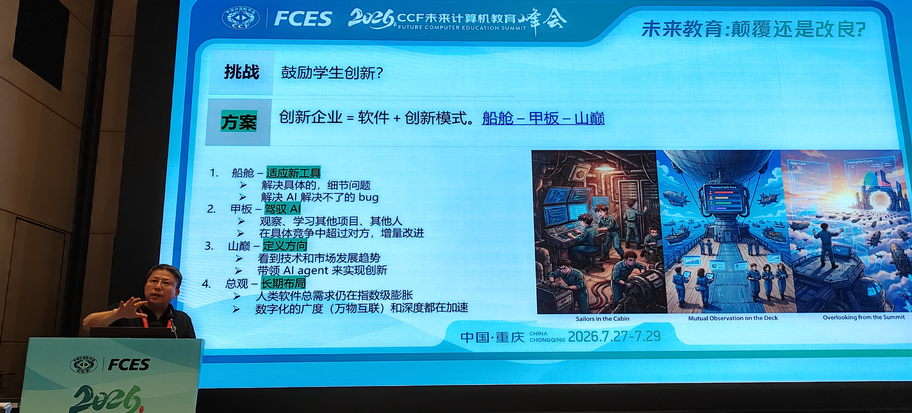
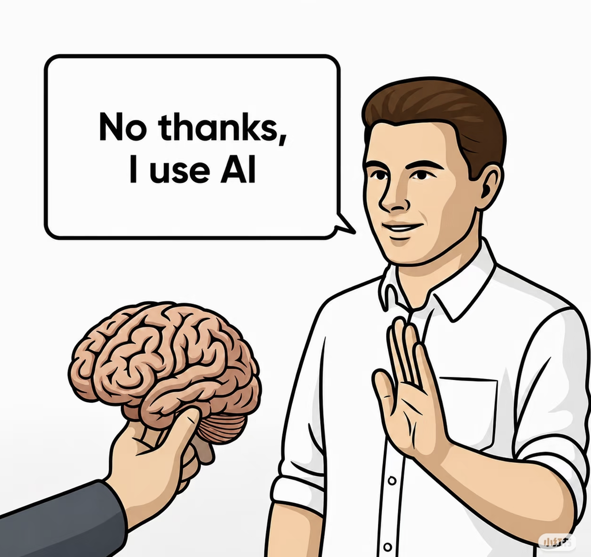

# 构建新关系：老师 - AI - 学生的协同

这是 2026/7/29 CCF 未来计算机教育峰会的系列文章之四

[系列文章 1](https://gitee.com/zouxin2025/ASE/blob/master/chapter0/edu01.md)  
[系列文章 2](https://gitee.com/zouxin2025/ASE/blob/master/chapter0/edu02.md)  
[系列文章 3](https://gitee.com/zouxin2025/ASE/blob/master/chapter0/edu03.md)   
[系列文章 4](https://gitee.com/zouxin2025/ASE/blob/master/chapter0/edu04.md)

## 一、上学上课，妨碍了学习和成长？

**”上课妨碍我学习了。“**
 
这是2026年春天，一位计算机专业学生在课程反馈问卷里写下的原话。虽然这可能只是个别学生的抱怨，但它确实像一道预警信号，逼迫我们思考：如果课堂输出的信息密度和反馈速度，甚至赶不上一个AI Agent，那课堂的价值究竟在哪里？

AI可以做知识播报员、代码生成器、作业批改员。如果课堂仍然停留在单向的知识传递，再加上各种签到和流程规定，那很可能“妨碍学习”——因为学生可能正在按自己的节奏进行深度（心流）的学习。这和第三篇的[不要让上学妨碍我心智成长](https://gitee.com/zouxin2025/ASE/blob/master/chapter0/edu03.md)前后呼应。

**然而，“上课妨碍我学习了”这句话背后，可能站着两种完全不同的人。**

第一种，是**真正在创造的人**。如上所述，这些学生 “不想被规定好的繁琐流程和节奏拖着走”。他们处于深度投入的“心流”状态，不断突破自己的认知边界。

第二种，是**正在逃避的人**。他认为AI可以帮他搞定一切，所以不需要课堂上的“手动练习”；他认为这门课的细节 “反正以后用不到”，所以不值得投入；他只是在寻找最低能耗的方式“混过去” —— 用AI快速生成作业。 这是前文提到的 [混淆 “工具的使用场景” 和 “能力的习得过程”](https://gitee.com/zouxin2025/ASE/blob/master/chapter0/edu02.md) 的错误。

偏才与懒汉在行为上有一个共同点：都不完全遵守标准化的课堂流程。但本质区别在于——**一个在创造，一个在逃避。**

| 维度 | 真正的心流学习者 | AI偷懒混作业的人 |
|:---|:---|:---|
| **产出** | 有超出常规的创作或探索 | 只有AI生成的“一次性”作业 |
| **态度** | 对某个领域有极强的好奇心 | 追求最低能耗 |
| **面临的挑战** | 挑战比课程更高难度的目标 | 回避任何挑战 |
| **可验证性** | 能用作品、项目证明自己 | 无法提供任何有说服力的产出 |

**如何区分这两种人？答案不是靠“直觉”，而是靠“可验证的证据”。**

如果学生不来上课，但能定期提交超出课程要求的作品、项目，并且能通过质询和答辩证明自己掌握了核心概念——老师应该给他空间，甚至主动提供指导。**这是“基于产出的豁免”。**

如果学生不来上课，也拿不出任何有说服力的产出，只是在考试前用AI突击完成作业 —— 老师需要介入，设计“即使全用AI也要付出巨大努力”的考核标准。**这是“基于产出的问责”。**

**大学容忍偏才的前提，是偏才能够用实际产出证明自己的价值。** 评价的核心从“你完成了什么规定动作”转向“你证明了什么能力”。

这正是第四篇要展开的核心命题：**如何设计老师-AI-学生的协同体系，让学生能在老师和AI的帮助下成长。** 让AI成为认知训练的加速器，而不是思考过程的替代者；让老师从“知识播报员”转型为“认知训练设计师”；让学生在AI和老师的双重支持下，逐步从“执行者”成长为“决策者”。

在讨论具体做法之前，先面对几组来自一线教师的真实提问：

- “我们连老师自己都还不会用AI工具，怎么教学生用好AI？”
- “我们首先得解决‘如何让老师愿意改革’的问题吧？”
- “AI都来了，还需要这么多老师吗？”
- “什么时候可以取消现有的计算机闭卷考试？”

这些问题没有标准答案，但它们指向了同一个方向：**AI时代的教育改革，不是“增加一门AI课”就能解决的。** 它涉及教师能力、评价体系、课程目标、考试制度的系统性调整。

## 二、师生关系：从“园丁与树苗”到“教练与学员”，再到“合作者”

在讨论“怎么做”之前，必须先回答一个更根本的问题：**师生关系应该是什么样的？**

现实中的课堂往往混合着多种角色，不存在纯粹的某一种模式。但传统体制下容易滋生出几种极端病态倾向：

**“园丁与树苗”——** 老师修剪、塑造，想让树苗长成“应该成为的样子”。但大学生有自己的思想。龚自珍在《病梅馆记》中早已批判过这种“以奇怪姿势修剪人才”的做法。

**“餐馆与食客”——** 学生交了学费，仿佛在餐厅消费。但食客喜欢“菜量大、新鲜”，而大部分学生不会赞美“作业量大、工具前沿、考试严格”。如果单纯依靠学生短期的评价来驱动教学，会迫使老师输出水课。

**“保姆与幼儿”——** 老师把课程内容煮成婴儿食品，一勺一勺喂给学生。学生把反复咀嚼过的东西再嚼一遍，觉得课程乏味。这种模式培养了“巨婴”：一边说“高等数学为何要教得这么难？毕业后会用得到么？”，一边说“我们又不是全职工程师，为什么要按工程师的要求来学软件工程课？”

**“狱警与犯人”——** 老师点名、扫码打卡、突击小测试、抓抬头率；学生想方设法逃课。老师花在“管理学生出席”上的时间，比花在“设计教学”上的时间还多。

我心目中理想的师生关系，在本科阶段是 **“健身教练与健身学员”** 的关系。它符合成人学习的几个基本原则：自我导向、基于经验、任务中心、内在驱动。教练有训练计划，能随时指出学员的进步和不足，**必须严格要求——学员的真实成绩对教练的口碑有直接影响。**

在AI时代，教练更应该能提供个性化指导了，因为**AI帮教师承担了80%的代码作业初审、语法排查和基础答疑**，教师才可能腾出精力去做那20%的个性化支持。

**到了研究生阶段，师生关系应进一步升级为“合作者/Co-founder”的关系。** 对于已具备独立研究能力的高年级博士生，导师与学生应共同为一个有挑战性的真实问题负责，共同承担风险，共同分享成果。

即使我们认同“教练与学员”是理想方向，实践中仍然充满疑问：

- “如果学生认为AI可以解决一切，老师的角色只能是安慰师吗？”
- “以前老师是知识的权威，现在知识权威消失了，那课堂的核心是什么？”
- “老师讲课，学生睡觉，而AI润物细无声。老师的核心任务是什么？”

这提醒我们：**“教练”不是一句口号——它要求教师从“知识播报”转向“实际扶持”，这项工作比传统教学更费心力，也更需要制度和工具的支持。**

## 三、三元协同：谁做什么？能力成熟度决定阶段

旧模式是：老师在讲台上讲，学生在下面听。老师是知识的权威，学生是知识的接收者。

新模式应该是：学生是学习生态中的主动建构者；老师是学习生态的架构师；AI是学习生态中的任劳任怨的合作伙伴。

这三者的关系变了——从“师-生”二元关系，变成了“师-AI-生”三元协同。

| 角色 | 核心任务 | 不可替代的价值 |
|:---|:---|:---|
| **学生** | 逐步承担定义问题、提出需求、做决策的责任 | 好奇心和主动性——只有学生自己知道“我想知道什么，我要成为什么” |
| **AI** | 提供知识、生成方案、加速迭代、即时反馈 | 速度、广度、耐心——但会讨好用户，出现幻觉 |
| **老师** | 设计情境、制造认知冲突、引导反思、评估成长 | 对人的判断——知道学生卡在哪里、什么时候该推一把 |

**学生对自己的成长负责，AI是强大而有幻觉的工具，老师是教练。**

三元关系培养的关键在“逐步承担”。三元协同的目标不是默认学生已具备所有能力，而是通过设计好的学习场景，让学生逐渐从“执行者”成长为“决策者”——这正是第一章提出的“基于产出的豁免/问责”的核心：产出证明了能力，能力决定了自由度。

王忠杰教授在FCES 2026论坛上提出了“教育期vs工作期”的区分框架。**“伴学伙伴”与“智能秘书”的划分不是绝对的时间切块，而是根据能力成熟度动态演进的。** 在学生已建立底层直觉的模块上，也应当鼓励他们切换为“CEO+智能秘书”模式，体会人机协同的生产力飞跃。

**如果把工作阶段的“CEO+智能秘书”模式过早照搬到尚在成长的学生身上，思考过程就会被跳过，能力得不到训练。** 这正是第一章中“AI偷懒混作业的人”所陷入的陷阱。

## 四、防止“短视通关”：把标准提高到“即使全用AI，也要付出巨大努力”

在AI时代，“通过一门课”的难度正在被重新定义。

如果课程的标准仍然是“写一段能跑的代码”或“完成一个能演示的demo”，那AI确实能在几分钟内搞定。学生用AI快速完成作业，剩下的时间刷短视频——从短期看是理性选择，从长期看是灾难。

**但这不是AI的错，是课程标准太低了。**

老师要做的事情，不是“防止学生用AI”，而是把课程标准提高到**即使学生全用AI，也必须付出足够努力才能通过**的水平。核心思路是：**把标准提到AI也无法替你思考的高度。**

这正是第一章“基于产出的问责”的实现方式——与其禁止AI，不如设计出让AI无法代劳的评价标准。

下面从七个维度，说明如何将“玩具程序”升级为“一流大学应该有的工程训练”：

### 1. 数据维度

从七八个元素扩展到一万、十万个；从64位整数扩展到大数、多维数组、复杂结构；从写死的数据扩展到适配不同城市的地铁数据，引入配置化需求。

### 2. 需求维度

从“结果”到“过程”（展示排序动画而非仅输出答案）；从“理想数据”到“真实数据”（统计代码行数时识别注释行、空行，递归处理多文件）；从“静态需求”到“增量需求”（文档编辑器逐步支持大文件、Markdown、无限次撤销）。

### 3. 用户维度

从单机运行给老师看一次，扩展到单用户复访（记住状态）、多用户并发（模拟100人同时查询）、全球化（多语言界面）、安全性（恶意输入与攻击测试）。

### 4. 软件构建维度

从单语言、一次性、从零开始，扩展到改进已有代码库、多语言接口契约、不停机升级、分层协作（老师设计数据库层，学生实现业务逻辑和UI层）。

### 5. 质量竞赛：工具+AI互相测试

随机配对或分组，A组程序由B组测试，B组由C组测试；提供AI辅助生成的边界用例、模糊测试、并发测试；引入开源测试框架、静态分析、变异测试；形成评分闭环——被发现的bug越多，程序方得分越低，测试方得分越高。

| 锻炼维度 | 具体内容 |
| --- | --- |
| 换位思考 | 不只“我能跑”，更要“别人会怎么攻击我” |
| 质量意识 | 质量的评判标准是“经得起别人的考验” |
| 测试设计能力 | 构造暴露缺陷的用例本身就是工程洞察力 |
| AI协同能力 | 用AI生成用例、分析覆盖缺口、识别风险盲区 |

### 6. 协作训练：结对编程与团队合作

引入结对编程和三人以上团队合作：

- **隐性知识的自然传递**：同伴的快捷键、调试技巧、工作流——在并肩编程中无声流动
- **防止偷懒与沉没**：一个人会滑入的低效区，两个人会自动避开
- **编码规范的自然生长**：同伴问“.h和.cpp到底各放什么？”、“所有文件都堆在桌面上？” —— 规范在协作中被“迫”长出来
- **沟通与协商能力**：代码合并时的分歧需要真正的协商来解决
- **代码评审训练**：读别人的代码比写自己的代码更难

结对编程的本质是：**一个人写代码时，另一个人同时在做设计审查、风险识别和知识获取。**

### 7. 高标准挑战：MC/DC覆盖率

MC/DC（修改条件/决策覆盖）是ISO 26262对最高安全等级的强制性要求——不仅覆盖每个条件和决策，还要覆盖每个条件独立影响决策结果的所有组合。

**若作业要求“在简易平台上完成导航程序并达到100% MC/DC覆盖率”**，AI可生成测试框架、建议边界值、甚至自动生成部分用例。但AI无法替学生回答：“为什么这个条件没覆盖？”、“这个组合逻辑上可能吗？”、“分支不可达时，凭什么相信系统安全？”

**MC/DC覆盖率是一个“即使全用AI也要付出巨大努力”的标准。** 它训练的是学生对程序逻辑的深度理解、边界条件的敏感度、以及对“何为可信工程质量”的判断力。

当学生既要与同伴协作，又要面对其他小组的“攻击测试”，还要达到MC/DC覆盖率这样的硬性标准时，他经历的已不是一个编程作业，而是一次完整的工程质量与判断力淬炼。

### 8. 提高标准后必须回答的问题

提高标准在实践中会立即撞上几个硬问题：

- “作业和考试应该让AI当拐杖还是当敌人？”
- “考记忆的题失去了意义，考实践的题又很难杜绝AI参与，怎么出题？”
- “教师自己懂不懂AI，会不会成为学生评价老师的新标准？”

这些问题的核心是：**标准提高了，评价方式也必须跟着变。** 如果考核转向“项目交付+过程追溯+质询答辩”，AI反而可以成为帮助学生触及更高标准的伙伴。

这正是三元协同的实践体现——AI帮助那些真正在创造的人走得更远，同时让逃避者无处可藏。

## 五、三个公式：从“跑得起来”到“靠得住”到“值得做”

前文讨论了“把标准提高到即使全用AI也要付出巨大努力”的思路——但具体提高到什么高度？有三个公式可以帮助我们定位。

**程序 = 算法 + 数据结构**——定义的是“能让计算机运行起来的逻辑”。AI时代，这个公式正在被快速自动化。

**软件 = 程序 + 软件工程**——增加了测试、质量门禁、CICD、架构约束，根据反馈快速迭代，是“让程序在真实环境中持续运行”的能力。谁来定义“什么样的覆盖率才算安全”、“什么样的架构在三年后不会腐化”？需要人来做判断。

**软件企业 = 软件 + 商业模式**——回答“谁是这个软件的受益者？他们为什么愿意为之付出？”

这三个公式构成了完整的认知阶梯：

| 层次 | 公式 | 核心问题 | AI的角色 | 人的角色 |
|:---|:---|:---|:---|:---|
| **第一层** | 程序=算法+数据结构 | “它跑得起来吗？” | 生成实现 | 审查正确性 |
| **第二层** | 软件=程序+软件工程 | “它靠得住吗？” | 生成测试、建议架构 | 定义标准、判断取舍 |
| **第三层** | 软件企业=软件+商业模式 | “它值得做吗？” | 分析数据、生成方案 | 定义价值、承担决策 |

对教师来说，这三个公式可以帮助设计课程的“难度梯度”：基础课程聚焦第一层但目标是“判断AI写的程序对不对”；核心课程必须进入第二层，让学生面对真实的质量标准；高阶课程应该触及第三层。

**AI的边界，就是人的价值所在。** 教师的任务，是帮助学生在AI边界处建立自己的判断力，而不是让学生停留在AI已经能够覆盖的舒适区。

## 六、管理层变革：为什么学校在抓签到和抬头率？

三元协同的落地，更考验大学管理层的智慧和勇气。

| 学校在抓的 | 其实在抓的是 | 学生得到的 | 真正的教育目标 |
|:---|:---|:---|:---|
| 签到、签退 | 物理位置的在场证明 | “我来过了” | 认知上的投入 |
| 抬头率 | 视觉方向的表面证据 | “我看了” | 思维上的专注 |

**但领导们为什么还在抓这些？**

原因有两个。第一，**古德哈特定律**：教育质量难以直接测量，于是管理者退而求其次，测量那些“容易测量的东西”——当一个指标成为目标，它就不再是好的指标。

第二，**签到不仅是教学质量测量的低成本替代品，更是高校行政安全合规的防御性手段。** 学校抓签到，很大程度上是为了应对“学生失踪/安全事故”的行政合规审查。

更深层的追问：

- “当学生态度普遍消极时，我们教什么都没用。但消极态度本身就是需要正视的核心问题——它可能是课程设计失败的信号，而不是改革的前提条件。”
- “本科教学和研究生教学的区分在哪里？AI时代这个区分是否还合理？”

这些追问指向一个共同结论：**管理层的任务，不是用行政手段管控“态度问题”，而是用制度设计改变“态度产生的土壤”。**

第一章提到的“基于产出的豁免/问责”正是这种制度设计的体现——用“你能证明什么”取代“你做了什么规定动作”，让真正在创造的人获得自由，让逃避者无法蒙混过关。

管理层需要做三件事：改变评价指挥棒、为“必要的冒险”提供空间、重新定义“教育成果”。

## 七、从“禁AI”到“设计AI”：在真实工程约束中生长能力

很多教师的第一反应是“禁AI”。但禁止从来不是有效策略。

更好的策略是：**设计AI的使用方式，而不是试图禁止AI。**

| 禁止AI的方式 | 设计AI使用方式 |
|:---|:---|:---|
| 口头警告：不准用 | 明确规则：这个作业可以用AI，但要标注哪些部分由AI生成 |
| 道德说教：用AI是作弊 | 认知引导：用AI可以，但你要能解释AI为什么这样回答 |
| 一刀切：所有作业都不能用 | 分级设计：裸奔训练不用、判断力训练用、整合训练协同用 |

课程设计需要在培养方案层面明确划分：

| 阶段 | AI的角色 | 学生的任务 |
|:---|:---|:---|
| **基础训练期** | 禁用或严格限制 | 手写逻辑推演，建立编程判断力 |
| **人机协同期** | 生成方案、提供建议 | 批判AI输出，指出隐患和改进方向 |
| **整合创新期** | 协作者 | 定义问题、驾驭AI、对结果负责 |

这正是第一章“心流学习者”和“AI偷懒者”的分水岭 —— 前者在整合创新期能驾驭AI创造价值，后者在基础训练期就试图用AI逃避思维训练。

**测试在哪里？——不在单独的章节里，而在真实工程的痛感中。** 测试从来不是教出来的，而是被真实工程的痛感倒逼出来的。当 AI 一秒钟生成 500 行代码，却因为没有测试覆盖导致整个系统崩溃时，学生会比任何人都更迫切地学会建立测试关卡。

## 八、收束

“上课妨碍我学习了”——这句话值得每一位教师认真对待。它不是对课堂的否定，而是对落后的教学方法的警告。

回到第一章提出的核心命题：**如何设计老师-AI-学生的协同体系？** 答案贯穿全文：

- **学生**对自己的成长负责，用实际产出证明自己的价值——这是“基于产出的豁免/问责”
- **AI**是强大而有幻觉的工具，帮助真正在创造的人走得更远——这是“即使全用AI也要付出巨大努力”
- **老师**是认知训练设计师，从“知识播报”转向“实际扶持”——这是“教练与学员”关系的落地

FCES 2026论坛的讨论最终没有消解分歧。这正是“未来教育：颠覆还是改良？”在编程教育中的真实形态。真正需要改变的不是一门课的教学方法，而是整个激励机制——**否则会出现劣币淘汰良币的情况。**

我在中关村学院的一些实践总结，[船舱，甲板，山巅](https://www.cnblogs.com/xinz/p/19379491)，在AI时代，程序员这个职业隐退了，[但是“构建者”这个职业迎来了更多的机会](https://mp.weixin.qq.com/s/sqiZPG_3r3te4KPEhtiTLw)。大学和老师应该培养更多的构建者 —— 这也是大学的“初心”吧？

当学生不再是信息的容器，他才能成为知识的共创者。当老师不再是知识的权威，他才能成为教育真正的设计师。当课堂不再是知识传递的管道，它才能成为认知碰撞的战场。

而那个说过“上课妨碍我学习”的学生，如果走进这样一个课堂——他不需要被“教”，他需要被“点燃”；他不需要被“告知”，他需要被“挑战”；他不需要被“监管”，他需要被“信任”。

那时，课堂将不再是妨碍，而会成为他每周最期待回来的地方。

*（全文完）*

**附录：** 《构建之法》和软件工程教育的部分文章和资源列表：
- [构建之法](https://gitee.com/zouxin2025/ASE/blob/master/README.md) —— 《构建之法》网上资源。
- [构建之法](https://github.com/xinase/ASE/) —— github 资源。
- [船舱，甲板，山巅](https://www.cnblogs.com/xinz/p/19379491) —— 现代软件工程教学方法的三种视角分析
- [程序员即将隐退，建造者继续闪耀](https://mp.weixin.qq.com/s/sqiZPG_3r3te4KPEhtiTLw)

### 软件复杂度系列文章

- [软件工程的第一性原理是什么？](https://mp.weixin.qq.com/s/SvzD7groV4LT33wpqoMV0g) —— 人类认知带宽是软件工程的刚性约束；AI时代工程师需要“双重视角”
- [需求的自相似分形，逃不掉的本质复杂度？](https://mp.weixin.qq.com/s/jkkSJ7DNgRrX5fGzKdG1pQ) —— 需求具有自相似分形特性；AI降低了制造代码的成本，但未降低管理复杂度的成本
- [为什么软件不能像搭积木一样盖起来](https://mp.weixin.qq.com/s/2kQT3yo8OAPwMPGxhFy9pA) —— 软件是离散状态机，组件化无法抹平复杂度；底层二进制边界是真实约束
- [软件的分形维度](https://mp.weixin.qq.com/s/ie1lvOmT366AEdhAk5bzIQ) —— 复杂度在尺度、依赖和执行三个维度上具有分形特性；抽象只压缩了理解，未压缩执行
- [软件的本质挑战：Hyrum 定律与软件生态的分形](https://mp.weixin.qq.com/s/rKuehNPLduzIwgV_r6Gl7g) —— API的所有可观察行为都会被用户依赖；版本升级的本质成本是生态兼容性
- [软件工程的终极目的：创造一个没有冲突的乌托邦？](https://mp.weixin.qq.com/s/ItTqtf5LySDmIYwzp3R4_w) —— 冲突是系统的反馈信号；工程的目标不是消灭冲突，而是让信号有序被捕获和处理
