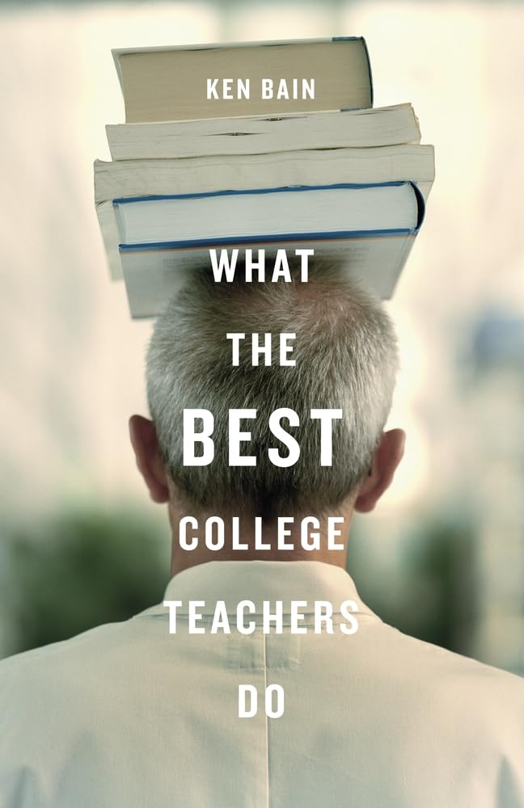
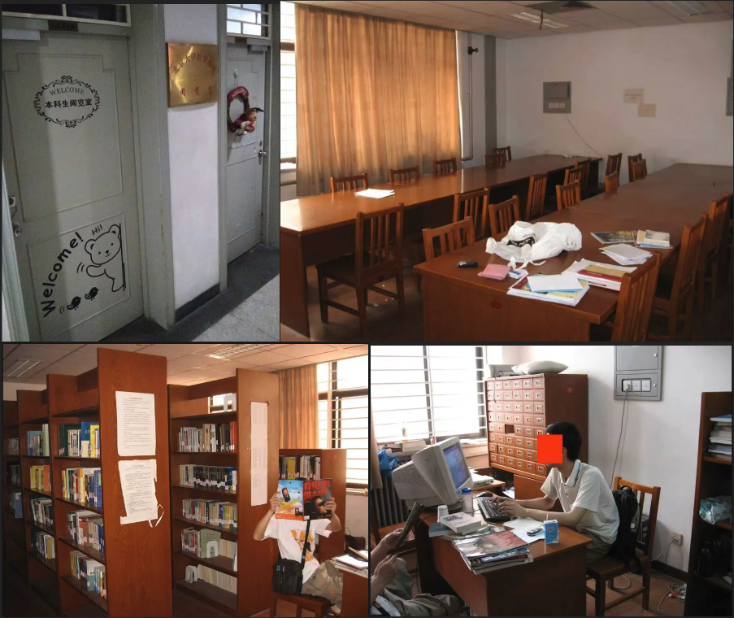
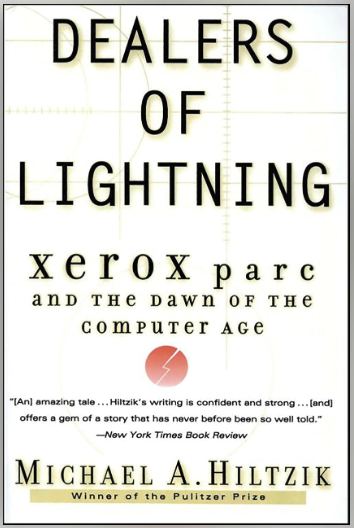
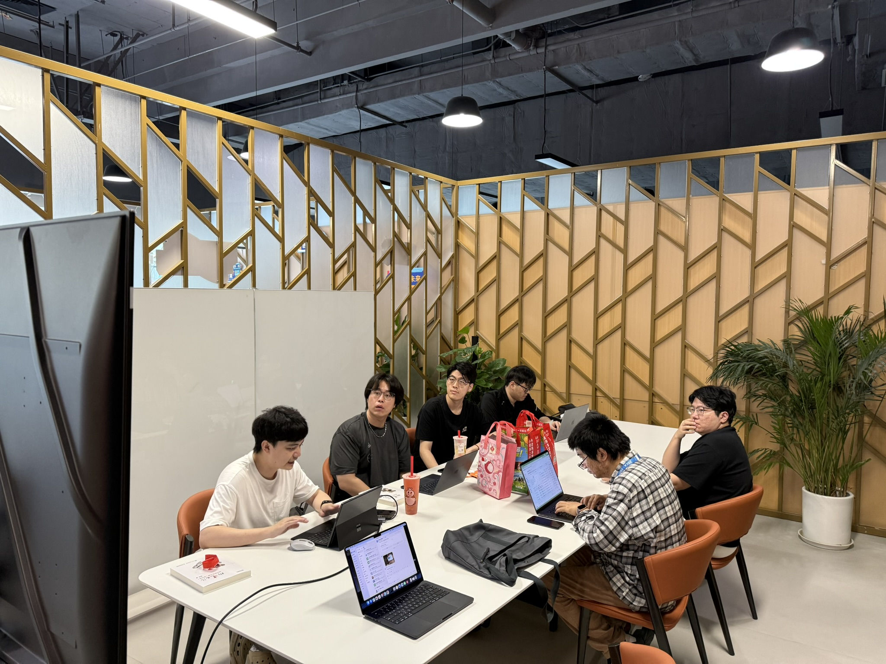
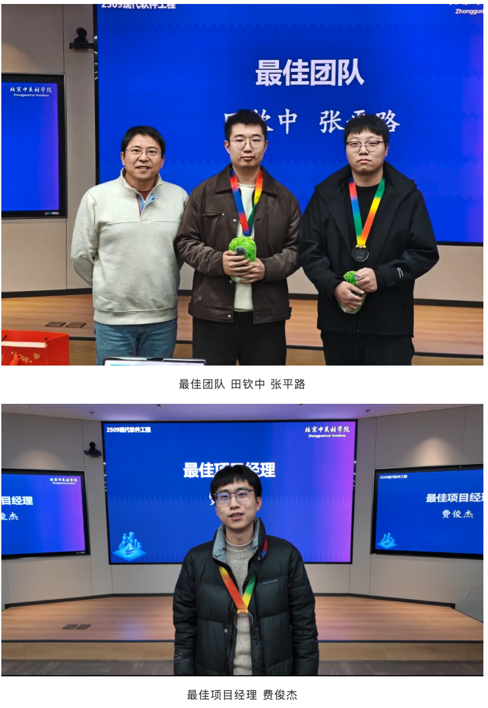

# AI时代，建设 “NCL” 生态 —— 从北大数院“本阅” 得到的启发

这是 2026/7/29 CCF 未来计算机教育峰会的系列文章之五

[系列文章 1](https://gitee.com/zouxin2025/ASE/blob/master/chapter0/edu01.md)  
[系列文章 2](https://gitee.com/zouxin2025/ASE/blob/master/chapter0/edu02.md)  
[系列文章 3](https://gitee.com/zouxin2025/ASE/blob/master/chapter0/edu03.md)   
[系列文章 4](https://gitee.com/zouxin2025/ASE/blob/master/chapter0/edu04.md)
[中关村学院经验介绍](https://gitee.com/zouxin2025/ASE/blob/master/chapter0/zgc-edu-2026-07.md)   
[本科理工科的第一门软件课怎么教](https://gitee.com/zouxin2025/ASE/blob/master/chapter0/cs101.md)   

> **不要让上课耽误我学习。**  
> ——当代大学生的流行吐槽，与马克·吐温两百年前的吐槽——“不要混淆了去学校和教育这两回事”——隔空呼应。

这句话让许多大学老师如芒在背。当AI可以随时提供精准的解题步骤、无限耐心的答疑和定制化学习路径时，我们必须面对一个残酷的拷问：如果课堂只是教师独白念PPT，外加签到签退来维持“出席率”，那么我们到底是在**教育**学生，还是在**管理**学生？

AI时代，海量的视频课程、AI 问答让知识的获取和技能的指导变为唾手可得。那么，高水平的学校能提供哪些 AI 无法提供的的？**真正的答案，是AI永远无法提供的东西：一个由真实的、背景各异的人组成的学术共同体**——在这里，你可以安全地暴露无知、接受批判、重构认知、练习成为领军者。

2026年菲尔兹奖得主王虹在北大数院的成长故事，以及她所深情回忆的“本科生阅览室”（本阅），为这个困境提供了一个极具启发性的答案。结合《如何成为卓越的大学教师》中提出的“自然的、有批判精神的学习环境”（Natural Critical Learning Environment，简称NCL），以及一些教育实践中涌现的方法论，我们的确要重新思考：在AI时代，大学教师的不可替代价值究竟是什么？

## 一、问题的症结：我们把“学习”窄化成了“信息传递”

AI的崛起，彻底暴露了传统课堂“信息传递”功能的落后。当一位老师对着PPT念完一节课时，学生完全有理由质疑：“网上视频和AI的解释更详细、更贴近实战，我为什么要来这里听这一遍？”

许多大学的传统评价体系将教学视为“完成任务”，导致课堂上“老师自顾自地讲PPT，学生在下面玩手机”。这不仅是时间浪费，更破坏了学习的“心流”——那种深度沉浸、忘我的认知状态。强制签到签退，更是对成人学习者自主性的不信任。

这里需要澄清一个常见的认知误区：**即使学生在记录上显示了【签到】、【签退】，课堂上偶尔抬头看黑板，这和他是否真正“投入”（engage）之间，没有因果关系。** 签到只能证明肉身在场，而“投入”是认知和情感的活跃状态——它可以发生在没有签到的场合（如本阅里的自发讨论）。把管理手段误认为教育目标，是我们最需要反思的起点。

王虹的故事告诉我们，她大二才从地球与空间科学学院转入数学科学学院，起点并不领先。她大量时间泡在“本阅”，这里没有签到，没有点名，却让她最终走向了数学之巅。这提示我们：**真正有效的教育，不是管控学生的肉身，而是塑造一个让他们主动“沉浸”的环境。**

王虹的经历并非孤例。一位从华中科技大学转到布里斯托大学的中国学生这样 [描述自己的转变](https://mp.weixin.qq.com/s/_kNZaO--DJn9WgPw7fUyDA)：在华科时，“所有课无一例外是大班授课，以考试为测评方法。我努力想在这套体系下证明自己——我从小就热爱电信，费了很大力气转到电信，但排名告诉我，你做得不好，你应该成为一个做题家。” 他感到 “认知失调”：“想做的事”和“应该做的事”产生了冲突。而在布里斯托，每周与导师同学的会议、做项目和写文章的评价方式、实时获得的反馈，让他第一次感受到“认知协调” —— “项目问题得到解决是让人愉快的，专业人士的认可是能给人正反馈的。”

> 这位学生总结道：“我越来越自信了，尤其是提出一些新奇的想法和分析的时候……我特别喜欢这种创造性工作。”

两种教育环境，两种截然不同的成长轨迹。

## 二、NCL的核心：让真实的问题驱动学习

《如何成为卓越的大学教师》（Ken Bain 著，2004）一书的核心，是构建“NCL环境”。书中这样定义：

> *“In that environment, people learn by confronting intriguing, beautiful, or important problems, authentic tasks that will challenge them to grapple with ideas, rethink their assumptions, and examine their mental models of reality.”*

简言之，在这个环境里，学生通过面对**有趣的、重要的、真实的问题**来学习，在挑战中审视自己的假设，重塑认知模型。

NCL包含三个关键要素：

**1. Natural（自然）**：学习内容与学生的兴趣、困惑和未来要面对的真实世界紧密相连，而非人为割裂的考点。外企员工花高价上英语速成课，学完很开心但能力并无变化；而Toastmasters Club让会员讲自己工作和生活中的事，获得匿名反馈，交流能力却有明显改善。前者不“自然”，后者“自然” —— 因为后者与人的真实需求紧密相连。 我们学院的学生之所以要去课堂上课， 去活动场所交流， 是因为课堂上自然就有老师和学生一起讨论问题， 不是因为某个关于 ‘签到’， '某类活动可以得绩点' 的不自然规定。 

**2. Critical（批判性）**： 这里的“批判”常被误解。它不是让学生互相挑刺，更不是鼓励师生对立。NCL中的批判，本质上是“健康的认知摩擦”（healthy cognitive friction）——一种基于逻辑和证据的、以探寻真理为目标的理性交锋。

健康的摩擦有三个特征：

- 对事不对人：质疑的是想法，而非质疑者本人。正如PARC的“Dealer”会议上，研究员们对台上展示的构思极尽苛刻之能事，但所有人都明白——他们在共同寻找更好的答案，而非贬低同事。

- 在安全的环境中发生：学生敢于暴露无知、敢于提出不成熟的想法，是因为他们知道不会因此被嘲笑或扣分。优秀教师“从不会归咎于学生”，而是创造一种“犯错是探索的一部分”的信任氛围。

- 以推进认知为目标：摩擦不是为了争输赢，而是为了暴露盲点、检验假设、逼近真相。培根描述了这种紧张而又彼此受益的场景：“真理之川从错误之沟渠中流过；像萌芽一般，在一个真理之下又生一个疑问，真理疑问互为滋养。“ 为什么这种摩擦有价值？因为认知的跃升很少来自“舒适地接受”，而更多来自“被挑战后的重构”。

摩擦产生的“建设性紧张感”正是深度学习的催化剂：学生不是被动接收结论，而是被鼓励提问、辩论、试错、甚至经历“经过深思熟虑的失败”。而这种紧张感之所以“健康”，是因为它发生在彼此信任、目标一致的共同体中——正如“本阅”里同学之间互相讨论问题时那种“毫不客气但充满善意”的氛围。

教师的关键作用在于：调节摩擦的强度。太弱，讨论流于形式；太强，学生因恐惧而退缩。优秀的教师懂得在何时施压、何时提供支持——这正是“设计师”和“教练”角色的核心技能。

**3. Learning（学习）——拥抱“建设性的不适”，而非廉价的快乐**

这里的“学习”，指向的是**认知结构的真正改变**——不是增加一个知识点，而是重构理解世界的方式。而这种改变，几乎总是伴随着某种程度的**痛苦**。

为什么？因为真正的学习要求我们做三件极其反本能的事：

- **承认自己错了**：旧的认知框架被证伪，需要被推翻或大幅修正。这不仅是智识上的挑战，更是对自我认同的冲击。
- **在不确定中摸索**：没有标准答案，没有现成路径，只有模糊的问题和试错的责任。这种模糊性带来的焦虑，是研究生阶段最普遍也最真实的情感。
- **接受反复的挫败**：一个新的认知结构很少一次成型，它需要被挑战、被击碎、再重组——每一次重构都伴随着“我是不是不适合做这个”的自我怀疑。

这正是费曼对普林斯顿高等研究院的批评如此犀利的原因：那里没有学生，教授们全职研究。费曼说：“Nothing happens because there's not enough real activity and challenge: You're not in contact with the experimental guys. You don't have to think how to answer questions from the students.”失去了“教学相长”中的“学”——即那些被追问、被质疑、需要把复杂思想解释给初学者的时刻——研究本身也失去了重要的活力来源。

费曼所描述的“学生的提问”，其价值正在于它制造了**认知摩擦**：你必须把模糊的思想转化为清晰的语言，必须直面“我是否真的理解了这个”的拷问。这个过程是痛苦的，但恰恰是这种痛苦，逼迫你完成认知的重构。

**NCL中的“学习”从不承诺快乐，它承诺的是“有价值的艰难”。** 正如健身不会承诺轻松，但它承诺更强健的体魄；深度学习的痛苦，是为了获得一种更强大的理解力和更持久的知识迁移能力。

北京大学数学学院本科生阅览室里的场景——不同年级的学生围坐讨论，彼此挑战对方的证明思路——正是在制造这种健康的“学习之痛”。管理员们拿着微薄的工资，却愿意从早待到晚，并非因为那里舒适，而是因为那里提供了一个**可以安全地经历“认知失败”并最终获得突破的空间**。

因此，教师在这个维度上的责任不是“让学习变得轻松”，而是：

- **诚实地预告痛苦**：告诉学生，如果你感到困惑、挫败、甚至愤怒，这恰恰说明你正在进入真正的学习区域。
- **提供安全退回的港湾**：确保这种痛苦不演变为羞辱或恐惧——学生知道，失败是探索的一部分，而非对个人价值的否定。
- **帮助区分“有益的艰难”和“无谓的艰难”**：前者是认知重构的必经之路，后者是资源匮乏、指导缺失、目标模糊造成的消耗。

**一句话：NCL中的“L”，追求的不是让学生“觉得舒服”，而是让学生“经历值得的痛苦，并获得持久的成长”。** 这是研究生阶段教育最核心、也最容易被遗忘的使命。

## 三、“本阅”的遗产：一个自发形成的NCL微缩景观

[北大数院的“本科生阅览室”](https://mp.weixin.qq.com/s/3oNqd6hi-9yAqfOpA0jjhw)之所以被王虹等一代代校友铭记，并非因其豪华设施，而在于它无意中构建了一个完美的NCL生态。

 
（注：图片来自 https://mp.weixin.qq.com/s/3oNqd6hi-9yAqfOpA0jjhw）

**本阅是什么？** 它于2000年设立，最初在理科一号楼1570，面积七十多平方米，有17个书架、6张桌子、近30把椅子，还有一块黑板供讨论。2004年搬至交流中心426和427，后期流通书籍达三千余册。最重要的是，**它完全由本科生建设、管理和使用**——规章制度由学生制定，书目和借阅系统由学生编写。管理员的工位是一张设在阅览室里的“单人桌”，象征意义很明确：管理员并非高高在上的管理者，而是和大家坐在一起的学习伙伴。2023年数院搬入智华楼“九章馆”后，本阅完成了历史使命，但其精神仍在延续。

**跨年级的社交破冰与“自然”连接。** 本阅打破年级界限，转系生、元培生都能找到归属感。早期没有饮水机，大家要走过迷宫般的楼道去打水，常常是一两名同学把所有人的水杯拿去一起打水。2006级转系生高紫阳回忆：“看书时，一位不相识的师姐拿起了我的水杯问我要不要打水。师兄解释说这是本阅的传统：无论认不认识都会帮忙打水。惊讶之余，感觉很温暖。”王虹正是在这里认识了同学唐云清，并与同为管理员的范晨捷成为未来的合作者。

**自主管理的“批判性”氛围。** 本阅管理员每次值班三小时，最初有10元工资，后期管理员队伍增至二十多人。这里不是学校强加的“第二课堂”，而是学生自己的“领地”。开放时间逐步延长，甚至成为事实上的通宵自习室——“万年有人的本阅”。同学们在里面自由讨论、聊天、约饭，形成紧密的学术共同体。

**从“旁观”到“沉浸”的深度学习。** 本阅的社交属性恰是其独特之处。“如果上一流大学的学生都是独自听课，回到自己宿舍的单间做作业，独自吃饭，这样的一流大学值得上么？”本阅的回答是：教育发生在人与人的相遇中。王虹担任管理员，出勤率颇高，正是这种“主人翁”式的深度学习，让她完成了从“插班生”到“共同体核心成员”的身份转变。

## 四、豆袋椅上的 Dealer：另一个 NCL 范本

如果“本阅”是中国语境下的自发NCL生态，那么大洋彼岸的施乐帕洛阿尔托研究中心（Xerox PARC）则在1970年代提供了一个制度化的范本。

PARC计算机科学实验室负责人鲍勃·泰勒创造了一个传奇机制——“Dealer”会议。每周二，所有研究员必须放下手头工作，聚集到摆放着豆袋椅的专用会议室（被称为“Bean Bag Room”），一待就是几个小时。这个会议室不设主席台、不设固定座位，任何人发言都只能站在黑板前 —— 没有任何权力象征物。会议被称为实验室的“知识脉搏”。

会议的核心环节是“半生不熟想法的时间” —— 一位研究员走到黑板前，展示自己尚未成型的构思，而台下同仁则毫不留情地解剖、质疑。任何不够出色的想法都可能招致尖锐反馈和激烈的来回争执。但这场智力角斗并非出于敌意，而是为了寻找真理的极致学术竞赛。

豆袋椅的舒适消解了等级，严谨的议程保障了深度，而极致的批判性则迫使思想快速进化或死亡。泰勒信奉“雇用优秀的人，然后别管他们”，但同时用精心设计的制度保障交流的必然发生。这种“强制”参会与“自由”交锋的微妙平衡，在PARC催生了个人计算机、激光打印机、图形用户界面、TCP/IP 等一系列改变世界的发明。

豆袋椅室与“本阅”给出了同一个答案：**教育不是管控，而是生态设计。** 大学能做的，是为学生创造一个足够安全、足够舒适、又充满智力挑战的空间，并让他们习惯于与同伴进行“半生不熟”的头脑交锋。当这样的空间存在时，真正属于学习者的“心流”与“共同体”才会自然生长。

## 五、柳比歇夫时间法：碎片化时代里的“深度沉浸”

如果说“本阅”和豆袋椅解决了“在哪儿交流、与谁交流”的空间问题，那么另一个看似不相关的方法论则回答了另一个维度的问题：“如何在碎片化时代保护个体深度思考的时间。”

苏联科学家柳比歇夫的“时间统计法”——他从26岁到82岁，56年如一日记录时间开销，年度计划误差可达千分之三。我原以为这是某种“苦行僧式的自律”，直到一位博士生这样解释给我听：

> 柳比歇夫时间法不是让你把每天塞得更满的‘苦行僧日记’，而是专为博士生打造的‘科研不确定性降噪仪’。对于博士生——你最大的痛苦不是懒，而是忙了一天却说不清忙了什么，导致深夜焦虑。这个方法只要求你记录‘有效专注’的起止点，不评价、不考核，一周后你就能清晰地看到：到底是‘科研本身的难度’在拖累你，还是‘碎片化切换’在耗死你。

这个解释让人恍然大悟。它的精神与NCL、“本阅”高度一致——**真正的学习和创造，需要“大块沉浸”的心流，而非被外力切割的碎片。**

高效博士生时间安排的共同特征：每天至少一段两小时不受打扰的整块时间攻克核心问题；深度工作后安排一小时彻底休息完成大脑重启；全天大的任务切换不超过3次，把精力集中在一两件核心大事上。一句话：**一天只做一两件难事，一次沉浸至少两小时，做完后彻底充电。**

近十年有不少时间管理App在设计上体现了这一方法论。一位开发者甚至说：“我已经不记经济账了，改记时间账。”

我们现在的课堂制度，恰恰在系统性地破坏这种“大块沉浸”的可能性。 大学课程安排，生怕给学生流出大量 ”空闲“ 时间， 一节45分钟的课，加上课间切换、签到签退，学生的认知不断被打断、切割。当学生说“不要让上课耽误我学习”，他们抗议的正是这种对心流的持续破坏。

## 六、给研究生院的建议：在AI时代更要构建NCL

在给出具体建议之前，需要先正视一个现实：**最难而正确的事，是改变师生双方的心智模式。** 具体而言：把教学从“信息交付” 转变为 “生态共建” —— 这要求教师放弃熟悉的讲授舒适区；把评价从“终结性考试” 转变为 “过程性成长”——这要求学院面对无法短期量化的专业判断；把管理从 “管控学生” 转变为 “信任学生” —— 这挑战了大学最根深蒂固的控制逻辑。最困难的是，改革者不得不在旧的评价框架里为新的实践腾出空间 —— 在考试制度中嵌入项目评价，在签到要求中保留弹性，在学分结构里为“无目的交流”挤出空间。正确，是因为我们必须开始；难，是因为我们必须在跑步的同时更换跑道。

理解了这些，下面的具体建议才有了根基。

面对AI，大学教师从 “知识权威” 转型为 **“学习生态的设计师” 和 “批判性思维的教练”** 。可操作的建议有：

### 0. 确立核心理念：以终为始，从入学第一天就开始练习成为领军人物

研究生教育的终极目标，是培养**未来的领军人物**——那些能够在各自领域中主动发现问题、组织资源、推动进展的人。

但这里有一个常被忽略的真相：**“领军”不是毕业时突然获得的头衔，它是一种需要长期练习的能力。** 如果一个人在研究生阶段只是被动地完成作业、通过考试、等待学位，他毕业后不可能突然变成一个主动的领军者。 以终为始原则的意思是：**既然我们希望毕业生成为主动的贡献者、领军者，那么从他们进入研究生院的第一天起，就必须让他们把自己摆在一个主动贡献者的位置上，开始练习这种能力。**

如果一个学生，平时不来上课、不参与讨论、不贡献想法，与学术共同体的联系仅剩“签到”和“考试”，最后完成论文、通过答辩，被授予学位。我们给了他一个“领军人物”的证书（？！）

这合理么？他似乎没有练习过任何领导力——**他甚至连“主动提出问题”都没练习过。**

更偏激的说法是，一个平时不来上课的学生，他练习的是“如何在系统中以最小代价通过考核”，而不是“如何成为一个主动的贡献者”。如果这种模式持续几年，这样的毕业生成长为学术上，技术上，具体行业上的领军人物的概率是多少？

人的能力是通过**持续的行为模式**塑造的。你练习什么，你就会成为什么：

- 你练习“被动接收”，你就会成为被动等待指令的人；
- 你练习“躲避讨论”，你就会成为在会议上沉默不语的人；
- 你练习“最小化投入换取学位”，你就会成为在工作中 “及格就好” 的人；
- 你练习“从不质疑权威”，你就会成为永远跟随他人议程的人。

反过来也一样：

- 你练习“主动提问”，你就会成为善于发现真问题的人； 
- 你练习“频繁互相批判并重构想法”，你就会成为敢于失败，经常失败， 但是善于迭代认知的人；
- 你练习“为共同体贡献，不纠结短期的得失”，你就会成为能够凝聚团队的人；
- 你练习“从入学第一天就主动参与”，你就在练习成为领军者。

在NCL环境中，这种“主动贡献者的练习”具体表现为：

- **主动提问**：不是等老师给答案，而是主动暴露自己的困惑。那个你担心“太幼稚”的问题，可能正好点破了大家都困惑的盲点。 而且，NCL 中，这样的初学者的问题是会得到自然的宽容对待。 
- **主动质疑**：不是被动接受文献和观点，而是敢于说“这个假设成立吗？有没有另一种可能？”——这正是批判性思维的起点。
- **主动分享**：不是等着被评价，而是主动把自己的“半生不熟的想法”拿出来接受集体摩擦，让它在碰撞中进化。就像PARC的Dealer会议上研究员们所做的那样。
- **主动反馈**：不是只在期末填一次教学评估，而是在过程中告诉老师“这个部分我卡住了”“那个例子让我豁然开朗”——你的反馈是老师调整教学节奏的关键依据。

**从“消费者”到“共建者”的转变，不是毕业后自动发生的，而是从现在开始、从这一节课开始的选择。**

- **消费者心态**：“这门课能给我什么？老师讲得够不够清楚？我的分数是多少？”
- **共建者心态**：“我能为这个课堂贡献什么？我能提出什么不一样的角度？我能帮助谁？如果我都懂了，那么我如何去落地我的想法？”

两者的区别，正是“被动等待”与“主动构建”的区别。前者关注“获得”，后者关注“参与”。前者把自己放在客体的位置，后者把自己放在主体的位置。

### 1. 重构课堂：从“独白”转向“对话与工作坊”

如果信息传递可以由AI完成，宝贵的课堂见面时间必须用于AI无法替代的事。

- **取消纯粹的讲授**：将基础概念录制成视频让学生课前自学（翻转课堂）。
- **课堂时间用于解决“真问题”**：直接抛出开放性问题，让学生分组推演、辩论，老师充当引导者。
- **废除形式主义的签到**：学生来课堂，是因为课堂有吸引他们的NCL环境，有需要和老师同学挑战、讨论的真实话题，是学生成长中自然的一部分。签到本身传递了一种“不信任”的信号——老师不相信学生会自觉来上课，学生自然也不会对这门课产生主人翁意识。而“本阅”没有签到，却让学生每天泡在那里，本质是**信任激发了自主**。

### 2. 保护“心流”：尊重学生的深度工作时间

- **减少课堂时长的碎片化切割**：尝试2小时以上的大课段工作坊，让学生真正进入沉浸状态。
- **不布置无意义的“签到”任务**：每一次强制中断，都是在破坏一次可能的“心流”。
- **鼓励学生像柳比歇夫一样记录自己的“有效专注”时间**：帮助他们区分“看起来很忙”和“真正在思考”，给研究生流出时间和空间，让他们练习如何成为自己时间的主人。

### 3. 拥抱背景差异：把多元背景转化为教学资源

前文提到的王虹、丁剑都是转系生，他们在数学学院的本科生阅读室找到了自己成长的小环境。今天我们的研究生来自不同专业、背景各异，这本应是 NCL 环境中绝佳的 “认知冲突”， ”认知互补“ 的来源。

- **设计“十字路口”式的讨论题**：让不同背景的学生对同一个问题给出不同解读。
- **鼓励学生分享失败经历**：优秀教师“分享个人的失败经历”。当老师敢于示弱，学生才敢于暴露无知，这正是批判性思维的起点。

### 4. 创造“自然”的社群空间：让交流发生在课表之外

“本阅”最重要的贡献，是提供了一个**让师生、生生在非正式场合相遇的空间**。

- **开辟专属的学生活动空间** 配备可移动桌椅、白板墙、自助饮水。在北京中关村学院，学生自发组织了每周五下午的DemoDay，大家自由演示各自的半成品，并自由交流（组织者：开源俱乐部，高京）。

- **把“1对多”变成“多对多”**：在所有空间改造中，成本最低、见效最快的一个动作，是把教室布局从“排排坐、面朝老师”改为“圆桌分组、面朝彼此”。传统教室中，发言是“公开演出”，多数人沉默；圆桌分组中，发言是“日常对话”，每个人都更愿开口。这个改变动的不是桌椅，而是**权力结构**——注意力从全部指向老师，变为指向彼此；默认状态从被动接收，变为主动参与。圆桌让NCL环境有了最直观的起点。

- **鼓励“无目的”的交流**：不要将所有活动都纳入目的非常确定的学分考核，允许学生在那里闲聊，偶遇，搞一些头脑一热就开始的探索。
- **借鉴“管理员制度”**：让不同年级的学生共同参与空间运维，增强归属感。王虹正是通过担任管理员，完成了身份的转变。

### 5. 改革评价体系：拥抱过程与“巅峰体验”

- **降低期末考试的权重**：像软件工程课那样，将项目的决策领域逐步放宽——从个人到结对再到团队，逐步扩大学生自主权。
- **鼓励“经过深思熟虑的失败”**：即使项目失败了，深刻的总结也能得高分——因为学生体验了真实的困境。
- **制造“巅峰体验”**：对在某个局部做到极致的同学给予即时、公开的认可（哪怕只是小小的纪念品），这比冷冰冰的绩点更能激发内驱力。

### 6. 区别对待“免修”与“共同体参与”

研究生阶段，学生自学能力较强，申请免修或只参加考试的情况时有发生。这是一个需要分类讨论的问题：

如果学生确实已经掌握了课程内容，应当给予认可——这是对其自学能力的尊重。但更重要的是，导师应当向学生提出一个更高阶的邀请：

>“你既然已经掌握了知识，那么你在这个课堂里的角色就不再是‘学习者’，而是‘贡献者’。我们希望你留下来，不是为了再听一遍，而是为了挑战老师、质疑同学、帮助那些正在挣扎的人——因为**教别人，是最好的学**。”

研究生院真正的价值，不在于“让你变聪明”，而在于“把你扔进一个由聪明人组成的、充满健康摩擦的共同体中，让你在持续的认知碰撞中，发现自己还能变得更好”。一个只来考试的研究生，也许能拿到学分，但他错过了研究生院最宝贵的东西：**那种在深夜与同伴争论一个问题、被逼到墙角却突然找到新思路的体验**——在那个时刻，你不仅学到了知识，你成为了知识生产的一部分。

因此，对于“免修”请求，导师的回应不应该是简单的“批准”或“拒绝”，而是一次关于研究生教育本质的对话：你来到这里，究竟是为了“通过考核”，还是为了“成为学术共同体的一员”？前者可以在任何地方（包括函授）完成，后者只能在与同行的真实互动中实现。

## 结语

当学生说“不要让上课耽误我学习”时，他们并非拒绝教育，而是拒绝那些打断心流、扼杀思考的无效形式。

马克·吐温的讽刺和当代学生的吐槽，指向同一个病灶：**我们把制度性的“上学的动作”误当作了教育本身。**

AI时代，知识获取将愈发廉价，但**认知的跃升、批判性思维的养成、因学术共同体而产生的归属感与雄心，依然依赖于人与人之间深刻的互动与碰撞。**

北大数院“本阅”只是一间放满书架和黑板的普通房间。但因为有了**信任、自主、交流与陪伴**，它成为了王虹等一代代数学家的精神原点。在今天的校园里， 我们可以用心设计一个个充满挑战与支持的 NCL 微生态。

**当学生不再担心被“上课”耽误，而是被 “NCL环境” 所吸引，那种因深度学习和思想共鸣而产生的“心流”，将成为AI时代大学教育最后的、也是最坚固的护城河。**

**延伸阅读**
- Ken Bain, *What the Best College Teachers Do*, Harvard University Press, 2004
- Michael Hiltzik, *Dealers of Lightning: Xerox PARC and the Dawn of the Computer Age*, 1999
- 倪忆，《王虹北大足迹之本科生阅览室》（微信公众号“普林小虎队”，2026年8月）https://mp.weixin.qq.com/s/3oNqd6hi-9yAqfOpA0jjhw
- Dingding Wang，《和菲尔兹奖得主王虹一样，我们本科期间没有自信》https://mp.weixin.qq.com/s/_kNZaO--DJn9WgPw7fUyDA 
- 邹欣，《现代软件工程 怎么教好课》（博客园，2011年12月） https://www.cnblogs.com/xinz/archive/2011/12/29/2306652.html 
- 中关村学院研究生会，《绝了，这门课居然在教室开起了发布会》 https://mp.weixin.qq.com/s/Rls8GpojX0ftYpMxgZ5m9g