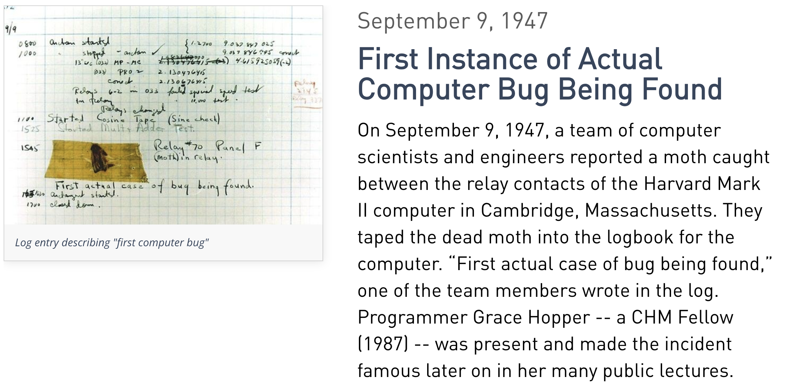
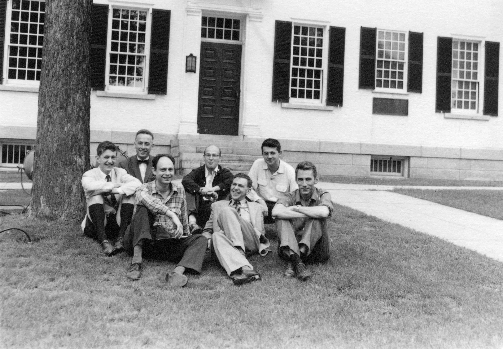

# AI 在软件工程全面强于人类已经发生、只是时间问题？
1947 年，哈佛 Mark II 计算机的继电器里夹了一只飞蛾，Grace Hopper 把它粘在日志本上，写下了“First actual case of bug being found”。这是人类第一次在计算机里捉到真实的虫子，也用独特的方式标记了“Bug” 这个词进入了软件的词汇表。

九年后，1956 年达特茅斯学院，一群年轻的学者开启了一场名为“人工智能”的研讨会。他们畅想 AI 的未来，其中一个朴素而具体的愿望就是：让计算机自己写出没有 Bug 的程序。 

如今，这个梦想似乎已经触手可及——AI 可以秒级生成代码、修复漏洞、甚至识别出人类肉眼难察的逻辑缺陷。

于是，一个顺理成章的追问出现了：既然 AI 已经能在代码层面降维打击人类，那它能不能顺势把整个软件工程也彻底取代了？或者说，已经取代了？

这是一场人类与自己一手打造的 AI 之间漫长而深刻的博弈。在过去几十年里，我们目睹了人类在曾经引以为傲的领地里接连退守：从西洋跳棋、国际象棋，到被誉为“人类智慧最后堡垒”的围棋；从困扰生物学半个世纪的 AlphaFold，到几秒跑通测试的 AI 编程助手，语言翻译 ……“比 AI 强” 这个荣誉连续丢失。

但如果我们穿透表象就会发现：在围棋这类规则固定的“封闭系统”，与软件工程这种 “人的业务逻辑持续演化”的“开放系统”之间，存在着一道本质的鸿沟。

在盲目追捧或过度焦虑之前，我们有必要剥离表象，重新理清那些被混淆的概念、底层原理与逻辑推理。

最近，一篇题为《一个关于 AI 的流行观点，其实是错误的》的文章在不少技术群流传。文章的核心论点是：

> “把简单、重复的事交给 AI，复杂的事还是需要人去规划和分解——这个观点是错的。AI 已经能处理复杂任务。AlphaFold 解决了 50 年的生物学难题，AI 能几分钟分析几万行代码，所以‘复杂的事需要人脑规划分解’已经过时了。”

很多读者看了觉得“有道理”。毕竟 AlphaFold 是真的，AI 分析代码也是真的。

但作为软件工程师，读到后面总觉得哪里不对。这篇文章把我们日常面对的“软件维护”、“生态演化”、“团队协作”这些事，说得太简单了。 没关系，我们分几个轮次把各种问题聊清楚。 


## 第一轮：AI 能分析几万行代码，远超人类

### 原文观点

“AI 可以在几分钟内分析几万行代码，理解整个系统的架构、识别逻辑漏洞、生成重构方案。这已经不是‘简单任务’了，所以 AI 完全能处理复杂系统。”

### 回应

#### 请先看清三个维度

| 概念 | 核心定义 | AI 渗透率 |
|:---|:---|:---|
| **程序（Program）** | 在既定输入下产生既定输出的逻辑实体 | **高**：读代码、找漏洞、生成算法 |
| **软件（Software）** | 程序 + 文档 + 配置 + 流程 + 数据 + 历史决策 + 用户生态 | **受限**：受制于断层上下文与隐性契约 |
| **软件企业（Enterprise）** | 软件 + 商业模式 + 组织文化 + 客户关系 + 市场节奏 | **极低**：涉及多方利益博弈与价值取向 |

AI 能“分析程序”——读代码、找漏洞、生成重构建议。但分析程序不等于理解“软件”。

#### 隐性知识不是“不可知论”，而是“信息的物理断裂”

有人说 AI 可以学习所有文档。但哲学家波兰尼（Michael Polanyi）指出：**“We know more than we can tell.”（我们知道的，比我们能说出来的多。）**

在工程实践中，**隐性知识（Tacit Knowledge）**并非不可捉摸的神秘力量，而是**未被数字化（Data Gap）的上下文**：

- 10 年前的某个 Hack 为什么保留到现在？因为当时高层为了抢占市场做出了商业妥协，口头约定“先上线再修复”，而记录只留在了某次走廊里的抽烟交流中。
- 某个接口的类型为什么设计得奇奇怪怪？因为当年某家大客户的旧系统有 Bug，为了兼容它特意留了这个副作用，这并未写进规范文档。

这些信息**压根没有进入训练集**。AI 读到的代码只是最终结果，它看不到那些在走廊里口头约定、从未被写入文档的商业妥协。它以为自己在做最优优化，实则踩中了 10 年前的商业陷阱。

#### 即使“人类在环”，也无法消除认知开销

有人反驳：“让 AI 提建议，人类工程师审查（Human-in-the-loop）不就行了吗？”

现实是：当 AI 缺乏上下文时，它会频繁给出“技术上极其优雅、商业上破坏兼容”的重构建议。人类工程师为了审查这些建议，必须重新唤醒大脑中的上下文去验证 AI 是否破坏了隐性契约。**这种密集的上下文切换与审阅疲劳（Review Fatigue），产生的认知开销往往高于人类自己动手。**

#### 补充：如果 AI 上下文窗口增长了怎么办？

当然，AI 的上下文窗口和训练数据覆盖面确实在快速增长，未来可能读到更多当前缺失的信息——这会让它在 Complicated 层面上表现得更出色，甚至接近人类工程师在程序分析上的水平。但即便如此，它依然无法解决“奖励函数无法建模”这个根本问题——因为商业决策的优劣，其评价标准本身就在持续演化，无法被编码为一个静态的目标函数。

**结论：AI 是极致的“程序分析器”，但软件工程的大量工作发生在代码之外的“上下文断裂带”——这些缺失的数据，AI 无法凭空凭代码推演出来。**


## 第二轮：围棋、AlphaFold 都走过来了，“只是时间问题”

### 原文观点

“AI 从国际象棋到围棋，再到 AlphaFold，每一次都是‘超越人类只是时间问题’。软件工程也一样，现在不行，过几年就行。”

### 回应

这个论述看似有力，但混淆了系统属性与演化机制。

#### 核心差异：Complicated（繁杂）vs. Complex（复杂）

| 维度 | **Complicated**（如 AlphaFold / 围棋） | **Complex**（如软件生态维护） |
|:---|:---|:---|
| **目标函数** | **静态固定**（能量最低构象 / 胜负规则） | **动态漂移**（随商业策略、用户习惯而变） |
| **反馈回路** | **单向闭合**（AI 预测不改变物理规律） | **双向涌现**（AI 改动 API 会重塑用户未来的依赖） |
| **决策空间** | 物理世界 / 封闭规则世界 | 人的世界 / 适应性行为网络 |
| **技术路径** | 算力与算法优化可完全覆盖 | 无法单靠增加算力解决 |

- **AlphaFold 面对的是物理世界**：蛋白质折叠有客观的 Ground Truth（物理最低能量态）。无论 AI 如何预测，物理定律不会因为 AI 的预测而改变自己的运行方式。它的目标函数是稳定的。
- **软件维护面对的是人的世界**：一个 API 的“正确行为”不是由数学公式决定的，而是由**几十万用户的实际使用行为**定义的。当 AI 修改了一个未定义行为，用户可能立刻崩溃——AI 的决策反向改变了系统的环境。

#### 为什么强化学习（RL）在此遭遇瓶颈？

AI 乐观派常寄希望于强化学习（RL）和 AI Agents 的自主进化。然而，强化学习成立的前提是能够定义一个可计算的**奖励函数（Reward Function）**。

在软件生态中：

- “为了短期商业利益留着 Bug”与“强行重构追求长远可维护性”，哪个 Reward 更高？
- 延迟反馈周期长达数年，且评价标准包含客户满意度、团队士气、技术债务等多维非确定指标。

**当奖励函数本身无法被数学建模时，强化学习便失去了演化的基石。**

#### 思想实验：AI 独立维护 Linux 内核

假设将 Linux 内核交给完全由 AI 驱动的 Agent 团队维护 5 年：

```
[第 1 个月] AI 按最高代码规范重构模块，性能提升 5%，技术指标优异。

[第 6 个月] 硬件厂商提交带有特定 Hack 的紧急 Patch（商业上紧急，技术上不完美）。
            AI 根据代码洁癖规则拒绝了该 Patch。

[第 1 年]  厂商选择转向竞争生态，Linux 在特定关键领域的市场份额下滑。

[第 3 年]  代码库极其干净，但大量现实世界的“脏需求”被拒之门外，社区生态活力衰退。

[第 5 年]  Linux 变成了“完美但没人用的系统”——那些“重要但不够完美”的权衡再也没有人做了。
```

这个实验说明：**软件维护中的关键决策，绝大多数不是“代码质量”的单一优化，而是“代码纯洁性 vs 商业生存”、“架构设计 vs 用户依赖”的价值博弈。**

**结论：围棋与 AlphaFold 的突破证明了 AI 对固定目标函数系统的征服力；而软件生态属于目标函数动态漂移的 Complex 系统。这不是“量变到质变的时间问题”，而是“问题范畴的本质不同”。**


## 第三轮：AIGC 画画、短视频也是开放任务，AI 很快就突破了

### 原文观点

“AI 画画、生成短视频也是开放性的创作任务，没有固定规则，AI 同样在短时间内超越人类。所以‘AI 无法处理开放演化问题’不成立。”

### 回应

这一轮反驳很有迷惑性，因为它模糊了“创作（Generation）”与“维护（Maintenance）”的数学本质。

#### 状态空间与历史契约的断崖

我们将创作类任务与软件维护类任务放在两个核心维度下对比：

| 维度 | 创作类（AIGC 画画/视频） | 维护类（软件生态维护） |
|:---|:---|:---|
| **容错率** | **高**——几个像素抖动，大脑会解读为“艺术风格” | **历史契约的零容错**——一旦某个行为被用户依赖，它就变成了“不可破坏的基准事实” |
| **状态空间** | **独立不累加**——生成新图不需兼容 200 年前的颜料配方 | **单调累加**——$S_t = f(S_{t-1}, \Delta)$，必须在包含几十年历史状态的拓扑网中寻找解 |
| **历史债务** | 无 | 有——Hyrum 定律锁死了过去的行为 |

AI 可以“创作”新代码，但 AI 无法在一个已经被几十亿人锁死的状态空间中做“零容错”的修改，同时保证不破坏任何人的业务逻辑。

#### 发生在软件史上的“铁律”

这就是前文提及的 **Hyrum 定律**：

> *“With a sufficient number of users of an API, it does not matter what you promise in the contract: all observable behaviors of your system will be depended on by somebody.”*
> （当你的 API 有了足够多的用户，你在契约里承诺什么都不重要：系统里所有能被观察到的行为，都会有人依赖它。）

**真实案例 1：Excel 的 1900 年闰年 Bug**

Lotus 1-2-3 误将 1900 年算作闰年（多出 1900/2/29 这天）。Excel 为了能无缝打开 Lotus 的文件，故意复刻了这个 Bug。30 多年过去，微软工程师明知其错误却永远不敢修复——因为全球无数财务报表已经将这个错误序列号当成了基准事实。

**真实案例 2：Windows 为 SimCity 兜底**

DOS 时代的 SimCity 存在 Use-After-Free 内存违规访问 Bug。在 Windows 95 引入全新内存管理时，微软工程师没有强迫游戏打补丁，而是在 OS 内部写了专门的兼容 Shim：检测到 SimCity 运行，就自动切换回旧版不立即释放内存的分配模式。

AI 可以极其精准地“识别”出这些 Bug，但 AI 无法自主“决策”该不该修——因为**修正成本取决于代码之外的全人类既有资产合规校验成本**。当修复成本高于 Bug 造成的实际损害时，Bug 就升格为了 Feature。

**结论：AIGC 的突破证明了 AI 具备极强的“概率生成能力”；但软件维护面临的是“历史契约的零容错 + 状态累加 + 隐性契约”的硬约束。用画画的成功推演软件维护的替代，忽略了两者在状态空间上的本质差异。**


## 那 AI 在软件工程中到底能做什么？

花了大篇幅论证“AI 不能做什么”之后，一个自然的疑问是：**那 AI 到底擅长什么？我怎么用它？**

### AI 在“程序级”工作中是真正的突破性工具

| AI 擅长 | 说明 |
|:---|:---|
| **生成单元测试用例** | 大幅提升测试覆盖率，减少重复劳动 |
| **迁移老旧代码** | 语言升级、框架迁移的自动化辅助 |
| **生成样板代码** | 解放工程师，聚焦核心业务逻辑 |
| **识别已知漏洞模式** | 静态分析能力的增强 |
| **代码补全与解释** | 提升编码效率，降低新手入门门槛 |

### 在“软件级”和“企业级”工作中，AI 的能力边界明显

| AI 不擅长 | 原因 |
|:---|:---|
| **理解商业上下文和隐性契约** | 信息未数字化，不在训练数据里 |
| **在“没有正确解”的 Complex 系统中做权衡** | 目标函数动态漂移，无法定义奖励函数 |
| **在“状态累加 + 历史契约”中安全修改代码** | Hyrum 定律锁死了过去的行为 |

### 最现实的未来格局

> **AI 处理程序级工作，人类聚焦软件级决策。**

不是人类被取代，而是分工被重新划分。工程师从“写代码”更多地转向“做判断”——判断哪些代码该写、哪些该改、哪些永远不能碰。


## 总结：三轮驳论的逻辑闭环

| 原文反驳 | 逻辑盲区 | 批判性视角下的硬核事实 |
|:---|:---|:---|
| **1. AI 几分钟分析几万行代码** | 误把“程序”等同于“软件” | **信息的物理断裂**：大量商业妥协与历史决策未被数字化，AI 面对的是不完整上下文；纯技术建议会引发严重的审阅疲劳。 |
| **2. AlphaFold / 围棋能过，只是时间问题** | 混淆 Complicated 与 Complex | **目标函数漂移**：物理世界有客观 Ground Truth 且反馈单向；软件生态中 AI 的决策会改变用户行为，且缺少可计算的 Reward Function。 |
| **3. AIGC 画画能突破，软件也能** | 混淆“一次性创作”与“状态维护” | **历史契约的零容错**：AIGC 高容错且无状态累加；软件维护受制于 Hyrum 定律，必须在累加的状态空间中承担历史契约。 |


## 写在最后

在人类与 AI 的博弈中，承认“AI 无法替代人类做复杂规划”，绝不意味着否定 AI 的工程价值，更不是人类自大式地抱残守缺。

相反，AI 正在重塑编程的形态。它以惊人的效率承接了语法构建、单元测试生成、样板代码编写等大量的“程序级”任务，把人类工程师从重复的体力劳动中解放出来。

但当人类在代码编写层面上再次退守时，工程师的真正价值反而被逼召了出来：

- **理解用户生态中那些未被文档化的隐性契约**
- **在技术纯洁性与商业现实之间做出合理的妥协与权衡**
- **在没有明确奖励函数（Reward Function）的 Complex 系统中，承担风险并做出“足够好”的决策**

这场博弈的终局，不是人类完全被剥夺，而是人类终于可以退守到最核心的阵地——那些涉及上下文感知、生态意识、商业博弈与责任担当的地方。在 AI 越来越强大的时代，这些能力不仅不会贬值，反而会变得无比稀缺。