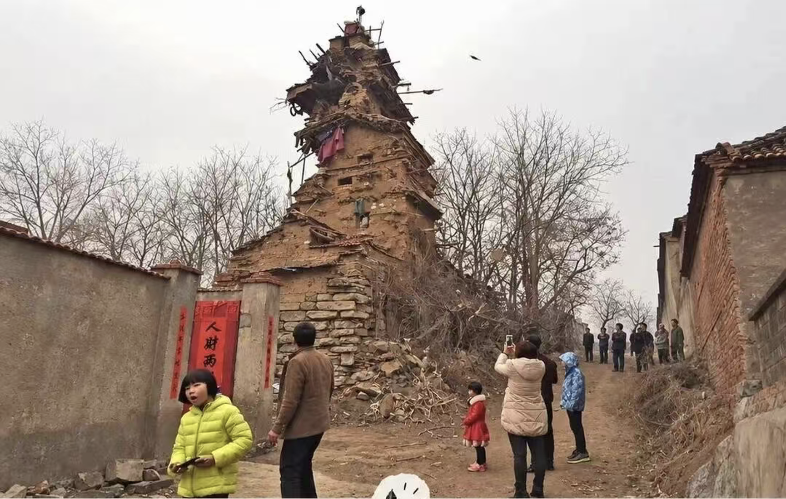

# 以终为始的陷阱：当“终点指标”被误认为“生长路径”

引子：微信群的讨论和图片让我想起了 9 年前的这个回答： https://www.zhihu.com/question/41338706/answer/91067000  于是我想起 2014年出版的《构建之法》 中移山软件公司的小伙伴们，他们现在已经都有小孩了吧？ 

## 一、午饭后散步聊天

几天前，移山公司的几个小伙伴刚参加完园区提供的一场高端培训：《战略思考：以终为始与第一性原理破局》。

今天午饭过后，大家按习惯绕着园区的塑胶跑道慢悠悠散步消食。不知怎的，话题全围着培训内容炸开了。

“以终为始，第一性原理。”小飞把脚边一颗小石子踢出老远，两只手插在卫衣口袋里直晃悠，“我越琢磨越通透。先把最终目标定死，然后倒推每个节点，从第一天起就朝终点发力。整个路径清清楚楚，完全可控，这才是最地道的工程化思维嘛。”

“可不是嘛！”后端开发果冻推了推滑到鼻梁的眼镜，“我这两天就照着这套逻辑，给我家娃量身定制了一个 《国史十年工程》，从十年后倒推到现在的他每天的学习。”

“英雄所见略同。”项目经理小李也来了精神，比划着手势说，“我家那个刚满4岁，天天拿蜡笔在墙上鬼画符。受到培训的启发，我干脆拉了个排期表，叫‘小达芬奇工程’，全套对标专业画家的技能树。”

三个人越聊越带劲，仿佛靠着刚在培训班学来的战略倒推与需求拆解，顺手把困扰人类几千年的教育难题给秒杀了。一直走在旁边的阿超听着他们神采飞扬的讨论，只是抿着嘴乐。

阿超是公司的资深架构师。他放慢脚步，好奇地看着三人：

“你们的育儿工程是什么？这么早就把娃儿卷起来？ 成功几率有多少，副作用呢？“ 

“用第一性原理把‘终局’倒推拆解，世上有两种完全不同的拆法：一种是**机械的办法**，把终点的数字或者产物像切豆腐一样切成很多块，以为拼起来就能交工；另一种是**基于事物本质机能的办法**，去探究终点系统到底靠什么底层机制运转，然后顺应规律去筑基。

---

## 二、小飞的马拉松计划：机械切片与机能解耦

小飞一挺胸脯，抢先说道：

“前几天那个培训把我的‘马拉松梦想’给彻底唤醒了！

“我这两年看到很多中登和老登在慢悠悠地跑马，我就琢磨：我大学虽然没练过任何长跑，但我百米冲刺可跑过15秒啊！我要是跑马，能到国家健将这个水平么？查了一下，国家健将线卡在2小时20分左右，折算下来，每公里3分19秒，每100米差不多跑20秒。我这百米成绩说明我底子完全够！

“所以我按‘以终为始’把训练计划排好了：第一天拿健将配速冲100多米，累了就休息；第二天加到150米；第三天冲200米……每天就往前拱一点点。五年一千八百多天，五年后，我不就能用健将配速一口气把这42公里给拿下了吗？！”

阿超哈哈大笑：

“百米冲刺是纯粹的**无氧**爆发，一口气玩命抡十几秒就见底了；马拉松是在路上死磕三个小时左右，拼的是极其庞大的**有氧**耐力。你把**无氧**冲刺练起来，对**有氧**底子没有任何帮助。

“真正的练法，大部分时间必须是慢吞吞的**有氧**慢跑，把心肺基础一点点磨大，偶尔再穿插点速度和力量。

“而且跑步时身体在消耗受损，只有休息和睡觉时才在修复变强。你天天拿**无氧**速度去硬顶，身体根本来不及恢复，不出一个月，你连健将的边儿都没摸着，跟腱先废了，骨头先裂了。”

小飞连忙摆手：

“超哥，你这可冤枉我了！我正是考虑到了休息，比如我跑到200多米后，只要感觉维持不住目标的配速，我就立刻停脚结束训练，绝不过度透支体力！而且我跑一天、休息一天，给足身体自我修复的时间。在身体状态最好的时候去冲，里程一点一点往上磨，五年成为国家健将时间绰绰有余啊！”

阿超看着他那一脸认真的模样，忍不住笑叹了一口气：

“如果真按你说的，练上五年，你绝不止能跑200米。身体会被迫适应，你的**无氧**耐受和肌肉能力会变强，你可能会咬牙撑到 800 - 1000米左右。 

“你每次只跑几分钟，身体的**有氧**引擎刚开始预热，你就已经打卡收工了。五年过去，你确实没受重伤，但你练成了能用马拉松健将级配速跑一公里跑的业余高手， 但是离一公里的的国家健将水平差得远，这要是用来惊艳我们公司的女同胞，就非常足够了，可能是一个‘厉害的 Demo’。你在公司里面经常能很快地搞出 Demo，被称为‘Demo 之王’，可能跑步也是这样吧？

“你这是典型的机械拆解：以为把距离切碎，就能自然拼出耐力。可人体本质的生理机制是有氧氧化系统，这才是第一性原理。”

小飞挠了挠后脑勺，被“Demo之王”的调侃噎得哭笑不得，眼里的得意彻底褪了下去：

“哦？我的确没看到短跑运动员在长跑项目表现优秀的。看来我真得刷刷短视频，把身体这套有氧、无氧的代谢机制给彻底搞明白了，不能光凭想象。”

---

## 三、果冻的国史计划：外部存储与心智理解

32岁的果冻一心想让 5 岁的儿子在十五岁时具备独立史学研究能力。培训班上的“以终为始”正好给他打了气。

他那套计划完全是从数据库角度琢磨出来的：中国历史的朝代更迭、重大事件、典章制度，总归是一套确定的静态数据集合。孩子从 5 岁到 15 岁有整整十年，每天定额灌入：5岁背会朝代歌，8岁通读编年普及本，11岁精读白话《史记》，15岁就能独立撰写断代史论文。

阿超笑着问他：“现在豆包这些 app 记录历史事件，前因后果几秒钟列得明明白白。你花整整十年，把孩子打造成一个两腿图书馆，图个啥？”

果冻不服气地嘟囔起来：“可只要数据规模堆得足够大，深层的理解自己不就 **涌现** 出来了？现在那些大语言模型不也是靠千亿级语料一顿猛灌，突然变聪明的？说不定我家小果冻会涌现成为 **少年历史学家** ，而且历史学家越老越吃香，他以后职业发展会稳中向好。”

小飞插嘴说：

“大模型靠海量文本拟合的是符号与符号之间的统计概率，它不需要肉身体验，就能把词句组合得滴水不漏。人脑认知完全不同。一个十岁的孩子背下‘安史之乱爆发于755年’轻而易举，但他缺少对复杂利益撕扯、体制僵化、经济杠杆以及人性欲望的实际体会。在他脑子里，那些史料只是一串串没有温度的字符，根本没有现实生活作为参照系。

“大模型靠算力硬灌，代价顶多是产生事实幻觉；你要是靠意志力硬往小孩子脑子里灌枯燥的事实，人类神经系统会启动自我保护，说不定厌学情绪日益高涨啊！”

阿超点头补充道：

“果冻，你也是掉进了机械拆解的坑。你把历史学拆成了‘待录入的数据表’，以为灌满就能涌现出洞察力。但历史思维的本质机能，是带着现实经验与问题意识去辨析史料、推理因果。没有肉身体验作为接地点，再大的数据量也只是死记硬背。”

---

## 四、小李的达芬奇工程：局部规范与神经发育

小李接过话茬，叹了口气说：

“说实话，我前几天听完培训，一回家看见我那四岁的小祖宗正拿着彩色蜡笔把白墙抹得一团糟，心里真叫一个急啊！

“当时培训不是讲嘛，做任何事都要‘先画出北极星指标’，然后拆解路径。我一琢磨，小孩子学画画的终点不就是成为写实派大画家吗？于是我搞了一张阶梯推进表：5岁起练素描排线，6岁石膏几何体，7岁带去公园户外写生，专攻文艺复兴的油画，等到了10岁，直接给他办一场个人写实画展！”

阿超叹了口气：

“幼儿早期涂鸦本质上是感觉运动的整合训练。4到7岁的小孩，手部细微肌肉群和双眼立体视觉都没发育成熟。他们画那些歪歪扭扭的线条、大块撞色的色块，是在协调手眼反应、疏解情绪、摸索自己对空间的一套幼稚理解。你非要他端坐在那找消失点、算明暗交界线、一根一根排线，是在拿成人的工尺规矩去勒幼嫩的神经。小家伙画不出来就挨训，很快就会认定自己根本不是画画的料。

“过早建立僵硬的局部规范，会严重挤压全局探索的野性。文艺复兴式的写实技巧是一套高度工业化、标准化的视觉表现工具。过早把这套模具套在孩子手上，看似起步很专业，其实过早封死了孩子眼里的世界。可能孩子画出灵气全无的油画，远远不如 AI 了。

“这也是机械倒推的弊端：把大师笔下的‘透视与光影’这种末端指标，当成了儿童神经发育的起点，完全忽略了人类感知系统自我成长的本质节奏。”

---

## 五、大一新生的困惑：面对AI工具的高等工程教育

散步拐进一片郁郁葱葱的林荫道，小飞从跑步的打击里回过神来，眉毛一挑，又把问题抛向了大学：

“超哥，小孩子身体和神经发育不全，我认。可大一新生都是十八九岁的成年人了，高考千军万马杀出来的，抽象思维和抗压能力绝没问题。更何况，写软件是纯人造的逻辑工程，没有骨骼肌肉那些生理弯弯绕。

“他们四年后毕业走向工业界，终点明摆着是用 AI 工具搭架构、写业务、调接口。既然终点如此明确，为什么大一还要强迫他们去手写汇编写机器指令、在纸上推导自动机状态图、徒手抠红黑树的左右旋转？这些底层代码他们工作后大概率一辈子不用碰。直接以 AI 为主力，训练他们用自然语言清晰拆解现实业务，这难道不是培训班讲的最纯粹的‘以终为始’？”

果冻和小李在旁边连连点头，显然觉得这套说辞极具说服力。

阿超反问：

“如果一个大一新生，靠提示词工程和各种现成 AI 插件，两周内就攒出了一个界面漂亮、接口齐全、带权限管理的系统，你们觉得他是合格的软件工程师，还是熟练的工具操作员？”

小飞被问得卡了壳：“东西跑起来了，功能也实现了，怎么就不算工程师了？”

阿超收敛了笑容，严肃地说道：

“不止小孩的身体发育有客观规律，急不得；成年人在学习和掌握高阶专业知识上，大脑神经元连接的重构同样有其硬性规律，急也急不来。

“很多人以为成年人心智成熟了，‘直接用 AI’就是通往工程师终点的捷径。这完全是把工具的输出当成了自己的认知。人类对复杂系统的理解，必须经过亲手踩坑、排查错误、推演边界的物理过程，神经回路才能把这些抽象经验固化为直觉。企图跳过心智筑基的阶段‘直接用 AI’，并不是捷径，只是把学习的必经苦工给外包了。外包出去的结果，就是自己的心智原地踏步。

“AI 带来了软件史上语义跨度最大、最不透明的封装。然而软件领域有一条被反复验证的法则——抽象泄漏法则：任何试图向程序员隐藏底层复杂性的机制，终究会在系统的极限边界处暴露无遗。AI 骨子里是个靠‘猜概率’干活的黑盒，而底层的内存、网络和芯片，全是不讲情面的‘硬碰硬’。这两个撞在一起，一旦底下露了馅，场面只会比以前崩得更惨、更难收拾。

“形式语言与自动机不是为了手写编译器，而是教你把含混现实变成严密的状态机。懂状态机的人，能把大模型这个概率黑盒驯服成确定性调用；不懂的人写提示词，全靠拜佛碰运气。

“手写汇编和计算机体系，是给你心里打下硬件成本的秤砣。指令流动、缓存击穿、线程锁死全得耗真金白银的算力。没有硬件直觉，AI 吐出满是上下文切换开销的烂代码，你都看不出来，还会当成宝贝。

“算法与数据结构不是为了刷题，练的是极端场景下的取舍本能。百万并发压过来，到底拿内存换计算，还是用延迟保带宽？这种生死抉择全凭年轻时在算法里压榨资源的硬核手感，AI 代劳不了。

“跳过这些底层死磕，做做演示玩具确实快。可一进深水区，系统崩了，你连否决和纠偏 AI 的底气都没有，只能对着报错抓瞎。

“现在还有人寄希望于多 Agent 系统，觉得一个模型搞不定，拉一群智能体互相 Review、各司其职不就行了？但你想过没有，底层的工程师如果连基本的状态机、通信协议和并发边界都搞不清楚，你拉出来的这群 Agent，到底是在帮忙，还是在帮倒忙？

“多 Agent 交互本质上是一个极度复杂的分布式系统。每个 Agent 都有概率产生幻觉和状态漂移，智能体之间多轮通信的误差不仅不会自动抵消，反而在指数级级联放大。没有懂底层的工程师在上层设计严格的仲裁协议、状态同步机制和回滚策略，一群黑盒在里面互相确认、彼此背书，最后不是高智商协同，而是集体胡说八道，把一个原本只需三行代码的简单问题，搞成死锁成一团的架构泥潭。”

---

## 六、横渡浅水池、通宵演示程序与“能力证明”

小飞脖子一梗，两只手在空中比划得飞起：

“超哥，照你这说法，不啃完枯燥理论就什么都干不成？那我可有亲身反例！

“我刚进大学那会儿是十足的旱鸭子。开学大家结伴去游泳馆，室友们认真学习理论和基本动作，折腾半个月还在原地喝水。我当时心想：游泳的第一性原理，不就是从岸这边挪到岸对面吗？

“我就直接以终为始——我盯着池子正对面的瓷砖壁，对自己说‘那里就是老子的终点’。然后‘扑通’一声跳下去，双手双脚一阵狂抡，管它什么姿势，死命往前扑腾！结果几十秒后，我手掌结结实实拍在对面的池壁上，横渡成功！虽然呛了几大口水，但我当天就能在水里前进了。根本没学什么劳什子理论，这也叫失败？”

果冻和小李被小飞手舞足蹈的样子逗乐了。

阿超笑着说：

“嗯，听大家说过不止一次，我记得关键字有三个：儿童区。”

小飞整张脸涨得通红：“儿童区……也有水啊！”

阿超侧头看着他，嘴角泛起一丝戏谑：

“你在毫无生命威胁的儿童区里，靠着蛮力把自己推到了对岸。你没出事，单纯因为池子太浅、你身强力壮。你以为你跨过了门槛，其实只是在安全水域里捡了个侥幸。”

小飞脸上一阵红一阵白：

“行，游泳池水浅，那大三的软件工程专业课总不能算儿童区了吧！

“当时期末大作业要求组队搞个完整的业务系统。隔壁组提前两个月就天天开需求会，啃设计模式，搞代码评审，单元测试，天天折腾到半夜。

“我们组呢？平时根本不管那些繁文缛节。直到答辩前最后一晚，我扛了一箱功能饮料，带着两个哥们在宿舍通宵敲键盘。天亮前代码编译成功，第二天上台演示，所有增删改查一次跑通，老师当场给了优秀！超哥，这总不能算假的吧？代码实打实在机器上跑得飞起，我们一晚上就搞定了！”

阿超说：

“这我也听说了不止一次，你的爆发力强，在编程方面也是这样。但是关键字还是类似的：水太浅。

“你熬夜跑通的程序，不是真正的工业级软件，那叫演示程序。

“大学很多课程考核的测试环境过于理想化：输入数据是预设好的静态参数，请求并发量永远是 1，网络链路默认绝无丢包，内存泄露和资源死锁根本没机会发作。这种系统撑过几分钟的讲台展示就算通关，其实只是一次性的道具。很多时候，一些老师和学生之间甚至有一种心照不宣一起混的心理——老师不想找麻烦，学生只想拿学分，只要主流程没当场崩掉，大家就互相成全、皆大欢喜。

“但真正的软件工程核心，是长期对抗系统复杂度和外部环境的持续劣化。线上系统一发布，面对的是数十万用户的瞬时并发冲击、网络硬件分区、异常脏数据写入，以及半年后需求变更引发的牵一发而动全身。这种残酷考验面前，设计模式、模块正交解耦、严格的代码评审与单元测试，是保全系统的压舱石。

“现在有了 AI，这个能力证明来得更加方便了。代码提示工具让人只敲几行注释就能拉出一整个模块，更加强化了‘我已经彻底搞定软件开发’的幻觉。再加上心照不宣的放水考核机制，学生轻轻松松走出校门，给社会带来了一些多余的 AI 提示词工程师。”

---

## 七、村头的危楼：系统技术债的不可逆临界

几个人边走边聊，不知不觉顺着园区后门穿进了一片等待拆迁整治的旧村落。

在杂草丛生、碎砖遍地的空地上，突兀地立着一栋极其畸形的泥土砖楼。

楼体用泥巴和杂牌水泥硬生生拼凑起来，表面坑坑洼洼。没有框架梁柱，地基肉眼可见地松软。更诡异的是，从二楼开始，整栋楼像被某种外力生生拧紧，一层比一层向内收缩、越往上越狭窄，到了第六层、第七层，逼仄倾斜得像个随时会折断的水鸟笼子。整栋楼歪斜在风里，顶层居然还扯着晾衣绳，透着昏暗的灯光。

据说这是当地一位老农，硬凭一辆破推车，每天四处捡废料，自己一个人叮叮当当砌了整整十年。小李倒吸了一口凉气，直拍胸口：“这太胡来了，完全不讲承重结构，怎么可能住人？”

果冻盯着危楼，推了推眼镜，眉头锁得极深，若有所思地反驳道：

“超哥，我觉得小李看得太表面了。农村盖房，两层楼早够他们一家遮风挡雨了。这位老汉如果不图生存，干嘛非要花十年时间被人指指点点、一路硬干到第七层？他骨子里肯定揣着一股超越日常算计的野蛮执念。

“当年乔布斯非要在机箱内壁刻上所有团队成员的名字，马斯克在荒郊野地里拿劣质板房搭起流水线焊不锈钢火箭，在老牌航天巨头眼里不也是不可理喻的蛮干？这种不计代价打破常规的狂热，难道不也是一种 **原始的创新驱动力** 吗？”

阿超走到那堵风化严重的墙根下，手指碾了碾缝隙里掉落的水泥碎屑：

“乔布斯和马斯克打破的是人类社会中由官僚体系、既得利益和传统供应链铸造的商业行规，可他们做出的每一项工程决策，都遵守材料力学、电磁学与热力学的基础约束。马斯克敢用不锈钢造飞船，前提是他在超低温与极端高温交替工况下，把 300 系列钢材的抗拉强度、屈服极限和延展率算到了极致，是有物理基础的。

“这栋楼的主人挑战的不是社会行规，他挑衅的是纯粹的地球重力和材料物理极限。

“把对科学规律的无知盲动，包装成特立独行的创新执念，是工程界最致命的自嗨。

“更现实的教训在这里：如果老汉当年盖完第二层就收手，这栋小楼是可重构的。两层自重负荷轻，地基勉强吃得住，日后有了积蓄，他完全可以在外圈下挖补设钢筋混凝土灌注桩，架起正规的圈梁和构造柱，实现原址加固改造。

“可他任由蛮干的执念一路飙到第七层，整套系统很难重构了。

“底层劣质黏土砖的抗压与抗剪切强度早就逼近崩塌临界。为了避免倒塌，他越往上盖越得削减体量，最终搞出这栋无用的尖锥怪物。这时候，想装个外挂电梯？墙体挂不住任何锚栓；想下挖加固地基？任何局部的开凿震动都会打破内部脆弱的摩擦平衡，导致瞬间粉碎性坍塌。系统的归宿只有在某次强风或者微弱地震中轰然崩解。

“我们见过太多灾难性的软件系统，演化轨迹跟这栋危楼一模一样。一开始为了抢工期、出成绩，全局变量满天飞，接口到处打胶水补丁。业务规模小的时候，系统还能勉强支撑，也能下决心推倒重构。但随着执念和业务盲目膨胀，代码堆到第七层，依赖错综复杂，谁也讲不清底层的边界在哪里。团队每天疲于奔命到处灭火，任何改动都会引发蝴蝶效应般的线上事故。这栋不可重构的系统怪物，最终注定在流量洪峰中灰飞烟灭。”

---

## 八、回归培养：小孩与大学生的两条轨道

四个人沿着村道慢慢往回晃悠，阳光把影子拉长。危楼带来的视觉冲击让大家安静了很久，果冻抓了抓头发：

“超哥，被你这么一拆，我们全成了反面教材。那按真实的生长规律，到底该怎么带小孩？大学新生又该怎么培养？”

阿超踩着脚下的落叶，语气变得平缓务实：

“回到开头说的那句话：拆解终局，别用机械的办法，得用基于事物本质机能的办法。

“先说小孩。四五岁的孩子，培养的核心不是灌输指标，而是保护感受力和现实触觉。

“学画画，别过早逼他练排线、抠光影。让他抓着各色画笔在纸上尽情涂抹，带他去摸泥土、看树叶脉络、感受落日颜色，把手眼协调和对真实世界的观察力养出来。学历史，别拿朝代歌和枯燥年表当 KPI。带他读精彩的人物故事，看历史遗迹，在日常生活和同伴交往中理解矛盾、协作与取舍。有了这些现实经验打底，以后读史书才能有感触。

“再说成年人和大一学生。学习和掌握知识从来没有快进键，‘直接用 AI’并不是捷径。在 AI 时代，专业培养其实很清晰，主要就两条轨道：

“第一种轨道是 **AI + CS**。走这条路的学生，未来要做的是造轮子、定架构、驯服模型的人。那你就必须扎扎实实把计算机科学的硬骨头啃下来。自动机、体系结构、操作系统、编译原理、数据结构，这些底层力学一样都不能偷懒。因为你的终点是做裁判官和架构师，底层功底不扎实，你连 AI 吐出的烂代码都看不懂，更别谈驾驭它。

“第二种轨道是 **AI + X**。这里的 X 是另一个专业领域，比如生物学、化学、机械或者经济学。走这条路的学生，没必要把自己逼成底层系统专家，但你必须把 X 学科的专业本体学透，同时熟练掌握 AI 工具。以‘AI + 生物’为例，你必须扎实掌握分子生物学、基因组学和生化实验规范，清楚实验的误差边界与现实约束；然后把 AI 当作放大分析效率的杠杆。你核心的护城河是对生物学机理的深刻理解，没有这个专业底盘，AI 算出来的蛋白质结构和靶点数据是真是假、能不能落地，你根本无从判断。

“两条轨道有一点完全相通：**AI 只是杠杆，杠杆再长，也得靠地下的支点发力。** 支点要么是扎实的计算机底层机能，要么是深厚的领域专业底盘。抛开支点去谈以终为始，无非是两头踏空的幻觉。”

---

## 九、生长的节律

四个人溜达回园区，二期工地那边打桩机正“咚、咚、咚”砸得地面直颤，大罐车排着队往几十米深的地基里灌水泥。

小飞瞅着大坑：“得，今晚回去我练练慢跑，我先能慢跑全马，然后再加速，这样可以吧？ 难道又陷入另一种机械主义么？ 超哥？”