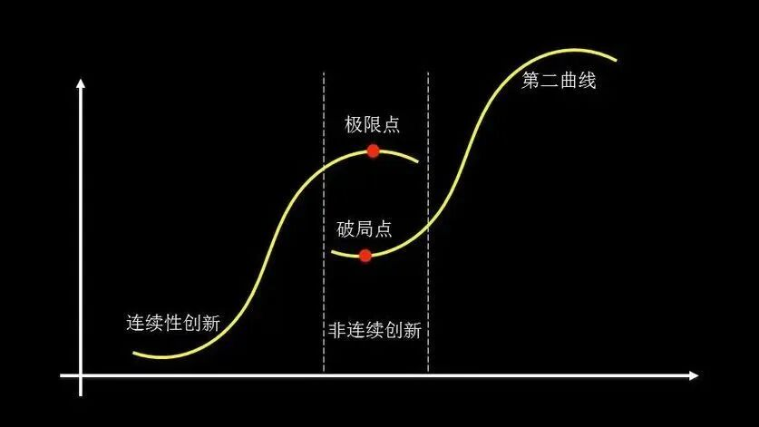

# AI 颠覆为何效果慢？——重读 30 年前的悖论   

## TL;DR（太长不看版）

**核心观点**：从电气化到AI，颠覆性技术从诞生到真正提升生产率，中间总要经历一个长达数十年的“安装期”——旧流程、旧KPI、旧基础设施会反复扼杀或拖慢创新。这不是失败，而是价值网络成型前无法绕行的序章。

**六个押韵的历史教训**：
1. **Paul David（1989）**：电力花了40年才推动生产率飞跃，因为工厂必须先重组流程，而非简单替换动力源。
2. **克里斯坦森（1990s）**：锐意进取的机构恰恰最容易扼杀颠覆性创新，因为其KPI和价值网络形成“组织免疫系统”。
3. **当代AI**：AI/LLM热潮未在生产率统计中体现，因为我们正处于“安装期”——学习成本、幻觉、流程不兼容等问题拖累了效率。
4. **旧技术的战略钳制**：钉钉等数字底座Bug丛生、不支持现代集成，且平台方故意限制开放性、强推自己烂尾的AI版本，形成“卡死”僵局——你想用外部AI改善它，它不让你动；你等它的官方AI，它迟迟不来且质量堪忧。
5. **Gartner曲线**：每项新技术都会从“期望顶峰”坠入“幻灭低谷”——这是正常规律，而非失败信号。
6. **历史押韵**：历史不重复，但节奏惊人相似。我们需要耐心，更需要在“隔离区”跑通新范式、投资互补性资产、识别并解构旧KPI，而非用旧报表审判新未来。

**思考**：AI真正的生产率爆发，什么时候能从一些个人的证词，发展到整个机构效率的大幅提升？现在的“在正式报表中看不到大成果”，原因有多少？

---
最近两天我看到至少两个短视频在谈这篇论文：
[计算机与发电机：COMPUTER AND DYNAMO: The Modern Productivity Paradox in a Not-Too Distant Mirror](https://ageconsearch.umn.edu/record/268373/?v=pdf)

在某个论文网站上，它的下载量也是在最近一周飙高了 100 倍：

## 讨论正文
### 不断押韵的历史教训：从电气化到AI，颠覆性创新的漫长“安装期”

历史不会简单重复，但总是押着相似的韵脚。当我们站在2026年，审视AI与大型语言模型（LLM）带来的喧嚣时，如果回望过去一个多世纪的技术革命史，会发现一个规律：**每一项颠覆性技术的价值在正式报表上获得肯定，都远比其技术诞生要来得更晚、更艰难。**

#### 1. 历史的序章：电气化与“生产率悖论”

1989年，经济史学家Paul David在其经典论文《计算机与发电机》中，初步揭示了这一规律的早期版本。当时，计算机已开始普及，但却对正式统计中的宏观生产率没有帮助 —— 这正是著名的“生产率悖论”。

为了解释这一矛盾，David 将目光投向了更早的电气化时代。他发现，早在 1880 年代初，发电机（dynamo）就已问世，但直到1920年代，电力才真正推动美国制造业的生产率飞跃。这中间存在长达**约40年的滞后**。原因在于，工厂最初只是用电动机替换蒸汽机，却保留了旧有的集中式传动轴系统（“组驱动”）。只有当工厂彻底重构为单元驱动系统、流水线作业普及后，电力的潜力才被真正释放。David的结论是：**通用技术的果实，需要漫长的互补性投资与组织变革才能兑现。**

#### 2. 机构的迷思：锐意进取，却扼杀创新

1990年代，克里斯坦森在《创新者的窘境》中，从管理学的角度补充了这一历史观察。他发现，恰恰是那些锐意进取、管理良好的优秀机构，反而最容易在颠覆性创新面前败北。

（我大约是在 2008 年读到的这本书，这两天我们学院发了一本珍藏版，翻了一下，的确是常看常新）

颠覆性的创新，往往破坏了现有技术的生态和获利机制，但是新技术能把企业带到第二条增长曲线，让企业焕发第二春。 但是，事情在变好之前，可能要变坏一段时间。 

原因并非它们畏惧新事物，而是其赖以成功的KPI、流程和价值网络，构成了一个精密且固执的“组织免疫系统”。当颠覆性技术初现时，其性能往往不如主流产品，无法满足主流客户的当下需求，因此被旧流程判定为 “不成熟” 或 “价值小”。机构越是 “锐意进取” 地优化现有流程，就越会主动地边缘化甚至扼杀那个未来可能颠覆自己的“异类”。**现有的成功，成了变革的最大敌人。**

#### 3. 当代的押韵：AI/LLM与“确定性拷打概率模型”的效率黑洞

如今，AI/LLM热潮未在宏观生产率数据中留下印记，许多引入AI的机构也经历了“效率不升反降”的阵痛。

这常被肤浅地归咎于AI不够成熟。但从系统论看，**这是组织在用 “零错率” 的旧标准，严苛要求一个基于概率模型的智能体。** 在容错为零的流程里，即便AI在95%的场景下表现出色，人类也不得不建立更繁琐的审核、校对和人肉对齐链条，以防范剩余5%的不确定性。技术省下的时间，全被用来对冲概率系统的随机性。

这不是AI太弱，而是新火车头正生硬地卡在旧铁轨上。我们正处在Paul David所说的“安装期”——摩擦与颠簸，恰是范式转换的序章。

#### 4. 旧瓶装新酒：数字底座如何“卡死”AI创新

如果说‘安装期’是技术革命的普遍节律，那么在中国特定的数字生态中，这一阶段正被一种人为的因素显著拉长——既有技术的钳制。在所有制约因素中，最令人窒息的莫过于**既有技术的钳制**。许多机构的数字化底座，深度绑定在某个协作平台（如钉钉）上。这个底座本身的 Bug 层出不穷、不能顺畅支持现代化的API集成（如 Webhook 等 “Claw”），导致 IT 部门每天要花大量时间 Debug，而非探索AI的真正潜力。

然而，真正的困境远不止于此。当我们向平台方反馈时，得到的往往是礼貌而空洞的“兜圈子”。更深层的原因是：**平台方并不希望我们自行通过开放接口，用外部AI来优化工作流。** 它的战略是让我们等待它自己的 AI 产品。问题在于，这个官方 AI 新版本目前体验极差、旧的 Bug无人修复，且迭代路线图模糊不清 —— 原来吹牛的颠覆性版本迟迟没有出现，逐渐腐烂的旧版本又没有增量改进。 报一个尴尬的 bug，我们正在使用的企业版钉钉， 都搜索不到我们安装的龙虾（claw）。 

这就形成了一个 **“卡死”僵局**：你用旧系统，被Bug折磨得痛不欲生；你想用外部 AI 改善它，平台不开放接口或故意制造兼容障碍；你想等平台的官方 AI，它却遥遥无期。你被牢牢锁定在一条既无法自我优化、又无法外求突破的轨道上。这正是Paul David所说的 “路径依赖” —— 早期对某个技术底座的廉价选择，演变成了今天创新探索的昂贵牢笼。

#### 5. 心照不宣搞定新的 KPI 

当急躁的管理层试图用量化指标来催熟 AI 这个新技术时，大家在慌忙中，往往动作会变形。其中最典型的当代奇观，莫过于**把“Token 消耗量”或“API 调用次数”直接列入考核统计表**。

这直接踩中了管理学里的**古德哈特定律（Goodhart's Law）**：当指标变成目标，它就失去了作为指标的价值。为了迎合这一设定，团队最理性的选择不再是提炼算法或优化工作流，而是将原本一句话即可阐明的提示词，故意诱导 AI 扩写成数千字的冗长文本，随后再调用另一个模型进行摘要。 或者是 为说新词强说愁，把业务中次要的问题拿来大做文章，证明 AI 的威力。  这种“以浪费计算资源为荣，凭空制造业季” 的刷榜行为不可能让一个机构的核心效率指标得到实质的提升。 

从系统架构与工程逻辑的角度审视，这种指标设计的荒谬性在于两点：

##### 1） 错把“系统功耗”当成“业务成就”

Token 消耗、投喂体积、账号活跃度，本质上皆属于**输入侧的“系统功耗”（Input）**。
在工业时代，烧煤多或许代表运力大；但在智能时代，**优秀架构的硬指标是“一击必中”（Zero-Shot/Few-Shot Precision）**。一个真正跑通的端到端 Agent 或提炼到极致的 Prompt，只需消耗极少的计算开支，便能精准穿透一个复杂的审批流。相反，只有陷入死循环、缺乏边界条件的拙劣系统，才会疯狂空转并吞噬 Token。

> **用 Token 消耗量来考核生产率，形同通过“消耗了多少牛肉海参”来考察足球队的训练质量一样外行——它度量的只是高昂的成本，而非最终的破门得分。**

##### 2） 人为制造了“二阶偶发复杂度”

旧有流程的冗余与不便，属于系统的一阶复杂度。如今为了凑齐 Token 的考核账单，全员不得不额外耗费心智去构思“如何让 AI 制造出更庞大、更合规的废话”，这便演变成了**二阶偶发复杂度**。
AI 的本意应当是“降噪”，而这套指标却强迫高知人才集体降级为“数字垃圾的制造者与清理工”。的组织是在“为凑指标强刷 Token”。系统变得比以往更加臃肿、更加不可维护。

#### 6. 颠覆性创新面临的“围城”

结合历史与当下，每一项颠覆性技术在走向成熟前，都会遭遇一系列系统性的“关卡”：

-   **旧KPI的错配**：以机械时代的“精度”标准来衡量概率性的智能系统，迫使AI“自废武功”。
-   **落后基础设施的拖累**：数字底座充满 Bug 且不支持现代集成，消耗了创新者宝贵的精力，使 AI 无法嵌入流畅的工作流。
-   **第三方供应商的锁定与扼杀**：平台方为守护自己的 AI 路线图，主动限制开放性，造成机构创新节奏受制于人、无法自主进化的卡死局面。
-   **价值网络的缺失**：AI 缺少互补性的数据、人才、流程和制度，其价值无法在旧报表中体现，反而在初期只呈现为高昂的成本。

这些具体问题共同构成了当代创新的 “头上彩旗挥舞，脚下泥泞不前”。

#### 7. 技术成熟度的曲线：必然的“迷茫之沟”

Gartner的“技术成熟度曲线”（Hype Cycle）以图形化的方式捕捉了这一规律。每一项颠覆性技术都会经历一个“期望膨胀的顶峰”，随后急速坠入 **“幻灭的低谷”**。在这个阶段，公众的失望情绪达到顶点 （因为没达到预想的美妙前景），投资和关注度锐减。

Paul David所描述的“安装期”，克里斯坦森笔下的“被扼杀的创新”，慢慢腐化的旧 IT 基建导致的“锁定与卡死”，以及Gartner曲线中的“幻灭低谷”——**它们描述的是同一个历史阶段：新技术尚未与旧世界完成磨合，其价值网络正在黑暗中缓慢成型，而旧世界的主导者正竭力维护自己的地盘。**

#### 结语：耐心不是美德，而是战略

历史给予我们的启示并非消极，而是深刻的战略清醒：**颠覆性技术从诞生到真正改变世界，其“安装期”往往以五年甚至数十年计。**

在这个阶段，重要的不是催促“火车跑得更快”，而是有策略地进行 **“铺轨工程”**：

1.  **识别并解构**与新技术不兼容的旧KPI和旧流程。 要抛弃，或者用独立的组织形式来管理和跟踪颠覆性技术的成效。 
2.  **隔离式创新**，在“特区”内跑通新范式，再逐步推广 —— 在不兼容的旧技术（如 钉钉）之外，寻找可替代的轻量级协作底座作为“试验田”。
3.  **投资互补性资产**，包括数据治理、人才培养和组织文化重塑。
4.  **建立新的先导指标**，去衡量那些旧报表无法捕捉的价值（如节省的低价值时间、出现的新商机）。
5.  **规避锁定陷阱**，在选择技术底座时，将 “开放性与可替代性” 放到比 “短期成本更“ 优先的位置。

正如Mark Twain所说：“历史不会重复，但总是押韵。”当我们理解了电气化、个人电脑、互联网所经历的押韵历史，就能以更从容的战略定力，去认识 AI 转型中的一些问题， 它们并非失败的信号，而是企业从目前的山头奔向下一个山头的跋涉过程中必经的山谷和沼泽。 

为了将这些顶尖学者的工作完美融入你长文的尾声，我们需要用一种“群星闪耀、历史接力”的叙事手法将其串联。文字需要保持你一贯的技术克里姆林宫式的冷峻，同时用学术题目（中英双语）和精准的时间线拉出纵深感。

以下是为您整理好的最终章节文稿。这段文字不仅能让你的文章在理论深度上瞬间拉满，而且每个段落最后留下的问题，将如同回音一样，在读者的脑海中久久不散。

---

## 回音：群星的接力——“技术滞后”的理论谱系

下面的学者从 200 多年前开始，接力式地构建了人类理解“技术滞后”的理论骨架。他们的研究互相呼应，每一环的递进，都让我们对当前 AI 困局的认识深入骨髓 -- 当然，这是在假设人类能认真学习历史，并能从历史中吸取教训的前提下（致敬黑格尔和萧伯纳）。 

---

* 克拉夫茨（N. F. R. Crafts）: 1769–1850 | 工业革命的源头跃迁
英国经济史学家克拉夫茨在研究工业革命时期蒸汽机的扩散过程时，发现了一个常被忽视的事实：詹姆斯·瓦特在 1769 年就获得了蒸汽机的关键专利，但蒸汽动力直到 19 世纪中期才真正成为英国工业生产率增长的主要驱动力，中间隔了约 80 年。原因与后来的电气化如出一辙——早期工厂只是把蒸汽机嵌入旧式水车动力系统中，生产流程本身纹丝不动，直到工厂建筑和传动系统被彻底重新设计，蒸汽的潜力才被释放。

克拉夫茨的定量研究在学术界引发过关于工业革命增长率的长期争论，但他关于技术扩散时间线的基本判断已成为共识。这一发现将“通用目的技术的漫长安装期”追溯到了工业革命的源头，也是日后 Paul David 电气化分析的先声。

> **既然蒸汽机等了 80 年才真正改变世界，今天我们给 AI 的时间还不到它辉煌年岁的十分之一，我们凭什么认为等待已经太久？**

* 罗伯特·索洛（Robert Solow）: 1987 | 幽灵般的悖论定名
1987年，诺贝尔经济学奖得主索洛在《纽约时报书评》（*The New York Times Book Review*）的一篇短评中写下了那句被后人常常提起的名言：

> “你到处都能看到计算机时代，唯独在生产率的统计中看不到。”

这并非一篇严谨的学术论文，只是一句夹杂在书评中的直觉观察，但它精准地捕捉到了一个令整个经济学界不安的系统性矛盾，后来被正式命名为**“索洛悖论”（Solow Paradox）**。

索洛本人并未在那篇短文中提出系统解释，但他为后续所有研究标定了标杆，影响力远远超出了学术圈，切入公共话语和商业决策的深层肌理。

> **一个经济学家随手写下的一句话，定义了一个时代对技术的根本困惑——那么今天我们对 AI 的讨论中，是否也藏着一句尚未被说出的、属于 2026 年的索洛式箴言？**

* 保罗·大卫（Paul David）: 1990 | 历史明镜下的发电机
1990年，经济史学家 Paul David 发表了那篇著名的《计算机与发电机：不远镜鉴中的现代生产率悖论》（*Computer and Dynamo: The Modern Productivity Paradox in a Not-Too Distant Mirror*），为索洛的困惑提供了一个经典的历史类比。

他发现电力在 1880 年代就已商用，但美国制造业的生产率飞跃直到 1920 年代才出现，滞后约 30 年。原因在于工厂最初只是用电动机替换蒸汽机（组驱动），保留了笨重的集中传动轴系统，只有当工厂彻底重构为单元驱动、流水线普及之后，电力的潜力才被真正释放。这篇最初在经济学会议上宣读的短文，直接成为了 Brynjolfsson 等人日后研究 AI 扩散的理论源头。David 的结论简洁有力：通用目的技术的果实，需要漫长的互补性投资与组织变革才能兑现。

> **如果电气化需要一代人的时间来“铺轨”，我们是否真的做好了以同样的尺度来衡量 AI 的准备，还是说我们的耐心只够读完一篇季度财报？**

* 布雷斯纳汉 & 特拉滕贝格: 1995 | 通用技术的工业飞轮
1995年，蒂莫西·布雷斯纳汉（Timothy Bresnahan）和曼努埃尔·特拉滕贝格（Manuel Trajtenberg）在《通用目的技术：“增长的引擎”？》（*General Purpose Technologies: Engines of Growth?*）中进一步系统化了这一逻辑。这篇发表于《计量经济学杂志》（*Journal of Econometrics*）的论文将蒸汽机、电力、半导体这类技术正式定义为**“通用目的技术”（GPT, General Purpose Technologies）**，并确立了其三大核心特征：普遍适用性、持续改进潜力、催生互补创新的能力。

更重要的是，他们揭示了这类技术的“正反馈循环”：技术进步降低应用部门的创新成本，应用部门的创新反过来又拉动技术进一步改进。但这个飞轮转动得天然缓慢，因为互补性创新无法一筑而就，只能一个行业一个行业地渗透。

> **既然通用目的技术的飞轮必须一个行业一个行业地渗透，那么今天 AI 在哪些行业已经转动了飞轮的第一圈，又在哪些行业还完全卡在门外——我们是否真的做过这样的排查？**

* 卡洛塔·佩雷斯（Carlota Perez）: 2002 | 金融资本与技术大周期
2002年，委内瑞拉裔经济学者佩雷斯在《技术革命与金融资本》（*Technological Revolutions and Financial Capital*）中提出了一个更宏大的演进框架，将每次技术革命分为爆发（Irruption）、狂热（Frenzy）、转折（Turning Point）、协同（Synergy）、成熟（Maturity）五个阶段，并严格区分了**“安装期”（Installation Period）**与**“部署期”（Deployment Period）**。

在安装期，新技术在旧范式内部被试用和排斥，伴随金融狂热与泡沫；只有经过一场系统性危机和制度重构（转折点）后，技术才能进入真正的部署期，广泛渗透并推动生产率提升。佩雷斯的理论源起于 1980 年代与创新研究先驱弗里曼（Christopher Freeman）的合作，其对五次技术革命的历史分析具有强大的跨周期说服力。

> **佩雷斯提醒我们，每次技术革命的中场都有一场危机作为转折点——那么 AI 革命的“转折点”会以什么形式到来，我们是否已经站在了它的边缘而浑然不觉？**

* 布林约尔松 等（Brynjolfsson et al.）: 2017 | 现代生产率悖论的落地
2017年，埃里克·布林约尔松（Erik Brynjolfsson）、丹尼尔·洛克（Daniel Rock）和查德·西弗森（Chad Syverson）发表了《人工智能与现代生产率悖论：冲突还是预期？》（*Artificial Intelligence and the Modern Productivity Paradox: A Clash of Expectations and Statistics*），将 Paul David 的发电机框架直接应用于人工智能。 **注意，这是在 Transformer 论文和 LLM出现前夕的文章**

这篇发表在《美国经济评论》（*American Economic Review*）上的文献明确将**实施滞后（Implementation Lags）**列为首要因素，认为企业尚未完成必要的组织流程变革才是真正症结。他们的核心判断是：今天的 AI 大致相当于 1900 年左右的电力，潜力已经显现，但互补性创新远未完成。

> **如果布林约尔松的判断正确，AI 的生产率爆发还在一二十年后，那么今天所有急于用季度数据来证明或否定 AI 价值的行为，是否从一开始就问错了问题？**
>

* 罗伯特·戈登（Robert J. Gordon）: 2016 | 特殊世纪的制衡冷水
2016年，西北大学的戈登在巨著《美国增长的起落》（*The Rise and Fall of American Growth*）中提供了一个重要的制衡视角。戈登承认技术扩散存在漫长滞后，但他冷峻地指出：**并非所有等待都能换来等量回报。**

他认为 1870 至 1970 年是人类历史上绝无仅有的“特殊的世纪”，电力、内燃机、管道供水等发明从根本上重塑了人类生活方式。而 1970 年以后的数字革命虽然显著，其生产率拉动效应却远不如第二次工业革命。戈登提出的问题与 AI 的未来直接相关：技术创新的滞后效应是客观规律，但滞后本身并不保证最终回报的规模。

> **如果我们正在经历一场“戈登式”的技术革命——轰轰烈烈却回报有限——我们当前的投资规模和社会期待是否正在酝酿一场巨大的错配？**
