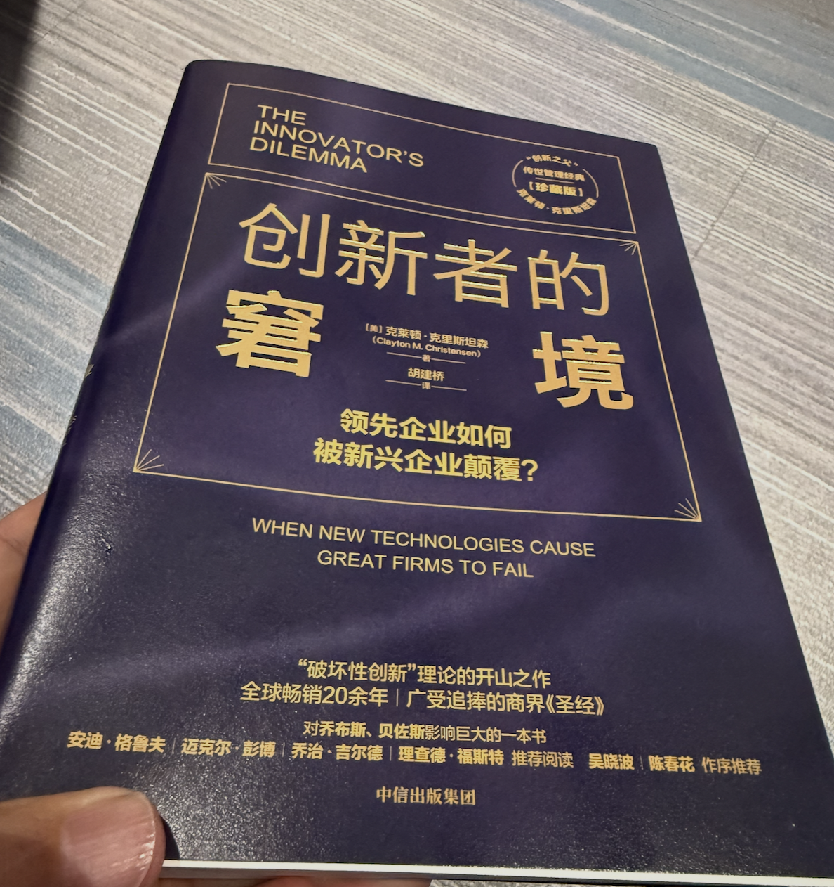
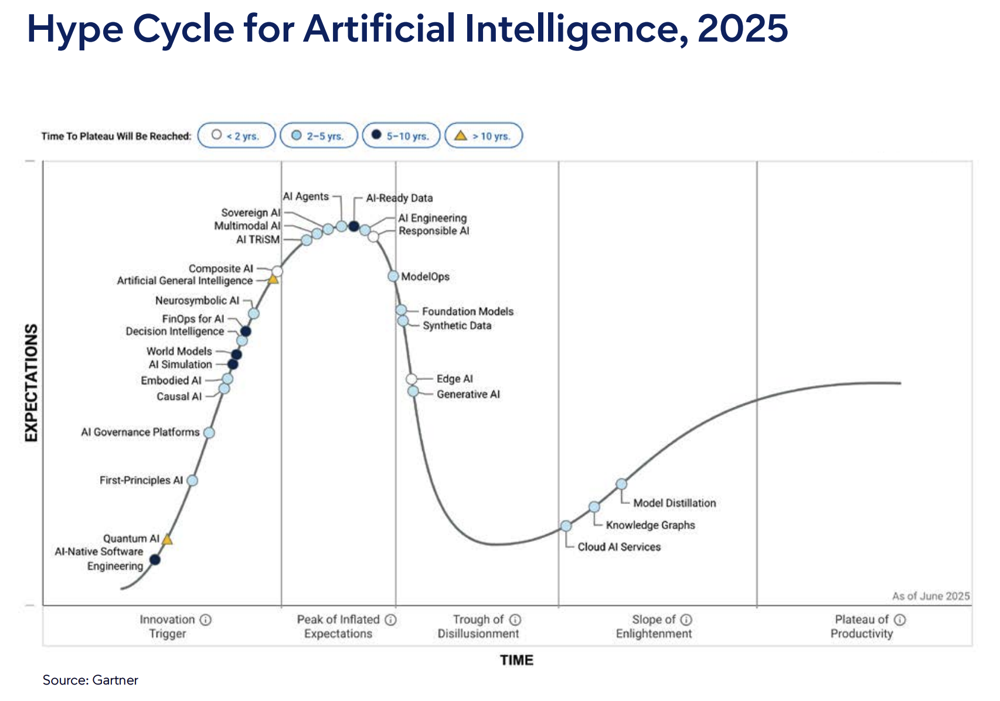

# AI 颠覆为何效果慢？——重读 30 年前的悖论

## TL;DR（太长不看版）

**核心观点**：从电气化到AI，颠覆性技术从诞生到真正提升生产率，中间总要经历一个长达数十年的“安装期”。旧流程、旧KPI、旧基础设施、旧组织结构，会反复扼杀或拖慢创新。这不是失败，而是价值网络成型前无法绕行的序章。

**六个押韵的历史教训**：
1. **Paul David（1990）**：电力花了30-40年才推动生产率飞跃，因为工厂必须先重组流程，而非简单替换动力源。
2. **克里斯坦森（1990s）**：优秀机构之所以难以拥抱颠覆，是因为它们的成功机制本身构成了“组织免疫系统”。
3. **当代AI**：AI/LLM热潮未在生产率统计中体现，因为我们正处于“安装期”——学习成本、幻觉、流程不兼容等问题拖累效率。
4. **不是局部修复**：通用技术不是补丁，而应推动机构全面重构；若仅做局部修补，效果必然被稀释。
5. **旧底座的钳制**：钉钉类数字平台Bug丛生、不支持现代集成，平台方又限制开放性，形成“卡死”僵局。
6. **Gartner曲线**：每项新技术都要从“期望顶峰”坠入“幻灭低谷”——这是正常规律，而非失败信号。

**思考**：AI真正的生产率爆发，什么时候能从个人证词发展到机构效率的大幅提升？现在的“在正式报表中看不到大成果”，究竟是技术问题，还是我们还没重构好组织？

---
最近两天我看到至少两个短视频在谈这篇论文：
[计算机与发电机：COMPUTER AND DYNAMO: The Modern Productivity Paradox in a Not-Too Distant Mirror](https://ageconsearch.umn.edu/record/268373/?v=pdf)

在某个论文网站上，它的下载量也是在最近一周飙高了 100 倍：

## 讨论正文

### 不断押韵的历史教训：从电气化到AI，颠覆性创新的漫长“安装期”

历史不会简单重复，但总是押着相似的韵脚。当我们站在2026年审视AI与大型语言模型（LLM）带来的喧嚣时，一个规律清晰可见：**每一项颠覆性技术的价值在正式报表上获得肯定，都远比其技术诞生要晚、更艰难。**

#### 1. 历史的序章：电气化与“生产率悖论”

1989年，经济史学家Paul David在其经典论文《计算机与发电机》中揭示的，是一个早期的“生产率悖论”。当时，计算机已开始普及，但却对正式统计中的宏观生产率没有帮助。

他把目光投向了更早的电气化时代，发现发电机在1880年代初就已问世，但直到1920年代，电力才真正推动美国制造业的生产率飞跃。中间存在长达约40年的滞后。

原因很简单：工厂最初只是用电动机替换蒸汽机，仍然保持旧有的集中式传动轴系统（“组驱动”）。只有当工厂彻底重构为单元驱动系统、流水线作业普及后，电力的潜力才被真正释放。David的结论是：**通用技术的果实，需要漫长的互补性投资与组织变革才能兑现。**

#### 2. 机构的迷思：锐意进取，却扼杀创新

1990年代，克里斯坦森在《创新者的窘境》中从管理学角度补充了这一历史观察。他发现，恰恰是那些“做事对”的优秀机构，反而最容易在颠覆性创新面前败北。

（我大约是在2008年读到这本书，这两天学院发了珍藏版，翻了一下，的确是常看常新）

颠覆性的创新，往往破坏现有技术的生态和获利机制。它能把企业带到第二条增长曲线，但在事情变好之前，往往要先变坏一段时间。

其原因不在于机构害怕新事物，而在于现有的KPI、流程和价值网络造就了一套精密且固执的“组织免疫系统”。当颠覆性技术初现时，它常常不如主流产品，无法满足当下客户的即时需求，于是被旧流程判定为“价值小”或“不成熟”。

机构越是“锐意进取”地优化现有流程，就越会主动边缘化、甚至扼杀那个未来可能颠覆自己的“异类”。**现有的成功，成了变革的最大敌人。**

#### 3. 当代的押韵：AI/LLM与“确定性拷打概率模型”的效率黑洞

如今，AI/LLM热潮未在宏观生产率数据中留下印记，许多引入AI的机构也经历了“效率不升反降”的阵痛。

这常被肤浅地归咎于AI不够成熟。但从系统论来看，**这更像是组织在用“零错率”标准，审视一个基于概率模型的智能体。**

在容错为零的流程中，即便AI在95%的场景中表现良好，人类也不得不建立更繁琐的审核、校对和人工对齐链条，以防范余下5%的不确定性。技术省下的时间，最终被用来对冲概率系统的随机性。

这不是AI太弱，而是新火车头生硬地卡在旧铁轨上。我们正处在Paul David所说的“安装期”——摩擦与颠簸，恰是范式转换的序章。

#### 3.1 AI不是局部补丁，它是组织重构的触发器

如果你把AI当成“给现有系统装一个新插件”，你注定只能得到“老系统更快一点”的结果。通用技术不是补丁，而应当促成机构级的重新配置。

它要求的不只是算法升级，而是：

- 组织结构重构：谁判断、谁执行、谁监督，都要重新定义；
- 流程重塑：传统审批链往往要拆成“人机协同+实时反馈”；
- 决策机制重设：旧的“二级审批”会把AI变成人工审核的掩护；
- 数据与底座协同：数据库、接口、权限、自动化必须一并改；
- 人才与激励再定义：让AI成为新的生产要素，而不是“AI工程师做结果，业务人看报表”。

因此，AI转型的慢，不仅因为模型自身，还因为你还没准备好让组织做一次深层次重构。

#### 4. 旧瓶装新酒：数字底座如何“卡死”AI创新

如果说“安装期”是技术革命的普遍节律，那么在中国特定的数字生态中，这一阶段正被一种人为因素显著拉长：既有技术的钳制。

许多机构的数字化底座深度绑定在某个协作平台（例如钉钉）上。这个底座本身Bug丛生、无法顺畅支持现代集成（如Webhook等开放API），导致IT部门每天花大量时间Debug，而非探索AI的真正潜力。

更糟的是，当你想用外部AI补强时，平台方往往表现出“闭门养大象”的战略：它们更希望你耐心等待自己的AI版本。

这个官方AI版本目前体验极差、旧问题无人修复、迭代路线模糊。原来吹牛的颠覆性产品，迟迟没有出现；腐化的旧版本又没有实质改善。

结果形成了一个**“卡死”僵局**：

- 你用旧系统，问题多得令人窒息；
- 你想用外部AI改善它，平台不开放接口；
- 你想等平台官方AI，它又遥遥无期。

你被锁定在一条既无法自我优化、又无法外求突破的轨道上。这正是Paul David所说的“路径依赖”——早期对某个技术底座的廉价选择，演变成了今天创新探索的昂贵牢笼。

#### 5. 心照不宣搞定新的KPI

当急躁的管理层试图用量化指标催熟AI时，最典型的当代奇观是：**把“Token消耗量”或“API调用次数”列入考核统计表。**

这同时踩中了管理学里的**古德哈特定律（Goodhart's Law）**：当指标变成目标，它就失去作为指标的价值。

于是，最理性的优化不再是提升业务效果，而是让提示词越写越长，制造出更庞大、更合规的废话，然后再用另一个模型摘要。或者把次要问题拔高成大课题，证明AI的“威力”。这种“浪费计算资源的秀场”，绝不会让一个机构的核心效率指标得到实质改善。

从系统架构角度看，这种指标荒诞主要源于两点：

##### 5.1 错把“系统功耗”当成“业务成就” 

Token消耗、投喂体积、账号活跃度，本质上只是**输入侧的“系统功耗”**。
在工业时代，烧煤多或许代表运力大；在智能时代，优秀架构的硬指标应当是“一击必中”（Zero-Shot/Few-Shot Precision）。一个真正跑通的端到端Agent，或一个经过极致提炼的Prompt，只需极少计算开支，就能精准穿透复杂审批流。相反，拙劣系统才会疯狂空转、吞噬Token。

> 用Token消耗量来考核生产率，形同通过“消耗了多少牛肉海参”来评估足球队训练质量——它度量的只是高昂成本，而非最终破门得分。

##### 5.2 人为制造了“二阶偶发复杂度” 

旧有流程的冗余属于系统的一阶复杂度。如今，为了凑齐Token考核，全员不得不额外耗费心智去构思“如何让AI制造出更庞大、更合规的废话”，这就演变成了**二阶偶发复杂度**。

AI的本意应当是“降噪”，而这套指标却把高知人才逼成“数字垃圾制造者与清理工”。系统变得比以往更加臃肿、更加不可维护。

#### 6. 颠覆性创新面临的“围城” 

结合历史与当下，每一项颠覆性技术走向成熟前，都会遭遇一系列系统性的关卡：

- **旧KPI的错配**：用机械时代标准衡量概率智能，迫使AI“自废武功”。
- **落后基础设施的拖累**：旧底座Bug满天飞，创新者精力被消耗殆尽。
- **第三方平台锁定**：厂商为守住AI路线图，主动限制开放，创新节奏受制于人。
- **价值网络缺失**：缺少互补性数据、人才、流程和制度，AI的价值无法在旧报表中体现。
- **组织重构迟滞**：当AI被视为局部修补，机构就无法获得通用技术带来的系统性增益。

这些问题共同构成了当代创新的“头上彩旗挥舞，脚下泥泞不前”。

#### 7. 技术成熟度的曲线：必然的“迷茫之沟” 

Gartner的“技术成熟度曲线”（Hype Cycle）图解了这一路径。每项新技术都会先冲上“期望顶峰”，再坠入**“幻灭低谷”**。此时，失望情绪高涨，投资锐减。

Paul David的“安装期”、克里斯坦森的“组织免疫”、旧IT基建的“锁定与卡死”、以及Gartner的“幻灭低谷”——**它们描述的，正是同一阶段：新技术还没与旧世界完成磨合，价值网络在黑暗中缓慢成型，旧世界的既得者正竭力自保。**

#### 8. 结语：耐心不是美德，而是战略

历史给予我们的启示并非消极，而是深刻的战略清醒。**颠覆性技术从诞生到真正改变世界，其“安装期”往往以五年甚至数十年计。**

在这个阶段，重要的不是催促“火车跑得更快”，而是有策略地做**“铺轨工程”**：

1. **识别并解构**与新技术不兼容的旧KPI和流程；要么抛弃，要么用独立组织来衡量颠覆性技术的成效。
2. **隔离式创新**：在“特区”内跑通新范式，再逐步推广；在不兼容的旧底座之外，先找可替代的轻量协作试验田。
3. **投资互补资产**：数据治理、人才培养、组织文化和制度机制，都要一起搬进AI转型的赛道。
4. **建立新的先导指标**：衡量旧报表无法捕捉的价值，比如节省的低价值时间、新商机的出现、组织学习速度。
5. **规避锁定陷阱**：技术底座的“开放性与可替代性”，应当高于短期成本的考量。

> 你不能仅靠“给老工厂换成电机”，就期待它像装上新发动机的老蒸汽车一样顿时跑出新速度。AI不是一个插件，它是整条工厂的重新设计，是生产要素的再配置。

### 行动清单：别把AI变成一个漂亮的花瓶

- 重新审视现有AI项目的KPI：测的是“投入量”，还是“真实业务效果”？
- 识别可做“隔离试点”的场景：先从不依赖旧底座的边缘业务跑通。
- 盘点技术底座的开放性：接口是否可控、替代方案是否可选。
- 评估组织重构成本：现有流程、权限、岗位如何变动？
- 跟踪互补资产进展：数据、人才、审计、流程、文化，哪一项最拖后腿？

## 回音：群星的接力——“技术滞后”的理论谱系

下面的学者从200多年前开始，接力式地构建了人类理解“技术滞后”的理论骨架。他们的研究互相呼应，每一环递进，都让我们对当前AI困局的认识更清晰。

* 克拉夫茨（N. F. R. Crafts）: 1769–1850 | 工业革命的源头跃迁
英国经济史学家克拉夫茨研究工业革命时期蒸汽机的扩散过程时发现，詹姆斯·瓦特在1769年就获得蒸汽机关键专利，但蒸汽动力直到19世纪中期才真正成为英国工业生产率增长的主要驱动力，中间隔了约80年。原因与后来的电气化几乎如出一辙。

> 既然蒸汽机等了80年才真正改变世界，今天我们给AI的时间还不到它辉煌年岁的十分之一，我们凭什么认为等待已经太久？

* 罗伯特·索洛（Robert Solow）: 1987 | 幽灵般的悖论定名
1987年，诺贝尔经济学奖得主索洛在《纽约时报书评》中写下了那句被后人常常引用的话：

> “你到处都能看到计算机时代，唯独在生产率的统计中看不到。”

这句话把一个困惑钉在了公共话语的显微镜下。今天我们也许应该问：AI时代的“索洛式箴言”会是什么？

* 保罗·大卫（Paul David）: 1990 | 历史明镜下的发电机
1990年，Paul David发表了《计算机与发电机》，为索洛的困惑提供了经典历史类比。他指出，电力在1880年代已商用，但美国制造业生产率飞跃直到1920年代才出现——滞后约30年。

他解释说，工厂初期只是用电动机替换蒸汽机，保留了笨重的集中传动轴系统，只有当工厂重构为单元驱动、流水线普及后，电力的潜力才被释放。

> 如果电气化需要一代人的时间来“铺轨”，我们是否真的做好了以同样尺度来衡量AI的准备，还是说我们的耐心只够读完一篇季度财报？

* 布林约尔松 等（Brynjolfsson et al.）: 2017 | 现代生产率悖论的落地
2017年，埃里克·布林约尔松、丹尼尔·洛克和查德·西弗森发表了《人工智能与现代生产率悖论：冲突还是预期？》，将David的发电机框架直接应用于AI。

他们认为，企业尚未完成必要的组织流程变革才是真正症结，并将**实施滞后（Implementation Lags）**列为首要因素。今天的AI，大致相当于1900年左右的电力：潜力已经显现，但互补性创新远未完成。

> 如果布林约尔松的判断正确，AI的生产率爆发还在一二十年后，那么今天急于用季度数据证明或否定AI价值的行为，是否一开始就问错了问题？
