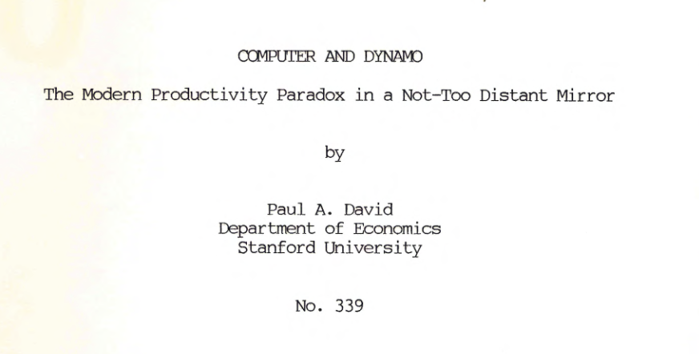
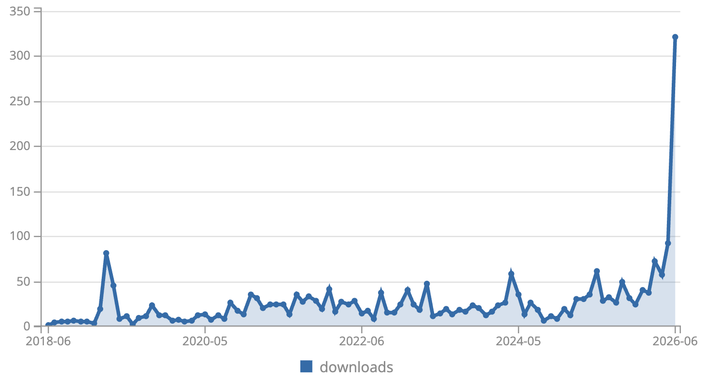

# AI 革命的效果为何迟迟没有出现？

## TL;DR
### TL;DR（太长不看版）

**核心观点**：从电气化到AI，颠覆性技术从诞生到真正提升生产率，中间总要经历一个长达数十年的“安装期”——旧流程、旧KPI、旧基础设施会反复扼杀或拖慢创新。这不是失败，而是价值网络成型前无法绕行的序章。

**六个押韵的历史教训**：
1. **Paul David（1989）**：电力花了40年才推动生产率飞跃，因为工厂必须先重组流程，而非简单替换动力源。
2. **克里斯坦森（1990s）**：锐意进取的机构恰恰最容易扼杀颠覆性创新，因为其KPI和价值网络形成“组织免疫系统”。
3. **当代AI**：AI/LLM热潮未在生产率统计中体现，因为我们正处于“安装期”——学习成本、幻觉、流程不兼容等问题拖累了效率。
4. **旧技术的战略钳制**：钉钉等数字底座Bug丛生、不支持现代集成，且平台方故意限制开放性、强推自己烂尾的AI版本，形成“卡死”僵局——你想用外部AI改善它，它不让你动；你等它的官方AI，它迟迟不来且质量堪忧。
5. **Gartner曲线**：每项新技术都会从“期望顶峰”坠入“幻灭低谷”——这是正常规律，而非失败信号。
6. **历史押韵**：历史不重复，但节奏惊人相似。我们需要耐心，更需要在“隔离区”跑通新范式、投资互补性资产、识别并解构旧KPI，而非用旧报表审判新未来。

**结论**：AI真正的生产率爆发，可能要到2028年后。现在的“看不到成果”，正说明它已经碰到了真实世界的根基——这是一个好迹象，意味着创新正在认真“铺轨”，而非浮于表面。

---
最近两天我看到至少两个短视频在谈这篇论文：

论文的下载量也是在最近一周飙高：

## 讨论正文
### 不断押韵的历史教训：从电气化到AI，颠覆性创新的漫长“安装期”

历史不会简单重复，但总是押着相似的韵脚。当我们站在2026年，审视AI与大型语言模型（LLM）带来的喧嚣时，如果回望过去一个多世纪的技术革命史，会发现一个令人清醒的规律：**每一项颠覆性技术的价值爆发，都远比其技术诞生要来得更晚、更艰难。**

#### 1. 历史的序章：电气化与“生产率悖论”

1989年，经济史学家Paul David在其经典论文《计算机与dynamo》中，揭示了这一规律的早期版本。当时，计算机已开始普及，但宏观生产率统计却毫无起色——这正是著名的“生产率悖论”。

为了解释这一矛盾，David将目光投向了更早的电气化时代。他发现，早在1880年代初，发电机（dynamo）就已问世，但直到1920年代，电力才真正推动美国制造业的生产率飞跃。这中间存在长达**约40年的滞后**。原因在于，工厂最初只是用电动机替换蒸汽机，却保留了旧有的集中式传动轴系统（“组驱动”）。只有当工厂彻底重构为单元驱动系统、流水线作业普及后，电力的潜力才被真正释放。David的结论是：**通用技术的果实，需要漫长的互补性投资与组织变革才能兑现。**

#### 2. 机构的迷思：锐意进取，却扼杀创新

1990年代，克里斯坦森在《创新者的窘境》中，从管理学的角度补充了这一历史观察。他发现，恰恰是那些锐意进取、管理良好的优秀机构，反而最容易在颠覆性创新面前败北。

原因并非它们畏惧新事物，而是其赖以成功的KPI、流程和价值网络，构成了一个精密且固执的“组织免疫系统”。当颠覆性技术初现时，其性能往往不如主流产品，无法满足主流客户的当下需求，因此被旧流程判定为“不成熟”或“无价值”。机构越是“锐意进取”地优化现有流程，就越会主动地边缘化甚至扼杀那个未来可能颠覆自己的“异类”。**成功，成了变革的最大敌人。**

#### 3. 当代的镜像：AI/LLM与“低效的繁荣”

如今，我们正身处AI/LLM引领的颠覆性浪潮中心。然而，我们并未看到生产率奇迹的降临，反而感受到了类似的困惑与阵痛：

-   在宏观层面，AI尚未在GDP或劳动生产率数据中留下显著印记。
-   在微观层面，许多机构（如大学）引入了AI，但成员并未感到效率提升，反而因学习成本、调试AI输出、应对幻觉等问题，经历了“效率下降”的困惑期。

这并非AI技术本身不够强，而是我们正身处Paul David所说的 **“安装期”**——新火车头被架在了旧铁轨上，摩擦与颠簸在所难免。

#### 4. 旧瓶装新酒：数字底座如何“卡死”AI创新

在所有制约因素中，最令人窒息的莫过于**既有技术供应商的战略性钳制**。许多机构（如大学）的数字化底座，深度绑定在某个国产协作平台（如钉钉）上。这个底座本身的Bug层出不穷、不支持现代化的API集成（如Webhook等“Claw”），导致我们每天要花大量时间Debug，而非探索AI的真正潜力。

然而，真正的困境远不止于此。当我们向平台方反馈时，得到的往往是礼貌而空洞的“兜圈子”。更深层的原因是：**平台方并不希望我们自行通过开放接口，用外部AI来优化其上的工作流。** 它的战略是让我们等待它自己的AI产品。问题在于，这个官方AI新版本目前体验极差、Bug无人修复，且迭代路线图一团迷雾——新版本迟迟没有出现，旧版本又烂到无法使用。

这就形成了一个 **“卡死”僵局**：你用旧系统，被Bug折磨得痛不欲生；你想用外部AI改善它，平台不开放接口或故意制造兼容障碍；你想等平台的官方AI，它却遥遥无期且质量堪忧。你被牢牢锁定在一条既无法自我优化、又无法外求突破的轨道上。这正是Paul David所说的“路径依赖”——早期对某个技术底座的廉价选择，演变成了今天创新探索的昂贵牢笼。

#### 5. 颠覆性创新面临的“围城”

结合历史与当下，每一项颠覆性技术在走向成熟前，都会遭遇一系列系统性的“关卡”：

-   **旧KPI的错配**：以机械时代的“精度”标准（如要求AI版本间评分完全一致）来衡量概率性的智能系统，迫使AI“自废武功”。
-   **落后基础设施的拖累**：数字底座充满Bug且不支持现代集成，消耗了创新者宝贵的精力，使AI无法嵌入流畅的工作流。
-   **第三方供应商的锁定与扼杀**：平台方为守护自己的AI路线图，主动限制开放性，造成机构创新节奏受制于人、无法自主进化的卡死局面。
-   **价值网络的缺失**：AI缺少互补性的数据、人才、流程和制度，其价值无法在旧报表中体现，反而在初期只呈现为高昂的成本。

这些具体问题共同构成了当代创新的“泥泞现实”。

#### 6. 技术成熟度的曲线：必然的“迷茫之沟”

Gartner的“技术成熟度曲线”（Hype Cycle）以图形化的方式捕捉了这一规律。每一项颠覆性技术都会经历一个“期望膨胀的顶峰”，随后急速坠入 **“幻灭的低谷”**（或称为“迷茫之沟”）。在这个阶段，公众的失望情绪达到顶点，投资和关注度锐减。

Paul David所描述的“安装期”，克里斯坦森笔下的“被扼杀的创新”，钉钉式的“锁定与卡死”，以及Gartner曲线中的“幻灭低谷”——**它们描述的是同一个历史阶段：新技术尚未与旧世界完成磨合，其价值网络正在黑暗中缓慢成型，而旧世界的主导者正竭力维护自己的地盘。**

#### 结语：耐心不是美德，而是战略

历史给予我们的启示并非消极，而是深刻的战略清醒：**颠覆性技术从诞生到真正改变世界，其“安装期”往往以十年甚至数十年计。**

在这个阶段，重要的不是催促“火车跑得更快”，而是有策略地进行 **“铺轨工程”**：

1.  **识别并解构**与新技术不兼容的旧KPI和旧流程。
2.  **隔离式创新**，在“特区”内跑通新范式，再逐步推广——在钉钉之外，寻找可替代的轻量级协作底座作为“试验田”。
3.  **投资互补性资产**，包括数据治理、人才培养和组织文化重塑。
4.  **建立新的先导指标**，去衡量那些旧报表无法捕捉的价值（如节省的低价值时间、激发的新问题）。
5.  **规避锁定陷阱**，在选择技术底座时，将“开放性与可替代性”置于比短期成本更优先的位置。

正如Mark Twain所说：“历史不会重复，但总是押韵。”当我们理解了电气化、个人电脑、互联网所经历的押韵历史，就能以更从容的战略定力，去穿越AI当前所处的这片迷茫之谷。它并非失败的信号，而是价值网络真正成型前，一段必要且无法绕行的序章。