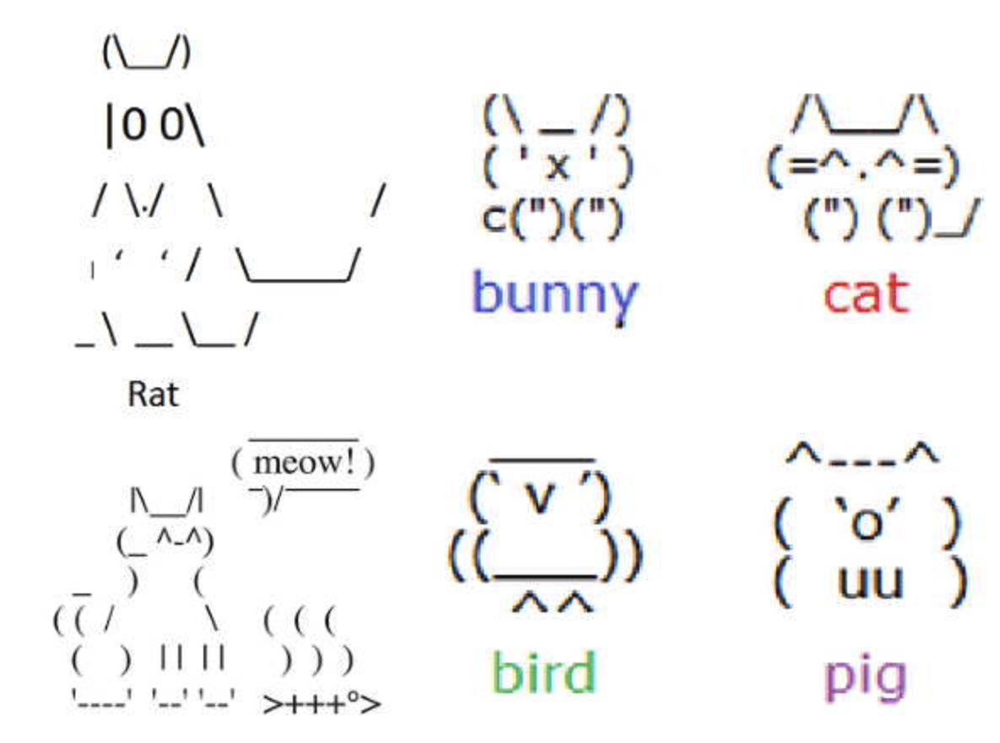
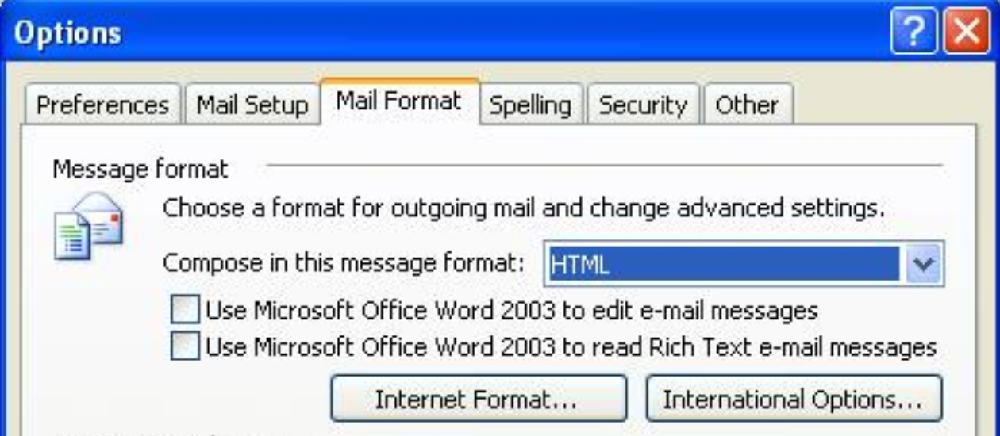
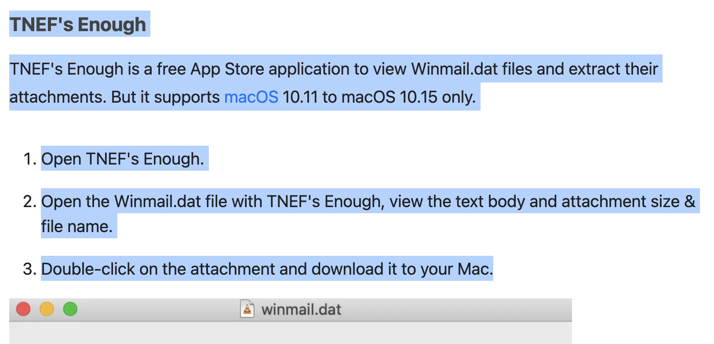

# 软件复杂性讨论(5) - email 正文格式的演化和软件复杂性

## 前面关于软件复杂性的讨论

[1. 软件的分形，和英国海岸线还要复杂？](https://mp.weixin.qq.com/s/ie1lvOmT366AEdhAk5bzIQ)  
[2. 软件的抽象，是银弹？](https://mp.weixin.qq.com/s/2kQT3yo8OAPwMPGxhFy9pA)  
[3. AI 自动写代码，是银弹？](https://mp.weixin.qq.com/s/SvzD7groV4LT33wpqoMV0g)  
[4. 软件需求的复杂度，是分形还是兔子洞？](https://mp.weixin.qq.com/s/jkkSJ7DNgRrX5fGzKdG1pQ)


---

## 导读：篇文稿解答三个核心疑问

作为编写过代码、且每天都在使用 Email 的 IT 从业者或计算机专业师生，你是否曾停下敲击键盘的手，思考过以下三个问题：

1. **邮件正文的格式演进** 从最初的极简纯文本到重型的 WordMail，主要驱动因素是满足用户需求，还是炫技，还是商业目的？
2. **为什么格式的过度发展与技术滥用，最终损害了很多用户的利益？** 你接受到 `winmail.dat` 附件么，如何逼得外部生态必须发明专门的“后处理软件”来买单？
3. **技术生命周期的终局，如何让邮件正文格式不再重要？** 从“单机物理嵌套”到“云端分布式链接”，今天的 email 回到了 “只读一个验证码” 的安全手段？

---

## 讨论正文

### 1. 再也不是 ASCII 文本了 - 多语言国际化的支持

果冻擦了擦冷汗，试图在白板上寻找新的架构防线：“超哥，听完上集 [Borland 物理死磕派被拖死的悲剧](https://mp.weixin.qq.com/s/jkkSJ7DNgRrX5fGzKdG1pQ)，我懂了。咱们不能在每个应用里都像素级重写一套引擎。那我不用套娃，我用 Windows 现成的轻量级 RichEdit 控件来做编辑器总行了吧？就像早期的 Outlook 那样，让应用保持轻量。”

阿超听完冷笑了一声，走到白板前拿起了黑色记号笔：“果冻，你这是回到了 Outlook 的轻量级童年。1971 年 ARPANET 时代开始的 Email 正文的标准很简单，核心是 7-bit ASCII 码的**纯文本流（Plaintext）**。1982 年 geek 用户敲下了人类第一个笑脸符号 `:-)` ，当时的人们在email 和 BBS 系统中用简单的文字拼出了各种 ASCII Art，显示了人类在底层基础设施匮乏时，对表达丰富度的追求。“



“但随着 Email 演变为商业竞争的焦点，” 阿超在白板上写下了 ‘需求蔓延’ 几个字，“用户希望 email 正文能表达越来愈多的信息，颜色、要加粗、附件、表格，不同国家的人们开始用 email 交流。要面对多语言国际化的技术挑战（从右向左排版，等等），但是 Windows 当年的系统空间 RichEdit已经疲于奔命， Unicode 当时还不是主流的格式，怎么办？大家用一个临时方案 DBCS 来对付。”

小飞斜眼看着果冻，不怀好意地笑了笑：“果冻，既然你《软件工程》考了九十五分，这是微软面试的经典真题。在东亚（中日韩）用户涌入带来的 **DBCS（双字节字符集）** 变长编码时代，英文占 1 字节，中文占 2 字节（前导字节 + 尾随字节）。现在，用户的光标停在邮件文本的某个位置。**用户按了一下‘左方向键’，你作为核心开发者，如何让光标安全地向左移动一个字符？**”

果冻揉了揉眼睛：“C 语言的字符串处理，向前移一个字符，不就是把当前的字符指针 `p` 直接减一，`p--` 吗？”

“`p--` ？”小飞拍着桌子说：“**你这一减，直接切在中文字符的肚子上了！** 字符长度不等于字节长度。在 DBCS 里有很多细节：

* **光标移动与退格**：你敢直接 `-1`，光标会卡在汉字双字节中间，按 Backspace 会将半个汉字与邻近字符拼接成乱码。你没有任何捷径可走，**指针必须大义凛然地退回到当前行的绝对起点，从第一个字节开始往后扫描**（ASCII 指针 `+1`，前导字节 `+2`），直到赶上当前光标位置，才能安全地实现‘光标左移一个字符’。这让一个 **O(1)** 的硬件级操作退化成了 **O(N)** 的文本扫描。
* **反向搜索（String Search）**：从后往前扫描英文字母（如大写 `A`，`0x41`）时，指针扫到的 `0x41` 可能根本不是 `A`，而只是某个巨型汉字的后半个字节。”

（请看本文最后的代码）

果冻挠挠头皮：“既然 DBCS 这么恶心，当时为什么不直接采用当时前沿的 **Unicode**？用定长宽字符不就没这些破事了吗？”

阿超摇了摇头，发出一声长叹：“果冻，你又在用无菌室里的‘重写思维’来逃避现实了。当时是 90 年代中后期，第一，主流消费级系统 Windows 9x 的底层内核依然是 ANSI/DBCS 架构；第二，早期 Outlook 依赖的企业级通信底层 **MAPI 协议** 和 Exchange 网关当时不兼容 Unicode。第三，切换到早期 Unicode 还会导致文本内存开销翻倍。在操作系统、底层协议和历史包袱的联合绞杀下，RichEdit 控件的代码体积在各种魔改打补丁中恶性膨胀。“ 

阿超停顿了一下，在白板上画了一条时间线："但这个噩梦并非永恒。1999年，Windows 2000（NT 5.0）完成了内核从ANSI到Unicode的全面重构；两年后XP普及，全球数亿台PC终于原生支持定长宽字符。同时，互联网协议层也在演进——UTF-8在2003年前后成为IETF推荐标准，SMTP和MIME开始原生支持UTF-8。"

"DBCS的血泪，最终不是被应用层的某个'大杀器'解决的，"小飞接话道，"而是被整个技术生态的底层基础设施升级完全淹没的。"

---

### 2. 富文本和多重交流的支持 -  Word 的支持最丰富

果冻在白板上画了一个问号，追问道："等等，既然Unicode已经为底层扫清了障碍，那上层选择什么渲染引擎应该更自由才对？90年代末正好是第一次浏览器大战，作为Windows标配的IE内核就在那儿，那时候 IE 的占有率逐渐升高，Outlook团队为什么不直接用它做邮件渲染？"

“问得好！Outlook 团队当年确实上车了 **HTML 格式路线**。” 小飞在搜索引擎上不断翻页，找到了一张尘封多年的经典 Windows XP 时代软件截图：



“果冻你看，这是 Outlook 2003 的设置面板。你看，在 `Message format`（邮件格式）里，虽然你可以妥协地选择用 `HTML` 格式发送，但紧接着下面就挂着两个复选框：*‘是否用 Word 2003 编辑邮件’* 和 *‘是否用 Word 2003 阅读富文本邮件’*。选择太多，也是让用户烦恼，对吧。”

果冻在白板上顺着刚才的线索画了一个复杂的文件传输链路，突然有些领悟：“超哥，我发现企业用户的日常办公有一个巨大的痛点：Email 本质上是来回的交流和讨论。在 Plain Text 年代，大家用 >、>> 符号逐层嵌套来标注几个回合的讨论；后来到了 RichEdit 时代，大家用文字缩进、改不同颜色来显示不同人的回复。

但如果对方发来一个 Word 附件，这个流式讨论的工作流就断了——我必须下载它，调用外部的 Word App 打开，在里面加批注、修改，再保存到本地，然后回到邮件客户端点击回复，把新文档重新作为附件插进去，最后在正文里简单写一句‘请看附件’。这效率太低了！既然核心内容在 Word 里面，那为何不直接自然地把 Email 正文和 Word 融为一体呢？让用户在正文里就能直接像修改 Word 一样去讨论，微软这么做不正好顺应了用户的这一直觉吗？”

“这的确是微软当年最核心的‘应用组件捆绑与生态锁定（Platform Lock-in）’战略。”阿超。

“你这个设想在商业体验上完美符合‘消灭中间商’的原则。微软当年的意图，就是利用 OLE 组件技术，把邮件正文魔改为一个 Word 的活动文档容器（Active Document Container）。这在技术层面，确实存在‘物理排版’与‘流式布局’的哲学冲突。Word 的第一性原理是 WYSIWYG（所见即所得）的物理印刷（锚点是 A4 纸等物理边界和像素对齐），而 HTML 的第一性原理是声明式的流式布局。早期的渲染模块根本无法承载 Word 级别的表格嵌套。

如果 Outlook 全面拥抱了开放 HTML 格式，封闭垄断的 Word 格式壁垒将不复存在。通过这种技术的强绑定，强制将整个 WordMail 引擎接入 Outlook，让私有文档格式推行为全球办公事实标准，发起主动的市场格式垄断。”

“但这头缝合起来的解决方案带来了严重的副作用。”阿超接着说，“即使用户仅仅想写一句 “Good morning”，再加一个笑脸的 smiley 😊，包含全球国际化支持、几十万行控制逻辑和宏引擎的 Word 运行时也必须在内存中整体启动，导致光标卡顿和内存飙升。这触发了安迪-比尔定律（What Andy gives, Bill takes away）：英特尔提升的硬件红利，迅速被微软更宏大的新功能消耗殆尽。”

“然而，在软件工程中，‘优化’本身就是一种极其伟大的‘创造’。”小飞面色庄重地接过了话茬。

“针对每个版本中越来越丰富的格式升级，微软工程师都会花很长时间改进性能。他们不仅实现了底层剥离、延迟加载（Lazy Loading），甚至深入二进制和汇编级别进行代码执行块优化 —— 重新排列那些条件跳转和热点函数，只为了提高 CPU 缓存命中率与分支预测准确率。这些极致优化的成果不仅挽救了 Outlook 的启动体验，更全面反哺了 Word 本身，为日后 Office 向更复杂的功能演进打下了坚实的性能地基。”

---

### 3. 其他用户 - winmail.dat 灾难

果冻理直气壮地反问：“既然我是从功能最强大的 WordMail 发出的邮件，排版完美且内嵌了 Excel 表格，我要求所有接收平台在阅读时达到一致的高保真效果，这不过分吧？”

“这恰恰引发了互联网的格式不兼容大战，损害了在微软生态外用户的利益。”小飞在白板上写下了一个文件名：`winmail.dat`。

“标准的互联网 SMTP/MIME 协议无法容纳 Word 内部复杂的 OLE 实现。当邮件包含一些私有属性或 OLE 对象时， 微软设计了 **TNEF（传输中立封装格式）** 技术，封装这些扩展的信息。这导致非 Windows/Outlook 用户收信时，正文排版全无，而且还有一个无法打开的附件：`winmail.dat`。用户一时摸不着头脑。 这种格式的独断专行对终端用户极其不友好，甚至在外部生态中逼出了专门用来修补这一架构漏洞的独立应用。例如在 Mac 生态中，由于系统原生无法解析 TNEF 二进制流，开发者不得不专门编写并上架了诸如 **`TNEF's Enough`** 这样的后处理软件。Mac 用户收到无法读取的邮件时，必须下载该应用，把 `winmail.dat` 拖入其中，才能查看、核对附件并下载。”




"这就是私有格式的负外部性（Negative Externality）——这是经济学中的概念，指一个实体的行为对无关第三方造成了成本。微软的 TNEF 格式满足了其自身生态内的功能需求，但代价是将解码成本转嫁给了所有非 Windows/Outlook 用户：Mac/Linux 用户配置额外工具，Webmail 服务商需要投入工程资源来解析这种私有格式。整个互联网生态被迫承担了本应由微软独自承担的兼容性成本。"

---

### 4. 丰富的格式 - 能隐藏钓鱼伎俩

“除了技术格式上的混乱，商业信任在应用层也走向了异化。”小飞把手里的白板擦往桌上一扔，发出“啪”的一声。

“果冻，你发现现代商业协作里最讽刺的一个现象没有。当年巨头不断支持越来越丰富的格式，是为了把 Email 塑造成商业交易的核心战场。可到了今天，各大机构发出的邮件，大半都挂着一个冷酷的 **`no-reply@`（请勿回复）** 地址。”

阿超叹一口气，补充道：“没错。机构为了逃避维护‘双向通信’的运营成本，提高单向推送广告和账单的工程效率，将邮件退化为了单向倾倒信息的工具。当收到金额错误的账单，用户点击‘回复’却只能收到‘投递失败’的系统退信时，商业交易所依赖的双向对等契约就崩溃了。

更严重的是，由于邮件底层协议对身份验证的缺失，它成为了供应链诈骗和核心投毒通道。机构为了防范风险，不得不强制推行‘钓鱼邮件安全模拟演练（Phish Training）’。安全合规部门每个月都会故意发送一些伪造系统升级、发放福利的钓鱼测试邮件，来‘钓鱼’自己的员工。谁要是点击了链接，就会被强制送去上合规课，甚至扣减绩效。”

果冻举手追问：“超哥，既然绝绝大多数钓鱼和投毒都是通过高保真 HTML 隐藏恶意超链接实现的，**那也许让邮件格式彻底回到 Plain Text（纯文本），才是更安全、更高效的解法？**”

“在纯粹的技术理性上，你是对的。但商业博弈和人类的直觉，无情地扼杀了这种高维安全方案。”阿超冷笑了一声：

“如果全球强制退回 Plain Text，HTML 邮件里的‘诱导按钮’、‘隐藏跳转 URL’将无处遁形，安全边界确实会大幅收敛。但现实是，无法退回纯文本的现状，配合高压的钓鱼演练，已经导致了理性人对邮件信任的彻底蒸发。企业在收到任何涉及账单、合同、或者带链接的邮件时，第一反应不再是协作，而是怀疑和恐惧。大家再也不想、不愿、也不敢用邮件来完成真正的商业交易了。

但最讽刺的是系统复杂度的对立统一：即使机构顶着巨大的认知摩擦去天天做安全演练，企业内部依然存在一小部分群体——**无论经过多少次培训，他们看到任何邮件里的链接，都还是会不假思索地点击。** 这种人类层面的不可控随机性，让安全合规部门不得不加上更重、更复杂的邮件网关审计与零信任屏障。技术防线越来越厚，邮件作为交易通道的效率却越来越低。”

---

### 5. 终局：邮件正文格式的日落

果冻：“我懂了。随着协同云（Notion、飞书、Google Workspace）的普及，行业从单机时代的 **Scale-up（物理嵌套/Embedding）** 转向了网络时代的 **Scale-out（云端链接/Linking）**。通过发送一个云端 URL，复杂的排版和表格全部在云端动态渲染。Email 终于回归了轻量级的通知通道，技术演进消灭了复杂度，对吧？”

“不！果冻，你陷入了技术决定论的盲目乐观主义了。”阿超说。

“云端链接也有它自己的复杂度：鉴权系统的复杂度、数据一致性的复杂度、多租户隔离的复杂度、服务宕机的风险，等等。 这十多年我们见得多了 —— 某基础云服务摔一跤，全互联网的应用都跟着半身不遂好几天。 

“**很多 IT 领域的技术，都会经历极简诞生、百花齐放、功能竞争、效能过度提供（Performance Oversupply）、收敛稳定，直至最终的落日。技术范式的转移，从来没有消灭复杂度，它只是改变了复杂度的形态。**

到了今天，Email 经历了四十年的功能发展与格式的竞争，由绚烂而平淡，其功能已经处于‘夕阳无限好’的阶段：**它成为了一个跨越所有巨头围墙花园的、去中心化的‘身份验证与登录契约通道’。**

现在大部分人打开一封邮件，目的不再是为了在邮件正文里阅读高保真的多维报表或宏排版，而仅仅是为了‘验证登录’ —— 从中读出一个 6 位数的数字验证码，或者点击一个点对点的链接，证明‘你是你’。 在很多场合，邮件正文的格式，都已经不再重要。 

---

## 思考题

1. 格式不兼容的古今对照：当年微软通过 TNEF/winmail.dat 将私有格式强加到开放 SMTP/MIME 协议之上，迫使 Mac/Linux/Webmail 生态逆向解析该格式。今天，各大超级 App（如微信、抖音、Apple）通过内嵌 WebView、禁绝外部链接、推行私有协议，在移动端形成了类似的"格式闭环"。请从技术层面（私有格式对开放标准的"污染"方式）和经济层面（迫使外部承担适配成本的逻辑）对比这两种现象，并思考：winmail.dat 最终被云端链接（URL）部分消解，今天 App 的私有闭环是否也会被某种更高维度的开放连接所打破？

2. "消灭复杂度"的两种策略：正文展示了两种应对复杂度的路径——Unicode 从编码层消灭了 DBCS 的 O(N) 扫描噩梦（底层升级），云端链接从分发层消灭了 winmail.dat 的格式不兼容（范式转移）。但这两种策略都带来了新的复杂度：Unicode 为 WordMail 的应用层膨胀铺平了道路，云端链接引入了鉴权、一致性、服务可用性等新问题。请分析：为什么"底层升级"策略（Unicode）最终走向了统一标准，而"范式转移"策略（云端链接）反而催生了新的大厂生态锁定（如 Google Workspace vs Office 365 的文档格式不兼容）？

3. 技术生命周期的可推广性：Email 格式演进呈现出"极简诞生→功能膨胀→生态反噬→收敛稳定"的轨迹。请从正文案例中提炼出你认为"具有普遍性"或"仅适用于 Email"的关键特征，并以此论证：这一生命周期在多大程度上可以推广到其他技术领域（如浏览器、即时通讯、大语言模型）？


## 代码： 怎么让编辑器的光标走到 DBCS 字符串的前一个字符
（这是我当年进入微软的面试题之一）
在 `DBCS`（双字节字符集）编码下，由于字符是变长的（英文字符占 1 字节，中文字符占 2 字节），正如我们前面讨论过的，孤立地从当前光标向左看一个字节是无法判断它是“单字节字符”、“双字节字符的前导字节”还是“尾随字节”的。

解决这个问题的唯一确定性方法，就是**从文本的绝对起点（`pStart`）开始正向扫描**，直到扫描到当前光标（`pCurrent`）的位置。在扫描过程中，我们需要记录上一次成功识别出的字符起点。

以下是实现该逻辑的 C 代码函数。为了提高运行效率，我们利用了 Windows Win32 API 中标准的 `IsDBCSLeadByte` 机制（或者通过判断字节是否大于 `128` 的通用非标准判定方法，这里采用通用高位判定逻辑）：

```c
#include <stdio.h>
#include <stdbool.h>

/**
 * @brief 判断一个字节是否为 DBCS 的前导字节（高位字符特征）
 * @note 实际工程中，在 Windows 平台通常使用 IsDBCSLeadByteEx(CP_ACP, ch)
 * 此处使用通用的大于 128 (0x80) 的高位特征判定
 */
bool IsLeadByte(unsigned char ch) {
    return (ch >= 0x81 && ch <= 0xFE);
}

/**
 * @brief 在 DBCS 字符串中，寻找当前光标位置的前一个字符起点
 * * @param pStart    DBCS 文本的绝对起点
 * @param pCurrent  当前光标指向的位置
 * @return const char* 返回前一个字符的指针。如果光标已经在起点，或指针异常，返回 pStart。
 */
const char* BackOneChar(const char* pStart, const char* pCurrent) {
    // 边界条件防御：指针为空，或者光标已经在文本起点或起点之前
    if (pStart == NULL || pCurrent == NULL || pCurrent <= pStart) {
        return pStart;
    }

    const char* pScan = pStart;
    const char* pLastChar = pStart; // 记录上一个合法字符的起点

    // 从文本起点正向摸着石头过河，直到赶上或超过当前光标位置
    while (pScan < pCurrent) {
        pLastChar = pScan; // 迭代更新：当前扫描到的位置，就是最新的字符起点

        // 检验当前字节是否为高位前导字节
        if (IsLeadByte((unsigned char)*pScan)) {
            // 如果是中文字符的前导字节，并且下一个字节没有超过光标范围，指针前进 2 字节
            if (pScan + 1 < pCurrent) {
                pScan += 2;
            } else {
                // 特殊边界：如果前导字节刚好卡在 pCurrent 的前一步（说明光标切在汉字肚子上了）
                // 此时直接终止，pLastChar 保持当前汉字起点
                break;
            }
        } else {
            // 普通单字节 ASCII 字符，指针前进 1 字节
            pScan += 1;
        }
    }

    return pLastChar;
}

// ==========================================
// 验证用例
// ==========================================
int main() {
    // 假设 GBK 编码下的测试文本: "A中文B"
    // 十六进制表示：
    // 'A' (0x41)
    // '中' (0xD6, 0xD0) -> DBCS 变长
    // '文' (0xCE, 0xC4) -> DBCS 变长
    // 'B' (0x42)
    const char text[] = { 'A', 0xD6, 0xD0, 0xCE, 0xC4, 'B', '\0' };
    const char* pStart = text;

    // 测试 1：光标在 '中' 字的起点（即字符 '中' 的前导字节 0xD6）
    // 期待返回：'A' 的位置
    const char* pCurrent1 = pStart + 1; 
    const char* pRes1 = BackOneChar(pStart, pCurrent1);
    printf("测试 1 - 光标在 '中'，前退一个字符是: %c\n", *pRes1);

    // 测试 2：光标在 '文' 字的起点（即字符 '文' 的前导字节 0xCE）
    // 期待返回：'中' 的位置（打印它会打印出 "中文B"，其指针指向 "中"）
    const char* pCurrent2 = pStart + 3; 
    const char* pRes2 = BackOneChar(pStart, pCurrent2);
    printf("测试 2 - 光标在 '文'，前退一个字符打印其后文本: %s\n", pRes2);

    // 测试 3：由于错误魔改，光标意外卡在了 '中' 字的肚子中间（尾随字节 0xD0）
    // 期待返回：安全退回 '中' 的正确起点
    const char* pCurrent3 = pStart + 2; 
    const char* pRes3 = BackOneChar(pStart, pCurrent3);
    printf("测试 3 - 光标卡在 '中' 字肚子中间，安全退回到汉字起点: %s\n", pRes3);

    // 测试 4：光标已在文本开头
    // 期待返回：文本开头位置
    const char* pRes4 = BackOneChar(pStart, pStart);
    printf("测试 4 - 光标已在开头，最差安全返回原位成功（返回是否等于起点）: %s\n", (pRes4 == pStart) ? "true" : "false");

    return 0;
}

```

### 关键工程逻辑拆解：

1. **O(N) 时间复杂度**：由于无法单从局部推断状态，函数每次调用最坏情况下都必须从 `pStart` 正向顺序步进扫描到 `pCurrent`。
2. **防截断防御**：当 `pScan + 1 < pCurrent` 不成立时，意味着用户的 `pCurrent` 光标由于某种历史 Bug，刚好切在了一个双字节汉字的前导字节和尾随字节正中间。此时通过终止循环，成功将错位的指针强制向前修正到了该汉字的正确起点（`pLastChar`），达成了最差返回安全位置的合规性设计。