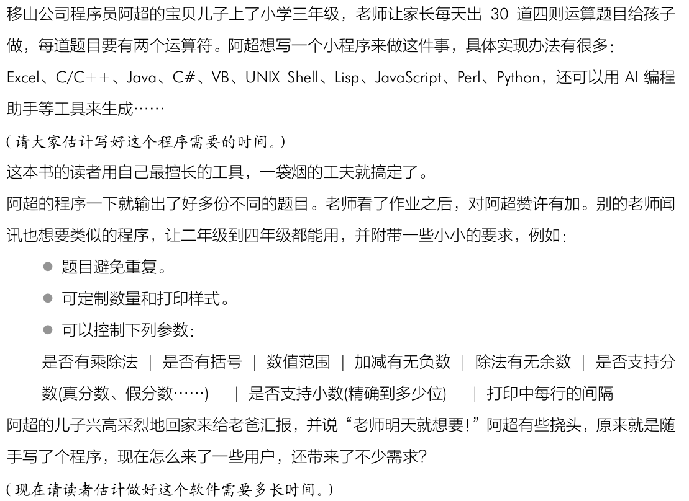
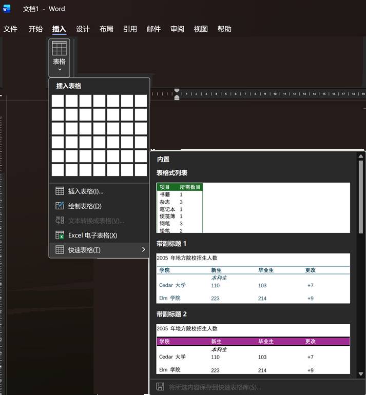
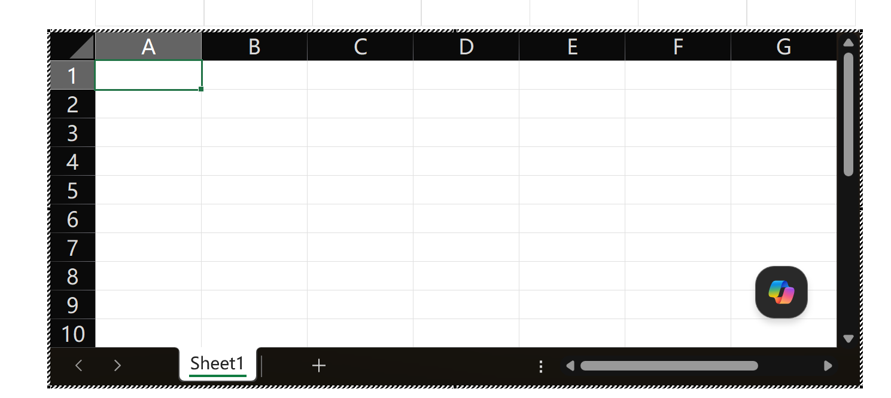
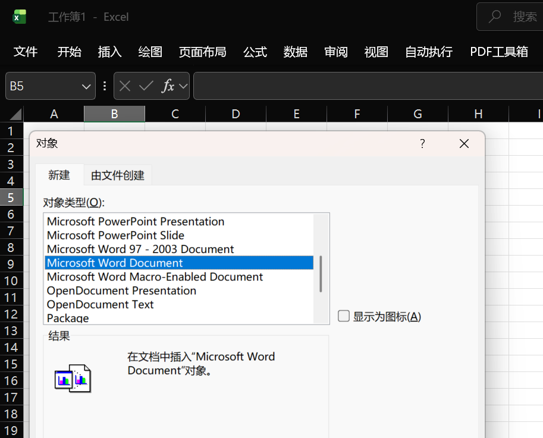
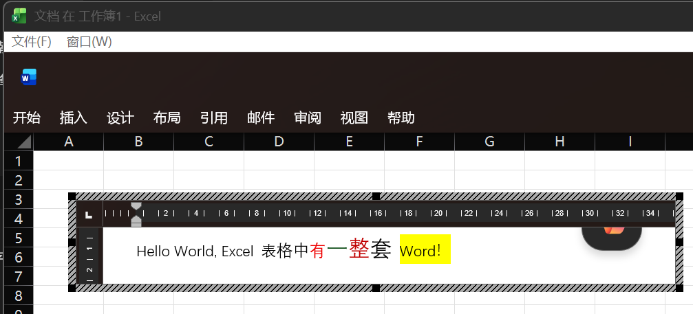
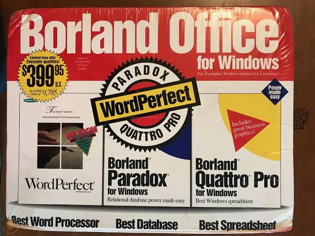

# 软件复杂性讨论(4) - 软件需求的自相似分形

## 前面关于软件复杂性的讨论

[1. 软件的分形，和英国海岸线还要复杂？](https://mp.weixin.qq.com/s/ie1lvOmT366AEdhAk5bzIQ)  
[2. 软件的抽象，是银弹？](https://mp.weixin.qq.com/s/2kQT3yo8OAPwMPGxhFy9pA)  
[3. AI 自动写代码，是银弹？](https://mp.weixin.qq.com/s/SvzD7groV4LT33wpqoMV0g)

---

## TL;DR
* **线性重复（Repetition）与自相似分形（Fractal）的本质区别**：处理线性的重复需求是软件开发的基本功，可以通过参数和循环轻松收敛；而需求的分形增长，是用户在某一业务能力内部，再次要求嵌套类似能力的演进方式。
* **从写代码到系统治理的转变**：当用户要求“文字里有表格，表格里还有文字”时，核心挑战已经不再是如何编写新代码，而是如何安全地复用已有的复杂系统和经过验证的历史工程资产。
* **AI 时代的软件工程拷问**：从早期的 OLE、OpenDoc 到 2026 年的 AI 自动化代码生成，软件工业一直面临抉择 —— 面对自相似的分形需求，我们究竟应该顺应直觉去快速重写代码以复制复杂度，还是克制欲望去设计严谨的契约以共享复杂度？前者看起来爽快，后者往往才是理性的软件工程。
* **AI 降低了制造代码的成本，却没有降低管理复杂度的成本。** 很遗憾，海量新代码反而增加了复杂度！

---

## 讨论正文

这篇文章，继续讲述，为什么 AI 工具可以一小时写一万行语法正确的代码了，软件工程仍然存在不可消除的复杂度。这也是《构建之法 第四版》的 [补充内容](https://gitee.com/zouxin2025/ASE) 的一部分。 

### 1. 软件需求中的重复，是最容易解决的复杂度

果冻盯着白板，揉了揉下巴，“超哥，刚才大家讨论软件复杂度的前几个帖子，特别是你提到的那个 *软件在实现时存在很多自相似的分形维度*，我听着总觉得悬在半空。为什么我在上学的时候完全没碰到过这种事？我的《软件工程》大作业还拿了九十五分呢。”

小飞斜眼看他，“你拿九十五分那个作业，题目是什么来着？”

果冻一拍大腿，“就是 [《构建之法》开篇的题目](https://gitee.com/zouxin2025/ASE/tree/master/chapter01) 啊，出五十道随机四则运算题目并批改。我当时的解法非常直接，在网页里硬编码了五十个固定的控件，一组组连着排下去。期末演示时，程序运行得极其稳定，老师当场给了高分。”



小飞翻了翻白眼，“那如果用户现在要求变了，不仅要五十道，还要能出六十道呢？”

果冻理直气壮地摊开手，“那还不简单？我把原来的项目复制一份，改名叫 `math-project-60`，在页面里再硬写十个控件凑满六十个，重新发布上线。”

“那如果用户要八十道呢？”小飞追问。

“那就再开一个项目，硬编码八十个控件。”果冻回答得不假思索，“只要肯花时间复制粘贴，这能出什么错？反正我觉得当年的老师挺好的，让我们得了高分。”

小飞深吸一口气，眼睛翻到天花板上去了，“兄弟，你那是把服务器当成流水线车间了。如果用户明天想要单数，后天想要一千道，你打算在后台存一千个独立的项目目录？”

阿超摘下眼镜，用镜布擦了擦，转头看向果冻，“果冻，学校老师给你打九十五分，是因为学校脱离实际的软件工程教育，让你误以为这就是软件开发的全部了。老师轻松了，学生也满意地获得了高分。这也说明了，正在教学中的老师和学生并不是评价一门课质量的唯一指标。” 

阿超把眼镜戴回去，用记号笔在白板上重重地敲了两下。

“**重复是最容易解决的复杂度。** 如果需求是单纯不变的、定死在五十个控件上的，那它顶多只是一个程序的函数，或者一个独立的逻辑单元，这根本不叫软件开发！”

小飞在旁边点头，手指在桌面上敲击，“确实，就像是在无菌室里做标本，把逻辑卡死在某个瞬间，这太小儿科了，看来我以后碰到你们学校来的简历要小心。”

阿超在白板上画了一条直线，在线上点了几个点。

“我们碰到的用户需求，有很多是基本需求的重复。软件最擅长高效地处理这类重复性的任务。如果用户的需求是在不同城市跑 $N$ 个 1000 米，我们不需要真的派人去 $N$ 个城市建操场，直接在跑步机上完成就行了。我们的‘跑步机模块’动态调用 $N$ 次就好了。用循环和参数把线性的重复消灭掉，这是软件工程最基础的课。”

果冻点了点头，“我理解了，这种线性重复通过抽象出参数和循环，确实容易收敛。”

---

### 2. 软件需求中的自相似分形

“对，但这只是第一层。”阿超把手里的记号笔换成红色的，在白板上画了一个正方形，接着在正方形里面画了一个小圆圈，小圆圈里又套了一个更小的正方形。

“**另一种复杂度，来源于需求的‘自相似性’。** 它们并不总是线性的，而是具有自相似性的‘需求套娃’。比如我们天天用的办公软件 Word。最初的需求很简单，就是一段文字，文字有格式。接着用户说，我想在文字里插一个表格。好，表格塞进去了。然后用户又说，表格的每个单元格里还要写文字，文字还要有各种格式。再接着，用户要求在单元格的文字里，再嵌套一个表格……”

小飞听着，眼皮跳了一下，“这就变成了：文字包含格式，格式包含表格，表格包含单元格，单元格又包含文字，文字又可能包含表格……无穷匮也。”  这算是我们前面讨论的软件的分形的一种么？ [软件的分形，和英国海岸线还要复杂？](https://mp.weixin.qq.com/s/ie1lvOmT366AEdhAk5bzIQ)  

>在数学上，分形（Fractal）通常指在任意尺度下都具有精细结构的对象，例如科赫曲线或曼德博集合。但在工程和系统科学中，“分形”一词常被放宽使用，特指“在有限尺度内，结构层级之间呈现出自相似递归模式”的现象 —— 例如树木的分支、河流的流域、以及软件需求中的 “容器嵌套容器”。

>本文沿用工程语境下的“分形”隐喻，并不预设需求的嵌套是无止境的。用户的真实需求自然有其边界（没有人会要求表格嵌套 100 层）。但我们关注的是：当需求结构天然具有“递归嵌套”的潜力，且嵌套深度在需求演化过程中不可预知时，软件架构该如何设计，才能在不增加边际成本的前提下容纳这种变异性？

>正是这个“深度不可预知”的特点，使得分形递归不同于线性重复——后者可以用循环和参数轻松收敛，而前者要求架构本身具有递归表达能力。这便是本文讨论的核心问题。

>在下文中，“分形需求”一词均在此工程语境下使用。

阿超说，“比喻常常能帮助大家理解，这样的需求分形的另一个比喻，就是爱丽丝漫游仙境中那个没完没了的兔子洞。用户提出的新需求，看起来只是地面上一个普通、狭小、人畜无害的泥坑。你以为写几行代码就能填满它。

可一旦跳进去，才发现底下是不断嵌套的相似结构。果冻，你打算硬编码多少层，来应对这种深度不确定的递归需求？

——用户当然不会嵌套一百层，但问题恰恰在于：你永远不知道下一版需求会深到第几层。”

小飞揉了揉太阳穴，接过了阿超的话茬：“超哥，你说的这种‘自相似的需求嵌套’，让我想起了上世纪 1980 到 2000 年的桌面办公软件时代。那时候各大公司为了解决‘字处理软件里套表单处理软件，表单处理软件里套字处理软件’的复合文档难题，展开了长期竞争。”

果冻顿时来了兴趣，“那时候大家都是怎么破这个局的？”

“当时不同的阵营，走出了完全不同的演进路线。”小飞一边回忆，一边在白板的另一侧梳理出几条脉络：

“不过，还有一个重要的历史背景。**用户需求和软件能力并不是彼此独立的，而是在不断共同演化（co-evolution）的。** 今天回头看，我们似乎觉得‘文字里嵌套表格、表格里再嵌套文字’是一条理所当然的发展路径。但在 1980~90 年代，谁也看不到这样的终局。

当时很多用户甚至不知道电子表格是什么，更不知道所见即所得（WYSIWYG）的文字排版到底有多强大。往往是软件公司创造出一种新能力，用户体验之后，才会进一步提出新的需求。于是能力催生需求，需求又催生新的能力，如此循环往复。这也是需求的复杂性之一。

等到用户开始要求‘文字里有表格，表格里还有文字’的时候，问题已经发生了变化。

此时各家公司早已投入多年研发，分别拥有成熟的文字处理软件和电子表格软件。它们背后不仅有大量代码，更有数百万用户积累下来的兼容性和使用习惯。用户并不是要求发明新的文字处理器，也不是要求发明新的电子表格，而是要求这些已经存在的能力能够彼此嵌套、彼此协作。

面对这种不断自我复制的分形需求，不同阵营给出了不同的答案。”

* **Microsoft 的路线：OLE 与 COM 组件技术**
    微软的解法最符合‘套娃’的直觉。他们推出了 OLE（对象链接与嵌入）技术。当你在 Word 里双击一个 Excel 表格时，Word 的菜单栏会瞬间变成 Excel 的菜单栏。这背后的核心是 COM（组件对象模型）。微软通过操作系统底层的协议，让不同的可执行程序能够互相调用和嵌套。为了让 OLE 在 Win95、Win98 和 WinNT 这么一堆底层完全不同的操作系统上跑通，微软的工程师通过多个版本的持续努力。他们用全局注册表解耦、系统级 COM 运行时支持、二进制 Marshalling 管道隔离、以及严格的接口不变性契约，在那个硬件性能极其有限的时代，用最高的架构成本，建立了组件间复用的标准。  

* **Borland 与 IBM 的反击：Object Windows Library 与 SOM/OpenDoc**
    作为微软当年的死敌，Borland 拥有极其优雅的面向对象框架（如 OWL），他们更倾向于在语言和框架层解决这种复用性。而 IBM 则联合 Apple、Borland 等公司推出了 OpenDoc 规范，底层依托于 SOM（系统对象模型）。他们的哲学是‘以文档为中心’，认为用户不应该关心自己是在用 Word 还是 Excel，所有的文字、表格、图表都应该是一个个独立的‘零件（Part）’，可以在一个统一的容器里自由嵌套。这种设计在架构上比 OLE 优雅得多，甚至计划跨平台推向 OS/2、Mac 和 Windows。但是多家公司各怀心思，内部利益难以协调，且随着 1997 年乔布斯回归苹果为公司止血而砍掉该项目，加之 IBM 转向 Java，这种由“委员会主导”的宏大设计最终并没能顺利落地。  

* **macOS 的演进：从 OpenDoc 的溃败到 Cocoa 的优雅架构**
    早期的 Apple 曾把赌注压在 OpenDoc 上，但随着乔布斯回归，Apple 果断砍掉了这个过于庞大复杂的计划。后来，macOS 依托于源自 NeXTSTEP 的 Cocoa 框架，走了一条截然不同的道路。Cocoa 完美地利用了 Objective-C 的动态特性，将视图层（View）抽象成了严格的树状层级结构（View Hierarchy）。在 macOS 看来，无论是文档、表格还是文本框，在底层都是一个 `NSView`。由于这种天然的自相似几何分形设计，嵌套变得极其自然，也为后来的富文本排版引擎奠定了基础。  

* **Linux 与开源阵营：Unix 哲学的挣扎与 KParts/Bonobo 的兴起**
    而在 Linux 领域，经典的 Unix 哲学宣扬‘做一件事并把它做好’，通过管道传输纯文本。但面对桌面办公的复合文档需求，这种纯文本哲学碰了壁。为了对抗微软，KDE 社区开发了 KParts，GNOME 社区开发了 Bonobo。Linux 阵营试图用轻量级的进程间通信（IPC）来让不同的独立程序（如电子表格组件和文本编辑器组件）在桌面容器里无缝嵌入。虽然这保留了开源的灵活性，但由于缺乏统一的商业标准去强推，导致格式兼容性和底层性能长期处于补丁叠补丁的挣扎状态。  
    然而，正是这种在单机桌面战场的溃败，反而让 Linux 阵营因祸得福——由于没有本地 OLE 历史包袱，当 Web 和云计算大潮来临时，Linux 顺理成章地成为了 Web Office 的孵化温床。随着技术演进，大部分用户最终在浏览器里做所有的事情，从而彻底绕过了本地单机时代那些复杂的跨进程死锁难题。

Word 中可以嵌套 Excel 表格： 




Excel 可以嵌套 Word 文档 -- 这是当年最酷炫的功能！



---

### 3. 历史交锋：商业大合并与源代码长征

阿超看着小飞在白板上列出的这四条历史路线，赞许地笑了笑：“没错。当年的 Borland、IBM、Apple 和 Linux 社区，为了解决这个‘分形维度’的复杂度，在架构上付出了无数血汗。这里面分化出了两大工程流派：**架构契约派**与**物理死磕派**。”

小飞把白板中央的几条路线擦掉，重新梳理出一条清晰的商业与技术主线：

“当时，微软的 Office 战车已经隆隆开来。单打独斗的诸侯们为了活命，结成了‘三剑客同盟’：为了对抗微软，他们把 **WordPerfect（字处理） + Borland Quattro Pro（电子表格） + Borland Paradox（数据库）** 强行打包在一起，冠以 **Borland Office** 的名字进行捆绑销售。



但这终究只是松散的商业联盟。到了 1994 年，网络巨头 **Novell** 为了打造能和微软全面抗衡的操作系统与办公生态，决定玩一把大的。他们狂砸巨资进行**大合并** —— 收购了 WordPerfect 公司，同时买下了 Borland 的 Quattro Pro 团队和整条产品线，试图把它们熔炼成一个真正的铁拳产品。”

果冻听到这里，忍不住问：“既然大家都变成一家人了，代码合并、互相嵌套不是顺理成章的事吗？就像微软用 OLE 那样？”

“顺理成章？”小飞冷笑了一声，“微软用 OLE实现‘套娃’，那是仗着 Windows 操作系统的底层特权，强行让不同的进程互相调用。但 **Borland 的技术专家们骨子里极其高傲，他们根本不信这个邪！他们成为了最纯粹的‘物理死磕派’。**”

小飞在白板上狠狠地画了一道横线：

“Quattro Pro 的技术专家没有去调用外部的 WordPerfect 组件，而是**从零开始，在自己的电子表格应用内部，纯手工、像素级地把一个全功能的文字处理排版和渲染引擎重新写了一遍！**

他们甚至还顺手写了一套私有的、跨平台的异步数据同步框架。他们的目标是：当用户在 Quattro Pro 的单元格里需要排版富文本、调整复杂的字体和段落时，不需要拉起任何外部进程，Quattro Pro 的内核自己就能运行字处理功能。他们试图以这种‘不重用老代码’的决绝，在自己的产品里依靠高密度的重写，去满足所有套娃需求。”

果冻说，“这……这不就是拿肉身去抗分形需求的无限变异吗？结果呢？”

阿超叹了口气，把手里的记号笔扔回桌上：

“这帮工程师把原本可以用来迭代核心业务的研发带宽，全部消耗在了重复发明轮子上。一个电子表格团队，竟然要分出核心精力去维护一个巨型字处理引擎。去维护和对齐两个完全不同的应用在所有细节场景下的一致性，是一个无穷无尽的 Bug 来源。

当微软的**架构契约派**靠着生态胜利、通过 OLE/COM 组件契约实现高维度的 DRY 原则（Don't Repeat Yourself），促成老代码重用，持续多个版本轻松搞定这个多维变异时，Novell 拼凑出的 PerfectOffice 却在底层‘代码巨兽’的内耗中溃败了。两大团队的代码底层完全不通，拼命重写的结果是软件体积急剧膨胀，Bug 满天飞，到了 1990 年代中后期，面对 Windows 95 的洪流，Novell 终于认输，把这套软件转卖给了 Corel 公司。”

他转回身，目光重新落在果冻身上：

“果冻，你必须意识到，**重用老代码还是重写全新代码，从来不是纯粹的技术炫技，而是一个严肃的软件工程决定。** 前者虽然痛苦且需要妥协于远古契约，但往往是对的；后者重新发明轮子看起来爽快，但实际上是巨大的工程陷阱。

即使在 2026 年，AI 工具能在一秒内写出全功能的全新引擎，也无法解决这种本质复杂度。因为**新代码就是负债，特别是没有经过多年用户验证、缺乏完备 CI/CD 和全面测试的全新代码。** 世界上已经存在一个跑了数十年、被千万用户和无数公式插件验证过的 Excel，盲目去重写它，在商业和工程领域绝不是理性的决定。”

---

### 4. 四十年后 Bug 出现

小飞一直在自己电脑上忙活，现在冷笑了一声，把自己的 Windows 11 笔记本转了过来，屏幕上正卡着一个死活点不掉的系统弹窗：

`⚠️ 提示：Microsoft Excel 正在等待其他某个应用程序完成对象链接与嵌入操作。`


小飞指着这个弹窗说：“兄弟，看。经历了四十年的风风雨雨，硬件主频翻了成千上万倍，操作系统都迭代到 Windows 11 了。Word 和 Excel 都有 CoPilot 的小按钮在一旁伺候，但是，今天在 Word 里双击一个嵌入的 Excel 图表，这个当年 OLE 时代留下的旧问题很有可能跳出来，把你的 Word 和 Excel 应用卡死。”

果冻尝试了“确定”和“取消”，也退出了 Word 和 Excel 程序，但是不论怎么操作，大约一分钟后，这个对话框又静静地出现在屏幕上。

“为什么一个普通的办公软件之间的交流问题，退出办公软件都不能解决？难道 OLE/COM 根本就不是 Office 软件的功能，而是 Windows 的系统级组件吗？”

“你猜得完全没错，”阿超从座位上站起来，在白板上把原先画在 Word 和 Excel 底下的那条基座线狠狠地加粗，“COM 根本不是 Office 的附庸，它就是 Windows 操作系统的骨架。”

阿超在白板上画出了一幅清晰的底层架构图：


```

+-------------------------------------------------------+
|  应用层：    Word 进程   <======>   Excel 进程          |
+-------------------------------------------------------+
|  组件层：             O L E  协 议                     |
+-------------------------------------------------------+
|  内核层：  COM 运行时环境 (Ole32.dll / RPCRT4.dll)     |
|            - 全局类厂注册表 (ROT)                      |
|            - 跨进程通信守护 (RPC / LPC)                |
+-------------------------------------------------------+
|  操作系统：           Windows 11内核                   |
+-------------------------------------------------------+

```

“当年微软让 Word 和 Excel 通过 OLE/COM 协议协同工作。为了获得更好的性能和一致性，这套机制深度依赖 Windows 提供的运行时环境和跨进程通信设施。 在普通应用中，一个程序崩溃，操作系统通常可以直接回收资源；而在复合文档场景中，多个进程需要共同维护对象状态、通信连接和生命周期。当其中某个环节出现异常时，问题往往不再局限于单个应用，而会扩散到整个协作链条。微软要长期维护 Word、Excel、COM、RPC、Windows 运行时等多个系统之间的契约关系。

这也是软件工程中一个常见现象：复杂度很少被真正消灭，它通常只是从一个地方转移到另一个地方。”

大家各种咨询，问了几家 AI 助手，终于在 Windows PowerShell 中运行下面的命令把恼人的对话框消除了。

```powershell
# 1. 用雷霆手段清洗相关进程和其残留句柄
taskkill /f /im OfficeClickToRun.exe /t
taskkill /f /im excel.exe /t
taskkill /f /im winword.exe /t

# 2. 禁用 Office 核心的定时维护和自动拉起任务
Disable-ScheduledTask -TaskName "Office Automatic Updates 2.0" -ErrorAction SilentlyContinue
Disable-ScheduledTask -TaskName "Office Feature Updates" -ErrorAction SilentlyContinue
Disable-ScheduledTask -TaskName "Office Feature Updates Log Collection" -ErrorAction SilentlyContinue

```

---

### 5. 终章：伸懒腰后的思考

大家的讨论，从果冻那个九十五分的大作业，一路烧到了 Windows 11 的底层内核。

小飞最终选择用 PowerShell 终结了进程，随着命令回车，那个 OLE 报错弹窗终于消失在重新恢复清净的屏幕中。

阿超伸了伸懒腰，锤锤后腰：

“当年的微软架构师，为了解决 ‘Word 里套 Excel，Excel 里也套 Word’ 这个自相似的递归需求，他们选择让两个久经考验的代码库 Word、Excel 通过 OLE 组件契约进行跨进程合作。在 PC的 单机+局域网时代，历经几个版本，才建立起了 Office 在 Windows 环境的流畅体验。

让成熟的老代码各司其职、相互协作，这本身是最理性的软件工程决策。但代价呢？代价是这种跨进程、强耦合的同步通信，将上层复杂度打包扔给了系统内核，在四十年后仍然时不时出现这样的恼人问题。

现在，AI 工具可以快速写海量代码，我们应该更看重 “重新写” 而不是 “重用” 么？

作为工程师，必须保持警惕：**效率的提升不代表你可以放弃对系统边界和生命周期的控制。** 如果没有在架构、契约和标准上进行严格的驾驭（Harness Engineering），盲目纵容 AI 为了追求一时的速度去产生新代码，那么这些代码大概率会成为系统负债的一部分。我们可以考虑这些办法：

- AI 生成代码必须伴随自动化测试和契约定义，否则不合并。
- 对 AI 生成的重复性代码强制抽象，防止线性的重复转化为分形的耦合。
- AI 生成的每个新模块，必须明确声明其依赖边界和对外契约，由架构师评审后方可入库。

守住工具的边界，敬畏已有的工程资产，才是软件工程的理性决策。”


思考：   
1. 为何现在大家都不用 “Word 文档中插入 Excel 表格” 这样的强大功能了呢？
2. Linux/Web 阵营当年“因祸得福”绕过了桌面时代的跨进程死锁难题，那我们今天真的逃出“自相似分形”的兔子洞了吗？
用户依然会要求“富文本里塞数据大屏，大屏的表格里再嵌一段富文本”。前端为此发明了 Web Components、Shadow DOM、iframe 和微前端。这是否只是把 OLE/OpenDoc 当年的“组件套娃”游戏，在浏览器这个新战场里重新演绎了一遍？那些工程问题（隔离、通信、生命周期、复杂度累积）真的被解决了，还是只是换了衣服继续存在？

