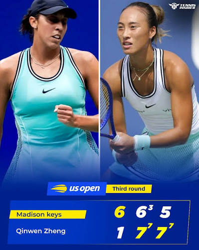
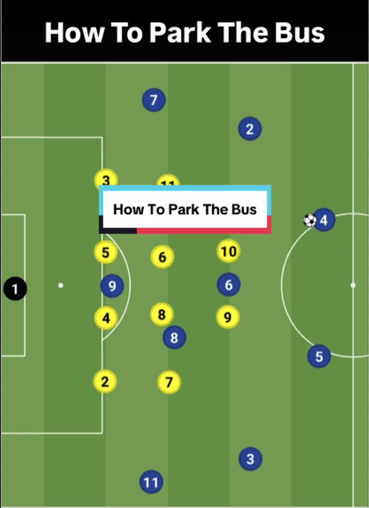
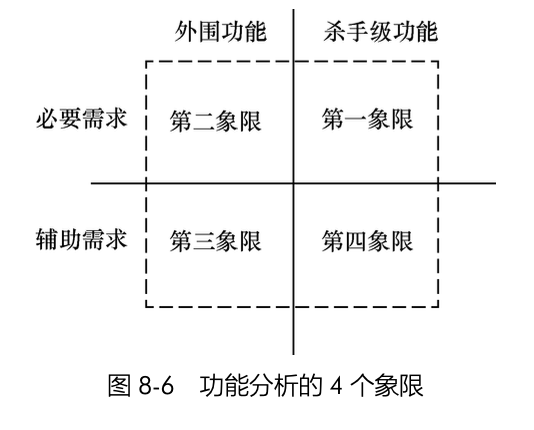
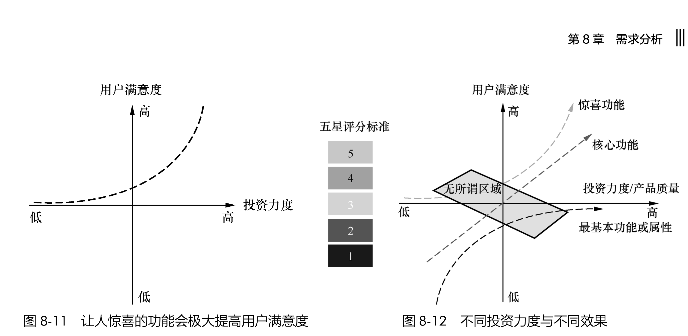

# 从体育比赛的类型看竞争策略

## 一、时间和胜利的关系

2026 年 9 月 5 日，在美国网球公开赛中，郑钦文在决胜盘 0-5 落后的绝境下，连扳七局，以 7-5 逆转赢下整场比赛。   

5-0 领先的局面居然也能输？这让人联想到足球：在足球比赛中，如果一支球队两球以上领先，它通常会慢吞吞地倒脚、全线退守、主动放弃控球权。即使场面狼狈不堪，也无所谓。因为时间站在它这边 —— 只要比赛时间耗尽，终场哨声一响，比分就是定局。落后方的场面优势如果没有转化成进球，那就只是徒劳地消耗了时间，反而对领先者有利。

网球和足球在“能否靠拖延时间获胜”这件事上，有着本质的区别。

安德烈·阿加西（Andre Agassi）在自传《Open》（《网球人生》）中，道出了网球这项运动残酷与迷人的本质：

> *“网球借用了生活的词汇，这绝非偶然：优势、发球、失误、破发、零分（love）…… 因为每场比赛都是微缩的人生。几分（point）组成一局（game），几局组成一盘（set），几盘组成一场比赛（match），像俄罗斯套娃一样环环相扣。一切都是那么紧凑，那么不可抗拒。**然而，你无法耗尽时间。这里根本没有时钟（And yet, you can’t run out the clock. There’s no clock）。只要你还在呼吸，你就还有机会。直到最后一分落地前，你随时可以翻盘。**”*

“你无法耗尽时间（You can't run out the clock）”，是这两类竞技规则的核心分水岭。在美式体育语境中，"run out the clock" 指的是领先方通过消极倒脚、拖延节奏来耗光计时器以锁定胜局。最近还有 “摆大巴 park the bus” 的说法： 

足球比赛可以耗尽时间而惨胜，但网球不行。哪怕局分 5-0 领先，下一局依然是从零（love-all）重新开打。

**更残酷的是，5-0 往往是网球场上最危险的时刻。** 竞技体育里有一个专门的名词叫“Choking”（窒息、手紧）：当胜利触手可及，巨大的想赢怕输感会像一只无形的手掐住选手的脖子 —— 喉头紧缩、呼吸发紧，原本千锤百炼、化为本能的基本动作，瞬间僵硬变形。选手不敢主动变线，动作缩手缩脚，满脑子想的都是 “我只要不失误、等对手送分就行”。而 0-5 落后的对手退无可退，反而能彻底放开手脚、招招搏命。

在很多大公司内部，这种心态被演绎得淋漓尽致：很多中层管理人员，虽然口号喊的都是“创新”、“再出发”、 “变局求发展”，但内心的真实情感早已变成了在公司里“耗时间” —— 只要现有业务还能跑，就这样维持着，直到自己调岗或者退休。这种“想保住现状” 的防守心态，不仅无法把存量转化为下一局的胜势，反而是自废武功的开始。在一些足球比赛里这么做或许管用（虽然场面难看、被球迷狂嘘），但在网球场上，这种心态往往会导致翻车。**当一个团队里充斥着这种消极防守的心态时，它就已经彻底不适合打网球了。**

## 二、单次失误的代价
足球与网球还有一个极易被忽视、关于“风险承受力”与“丢分心理”的根本差异。

在足球中，被对手进一球是一笔“不可逆的全局债务”。在 90 分钟倒计时的压迫下，丢掉一球意味着追平的概率直接骤降，防守者必然被无限放大的“损失厌恶（Loss Aversion）”所统治 —— 宁可牺牲全场控球、场面难看到被全场狂嘘，也绝不能犯错丢球。这种心理映射到大企业管理层，就是层层审批、反复论证与过度合规，因为谁也承担不起 “丢球了” 的连带责任。

但在网球中，丢分 （lose a point）却是一次“边际成本严格封顶的单次试错”。

网球的一局无论是毫无还手之力地迅速丢掉，还是经过多次平分（Deuce）的长时间鏖战后惜败，在计分板上都只记为“丢了一局” 。

2024 年 6 月，网球天王罗杰·费德勒（Roger Federer）在达特茅斯学院的毕业典礼演讲中，披露他的职业生涯统计数据，让人意外：

> “在网球这项运动中，完美是不可能的。在我职业生涯参加的 1526 场单打比赛中，我赢下了将近 80% 的比赛。但是，在这些比赛中我打下的所有单独得分（points）里，我赢下的比例是多少？**仅仅只有 54%。** 当你打每一分时，它必须是世界上最重要的事；但当这一分结束之后，它就彻底过去了。这种心态至关重要，因为它能让你带着同样的强度、清醒和专注，全身心投入下一分。”

即使是史上最伟大的网球手，面对全球顶尖对手，平均每 100 个球里也要输掉 46 个。网球的真谛从来不是“不丢分”，而是建立起强大的机制与心理熔断 —— 他从不沉湎于丢分的懊恼，而是把 54% 的得分优势，精准兑现在关键的破发点、局点和抢七盘上，最终赢得了职业生涯近 80% 的比赛胜率。

这种计分机制上的根本分歧，直接催生了两种截然相反的决策与心理模式：

### 1. 局部解耦 vs. 全局杠杆：为什么大厂制度杀死了“网球手”

企业面对创新业务之所以迟疑变形，本质在于“用管理足球失误的考核制度，去指导一场网球比赛”。

许多制度完善的大企业的 KPI 体系往往把每一次“丢分”（一次功能上线指标未达标、一次灰度测试数据下滑）都定性为“重大事故”，必须拉齐团队层层复盘、问责到底，甚至直接影响组织年终考核。当制度把每一次“单点丢分”都绑架成个人职业生涯的全局污点时，中层管理者的最优策略必然不是去前场截击打出制胜分，而是彻底放弃进攻、在后场安全区无限倒脚“耗时间”。

### 2. 丢分过程的无偏性 vs. 形式主义的“合规自欺”

正因为大厂制度极度厌恶丢分，中层往往会演化出一种防御性的自欺游戏：**把丢分的过程包装得极其体面。**

一个方向哪怕明眼人都知道走不通，但只要动用了上百人的正规军，写了数百页逻辑严密的 PPT，开了几十场跨部门架构评审，严格通过了法务、合规与安全的层层审核 —— 那么即便项目最终被市场无情淘汰（丢了一局），参与者依然能在述职报告里宣称“我们沉淀了中台能力、锻炼了骨干队伍、规避了系统性风险”。

团队把所有心力都耗费在让“丢分的姿势显得合规漂亮”上，却忘了真实市场的计分板从来不看你的过程多优雅：用户不会因为你的架构符合大厂规范而停留，只要产品不能切中痛点，计分板上记录的永远是刺眼的“0”。

### 3. 沉没成本与情绪反刍：顶级选手的“短时失忆”能力

网球场上顶尖选手的胜负手，在于能否建立费德勒所说的那种“短时失忆能力”（Next-Point Mentality）。

业余选手的死穴，在于带着上一分的心理包袱打下一分 —— 一旦双误丢局，脑子里不断反刍刚才失误的懊恼，导致动作愈发紧绷僵硬，迅速滑向溃败；而郑钦文在 0-5 绝境下之所以能连扳七局，核心就在于她彻底放下了前五局的沉没成本。前面输就输了，眼前的每一分都是全新的机会。

初创公司（如 Cursor、Claude Code 等轻量团队）之所以能在巨头环伺下切出缺口，恰恰占据了这种“网球心态”的生态位：它们在旧体系里一无所有，没有品牌包袱，没有存量利润需要护盘，前面的单点失误成本几乎为零，因而每一拍都敢变线搏杀。相反，手握几十年垄断红利的巨头，往往在巨大的情绪内耗与存量包袱中步履蹒跚，最终在想赢怕输的犹豫中，把大好局势拱手让人。

## 三、哪些优势能“保”，哪些不能？

理解了这两种心态之后，下一个问题是：在IT行业里，哪些优势确实值得"保"，哪些优势其实根本保不住？在 IT 和科技行业，很多团队误以为只要赢下了一轮竞争，后面的日子就可以靠“手紧的防守”混过去。

* **能“保”的优势**：通常是那些极度沉重的物理硬约束。比如写进银行底层的业务账本、覆盖全国的通信基站、跟超大企业签下的多年采购协议。这些资产迁移成本极高，对手短期内很难通过单点创新撬动。在这里，时间确实是领先者的朋友，存量优势可以支撑你很久。
* **保不住的优势**：一旦战场转移到新的技术范式或具体的产品体验上，前面的所有比分全部作废。历史市场份额、品牌光环、在旧体系里建立的权威，在新交互或新架构面前，根本无法折算成下一分。

最致命的错误，是把“保不住的优势”当成了“能耗时间的护城河”，带着“千万别犯错、平稳熬到退休”的心态去全新的赛道参加竞争。 

## 四、现实中的真实代价

IT 行业有各式各样的竞争，精彩程度不亚于体育赛场。 

 **IBM：守住了旧地盘，但场地在缩小**

IBM 的大型主机和遗留系统，客户确实迁不走，这笔生意也确实被它成功保到了今天。但当计算范式转向公有云时，IBM 在企业 IT 领域的号召力并没有顺延到新赛场上。它守住了那些“走不掉”的老客户，但在新的云原生和 AI 竞技场上，它没有打出任何决定性的制胜分，最终退化成了一个蜷缩在角落里的服务商。

**微软：手握海量血条，也得一拍一拍死磕**

微软在 PC 和 Office 上的垄断，本质上就是典型的“足球存量”。这给它带来了近乎无限的现金流，让它有资本在 AI 赛场上疯狂下注。但即便拥有如此庞大的企业客户绑定，当它把 Copilot 推向市场时，面对 Cursor、Claude Code、Codex 等轻量级对手的挑战，它依然发现：企业不会因为买了 Windows 就天然觉得你的 AI 工具最好用。手握足球现金流只能保证你“输得起、不破产”，但真到了产品体验的网球场上，依然容不得半点想赢怕输的保守。

**谷歌：5-0 领先者的经典“Choking”现场**

谷歌的 AI 业务是这套心理机制最典型的牺牲品。它发明了 Transformer，坐拥顶尖实验室、海量数据和 TPU 算力。在很长一段时间里，它的技术储备就是那个“5-0”的绝对领先者。但正因为背着搜索广告的高额利润，背着不可犯错的合规包袱，管理层的心态彻底变成了“千万别冲击现有现金牛、方案必须十全十美再出手”。这种极端保守让它迟疑不决，硬生生把发球权让给了光脚狂奔的 OpenAI。等到猛然惊醒时，先发优势已经被蚕食殆尽，顶尖人才批量出走。

## 五、对软件工程"需求分析"的启发
### 1. 区别对待不同象限
把这个视角拉回到软件工程，**需求分析的第一件事，不是急着列功能清单，而是先看我们手里的这个需求：到底是在帮用户守住一个"足球比赛的胜利"，还是在替用户抢下下一局"网球的胜利"？**

面对白板上密密麻麻的需求，团队到底凭什么判断哪个是足球、哪个是网球？在《构建之法 —— 现代软件工程》第八章中，对"功能分析四象限"有详细分析：

> * 杀手级（Core）功能 vs. 外围（Context）功能
> * 必要（Mission Critical）需求 vs. 辅助（Enabling）需求  

把这个工具与两类比赛逻辑对照，能帮团队立刻看清战场：

* **外围必要需求（Context × Mission Critical）就是你的"足球场"**
比如单词软件的释义准确性、多平台运行、数据强一致性与合规审计。不满足这些，产品根本无法进入用户视野；但就算做到了 99 分，用户也不会专门夸你。这是典型的"防守型存量"，对应的策略是"维持与抵消" —— 以最低成本达到"足够好"、和对手差不多即可。很多失败的团队往往在这些外围功能上过度工程化，像踢足球一样来回倒脚，把打网球的精力和预算耗得一干二净。

* **杀手级核心功能（Core）就是你的"网球制胜分"**
无论是划时代的屏幕取词、独家权威词典，还是全新范式下的 AI 交互切口，用户之所以选择你而不是竞品，全靠这一两个能比别人好 10 倍的杀手级功能。**在这个象限里，比赛永远是从 0-0 开始的网球赛。**

### 2. 允许丢分，快速失败，学到教训，继续战斗
费德勒 54% 的职业生涯得分率揭示了一个反直觉的真相：**顶级选手并不追求"每一分都赢"，而是接受接近一半的丢分率，把精力集中在 "必须赢的分"上面。** 这个策略，恰恰为四象限中的"杀手级核心功能"提供了精准的落地指南。

**第一，接受"辅助需求"的丢分，把测试资源聚焦在"致命失误"上。**

许多大团队的需求评审流程，要求每一个功能模块的测试覆盖率都达到95%以上。这在足球思维里是"防守无死角"，但在网球思维里，等于要求费德勒去练习"如何接好每一个发球"——浪费了本该用来打磨制胜拍的时间。

正确的做法是：对"外围必要需求"采用"足够好"策略（覆盖90%的常见场景即可），容忍边界情况下的丢分；但**对"杀手级核心功能"采用"零容忍"策略**——任何会导致核心体验崩坏的Bug，都必须像网球中的破发点一样被严肃对待。因为丢一个外围分不影响全局，但丢一个核心分就等于被破发。

**第二，放弃"完胜幻想"，用MVP策略替代"全功能首发"。**

足球思维的需求分析，倾向于 "等到所有功能都完备再一起发布"，因为这看起来最安全、最不容易丢分。但网球思维告诉你：**你不需要赢下每一分，你只需要在关键分上打穿对手。**

MVP（最小可行产品）策略的底层逻辑，就是主动放弃那些"不那么重要的分"——把一半的功能砍掉、把另一半做到60分，但把那个唯一的核心场景做到 120 分， 让用户惊喜。这正是费德勒 "54% 得分率撬动 80% 胜率"的策略在产品层面的翻版：在无关紧要的拉锯分上保持及格线，但在破发点上倾尽全力。

**第三，用"短时失忆"对抗需求蔓延。**

大团队的需求分析，往往陷入一种"存量包袱"的恶性循环：产品已经发布了十多个版本，积累了五百个历史需求。每一次新版本规划时，团队的第一反应不是"用户现在最需要什么"，而是"如何兼容这五百个旧功能、不破坏老用户的习惯"。

这就是费德勒所说的 "带着上一分的心理包袱打下一分" —— 上一局的功能无论如何已经发布出去了，沉没成本就是沉没成本。真正健康的网球心态是：**每一次版本迭代，都从0-0开始重新评估用户此刻最核心的痛点。** 旧功能只要能运行就维持现状，不要为了"保住历史得分"而让新功能的动作变形。

这正印证了《构建之法》同一章提到的 Kano 模型的残酷法则：过度投资基本功能只是在足球场上强调防守，做到极致也只能换来 “平局”；真正拉开身位的，永远是那些哪怕偶有瑕疵、但在核心场景上一拍定乾坤的 ”网球制胜分功能“。 

正如《构建之法》第八章所强调的：**只有结合具体的用户场景，讨论功能的强弱才有意义。** 在需求分析阶段，团队必须清晰划分出两个战场的打法：对外围必要功能克制做减法，用成熟手段快速"封顶保盘"；而在最核心的用户场景切口上，坚决克服"想赢怕输"的保守心理，允许局部失忆，默认从 0-0 开始，集中所有资源砸出压倒性的差异化体验。

链接：https://gitee.com/zouxin2025/ASE/blob/master/chapter08/readme.md

## 六、放下包袱，把每一次当全新机会来拼

在没有时钟的比赛里，最大的敌人往往不是对手，而是自己领先时的保守心态。

* **对于领先者**：不要以为前几局赢了，后面就可以靠求稳、靠流程合规、靠拖延时间把优势保住。在新机会出现时，你过去的积累只代表你底气更足、输得起几次，并不代表你在新产品上能自动得分。如果满脑子是“保住现有地盘，别出差错”，你就是那个在 5-0 领先时挥拍发僵、最终被大逆转的选手。
* **对于追赶者**：也不用被巨头庞大的身躯吓退。哪怕落后 5 局，只要比赛还没结束，巨头往往背负着沉重的自保包袱。它的代码比你沉重，它的流程比你缓慢，它的决策者更害怕犯错。在全新的产品切口上，大家面对的依然是一个平局。

正如阿加西所说，这里根本没有 “耗完时间就好了”。只要还在场上，就没有所谓的垃圾时间。真正有战斗力的团队，能守住底盘，但更敢于在每一次技术转向或新产品立项时，彻底放下历史包袱 —— 不管前面是领先还是落后，都聚焦于眼前的这一分，全力以赴拼下来。

网球思维的本质，不是鼓励鲁莽，而是把"丢分"从"事故"重新定义为"成本"。事故需要追责，成本只需要计入预算。当你把试错、迭代、局部失败都算作 "打赢网球的必要成本"时，团队才能真正从"怕丢分"的防守心态中解放出来，把精力集中在那些真正值得赢下的关键分上。
