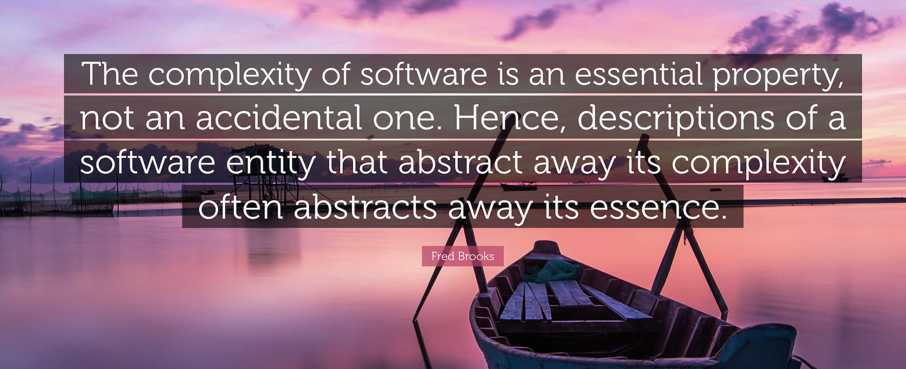
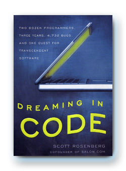

# 软件工程的终极目的：创造一个没有冲突的乌托邦吗？

> *本文与下列文章一起构成了《构建之法 · 软件复杂性的交响曲》*

[1. 软件的分形，比英国海岸线还要复杂？](https://mp.weixin.qq.com/s/ie1lvOmT366AEdhAk5bzIQ)  
[2. 软件的抽象，是银弹？](https://mp.weixin.qq.com/s/2kQT3yo8OAPwMPGxhFy9pA)  
[3. AI 自动写代码，是银弹？](https://mp.weixin.qq.com/s/SvzD7groV4LT33wpqoMV0g)  
[4. 软件需求的复杂度，是分形还是兔子洞？](https://mp.weixin.qq.com/s/jkkSJ7DNgRrX5fGzKdG1pQ)

## 引子：白领之梦与绞刑架

凌晨三点，超算中心的会议室。

1MB 内存溢出的根源刚刚被定位，第三方库降级回滚，监控大屏上的红线终于恢复平稳。果冻趴在桌上，睡着了好一会。他揉了揉布满血丝的眼睛，抬起头，声音有些沙哑：

“超哥，我刚才做梦，回到几年前软件学院的招生大会上。院长站在台上说，我们要培养‘软件的白领和金领’ —— 大家在空调房里用鼠标拖控件、团队用各种高级协同工具融洽交流、随着产品不断发布而升职加薪。我当时真信了，和台下很多高中生一起发出了欢呼。可现在呢？空调房是真的，拖控件也是真的，可是忽然线上的程序炸了，我们得半夜从二进制日志里徒手抓住那只 bug。融洽交流？下午跟运维吵得差点掀桌子，明天还要去和客户道歉。”

阿超正靠在墙上，脑袋贴墙，手臂缓缓移动，好像在做某种舒缓肩颈肌肉的健身操。听到这话，他转身坐了下来，拧开保温杯，往里面倒入二两枸杞，三勺咖啡：“果冻，你让我想起一个故事。”

> 两个劫匪逃命途中路过绞刑架。劫匪张三看着绞刑架叹气：‘要是没有这东西就好了，我们的职业该多么安全。’劫匪李四白了他一眼：‘别做梦了。如果这行毫无风险，做的人一定特别多，你我连入行都找不到门路。’

会议室安静了两秒。小飞一拍桌子，把阿超的保温杯弹起五厘米：“绝了。劫匪李总才是明白人啊！”

阿超扶着保温杯说：“软件工程里的‘绞刑架’ —— 死锁、依赖冲突、需求变更、凌晨三点的崩溃、被客户骂 —— 不是要消灭的敌人。它们是行业门槛本身。你刚才想到了院长的招生宣讲，其实你发现了：**院长当年卖给你们这些高中生的，本质上就是一个精心包装的乌托邦白日梦。**  这白日梦有点像 《张三的歌》。”

“乌托邦？”果冻重复了一遍。

“对，”阿超点点头，“人类天生渴望确定性，害怕摩擦。院长隐瞒了软件工程中所有残酷的、动态的、由于软件本质引发的摩擦，把这个行业粉饰成一个和谐、融洽、按部就班的白领流水线。但他们忘了，**工程中的冲突，本质上是物理世界映射在系统里的‘反馈信号’。** 死锁是并发逻辑错误的信号，吵架是需求边界不清的信号。在充满不确定性的世界里，**真实的信号是极其可贵的信息。** 没有冲突的完美世界，不仅不存在，而且极其危险——因为那意味着你彻底丢失了信号回路，成了盲人骑瞎马。这匹马如果还有 AI 幻觉的帮助，那就又拉风又危险。”

阿超叹了口气：“用一个完美的乌托邦去引诱年轻人，这可不是院长的原创。人类历史上最聪明的脑瓜，曾经尝试过打包票消灭所有冲突，去建造一个完美的社区。结果呢？他们连同信号一起消灭了。”

## 一、欧文的悖论：消灭冲突，就是消灭信号

1825年，英国实业家罗伯特·欧文在美国印第安纳州买下一座小镇，投入15万美元，命名为“新和谐村”。他带着和那位软件学院院长同样的自信宣布：只要消灭私有制、实行平均分配，就能消灭人类社会的一切竞争与冲突，建立一个和谐完美的无摩擦社会。

然而，这场试图消灭冲突的乌托邦实验，仅仅两年就彻底崩溃。如果用工程视角去复盘，“新和谐村”的致命问题恰恰在于：**为了消灭冲突，它人为地掐断了系统生存所必需的反馈信号。**

**一、“搭便车”问题（贡献信号被抹杀）。** 实行平均分配后，最努力干活的人发现，系统不再向他反馈积极的信号（没有超额回报），反而是自己的汗水在养活别人。于是勤劳者开始躺平。系统失去了关于 “谁在贡献、贡献多少” 的真实信号，激励机制归零，产量断崖式下跌。

**二、产权不清（责任信号被稀释）。** 所有房屋和公共资产归“全体共有”。在看似没有利益冲突的背后，是反馈回路的断裂：没有一个人能收到 “这个广场该我维护” 的明确信息。系统丢失了关于 “谁来负责” 的信号，形成了“公地的悲剧”。

**三、无休止开会（用纸面控制屏蔽行动信号）。** 欧文为了在不产生冲突的前提下解决纠纷，在两年内连写了七部不同的“小镇宪法”。很多人不断开会，试图通过永无止境的讨论去穷尽所有细节、说服所有人。然而，没有时间盒（time box），没有决策裁决，没有“先走一步试试看”的勇气。他们用无休止的 “纸面进展” 来代替 “行动反馈”，纸面的成功在现实面前不堪一击。

实验失败后，欧文把原因归咎于居民——“他们还没准备好成为完美社会的成员”。翻译过来就是：**我的体制完美无缺，全怪这届人民不行。**

这种用“体制的完美幻想”去掩盖“反馈信号断裂”的做法，和果冻梦里院长的忽悠一模一样。当庸俗的管理试图通过控制流程来创造一个“没有冲突、一切尽在掌控”的研发乌托邦时，新和谐村的悲剧就会在软件工程里精准重演。

## 二、三种复杂度，三类冲突

软件团队在研发周期中所遭遇的冲突，本质上是不同层面的复杂度信号在向外溢出。Fred Brooks 在《人月神话》中将软件复杂度分为两类，我们结合组织管理细分出第三类（琐碎复杂度）。每一类复杂度发出的信号，都需要不同的管理策略：

**本质复杂度**来自问题域本身——电商的库存扣减、并发下单、跨境税务；支付系统必须保证每一分钱不差。这些逻辑本身就复杂，无法被任何工具或流程消除。正如弗雷德·布鲁克斯在《人月神话》中所断言：“软件的复杂性是一个本质属性，而非偶然属性；因此，如果一个软件实体的描述抽象掉了其复杂性，往往也就抽象掉了它的本质。”

它所对应的冲突，是需求评审时产品说“改一个字段”而开发说“这要动整个订单状态机”，是架构评审时有人坚持 TCC（Try-Confirm-Cancel），有人坚持基于消息队列的最终一致性，还有人在强调：“不管选哪种方案，每个写操作的接口都必须设计为幂等（Idempotent）——否则网络超时导致的自动重试，就会产生重复订单、重复扣款。”

这种冲突发出的信号是：**技术方案与复杂业务的冲突。** 这种信号无法靠换框架或工具来回避，因为它本质上是业务内在的。

**偶然复杂度**来自工具、语言、框架和环境——编译环境不一致、npm 依赖爆炸、Docker 镜像拉不下来。它所对应的冲突，是“我这机器能跑你那不行”，是第三方库自动更新后底层环形缓冲区在 1MB 的数组边界出错。**这种冲突发出的信号是工程基建的粗糙。** 这种冲突可以被消除——用 CI/CD 标准化、用依赖锁定、用自动化测试，让信号在进入生产前被自动化拦截。

**琐碎复杂度**来自组织科层制和人类社会属性——采购流程、合同谈判、跨部门协调、预算审批、部门墙。它所对应的冲突，是法务要审核开源协议、采购要招标三个月、销售答应了一个不在研发路线图上的功能。

组织形式不仅制造了琐碎复杂度，它还会直接决定产品的形态。这就是康威定律（Conway's Law）所说的——**系统设计的结构，会镜像出设计该系统的组织的沟通结构。** 如果你的团队分成前端组、后端组、数据库组，你最终得到的软件架构，就会是前端代码、后端代码、数据库脚本的分离。你以为是架构师在做技术决策，实际上有很多决策是组织流程（琐碎复杂度）在替你做。而好的管理者会意识到这一点，并且主动设计组织结构和流程，让它们为产品形态服务，最大限度减少内耗摩擦对工程师的影响。

## 三、控制的幻觉：庸俗管理如何吞噬认知带宽

当琐碎复杂度遇上庸俗管理，就会演变成一场以“降本增效”为名的生产力灾难。

许多大公司都经历过这样的事：以前每层楼都有文具和常用耗材自取柜，后来为了“防止流失”，改为集中管理——领一个鼠标要坐电梯去指定楼层，填表，审批。行政部门的算盘是“物料损耗降低了”，但没人计算过：年薪百万的工程师、研究员中断思考、切换上下文、排队填表的时间成本，是那文具、鼠标价格的多少倍？

另一种常见场景：工程师申请两块高分辨率显示器，为了能有效分割代码、日志、监控、文档，和无数的工作聊天弹窗。后勤心想：“双屏是福利和地位的象征。副总裁桌上的两个显示器也不常用，工程师凭什么？”

这两类管理有着相同的荒谬内核：**用极其昂贵的人才带宽，去对冲极其廉价的物料损耗。** 当高水平人才的思维心流被随意打断时，他们白天只能应付各种紧急但不重要的琐事，等到夜深人静后才能开始重要工作。

更深的病灶在于：这些制度背后隐藏着对员工的不信任。当一个组织用“防止你占几块钱便宜”的逻辑来管理工程师时，它实际上在传递一个信号 —— “我们不信任你的判断，不尊重你的专业需求。”这种“情绪税”是无形的，但它的成本比任何物料损耗都高。它侵蚀的是工程师的归属感和主动性。

**好的管理，是把琐碎复杂度“社会化”。** 文具和耗材应该像空气和水一样随手可得；双屏应该像键盘鼠标一样成为开发岗标配，我们衡量产品在市场的表现，不比较一个人是用两把铲子还是三把铲子干活。 这要求管理者的决策和文化建设要靠谱才行。

## 四、有充分成功条件的项目：当资金和自信掩盖信号

2002年，著名软件 Lotus 1-2-3 的缔造者卡普尔创立开源应用基金会，招募顶尖程序员，投入数百万美元，目标打造革命性的个人信息管理工具——Chandler。结果：花了6年、800万美元，只交出迟迟无法完成的产品，2009年宣告失败。

失败不是因为没有钱、没有人。恰恰相反——**过多的资金和过强的自信，掩盖了所有本应听见的信号。**

**决策机制瘫痪。** 卡普尔试图以“民主”方式运营团队，所有重大决策都要达成共识。一个关于底层数据存储的技术选型，团队争论了近两年才决定。

**愿景虚无。** Chandler 要做“革命性的”“改变世界的”——但“革命性”具体是什么？没人说得清。需求无限膨胀，范围不断蔓延。

**无视硬信号。** 进度严重滞后时，他们选择增加人手，完美印证布鲁克斯法则：向延误的项目加人，只会让它更延误。

**可完成的信号被彻底淹没。** “我们有钱、有牛人”掩盖了“决策已瘫痪”；“我们要改变世界”掩盖了“需求是团迷雾”；“再招人就能赶上”掩盖了“管理已失控”这样的信号。

Linus Torvalds 这样评论这个雄心勃勃的项目：“别指望在短时间内达到大成就……如果一早就妄想做个大东西，可能现在还没动手呢。”

## 五、项目越大，信号来得越晚

**为什么大项目让“可行性信号”来得太晚？**

**起步成本吞噬验证周期。** 做一个 ”待办App” 的应用，花2天写代码，第3天就能收到反馈。做 Chandler 那样的底层平台，要先花2年搭框架。等收到“方向错了”的信号时，那2年的所有代码全部报废。

**沉没成本扭曲信号解读。** 做了几个月、投入几十万之后，如果收到“用户似乎不需要这个功能”的信号——大脑会启动防御：“不，一定是没做够。”信号被无视，项目继续推进直到崩盘。

**集成时刻即审判日。** 各模块闭门开发，3年后第一次集成——系统跑不起来、巨慢、有死锁。信号终于来了，但离项目启动已过去1000多天，足以杀死整个项目。

## 六、迟到的反面：用“研究”表演“掌控”

一些项目走向另一个极端——试图在动手前了解所有细节、确认所有信号。这同样致命。

管理者花大量时间开会、写文档、画原型。**这种行为的本质，是用纸面上的掌控感来表演“一切尽在掌控”。**

“行动”带来风险，“研究”带来安全。只要不开工，就永远不会有“失败”这个结果。他们试图穷尽细节，就像试图丈量英国海岸线的精确长度——尺子越小，曲折越多，永不收敛。

**这是一种主动消灭信号的行为。** 真正的信号来自代码跑起来、用户用起来、系统崩溃又被修复。而纸面上的文档和漫长的会议，只是“已知的已知”。

更深层的问题在于：这种“用流程控制一切”的管理方式，本质上是在用**自上而下的压制**替代**自下而上的涌现**。真正有价值的创新想法，很少诞生于精心设计的流程中，而是在动手探索、试错、碰撞中意外涌现的。当管理者试图用流程穷尽所有可能性时，他们同时也扼杀了那些无法被预先规划的新想法涌现的空间——这是比效率损失更致命的隐性冲突。

## 七、纸面掌控感 vs. 涌现与心流

由此可以看出，软件团队中存在着一种比显示器之争更深层、更隐性的冲突：

**组织的“控制欲”与工程师“心流”之间的冲突。**

当组织试图用流程、审批、规则来“掌控”一切时，它实际上在消灭两样东西：

**一是心流。** 工程师需要大块不被打断的时间来构建复杂的思维模型。每一次被拉去开会、每一次为了一支笔去填表、每一次解释“为什么要双屏”——都是对心流的打断。重新进入心流状态，平均需要15到20分钟。一天被打断几次，整个下午就废了。

**二是涌现。** 真正的创新很少来自顶层设计。它来自工程师在动手过程中偶然发现的新可能——这段代码可以复用、这个方案可以换个用法、用户其实需要的是另一种东西。幕后英雄很少从PPT里走出来。但当组织用“提前穷尽所有细节”来管控项目时，这些“意料之外的发现”就没有生存空间了。你把路铺得太平整，路边的野花就不会长出来。

**这种隐性冲突，不体现在明面的争吵上，而是体现在高水平人才的集体沉默中。** 他们不再提建议，不再争取资源，不再试图做任何“流程之外”的事。他们只是按时完成任务，然后下班。组织看起来井然有序，但创造力已经死了。

**好的管理，不是靠流程来压制不确定性，而是为“涌现”留出空间。** 这意味着：给工程师大块不被打断的时间；容忍计划外的探索和尝试；把流程定位为“防护网”而非“紧身衣”——防止系统崩溃，但不规定每一步怎么走。

回看历史，把 1825 年新和谐村的三个核心问题和现代软件团队的困境并排放置，会发现惊人的同构：

| 新和谐村 | 软件团队对应症状 | 研发反馈视角下的本质 |
| :--- | :--- | :--- |
| **搭便车问题** | “大锅饭”绩效，技术债无人认领 | **贡献模糊**：缺乏个体反馈，导致负向激励与心流消散 |
| **产权不清** | 公共代码库无人维护，基础设施围墙高筑 | **责任稀释**：为了局部控制，宁可阻断整体心流 |
| **无休止开会** | 架构评审变空谈，一行代码未写 | **控制的幻觉**：用纸面掌控感压制自下而上的涌现 |

当企业越成功，就越迷信流程，从“做对的事”转向“把事做对”。这种用“控制流程”粉饰的纸面掌控感，与“心流的形成、想法的涌现”构成了深层的内耗。它不体现在明面的争吵上，而是体现在高水平人才的躺平与生产率的缓慢下降中。

## 八、破局：基于“不可知论”的短周期反馈

> *“如果你不为你的第一版产品感到难为情，那你的发布就太晚了。”*
> —— 里德·霍夫曼（LinkedIn 联合创始人）

研发信号的“保质期”极短。克里斯坦森在《创新者的窘境》中提出，面对不确定性，唯一的策略是“不可知论”**——发布一个东西，让市场告诉你答案。因为**发布前，信号不存在；发布后，真实的信号才被生产出来。

霍夫曼这句名言，是对“乌托邦完美主义” 的精准批驳。如果你等到产品完美无缺才发布，只有两种可能：要么你花了太久时间，久到市场已经变了，信号早已过期；要么你根本没面对真实用户，只是在实验室里自己跟自己玩纸面游戏。

难为情才是正常的，因为它意味着你的系统刚刚把第一根触角探向真实世界，开始接收校准信号。

但这不等于“盲目乱试”。软件工程必须引入 **Spike + Walking Skeleton（步行骨架）** 的组合策略，在研发的最早期，主动逼出系统的硬核信号：

* **第一阶段：用 Spike 榨取“技术生死信号”。** 花 2-3 天写一次性代码，不考虑任何架构优雅与代码质量，专门验证核心技术方案在底层是否根本不可行。这是在项目初期，用极低成本向技术深水区索要“生/死”信号。拿到信号，就可以扔掉代码。
* **第二阶段：用 Walking Skeleton 锁定“端到端集成信号”。** 用最快速度，从 UI 到数据库，打通一条最窄的、能够真正运行的完整业务流程。先让它“走起来”——系统运转、数据流通过程中引发的端到端集成反馈，比纸面上讨论出的“完美方案”重要一百倍。
* **第三阶段：在演进中捕捉“次要重构信号”。** 一旦骨架走通，就有了现实参照物。所有的次要细节 —— 界面样式、字段命名、非核心配置参数 —— 在参照物上去调整、去优化、去捕获反馈。

**这并非现代软件工程的发明。** 1969 年之前，肯·汤普森和丹尼斯·里奇曾深度参与了著名的 **Multics 操作系统项目**。那个项目汇集了通用电气（GE）、贝尔实验室以及麻省理工学院（MIT）最顶尖的工程师与学者，试图在纸面上设计一个能满足所有人一切需求的完美多用户系统。结果，由于需求无休止蔓延，架构设计在无限的闭门会议中争论了数年，却由于迟迟无法发布而流产。

肯和丹尼斯在这个宏大的项目中尝够了苦头。于是，他们走向了反面。在一台性能极为简陋的闲置 PDP-7 机器上，他们抛弃了所有宏大蓝图（老板也没告诉），用最短的周期跑出了一个只有文件系统、进程调度和命令解释器的极粗糙内核——这就是 Unix 的第一版。让它先跑起来，在运行中暴露出哪里崩溃、哪里响应慢。**每一次崩溃都是宝贵的硬信号，每一次重构都是对信号的硬核回应。** 从 1969 年到 1971 年，他们写完就跑，跑通再改，连续经历了五个版本的颠覆性重构，才逐渐形成了那个影响了此后半个世纪的操作系统架构。

无论是当年的 Unix、编译器、操作系统，还是今天把写代码成本降到零的 AI 编程工具，它们都只是基础设施。**把“发布和运行”作为认知的起点，而不是终点，在泥泞中用短周期的硬信号校准方向。** 否则，你等待的时间，可能已经远远超过了信号的保质期。

## 九、早餐摊的思辨：黑盒的消费者，还是白盒的守护者？
走出超算公司大楼，三个人朝着街角正冒着热气的煎饼果子摊走去。清晨的冷空气让通宵后的脑袋清醒了不少。

“超哥，现在的 AI 编程工具把写代码、查文档、调配置这些‘偶然复杂度’全包圆了。”小飞双手插兜，眉头紧锁，“可我们天天用高级语言，把 gcc 编译器和 Unix/Linux 操作系统当成黑盒子，AI 就不能当成黑盒子吗？”

阿超在煎饼摊前站定，指了指正在摊煎饼的老板：“你们看这煎饼摊。老板舀一勺面糊、摊平、打鸡蛋。我们站在旁边，能观察到它运行的每一个工序——这是一个白盒系统。所以我们能根据即时信号反馈——‘多放点辣椒，不要葱花’。在这个系统里，运行状态是完全透明的。”

阿超话锋一转：“Linux 社区内部天天都在为了几行代码的修改吵得掀桌子。但为什么我们外部的消费者能安稳地把它当黑盒子？因为那个硬核社区充当了守门人，在底层把所有的技术冲突和信号充分暴露、校准了，不符合质量要求的产品绝对发布不出来。”

“但现在的 AI 编程工具不是现场摊的煎饼，它是工厂出来的‘预制菜’。如果一个 AI 告诉你没有任何技术冲突，三秒钟吐出新版本，连自己写的测试脚本也报告完美通过，这种连内部工序都不让你过问的黑盒子，你敢放心用吗？”

果冻打了个寒颤：“超哥，可现在的感觉真的很爽啊，写几句 Prompt，AI 就能很流畅地把活干完，这难道不是生产力的飞跃吗？”

“爽？这种流畅的爽感，三十年前人类就体验过一次了。”阿超冷笑了一声，“你们知道上世纪八九十年代风靡一时的 CASE（计算机辅助软件工程）工具运动吗？当时的技术巨头和招生院长，吹嘘的口号跟今天几乎一模一样——开发人员只需要在屏幕上画流程图、用鼠标拖拉控件、组合按钮，CASE 工具就能自动生成全部底层代码。当时那些只会拖拉控件的工程师，也觉得自己很爽，坐在空调房里动动鼠标就把软件做出来了。但结果呢？CASE 运动彻底失败了。那些只会拖拽按钮的工程师，最终没有为自己累积任何独特的行业价值。”

小飞一愣：“为什么？不是能自动生成代码吗？”

“因为拖拉控件和写 Prompt 一样，只解决了手写代码慢、排版容易错的**偶然复杂度**。”阿超递给小飞一个煎饼，“可一旦项目撞上**本质复杂度**——业务逻辑的深度缠绕、极端并发下的数据一致性博弈、不可避免的技术债腐烂——这种通过黑盒子交付的爽感就会瞬间变成毁灭性的灾难。当年的 CASE 工具自动生成的数万行底层代码，臃肿、死板且机械。一旦系统在高并发下出现诡异的内存泄露或死锁，那些只会拖拉控件的工程师直接抓瞎——他们丧失了‘白盒 Debug’的能力，看不懂机器释放的冲突信号，无法深入到底层去拆解和修复。随着维护成本呈指数级暴增，CASE 工具制造的完美幻觉彻底破灭，整个行业重新呼唤那些真正懂底层、能白盒调试的硬核工程师。”

“今天的 AI 编程，本质上就是一种获得了‘模糊推理能力’和‘自然语言接口’的超级 CASE 工具。它比 CASE 更危险 —— CASE 工具生成的代码虽然死板，但好歹是确定性的规则引擎；而今天的 AI 是概率模型，它会产生无法根除的幻觉。它吐出来的代码看起来比当年优雅、漂亮，甚至写满了极具迷惑性的正确注释。可在这层完美的预制菜外壳下，有一个更隐蔽的问题——**AI 会在内部自圆其说。** 这是大语言模型训练的核心特性决定的：它被训练成永远给出一个‘看起来合理’的答案，哪怕那个答案是错的。如果一段代码里有冲突，AI 不会像人类工程师那样停下来告诉你‘这里有矛盾，我需要澄清’，而是会**主动制造幻觉来让结果显得好看**——它会给你编一个看起来完整的解释，写一段跑得通的代码，甚至连测试用例都帮你写好，全部绿灯通过。”

“这就是 LLM 的‘自洽性陷阱’：它用自己的幻觉填补了所有的信号空白。在你面前的是一个完美无缺的报告，但底层的冲突从未被解决，它们只是被一层看起来合理的文本覆盖了。”

阿超放下煎饼，擦了擦手：

“你想想传统软件公司里，产品经理、开发、测试这三个角色之间的日常冲突——产品经理说‘这个功能很简单’，开发说‘这要动底层架构’，测试说‘你代码里还有 5 个严重的 Bug 没修’。每一方都在用自己的视角和数据去**反驳**另一方。开发要想说服测试‘这个功能可以上线’，他必须拿出测试报告、覆盖率数据、性能压测结果——**用证据去对抗怀疑**。这个过程充满了摩擦和争吵，但正是这种**结构性的对抗力**，让谎言和自欺欺人无处藏身。”

“可 AI 编程工具呢？**它既是编剧，又是演员，还是剧评人。** 它自己写代码，自己写测试，自己报告‘全部通过’。一个能自圆其说的系统，恰恰是最危险的系统——**因为它内部没有任何一个‘反对派’来戳破它的幻觉。** AI 把冲突信号覆盖了，把幻觉被包装成了真理。 有些 AI 工具还会输出情绪价值 -- 我稳稳地接住了你。”

阿超叹了口气：

“作为工程师，你当然可以享受工具给出的黑盒子结果（抽象），但你必须拥有‘白盒 Debug’的能力，以及对机器、软件、乃至现实世界各种信号的‘隐性知识’的积累与掌握。如果年轻一代真的信了忽悠，把 AI 当成完美无瑕的乌托邦，指望 AI 帮自己完成所有工作，从而放弃去收集、理解各种信号和冲突，那么他们不仅无法从真实 Bug 中获得磨砺，更会因为丧失了挖掘和理解信号的能力，被 AI 和其他工具彻底淘汰。”

## 十、终局的思考：在泥泞中不断迈出下一步

果冻回到宿舍，洗了把脸，对着 “待办 app“ 说了这些话：

> 我当年坐在招生大会台下，接过院长亲手递来的那张“白领乌托邦”门票，以为软件工程是一个没有冲突的美丽新世界。后来才明白，工程从来不是乌托邦。工程是在泥泞中走好下一步——走一步、踩实、看反馈、再走下一步。
>
> 幻想的乌托邦的幽灵还在每一家“成功过的软件公司”里游荡：大锅饭、无人维护的公共代码、无休止的方案讨论会。他和院长一样，试图消灭冲突，却连信号一起切断了。
>
> AI 工具屏蔽了旧摩擦，却带来了新风险，也对我们的隐性知识提出了更高要求。我们绝不能躺在“预制菜黑盒”里假装掌控一切。我们需要的是一个让反馈自由流动的白盒机制——贡献能看见，责任有人扛，会议有终点，信号有回路。但这个机制有个前提：我们永远等不到一条“完美大道”出现再出发。我们只有脚下的泥，和走好下一步的设施与勇气。
>
> 软件工程的明天，依然会有新的 Bug、新的争议、新的冲突。但这不是失败——**那些冲突，是系统还活着的呼吸声**，更是现实世界提醒我们：别人还需要我们提供白盒 Debug、摆平复杂度的独特价值。
>
> 软件工程，从来不是为了创造一个没有冲突的乌托邦。而是创造一个系统化的演进机制，让冲突有序发生、信号系统化地被捕获与处理，驱动整个团队与系统，向着未知的下一步快速演化。

>真正的软件工程，就是带着那一身凌晨三点的崩溃、无休止的依赖冲突和永远改不完的需求，像《张三的歌》里唱的那样——**在充满本质复杂度的真实世界里，去流浪（演进与探索）。**

>记得下午去和客户开会，为线上故障道歉。
