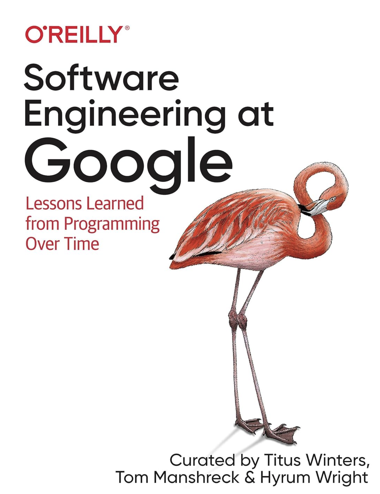
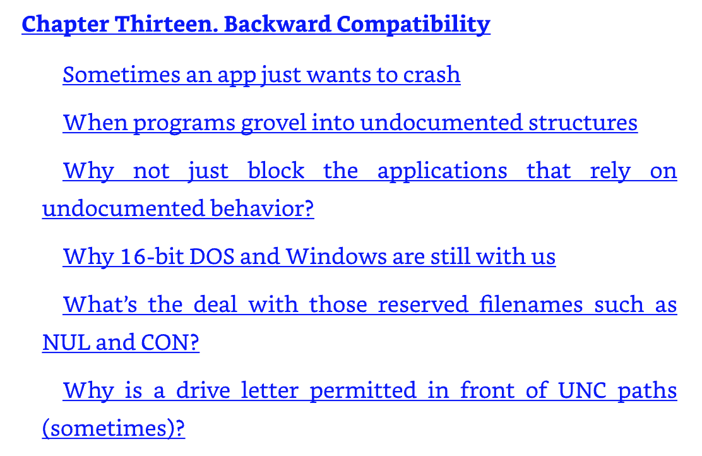
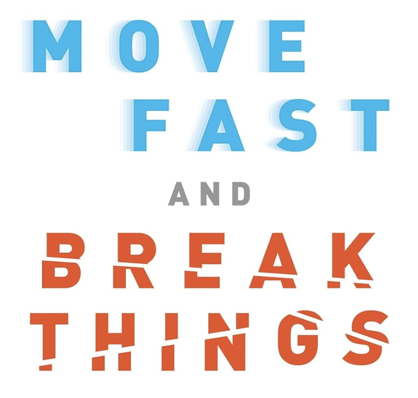

# 软件的本质挑战：Hyrum 定律与软件生态的分形

> **记住**：当你的 API 拥有了足够多的用户，代码就不再是你的代码了 —— 它是别人业务流程的一部分。不管公开的文档里写没写，软件的每一种可观察行为，都是客户生态的一部分，不能轻易改变。

## 引言：新版本给客户的"惊喜"

说个真事。我的团队以前开发了一个 Form Recognizer（智能表单）服务，客户传进来一张发票、单据或者表格的照片，我们拿 AI 模型识别出上面的各种语义字段，比如总价、签名、付款方信息，同时把这些字段在图片上的像素坐标也一并返回。老版本返回的坐标是基于原始图像坐标系的——图片要是侧着放的，坐标自然也是歪的，但我们就这么返回了。新版本自动把图片摆正，坐标也基于摆正后的图像重新计算，我们心想这回客户总该满意了吧。结果上线不到四十八小时，一个大客户就发紧急工单来了，说他们的发票流水线全崩了。一查才发现，客户基于我们上一版 API 的"不靠谱"行为，自己摸索写了一套脚本，处理了旧版本中的侧着放的图片，但在新版 API 中却崩溃了。

如果说 Form Recognizer 的"惊喜"还只是影响了几十个大客户，那软件史上还有更极端的例子——一个日期计算的错误，因为被上亿份电子表格（Excel）依赖，三十年来无人敢碰。这些案例背后有一条定律，来自 **Hyrum K. Wright**：

> **Hyrum 定律**：当你的 API 有了足够多的用户，你在契约里承诺什么都不重要，你的系统里所有能被观察到的行为，都会有人依赖它。
> *"With a sufficient number of users of an API, it does not matter what you promise in the contract: all observable behaviors of your system will be depended on by somebody."*

Hyrum K. Wright 曾在 Google 担任了十余年的资深软件工程师，也是《Software Engineering at Google》（O'Reilly, 2020）的合著者之一。在 Google 期间，他领导着自动化代码变更团队，是公司历史上对代码库做过最多个人修改的工程师。他提出这条定律，本质上是在 Google 维护那"几十亿行代码、几百万个依赖关系"的巨型系统时，对那种"牵一发而动全身"的痛苦最直接的总结。

## 一、软件的第一性原理与前三重分形

很多人喜欢套用伊隆·马斯克的"第一性原理"：既然抽象充满漏洞，为什么不直接打穿黑盒，回归底层写 C 语言甚至机器码？

这种想法忽略了物理世界与离散软件世界的本质不同。在物理世界里，连续介质力学是免费的运行环境——马斯克用钢板造火箭，钢板受力时分子间作用力会自动维持微观秩序，他不需要耗费脑力去控制每个铁原子的排列。但是在离散的软件世界里，CPU 是比特级的状态机，没有任何物理定律帮你做"微观平均化"。如果你抛弃抽象去写机器码，你将独自面对每秒几十亿次的离散状态跳变。

这就引出了**软件工程的第一性原理**：**软件工程的核心刚性约束，是人类大脑的认知带宽极限（Cognitive Capacity）。**

为了保护宝贵的大脑带宽，软件工程构建了一层又一层抽象。然而，就像曼德勃罗（B.B. Mandelbrot）发现测量英国海岸线不收敛一样，**软件的观察尺度不同，复杂度就会呈现出自相似的分形特性**。此前我们讨论过软件在**代码行间的逻辑分形**（需求拆解为模块、函数直至一行行代码）、在**编译构建时的依赖分形**（库与库之间的引用网络随着版本增长无限细分），以及在**硬件/网络层面的运行时物理分形**（并发竞态、超时重试在时间维度的无穷组合）。这些观点出现在下面的一系列文章中：

[软件的分形，比英国海岸线还要复杂？](https://mp.weixin.qq.com/s/ie1lvOmT366AEdhAk5bzIQ)  
[软件的抽象，是银弹？](https://mp.weixin.qq.com/s/2kQT3yo8OAPwMPGxhFy9pA)  
[软件需求的复杂度，是分形还是兔子洞？](https://mp.weixin.qq.com/s/jkkSJ7DNgRrX5fGzKdG1pQ)
[软件工程的第一性原理是什么？](https://mp.weixin.qq.com/s/SvzD7groV4LT33wpqoMV0g)  

前三重分形讨论的是技术系统内部的复杂度——代码行间的逻辑嵌套、编译依赖图的版本爆炸、运行时并发的状态组合，它们本质上都是**技术系统内部的复杂度**。但在面对 Form Recognizer 这类 API 变更引发的连锁反应时，我们发现还有一个更深的维度没有被覆盖。这个维度发生在代码之外——**社会与业务层**。我们必须补上第四层：**生态分形**。

## 二、第四种分形：生态分形

如果说前三重分形发生在代码、构件和物理层，那么第四种分形则发生在社会与业务层。但"分形"在这里不是一个比喻，而是一个具有明确扩散机制的工程现象：

当一个系统的可观察行为（包括 Bug）被足够多的用户所依赖时，这个行为就会在用户的业务流程中被反复复制、适配和固化，最终形成一种"反作用于系统本身"的递归约束。

这个过程有三个阶段：

**复制**：每个客户针对你的 buggy 行为写出各自的"补偿脚本"或"后处理逻辑"。同一个错误被千百个客户以不同的方式"继承"——这是横向分形。

**固化**：这些补偿逻辑随着时间嵌入客户的培训、审计、季度报表，成为不可逆的资产。你想改掉这个 Bug，就等于一次性推翻千百个客户的工程积累——这是纵向分形（时间递归）。

**传染**：我们在引言中提到的 Excel 日期 Bug，正是"传染"的典型——Lotus 1-2-3 的一个错误被 Excel 继承，Excel 的格式又被无数第三方工具继承。一个错误沿着依赖链逐级"复制"，形成跨系统的同构模式——这是网络分形。

它的维度爆炸公式是：

> **生态复杂度 = 用户数 × 系统可观察维度 × 时间沉淀**

当你的用户足够多，系统的任何一个微小抖动、未定义行为、格式缺陷甚至 Bug，都会被某些人拿去当作搭建自动化脚本、内部工具和业务流程的"底座"。前三重分形受限于机器和代码的物理边界，而生态分形则触及了**人、组织与商业流程的社会学边界**。你以为你只是改了一个内部坐标计算算法，但在生态分形中，你改变的是上百家企业流程中的隐性假设。这种组合爆炸加上隐性契约，才是任何技术手段都不能管控的风险。

这与 left-pad 式的"依赖供应链断裂"有本质不同：leftpad 是下游依赖上游的代码，而生态分形是**上游被下游的依赖所绑架**。前者是拓扑问题，后者是**时态契约问题**——过去的行为在时间中沉积，反过来锁定未来的设计空间。

> **left-pad 事件**： 2016 年，一个名叫 left-pad 的仅 11 行代码的 npm 包，被作者从 npm 中央仓库 unpublish（撤回）。虽然有源码备份在 GitHub，但 npm 作为 JavaScript 生态唯一的官方分发渠道，一旦返回 404，全球数十万个依赖它的项目构建即告失败。据 npm 官方统计，直接或间接依赖它的项目超过 10 万个，包括 Babel、React Native、Webpack 等主流前端工具链。在它消失的短短 2.5 小时内，全球数以万计的构建任务纷纷失败，整个前端生态陷入混乱 —— 直到 npm 团队破例强制恢复了该包，混乱才告平息。这个事件暴露了现代软件供应链的脆弱性：一个微小的底层依赖问题可以拖垮整个生态。

另外，不得不提 Javascript 仓促设计造成的各种包袱，它们永远存在于互联网上 —— 例如，typeof null === "object" 这个公认的 Bug 至今无法修复，因为全球数以亿计的网页早已把它当作"基准事实"来依赖。

## 三、真实规格就是它自己：Lotus 的幽灵与 Excel 的妥协

现在让我们回到引言中提到的那个"更极端的例子"。

上世纪 80 年代，Lotus 1-2-3 统治着电子表格市场。它的程序员犯了一个低级错误：**将 1900 年误判为闰年**，即把 1900 年 2 月 29 日这个不存在的日期记录为"第 60 天"。这个 Bug 随着 Lotus 文件格式流毒天下。Excel 作为后来者，为了能"正确打开"市面上所有的 Lotus 数据文件，**不得不咬着牙在自己的引擎里完整复刻了这个 Bug**。

直到今天，你在 Excel 里输入 `=DATE(1900,2,28)` 并设置格式为数字，会看到数值为 59（表示距 1900/1/1 的第 59 天）；输入 `=DATE(1900,2,29)`，居然看到 60——一个不存在的日期！输入 `=DATE(1900,3,1)`，数值是 61，而实际上应该是 60。从这一天开始，所有日期都错了一天。

无数人指出过这个 bug，微软也心知肚明，但**没有一任负责人敢按下"修复"按钮**——因为按下的一瞬间，全球所有依赖日期计算的财务报表将集体偏移，无数利率计算、合同到期日判断将出现细微而致命的偏差，市场上会出现无数的老版本 Excel 和新版本 Excel 的冲突，这将导致企业用户干脆弃用 Excel。

Lotus/Excel 的闰年日期 Bug 之所以改不了，**根本原因不是技术，而是经济学**。修正一行代码只需五分钟，但要修正它引发的全人类既有数据资产的合规性校验，成本无限趋近于正无穷。当修复成本高于 Bug 造成的实际损害时，**Bug 就变成了 Feature**。

这便引出了生态分形的铁律：**在软件生态里，错误的广泛传播，会使其升格为不可修改的"基准事实"。**

## 四、从 Windows 到 pgrust：为历史买单

如果说 Lotus/Excel 展示的是"数据层"的生态绑定，那么操作系统和数据库则在"系统层"给出了同样沉重的回响。

Raymond Chen 在《The Old New Thing》里写了几十年 Windows 开发的故事，核心主题就是当一个系统被几亿人用的时候，你永远想不到他们会依赖什么隐性行为。他在书中为"Backward Compatibility"贡献了一整章的案例：

Joel Spolsky 记录过一个经典案子：Windows 3.x 版的《模拟城市》（SimCity）有一个"释放内存后继续读取"（Use-After-Free）的严重 Bug。在旧版系统里这个 Bug 没触发崩溃，但到了 Windows 95，全新的 32 位内存分配器让游戏一开就死机。微软工程师没有逼游戏厂商打补丁，而是在 Windows 95 里写了专门的代码：**只要检测到运行的是 SimCity，就自动将内存分配器切换到不立即释放内存的特殊兼容模式。**

如果说 Windows 是客户端时代的遗迹，那么最近热门的 **pgrust**（由 AI 辅助用 Rust 重写 PostgreSQL 的开源项目）则在基础设施层面再次验证了 Hyrum 定律的威力（以下内容引自数据库专家冯若航的知乎文章：https://zhuanlan.zhihu.com/p/2060038538951910350）：

* **PostgreSQL 的真实规格就是它自己**：对于拥有海量用户的 PostgreSQL 而言，它的官方文档或 API 契约只是极其微小的一部分。过去三十年里它所展现出的每一种未定义行为、角落 Bug 甚至微小的执行细节，都已经沉淀为全球上百万企业业务流程所依赖的"隐性契约"。
* **测试用例无法穷尽真实行为**：pgrust 宣称跑通了 PostgreSQL 核心的 4.6 万条 SQL 回归测试，但这并不等于完全兼容。测试套件只能覆盖"开发者已知要测的东西"。当系统足够复杂、用户足够多时，极罕见的边界条件（如 Linux fsync 错误语义、特定隔离级别下的并发反例）永远无法被固化的测试集完全捕捉。对 PostgreSQL 来说，真正的规格只有 PostgreSQL 自己。
* **从零重写的死穴**：这恰恰解释了为什么 pgrust 尝试从零重写的第一版以失败告终——因为从零重写极易遗漏那些埋藏在代码形状里的历史隐性依赖；而它后来靠 `c2rust` 工具机械翻译 C 语言源码的第二版之所以能跑通，是因为**机械翻译保留了大部分三十年沉积下来的隐性契约**，那些非预期的控制流和数据竞争模式被一并平移了过来。

无论是 Excel 为 Lotus 的日期错误买单，Windows 为 SimCity 的内存泄漏买单，还是 pgrust 放弃从零重写转为机械平移 C 代码，都指向同一个铁律：**系统的兼容性从来不是靠文档保证的，它是靠逼着底层为用户的隐性行为与历史错误"买单"做出来的。**

## 五、新版本最大的敌人是谁

说出来有点讽刺：一个软件的新版本，最大的竞争对手往往不是隔壁厂的同类产品，而是它自己的上一个版本。道理很简单，老版本已经"够好"了，用户已经围绕它搭了脚本、做了培训、写了内部工具，它不完美但大家凑合着能用，你要让他们升级就等于让他们重新干一遍这些活，你拿什么说服他升级？

所以"够好"这词有两层意思。一层是我们自己工程上的，在当前上下文、时间、用户需求下，拆到这儿可以停了，再往下拆收益递减。另一层是用户心里的，老版本已经够好了我不想动。这第二层才是最硬的那堵墙。你说你新版本模型精度提高了百分之二十，用户说我的后处理脚本全是基于老坐标写的——你拿什么说服他升级？

更可怕的是，在 Excel 的例子中，甚至不需要用户主动说"我不想改"——因为所有第三方软件和既存文件都已经默认了那个错误日期，只要你改了，用户的数据在**打开的一瞬间**就崩了。连"说服"这个动作都省了，直接就是"不能改"。

## 六、版本升级是成本，不是功能

我们 Form Recognizer 团队后来定了一条规矩，每改一次模型，API 版本号就升一次。这样老用户不受影响，你继续用 v1.1 我继续维护 v1.1，同时推出 v1.2。

听起来很负责对吧？

但几个敏捷发布之后，你同时在维护三四个版本，每个版本都有独立的模型、独立的预处理逻辑、独立的监控。客户觉得高枕无忧，我们这边运维成本直线往上飙。更麻烦的是用户也懵了，打开文档一看，v1.1、v1.2、v2.1 都还活着，又出来了 v3.0，不知道该升到哪个。

同时依赖关系变成了矩阵乘法。假设你有三个互相依赖的服务，每个留五个版本，测试组合数理论上就是 \(5 \times 5 \times 5 = 125\) 种，实际只多不少。测试组合只是冰山一角。更可怕的是，当某安全漏洞曝出时，你要在五个老版本的分支上分别打补丁、分别回归、分别发布——这才是运维成本指数级增长的真正元凶。用户以为老版本高枕无忧，实际上我们是在替他们扛着一座各版本的大山（如果 Bug 都很多，那就是屎山）。

这就变成了一个纯经济学问题：

* **改一次升一次版本**：用户生态最稳定，但维护成本指数增长，版本矩阵拖垮团队；
* **强制所有人升到新版**：技术栈干净，但 Hyrum 定律反噬，客户流水线说崩就崩；
* **给过渡期慢慢迁移**：折中方案，但需要一套极其可靠的迁移工具加上足够的窗口期。

Facebook 早期喊的是 *Move Fast and Break Things*，那时候用户少、生态浅。后来用户奔着三十亿去了，再 break 一次就是全球事件，所以他们把口号改成了 *Move Fast with Stable Infrastructure*。本质还是想快，但加了一个硬约束：别把业务搞崩，也别把内部测试团队拖进 N 种组合的泥潭。

## 七、大厂工程师的日常：生态分形的时间递归

这就解释了为什么大厂那么多软件工程师天天在忙，但发布的东西看着却不多——大部分时间都花在帮那些不升级的用户兜底，为 N 种版本组合做兼容性测试、打安全补丁。

一个大厂成熟产品的团队日常就是典型：
1. 正在设计下一个大版本 V3；  
2. 同时要为刚发布不久的 V2 的 Service Pack 1 修复紧急问题；  
3. 还要为再之前的 V1 版 的 Service Pack 2 修复一些问题；  
4. 此外还要响应大客户的定制需求，以及各种安全漏洞的修复。 

一个看起来只有三天的开发任务，合入、测试、验收、发布的全链条可能拉长到三个月。

"老版本是有生命的。" 当软件交付并被使用后，它就逐步嵌入到了用户的工作流和企业运转体系里，用户围绕它搭建的附属生态，反过来向新版本提出了硬性约束条件。有的还成为了用户的日常语言的一部分， 例如用户表达搜索信息时的 “you should google it", "问一下度娘”。 

**这恰恰是生态分形在时间维度上的递归表达。** 老版本就像社会上的"不成文法"，新版本是后来提出的修正案。新产品每往前走一步，都必须向上兼容老版本的所有"隐性条文"。每一层都叠加了更多的约束条件，递归深度越深，设计空间就越窄。这也是为什么大厂的老工程师最怕改旧代码——你永远不知道改了这一行，哪一个用户会突然抓狂 -- 原来一直没问题的场景怎么莫名其妙地跑不通了。

## 八、苹果与 Windows：两种策略的代价

说到大厂的产品，苹果公司的 OS 和 Windows 的差异正好说明了两种策略的不同走向。

Windows 的命根子是兼容一切。它的企业级客户生命周期长达 10 到 20 年，根本无法承受破坏性升级，微软只能把选择权和兼容性成本留给自己，所有老版本都得兜底。

苹果面对的是高端消费级市场，靠的是软硬一体的控制权。新硬件强制绑定新系统，加上极高的生态跨设备换机成本，苹果把不升级的代价转嫁给了用户——硬件过时、生态断裂，逼着用户往前走，自己轻装上阵。

Windows 把**不兼容的成本**扛在自己肩上，用微软的工程师资源换取企业客户的长期信任；苹果把**不升级的代价**转嫁给消费者，用生态的物理断裂换取技术栈的轻盈。二者没有优劣，只有对自身用户生态生命周期和硬件控制力的判断不同——但请记住，**只有当你拥有苹果那样对硬件的绝对控制权时，你才有资格选择后者**。两种策略各有代价，没有哪一种选择是免费的。

## 后记

下次你想改一个"不影响功能"的内部实现之前，先问自己一句：**有没有哪个客户，正把我现在这个 buggy 的行为当作他们业务流程的常态条件？**

这里的"buggy 的行为"不限于文档承诺的 API 契约，还包括所有可观测的副作用——返回值的格式、错误码的语义、甚至一个空字段是返回 `null` 还是 `[]`。对客户而言，这些都不是"待修复的问题"，而是他们赖以运转的"信号"。

如果你答不上来，那就先别动。先去查日志、问客服、看工单。更稳妥的做法是：在修改之前，先加一条 Metrics，数一数线上这个行为每天被调用了多少次、来自哪些客户、用在什么场景下。

- **如果调用量为零**：放心改，它确实是个没人发现的实现细节。
- **如果调用量大于零**：哪怕它在设计上是 Bug，它也已经成为了用户生态中的"隐性契约"。你需要做的是：**把它正式化为可迁移的 Feature，写入迁移文档，给出替代方案和过渡期。**

确认了没有人把它当作常态条件来依赖，你才有资格说"这个可以改"。

**想清楚了再动手。**