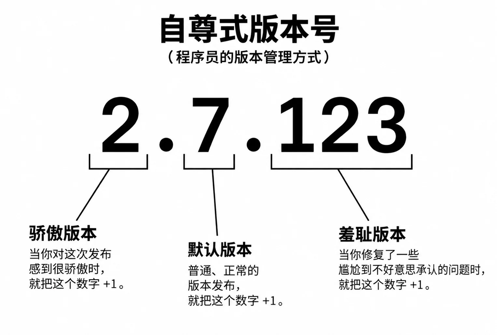

# 第15章　稳定、发布和维护

如果你不为你的第一版产品感到难为情，那你的发布就太晚了。  ——里德·霍夫曼（LinkedIn联合创始人）

## 15.1 代码完成，是另一个开始

“代码完成”不是终点，而是新迭代的起点。稳定与发布阶段最考验团队的项目管理与决策能力：何时“足够好”？如何平衡MVP与完美主义？优秀团队在A型（敢于带缺陷发布）与B型（追求完美）的血型冲突中找到理性平衡。

### 参考文档 软件版本号全解析：为代码贴上“身份标签”
版本号怎么定？ 
工程师自尊式：

从工程师的调侃视角看，版本号 `2.7.123` 常被戏谑为：
- **主版本号**：团队终于重写祖传代码、感到“脱胎换骨”时，加一；
- **次版本号**：产品经理塞进一批日常需求、平稳落地时，加一；
- **修订号**：工程师熬夜修完若干个离奇线上 Bug 后，加一——当它涨到三位数仍未升次版本，往往意味着“历史债务”已堆积如山。

然而，在真实的软件工程与基础设施运维中，版本号绝非随意数字，而是一份**关于兼容性、构建溯源与交付节奏的正式契约**。它帮助开发团队管理变更风险，协助运维团队评估升级成本，也指导最终用户做出安装或采购决策。

---

## 一、 为何需要版本号？

版本号的核心价值可归纳为三个层面：

1. **沟通预期**：告诉使用者“这次升级是颠覆性的，还是无害的增强或修复”；
2. **追溯问题**：将线上异常与特定代码快照关联，加速故障定位；
3. **管理生命周期**：区分开发中、测试中、已发布、已过时等不同软件状态。

下文将系统介绍业界主流的版本命名规范及其适用场景。

---

## 二、 主流版本命名规范

### 1. 语义化版本（SemVer）

- **格式**：`主版本号.次版本号.修订号`（如 `2.1.4`）
- **规则**：
  - **主版本号**：含有不向后兼容的 API 变更或重大架构重构；
  - **次版本号**：增加向下兼容的新功能；
  - **修订号**：进行向下兼容的问题修复或安全补丁。
- **适用场景**：面向开发者的公共库、API 服务、框架（如 npm、Cargo 生态）。
- **代表案例**：
  - **Kubernetes** 遵循 SemVer，严格区分破坏性变更与功能增强。
  - **Linux 内核**（如 `6.6.21`）虽形式上符合，但 Linus Torvalds 本人更偏实用主义——次版本号数字过长或“看着不顺眼”时即提升主版本，不完全拘泥于 API 兼容性。

> SemVer 是目前最广泛采纳的“契约式”版本策略

---

### 2. 日历化版本（CalVer）

- **格式**：`年.月.[微调号]`（如 `24.04.1`）
- **规则**：以发布时间作为版本主体，通常配合长期支持（LTS）标识。
- **最大价值**：用户和运维人员一眼即可判断软件的新旧程度，便于规划升级窗口。
- **代表案例**：
  - **Ubuntu**（如 `22.04 LTS`）——明确标记支持周期。
  - **Docker** 早期使用 SemVer（`1.13`），后全面转向 CalVer（`24.0.7`），以匹配其快速迭代与定期发布节奏。
  - **JetBrains IDE** 系列（如 `2024.1.2`）同样采用日历化命名。

> 若你的产品按季度或月份固定发版，CalVer 比 SemVer 更直观，但需注意它无法直接表达兼容性变化，需额外文档说明。

---

### 3. 构建号与提交哈希（Build / Commit-based）

- **格式**：`主版本-构建编号` 或 `v2.3.0-a7f3b1c`（含 Git 短哈希）
- **规则**：每次 CI/CD 流水线完成一次自动构建，编号即自增或附加源码提交 ID。
- **核心用途**：在高频交付场景下实现“一行代码对应一个二进制”，快速回溯引入问题的具体提交。
- **代表案例**：
  - **Windows NT 内核**：对外称 `Windows 11`，内部诊断与补丁管理完全依赖构建号，如 `Version 10.0 (Build 22631.3296)`。
  - **各类持续部署的微服务**：通常以 `镜像标签-提交哈希` 形式发布，如 `backend:v2.3.0-7f3a1c`。

---

### 4. 商业与订阅混合版本（Marketing + Hybrid）

- **格式**：对外使用年份或代号，对内绑定时间通道与构建号。
- **规则**：面向大客户或普通消费者时，用“年份版”或“昵称”降低认知门槛；内部迭代则依赖精细化版本追踪。
- **代表案例**：
  - **Microsoft Office**：传统买断版以 `Office 2016`、`Office 2024` 命名；Microsoft 365 订阅版则使用 `Version 2408 (Build 17928.20114)` 进行精细治理。
  - **macOS**：对外品牌如 `Sonoma`，同时保留 `14.5` 这类内部版本号。

> **教材补充**：这种“双轨制”提醒我们 —— 版本号不仅是技术问题，也是产品与市场策略的一部分。

---

### 5. 复合多维标签（AI / 大模型时代）

- **格式**：`架构代际-参数量-微调类型-快照日期`（如 `Llama-3.1-70B-Instruct`）
- **规则**：大模型彻底打破了传统单轴版本定义，需同时表达**模型结构、规模、训练策略和数据冻结时间**，以帮助用户评估硬件开销并预测输出行为稳定性。
- **代表案例**：
  - **开源社区**：`Llama-3.1-70B-Instruct`（代际-参数量-指令微调）
  - **商用闭源 API**：`GPT-4o-2024-08-06`（模型名+冻结快照日期），提示用户模型行为在该日期后固定，避免 Prompt 输出漂移。

---

## 三、 预发布与生命周期修饰符

在主干版本之后，通常附加阶段标识，用以明确软件的质量成熟度：

| 后缀 | 全称 | 含义 |
|------|------|------|
| `-alpha` | Alpha 内测版 | 内部验证，功能未完整，可能存有已知严重缺陷，仅供早期测试者使用。 |
| `-beta` | Beta 公测版 | 主要功能已冻结，面向外部收集兼容性及边缘场景反馈，不建议生产环境部署。 |
| `-rc` | Release Candidate（候选发布版） | 若无重大阻断问题，此版本即为最终正式版，处于最后质量确认阶段。 |
| （无后缀） 或 `-ga` | GA（General Availability，稳定商用版） | 已正式发布，达到生产环境可用标准，具备完整技术支持和更新保障。 |

> **实践建议**：`-rc` 版本是测试团队与早期用户的最后“安全阀”，建议在正式上线前至少发布一个 RC 版本以验证集成环境。

---

## 四、 总结与选型指南

| 应用场景 | 推荐版本策略 | 理由 |
|---------|------------|------|
| 开源库 / API / 框架 | SemVer | 明确表达兼容性边界，降低集成成本。 |
| 定期发布的产品（如 OS、IDE） | CalVer + LTS 标记 | 时间清晰，便于用户规划升级节奏。 |
| 高频 CI/CD 微服务 | SemVer + Build 号 / Git Hash | 实现精确回溯与自动回滚。 |
| 商业软件面向大众市场 | 混合策略（年份+内部构建） | 兼顾易记性与工程精细度。 |
| AI 模型及大模型应用 | 多维标签（架构+参数量+日期） | 适应快速迭代与多维度性能评估需求。 |

**最终提醒**：无论选择哪种版本方案，**一致性**和**文档化**比方案本身更关键。团队应制定明确的版本发布策略，并在 `CHANGELOG` 中清晰记录每个版本的变化内容，才能让版本号真正成为沟通的桥梁，而非形式主义的数字游戏。

## 15.1.1 什么时候才足够好？

发布决策需理性权衡“缺陷”与“改正”的成本。商业现实是：所有公司都希望零缺陷发布，但真正的高质量是“及时交付能解决用户问题的版本 + 快速跟进修复”。AI时代，这一决策更多依赖实时数据与功能开关。

### 参考文档
- 本章15.1.1正文

### 扩展阅读
- 《Inspired》  
- 2026年《AI产品发布决策框架》

---

## 15.1.2 发布的两种主要模式

客户端发布（打包发货）求稳：Alpha/Beta/RC/RTM/SOP-ready，版本碎片化成本高。服务端发布（厨房优化）求快：持续交付/部署，金丝雀发布，向后兼容+功能开关。核心是“立新不破旧”与蓝绿部署/回滚演练。

### 参考文档

### 扩展阅读

---

## 15.2 稳定与发布阶段的关键战术

会诊小组（Triage）动态提高修复门槛：Fix / As Designed / Won’t Fix / Postpone。Tell Mode → Ask Mode。DCR与CCB管理重大变更，防止Feature Sneak。ZBB（Zero Bug Build）强制清零老Bug。预发布环境（Staging）确保版本匹配与回滚演练。

### 15.2.1 会诊小组（Triage Team）不断提高门槛 
### 15.2.2 设计变更（Design Change Request）和控制
### 15.2.3 DCR之与错误同行
### 15.2.4 ZBB，砍功能
### 15.2.5 招数：管理预发布环境（Staging Server）与版本匹配

#### 参考文档
- 本章15.2正文及Excel 1900闰年案例

#### 扩展阅读
- 《Release It!》  
- 2026年《AI时代Feature Flag与DCR实践》

---

## 15.3 渐进式交付：持续交付的实战

从“一次性发布”转向“可控扩散”：功能开关+用户分层+数据驱动。Windows Insider、小米MIUI、Cursor等案例证明：渐进式交付是平衡速度与稳定的关键。需警惕过度打扰用户，结合SLO与回滚演练。

### 参考文档
- 本章15.3正文及图15-4

### 扩展阅读
- 《Accelerate》  
- 2026年《AI产品渐进式交付指南》

---

## 15.4 案例分析–AI批改简答题

以“AI简答题批改”为例，展示全栈更新+功能开关+分层灰度（内部Dogfood → Beta → 1%→100%）+用户分层（免费/付费）+合规设计。发布是产品、工程、客户成功共同驱动的增长引擎。

### 参考文档
- 本章15.4正文

### 扩展阅读
- 2026年《AI SaaS发布案例集》

---

## 15.5 提高DevOps长期效率

DORA四指标（部署频率、变更前置时间、变更失败率、服务恢复时间）是量化工程效能的黄金标准。DevOps/AIOps形成闭环反馈飞轮：模型/MLOps、提示词/LLMOps、RAG、评估体系。SRE与研发的共生模式（DRI+赋能团队）是关键。

### 15.5.1 CI/CD的效率衡量
### 15.5.2 以终为始，不断循环提高
### 15.5.3 运维的挑战与演进：从SRE到共生模式

#### 参考文档
- 本章15.5正文

#### 扩展阅读
- 《The DevOps Handbook》  
- 2026年《AIOps与DORA指标实践报告》

---

## 15.6 发布之后—解剖自己

发布是新一轮学习的起点。TSP七原则 + Postmortem（事后诸葛亮会议）帮助团队复盘。5WHY与鱼骨图找出根因，无指责文化（Blameless Culture）是心理安全的基础。质量里程碑用于固化工具链与流程改进。

### 15.6.1 TSP的原则
### 15.6.2 事后诸葛亮会议
### 15.6.3 怎么开好一个Postmortem会议

#### 参考文档
- 本章15.6正文及Postmortem模板

#### 扩展阅读
- 《The Retrospective Handbook》  
- 2026年《AI项目Postmortem模板与实践》

---

## 2026年附录：本章思考与练习

（本附录专门对应第15章内容，帮助学生将代码完成、发布模式、渐进式交付、DevOps效率、Postmortem与AI时代的真实实践相结合。建议先通读全章后再开始练习。）

### 1. “足够好”的发布决策在AI时代的权衡  
**这针对于15.1小节**（代码完成，是另一个开始）。

里德·霍夫曼的名言在AI产品中是否依然成立？如果你的AI批改功能在内部测试中仍有10%的幻觉率，你会选择A型（带缺陷发布）还是B型（追求完美）？AI时代“足够好”的定义与传统软件有何本质不同？这个问题的答案是否已有明确结论？

### 2. 客户端 vs 服务端发布策略的AI新挑战  
**这针对于15.1.2小节**（发布的两种主要模式）。

功能开关+金丝雀发布在AI服务端（如LLM推理服务）中如何应对“模型漂移”风险？客户端App的版本碎片化在AI时代是否更致命（例如老版本无法调用新模型）？你认为AI产品发布应更偏向“求稳”还是“求快”？这个问题的答案是否已有明确结论？

### 3. 会诊小组、DCR与ZBB在AI项目中的演进  
**这针对于15.2小节**（稳定与发布阶段的关键战术）。

AI时代，Bug可能源于数据/模型而非代码，会诊小组（Triage）如何判断“Won’t Fix”与“As Designed”？DCR是否需要新增“模型版本追溯”环节？ZBB在LLM项目中是否仍可实现？如果AI能自动修复80%的Bug，人类会诊小组的角色该如何重新定义？这个问题的答案是否已有明确结论？

### 4. 渐进式交付与用户分层的AI实践  
**这针对于15.3与15.4小节**（渐进式交付 + AI批改案例）。

在AI SaaS中，如何平衡“免费用户尝鲜快迭代”与“付费学校稳定需求”？功能开关能否完全解决“过度打扰用户”的问题？如果一次AI模型更新导致10%用户体验下降，你会选择全量推送还是无限期灰度？这个问题的答案是否已有明确结论？

### 5. DORA指标与AIOps闭环的长期效率  
**这针对于15.5小节**（提高DevOps长期效率）。

DORA四指标在AI项目中是否需要新增“模型漂移率”“提示词迭代周期”等维度？SRE与研发的“共生模式”在AI时代是否会演变为“AI SRE自动On-Call”？如果AI能自动完成Postmortem，你认为人类工程师仍需参与复盘吗？这个问题的答案是否已有明确结论？

### 6. Postmortem与无指责文化的AI时代意义  
**这针对于15.6小节**（发布之后—解剖自己）。

AI项目Postmortem应如何记录“模型幻觉根因”与“数据漂移责任”？5WHY与鱼骨图能否用于分析“AI生成代码引入的系统性风险”？在无指责文化中，如果AI工具本身导致重大事故，团队该如何定义“责任”？发布之后的学习循环是否会因为AI而变得更快、更浅？这个问题的答案是否已有明确结论？

---
## 第 15 章 发布和维护 问答

## 15.1 如何有效地设置“假的上线问题”让学生体验发布后的维护？

 学生在校园项目中无法自然遇到权限配置错误、限流失效、版本兼容等生产级问题，询问教师能否设计虚拟故障来训练工程思维，以及模拟训练是否有效。

**问题的核心：** 生产级问题的本质不是“高并发”，而是“未知的依赖和边界条件”。可以在受控环境中通过故障注入模拟。

**回答：**

书里15.3节讲的“渐进式交付”和15.4节的“功能开关”，本质就是在可控范围内暴露问题。教学中完全可以设计“假的上线问题”：

1. **故障注入**：在预发布环境故意改错一个权限配置、关掉一个限流开关、改一个API返回值格式。让学生通过监控日志和指标发现并修复。
2. **回滚演练**：故意发布一个有Bug的版本，让学生执行回滚操作，并验证MTTR。
3. **混沌实验**：在测试环境随机关闭一个依赖服务，看学生能否通过功能开关降级。

这些不需要真实用户流量，只需要一个模拟的生产环境（Staging）和故障注入工具。书里15.2.4节的“ZBB”和15.5.3节的“DRI机制”都可以作为演练场景。

**扩展思考：**

“只有真实事故才能学到”是个误区。航空飞行员在模拟器里训练紧急迫降，不是等真实发动机熄火。同样，软件工程的“模拟上线问题”只要足够逼真（日志、监控、告警链完整），就能培养学生的根因分析能力和应急流程意识。关键在于**场景设计要像真实事故一样模糊**——不给提示，让他们自己从监控数据中定位问题。

---

## 15.2 渐进发布对于用户使用体验和市场评价的影响？

 学生以Windows 10/11为例，指出Insiders版本不稳定、正式版仍有大面积Bug，影响用户体验，询问如何降低渐进发布的弊端及找到平衡点。

**问题的核心：** 渐进发布的平衡点在于**用户分层**——为不同用户群体提供不同的稳定性和更新频率承诺。

**回答：**

书里15.3节和15.4.2节的“用户分层”正是答案。微软的做法（消费者版频繁更新、企业版LTSC长期稳定）就是平衡。渐进发布的弊端无法消除，只能通过**明确预期**来管理：Insiders用户默认接受不稳定以换取尝鲜；普通消费者接收稳定版推送；企业客户可以推迟更新。

判断平衡点的标准：
- 产品的**核心场景**是什么？操作系统需要稳定，社交App需要新功能。
- **出错后果**多严重？银行软件一单都不能错，游戏崩了可以重连。
- **用户能否选择**？给用户“推迟更新”“仅安全更新”的选项，把平衡权交给用户。

如书里15.3.2节所说，“能快速发布”不等于“应该频繁打扰用户”。

**扩展思考：**

学生观察到的“正式版仍有大面积Bug”恰恰说明渐进发布的意义——没有渐进发布，这些Bug可能在最后集成时才被发现，后果更糟。Windows 10的Insiders计划就是把测试规模从几千内测扩大到百万用户，这种“众测”本身就是渐进发布的受益者。问题的根源不是渐进发布本身，而是**质量门禁不够严**——让不该放行的版本流到了更广的受众。

---

## 15.3 良性bug是否该被修复？

 学生以GTA5摩托飞天bug为例，认为用户欢迎的“良性bug”不应修复，而影响体验的慢加载问题虽非bug却应修复，询问修复标准。

**问题的核心：** 修复决策的标准不是“是否bug”，而是**是否对用户价值和安全构成风险**。

**回答：**

书里15.1.1节的“四种血型”和15.2.1节的“会诊小组”已经给出了决策框架。老师回复中举了反例：金融软件多发了钱，用户当然欢迎，但必须修复——因为这涉及**合规和法律责任**。

修复决策的优先级：
1. **安全/合规风险**（如多发钱、数据泄露）→ 必须立即修复。
2. **核心功能破坏**（如无法登录）→ 必须修复。
3. **用户体验提升**（如慢加载）→ 应修复，但可排期。
4. **良性、无害、用户喜爱的行为** → 可以不修复，甚至转化为功能（如游戏厂商把bug做成彩蛋）。

对于GTA5的飞天bug，游戏公司的决策逻辑是：它不影响其他玩家，不破坏经济系统，反而增加乐趣 → 可以不修。但如果是竞技游戏中的利用bug作弊，则必须修。

**扩展思考：**

“良性bug”的本质是**意外产生的正确行为**。如果它符合用户预期且不伤害任何人，它就是“特性”，不是bug。Excel的1900年闰年bug（15.2.3节）就是典型——因兼容性原因保留至今。但这类决策必须记录在案，并在会诊中明确“Won’t Fix”的原因，避免新成员盲目修复。

---

## 15.4 关于沉没成本，如何砍掉功能？

 学生理解“沉没成本不应影响决策”的理论，但实践中常舍不得放弃已投入的功能，询问如何正确决策砍功能。

**问题的核心：** 砍功能的决策依据是**未来收益与完成成本**，不是过去投入。

**回答：**

书里15.2.4节给出了完整方法。面对临近发布但无法按时完成的功能，团队需要回答：

1. **不完成这个功能，用户能否完成任务？** 如果能绕行或已有替代方案，砍掉是安全的。
2. **完成它还要多少时间？** 基于历史数据（不是乐观估计）评估。如果预计时间超出现有窗口，果断砍。
3. **砍掉后的“出口条件”是什么？** 明确这个功能在下一版本的计划中，不是永久放弃。

**实战步骤**（书里15.2.4节）：
- 承认沉没成本存在，但不作为决策理由。
- 用“项目铁三角”（好、快、便宜）做取舍——要么砍功能（放弃“好”），要么延期（放弃“快”），要么加人（放弃“便宜”）。
- 会诊小组（Triage）决策后，公开记录“Postponed”及原因。

**扩展思考：**

砍功能最难的不是理性分析，而是**情感**。团队成员对自认为“酷”的功能有感情。书里小飞的发言——“花了这么多心血，不甘心”——就是典型。破解方法是**让决策者不是功能开发者本人**（如PM或会诊小组），并强制要求DCR（设计变更请求）写明“如果不修会怎样”。当开发者自己写出“不影响核心功能、用户可绕行”时，砍掉就变得容易接受。
