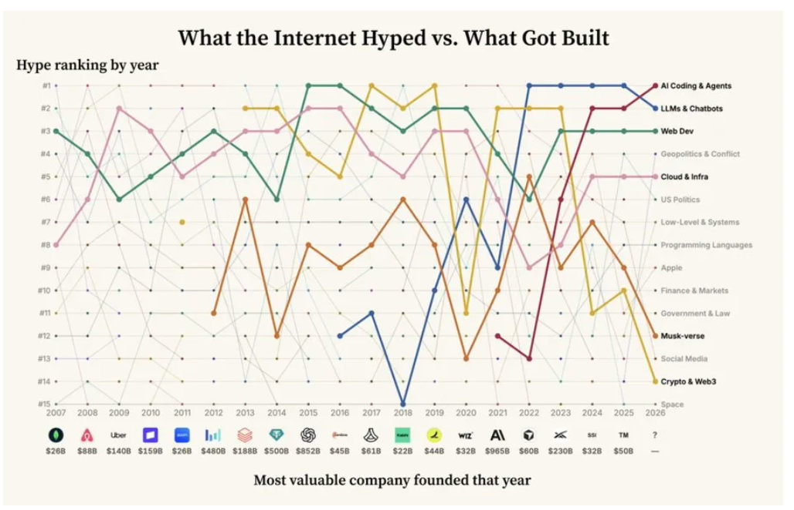

# 别迷信专家预测：喧闹和完美设计从来不等于未来

在科技行业，最昂贵也最普遍的错觉，莫过于相信“顶尖专家能够精准预测技术的未来，而最优雅、最完备的设计终将统治世界”。

每隔几年，技术圈和创投界都会集体陷入一种巨大的共识狂欢：架构师在白板上勾勒严丝合缝的顶层蓝图，分析师发布言之凿凿的趋势研报，极客社区刷屏推演下一代颠覆性范式。在他们眼中，未来的轮廓清晰而神圣，仿佛只要系统的抽象层次足够高、理论模型足够自洽，新纪元就会如期而至。

然而，拉开历史的广角镜头审视科技史，你会发现一个残酷的反常识事实：**那些在当年被技术精英推向神坛、设计精巧绝伦，但在 3 到 5 年后彻底灰飞烟灭、甚至几十年后也没诞生任何超级商业实体的“明星技术”，数量远多于真正跑出来的赢家。**

真实世界的进化法则，从来不是由“专家的审美”决定的。

---

## 一、20 年数据的无情对照：最喧闹处，往往没有巨头

红杉资本（Sequoia Capital）合伙人康斯坦丁·布勒（Konstantine Buhler）曾做过一项耐人寻味的数据复盘。他与团队拉取了 2007 年以来科技精英风向标社区 **Hacker News（HN）** 上每年的热度榜单（Top 15 话题），并把每一年全网最热炒的主题，与当年**实际诞生且最终最具商业价值的顶尖公司**进行了逐年横向对照。

这份复盘揭示了科技演进中最具戏剧性的三大常态错位：

### 1. 当年最热的喧嚣，几乎从未孕育当年的超级赢家

技术社区讨论分贝最高的话题，与真实商业帝国的发轫点几乎是完全解耦的：

* **2008 年**：HN 热度榜首被 **Google** 垄断，技术精英们沉浸于搜索引擎与海量分布式系统的宏大构想中；但那一年实际诞生、后来成长为千亿商业帝国的，是跑去给陌生人铺床垫的 **Airbnb**。
* **2009 年**：全网工程师最痴迷的是底层编程（Low-level programming）与极致优雅的语言内核；但当年创立的最具价值的公司，是做线下地推叫车、技术架构在当时看来“毫无极客审美”的 **Uber**。
* **2021 年**：整个互联网被 **Crypto / Web3** 的去中心化叙事彻底吞噬，技术大会言必称智能合约与元宇宙；但那一年真正诞生的 AI 巨头，是在聚光灯照不到的暗处沉下心啃模型对齐的 **Anthropic**。

### 2. 真正的巨变，在暗处潜伏 5 到 6 年，而非靠喧嚣催熟

真正重塑世界的巨浪，在刚起步时绝不是霸榜第一的明星，而是在长达数年的时间里以“非主流”的姿态低空飞行：

* **大语言模型（LLM）**：早在 2016 年就悄悄挤进了 HN 前 15 名，但在长达 6 年的时间里几乎被主流业界视作学术小众探索，直到 2022 年才登顶；
* **AI 辅助编程（AI Coding）**：2021 年排在第 12 位，伴随数年工程迭代与工作流渗透，到 2026 年才跃居榜首；
* **云计算与移动互联网**：早期的每一次底层萌芽，都经历了数年的冷板凳期。

### 3. 持久留存的复利，远胜脉冲式的假警报

如果一项技术像烟花一样在一年内冲上热搜第一，随后两三年迅速跌出前 15 名，它大概率只是由行业情绪堆砌出的假警报。例如当年的 **Google Wave**，曾被顶尖极客盛赞为“将彻底颠覆电子邮件和即时通信的下一代协作协议”，声势浩大，但在几年内便被彻底关停；早期消费级智能眼镜、虚拟地产热潮亦是如此。相反，那些具备持久生命力的议题，能在长达十几年里年年稳居讨论区，最终沉淀为真实的生产力飞轮。

---

## 二、从 Gartner 曲线看“专家的捧杀”：执念如何催生早夭泡沫

提到技术预测，最具代表性的工具莫过于咨询巨头 Gartner 每年发布的**技术成熟度曲线（Gartner Hype Cycle）**。

Gartner 试图把技术演进抽象为一个标准的认知生命周期：从“技术萌芽期（Innovation Trigger）”，一路被市场推向“期望膨胀顶峰（Peak of Inflated Expectations）”，随后断崖式跌入“幻灭低谷期（Trough of Disillusionment）”，最后一部分幸存者才艰难爬上“实质生产力平原（Plateau of Productivity）”。

然而，将红杉 Buhler 的真实商业复盘与 Gartner 曲线放在一起对照，就能看破这套机制背后的致命盲区：

### 1. Gartner 描绘的是“情绪过山车”，红杉揭示的是“注意力与商业的错位”

* **Gartner 曲线本质上是一个“情绪图表”**：它展示的是外部舆论对某项技术期望值的涨落，默认假设只要熬过低谷，技术终会转化为生产力；
* **红杉的 HN 复盘展示的是残酷的“商业错位”**：当年情绪分贝最高的技术，往往根本诞生不了当年的超级商业实体。商业巨头从来不在期望顶峰里狂欢，而是在喧嚣之外静默复利。

### 2. 专家对“完美方案”的执念，硬生生把早产儿催熟成泡沫

为什么那么多技术会在极短时间内被顶上 Gartner 的“期望膨胀顶峰”，随即跌入万劫不复的深渊？

**正是因为行业专家、分析机构与技术布道者的联手吹捧。**

专家们往往带着象牙塔式的技术洁癖，不仅把某项底层单点技术拔高为“重构一切的下一代总线”，更赋予它近乎乌托邦的完美标准——他们不允许有短板，不接受任何粗糙妥协，过早地为其构建了宏大的行业白皮书、全套标准规范与合规框架。

这种对“完美设计”的拔苗助长，导致技术在真实基础设施、算力成本和大众场景完全未准备好的时候，就被硬生生推到了聚光灯下：

* 资金疯狂涌入，期望值被拉升到人类无法兑现的高度；
* 架构师忙着开会制定庞大的“统一标准”，却没有人在真实泥泞的场景里做接地气的工具；
* 当大众发现它根本无法达到专家吹嘘的“完美全能”时，期望瞬间崩塌，技术直接被一棍子打入冷宫，原本健康的 5 到 6 年暗处孵化期被彻底打碎。

---

## 三、完美架构的陷阱：从 Xanadu 到 DCOM 的自嗨

专家的第一直觉是追求“理论上的无懈可击与控制感”**，而真实世界的物理法则是**“残酷的成本制约与网络不可靠性”。

专家最容易犯的工程自负，就是试图在宏观系统上消灭那些“不可避免的客观局限性”。计算机史上两次最壮烈的大倒退与大洗牌，把这种矛盾展现得淋漓尽致：

### 1. Xanadu 计划 vs. 粗暴的万维网（WWW）

在蒂姆·伯纳斯-李（Tim Berners-Lee）发明万维网之前，超文本先驱泰德·尼尔森（Ted Nelson）主导了长达数十年的 **Xanadu（仙境）计划**。
在学院派学者的蓝图里，一个合格的信息网络必须具备数学般的严密与纯粹：

* 必须是**双向强链接**（A 连到 B，B 必须动态感知 A 并保持对齐）；
* 必须**绝无死链**（系统底层保证全局一致性，绝不允许出现页面丢失）；
* 必须原生支持**分布式版本管理与微支付版权追踪**。

为了消灭“死链”这个瑕疵，这套极其完美的系统研发了整整 30 年，复杂度高到永远走不出实验室。

而蒂姆·伯纳斯-李在 1991 年拿出的 Web 协议，在专家眼里简陋得甚至像个业余恶作剧：单向链接、无状态、**坦然接受 404（Not Found）**——找不到页面就直接报错断开，底层根本不管全局一致性。

当蒂姆把万维网的论文投给顶级学术会议（Hypertext '91）时，**被评审专家毫不留情地拒稿（Rejected）**。泰德·尼尔森更是公开痛斥万维网是对超文本概念的“庸俗化篡改”，把脆弱易断的粗制滥造当成了标准。

然而，正是因为这种“允许局部失败、门槛降到几乎为零”的设计，瞬间引爆了全球开发者的网络效应，以指数级速度把人类文明带入了互联网时代。

### 2. DCOM/CORBA 的神坛崩塌 vs. RESTful API 的全面大一统

在 20 世纪 90 年代末到 21 世纪初，分布式计算领域同样上演了一场“宏大设计”被“简陋无状态”彻底血洗的历史。

当时，大厂与架构委员会（微软主推 DCOM、OMG 联盟推 CORBA、Sun 推 Java RMI）联手构建了一个看似美轮美奂的宏大构想：**位置透明性（Location Transparency）**。

在专家的设想中，网络应当被完全封装抽象掉：

* 调用千里之外一台服务器上的对象，应该和调用本地内存里的一个 C++ 对象没有任何语法区别（`pCar->Drive()`）；
* 引入极其复杂的**分布式引用计数（Distributed Reference Counting）**：客户端持有对象，远程服务器计数加一；客户端销毁，计数减一；
* 通过底层心跳 Ping 机制、复杂的租约期（Leasing）和垃圾收集协议，来跨越网络管理远程对象的生命周期；
* 双方通过 IDL 编译成强类型二进制桩（Stub/Skeleton），必须严格对齐。

这套设计在智力上带来了无与伦比的审美愉悦感 —— 它试图把整个不可靠的分布式网络，强行缝合成一个巨大的、确定性的单机面向对象内存空间。

然而，真实世界的物理铁律粉碎了一切。它直接撞上了著名的“分布式计算八大谬误”：

* **网络不可靠，但引用计数需要绝对可靠**：一次短暂的网络抖动或丢包，就会导致客户端的释放信号丢失，服务器内存迅速泄露；或者心跳包稍有延迟，服务器便把对象回收销毁，紧接着导致客户端悬挂指针崩溃。为了维护那一串虚幻的“引用数字”，系统不得不叠加极其庞大而脆弱的状态机与锁。
* **状态（State）是水平扩展的宿敌**：服务器死死记着每个客户端的引用，导致服务根本无法做无缝的负载均衡。一台机器宕机，挂在它身上的状态全部灰飞烟灭。
* **高动态端口穿不透企业防火墙**，高傲的二进制协议更是把跨语言、跨平台的协作成本推向了天文数字。

就在专家们为 CORBA 规范写了上千页厚度、为 DCOM 复杂的配对机制焦头烂额时，一帮被正统架构师视为“毫无工程追求、性能极差”的轻量方案登场了：**基于 HTTP 的无状态 API（RESTful / JSON / XML）**。

| 维度 | DCOM / CORBA / 状态化 RPC | 无状态 API（REST / HTTP / JSON） |
| --- | --- | --- |
| **对网络假定** | 假装网络不存在（透明无缝） | **承认网络充满断连与不确定性** |
| **状态维护** | 服务器深度维持客户端的引用计数与生命周期 | **无状态（Stateless）**：每一次请求带齐所有上下文，阅后即焚 |
| **错误处理** | 极度脆弱：底层连接断开引发级联雪崩 | **优雅降级**：失败了直接返回 500/503，客户端超时重试即可 |
| **数据格式** | 严格绑定的二进制强契约 | 简单直白、人类可读的明文 JSON/文本，天然跨平台跨语言 |
| **水平扩展** | 极度困难（依赖粘性会话与集群状态同步） | **天然水平扩展**：任何一台节点挂掉，请求换一台机器接着跑 |

当时的老派架构师痛心疾首，批评纯文本传输浪费带宽、无状态每次都要重新认证属于低级倒退。

但历史的结果毫无悬念：**RESTful API 与无状态架构以秋风扫落叶之势统治了现代软件工业。** 甚至连现代追求极限性能的微服务框架（如 gRPC），也早已彻底吸取了当年的教训，严格恪守无状态调用与单向短生命周期流，绝不再碰“分布式引用计数”这种试图消灭物理规律的梦呓。

---

## 四、Kano 效率曲线：看清平庸的“过度工程化”

技术预测与技术方案之所以频频失焦，核心在于团队往往陷入一种盲目勤奋的误区：**误以为只要系统设计得越精密、所有维度的投入都在等价地创造未来。**

在《构建之法 —— 现代软件工程》第八章中，通过引入 **Kano 满意度模型**，彻底戳破了这种“平铺直叙式努力”的幻觉：

在 Kano 模型的坐标系里，不同维度的技术投入遵循着截然不同的效率转化曲线：

1. **基本需求（卫生属性，Hygiene Attribute）**
比如底层软件的格式规范、文档完备度、配置冗余度、在不可靠网络上的绝对一致性。
正如一家小笼包店的地面擦得再干净、消毒达到航天级，顾客也不会因此给它评米其林三星 —— 顾客是来吃包子的。一个服务若能在不可靠的网络上做到 99.999% 的理论严密，但调用门槛极高、部署极重，它对用户满意度的边际贡献其实早已归零。
**DCOM 和 Xanadu 的悲剧，本质上就是把全部的资源和智力，耗费在了对“卫生属性”的过度工程化上。** 他们试图把网络做到“绝对无死链、绝对位置透明”，结果在这个边际收益趋近于零的死区里耗尽了生命力。
2. **惊喜需求（兴奋属性，Excitement Attribute）**
那些在特定真实场景下能让用户眼前一亮、门槛直降十倍的杀手级体验。
蒂姆的万维网用极度简陋的单向超链接，让全世界任何人只要贴一行文字就能一键跳转；RESTful 架构让任何一个刚学会编程的初学者用几行脚本就能调通一个云端服务；Cursor 并没有自研底层基座大模型，却通过极度丝滑的原生交互切中了程序员的核心痛点。
这些方案在第一天往往伴随着大量让专家皱眉的瑕疵（死链、纯文本解析慢、缺乏强类型校验），但因为它们打穿了那个唯一的、不可替代的核心场景，用户和开发者会毫不犹豫地原谅它们的粗糙，并迅速建立起无法逆转的生态飞轮。

**真正的颠覆，从来不是把“卫生属性”刷到完美，而是在“兴奋属性”上打出一记击穿痛点的制胜球。**

---

## 五、如何识别真正的技术未来？

如果连行业专家、标准委员会和顶级极客社群的集体喧闹都不可靠，我们究竟该如何刺破迷雾，判断一项技术的真实生命力？

科技历史和无数沉浮的案例，为我们沉淀出三条极其清醒的常识法则：

* **警惕“智力自嗨的完美设计”，拥抱“承认缺陷的极简方案”**
当一个技术方案试图向你兜售“完全透明”、“无缝统一”、“全局强一致”这种反物理常识的宏大叙事时，一定要高度警惕。真正能统治现实世界的技术，往往长着一张“粗暴妥协”的面孔 —— 它们坦然承认网络会断、节点会挂、页面会丢失、模型会有幻觉；它们不试图在底层消灭物理现实，而是把系统设计成无状态、松耦合、允许单点随时重试与优雅降级。
* **警惕“被专家推向 Gartner 顶峰的造词盛宴”，关注“低空飞行”**
当一项技术在短时间内被全行业挂在嘴边、成为各大峰会和年终汇报的必选定式时，它大概率已经被过早推进了泡沫期。真正的未来，往往在 Gartner 曲线尚未关注到的盲区、在连续 5 年以上稳定出现在极客讨论区边缘的角落里潜伏着。那些被精英们评价为“有用但技术含量不高”、“架构不够优雅”、却在真实世界里悄悄帮一群人解决脏活累活的工具，才是下一场工业革命的真正火种。
* **区分“技术审美”与“场景破发”**
永远不要被复杂的架构图和新造的技术名词所俘获。多问一句最朴素的问题：**它到底在什么具体场景下，把真实用户的哪一个核心体验提升了 10 倍，或者把准入门槛降低了 10 倍？** 如果答案仅仅是“提高了抽象层级”、“理论上更为完备自洽”，那么不管为它站台的专家名头有多响，它最终大概率会重蹈 DCOM 和 Xanadu 的覆辙，沦为科技陈列馆里又一件精致而无用的标本。

不要迷信那些被聚光灯照耀的喧嚣预言。科技史上的真正赢家，从来不是在会场上由专家用 PPT 和完美架构定义出来的，而是在暗处、在无人注意的泥泞现实中，被粗糙而顽强的野蛮生长铸就出来的。

----
参考文章：
https://theaileadershipedge.substack.com/p/the-rise-of-the-ai-board-member

> What got hyped vs what got built
> Sequoia’s Konstantine Buhler ranked the most hyped topics on Hacker News for every year since 2007 and mapped each year against the most valuable company actually founded that year.

> Three patterns stand out:

> The top company of a given year is rarely the hyped topic of that year. Airbnb launched in 2008 while Google dominated the conversation. Uber arrived in 2009 amid low-level programming chatter. Anthropic was founded in 2021 while crypto consumed the internet.

> New trends often announce themselves five or six years early. LLMs first entered the top 15 in 2016 and did not reach #1 until 2022. AI coding entered at #12 in 2021 and topped the list by 2026. Crypto appeared in 2011, years before its 2017 and 2021 peaks.

> Sustained attention is a stronger signal than a single spike. The “Musk-verse” has remained in the top 15 for 14 consecutive years, the only theme in the dataset with that kind of staying power.

> For investors and boards, I think the useful lesson is simple:

>  Don’t confuse what is loud today with what is compounding underneath.