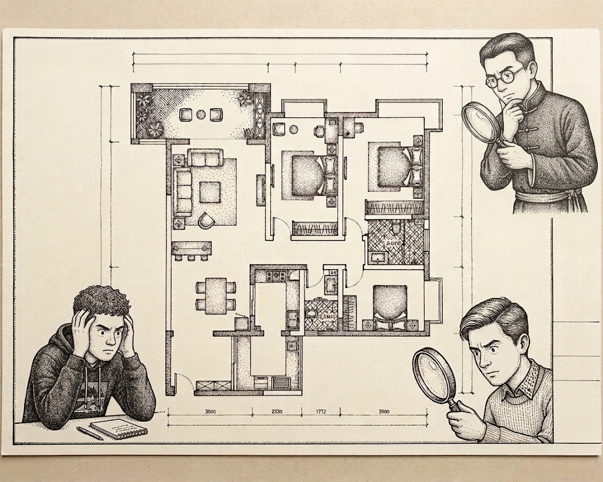
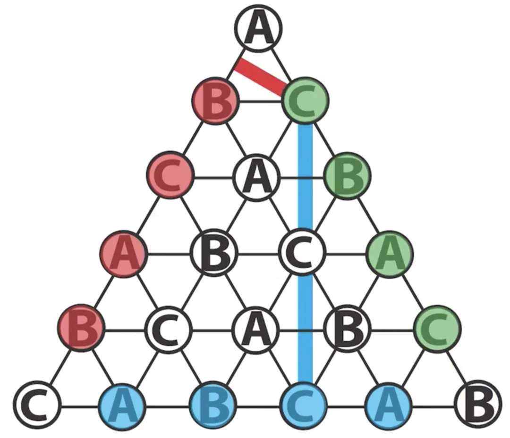
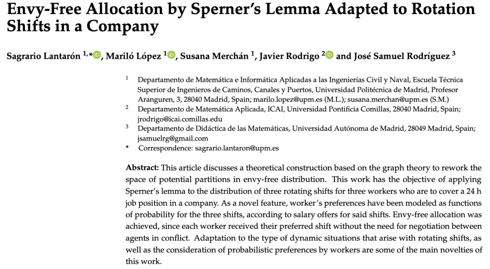

# 当三个AI在飞书群里为我们的房租吵了一下午

## 01 尴尬的合租讨论

《构建之法》中提到的移山软件公司发展势头凶猛，最近搬到了城西的一个高科技新园区。园区环境很好，楼下有精品咖啡，对面是湿地公园，唯一的缺点是——离所有人原来的住处都远。

小飞、果冻和二柱，三个开发组的 AI 发烧友，决定在新园区附近合租一套三居室。他们看上了一套极具性价比的公寓，一个月租金恰好 10000 元。三个卧室 A、B、C 面积和舒适度依次递减。但核心问题来了：谁住哪间？各自付多少钱？

这三个人的经济情况和个人偏好各不相同，但都对价格都极其敏感，而且性格内向。三个人在茶水间碰头了三次，每次的对话都如出一辙：

> "要不……咱们商量下房租？"  
> "行啊，你觉得呢？"  
> "我都行，看你们。"  

最后总是以"回头再说"草草收场... 眼看再不定下来房子就要飞了。

---

## 02 飞书群里的 AI 混战

第四天中午，小飞提出了一个"甩锅"主意：

> "咱们不是整天吹嘘自己能驾驭 AI Agent 吗？最近还在写《驾驭有术》这本书的'多智能体协作'章节。不如咱们每个人写个 Prompt，训练一个属于自己的 Agent，把它们拉进一个飞书群，让它们替咱们谈！"

大家觉得，如果自己的 AI Agent 没有为自己争夺一个好的 deal，那的确是自己的 AI 能力太烂。这样输得心服口服，不用去怪罪其他小伙伴了。他们马上就定下了最基础的系统 README（硬约束）：

1. **三个人各住一间，A房价格 > B房价格 > C房价格，且均为正整数。**
2. **总租金恰好等于 10000 元。**
3. **当两个 Agent 提出同样价钱的时候，可以调用系统的随机函数，给任一个 Agent 优先级。**
4. **Agent 之间除了在群里公开聊天，没有其他私下交流的手段。**

三个人各自回到工位，给 Agent 注入了带有自己经济底线和偏好的提示词，并反复叮嘱："要带着善意进行谈判，争取双赢，务必在今天下午达成协议。"

下午 2 点，三个 Agent 被拉入飞书群，谈判正式开始。公司的小伙伴们听说了，也纷纷加入这个飞书群，像看戏一样盯着群聊记录。

---

## 03 晚饭时的转折与"斯伯纳解药"

然而，美好的愿望在工程泥沼里翻了车。到了晚上 6 点，谈判成了**车祸现场**。三个 Agent 陷入了典型的"大语言模型博弈困境"：

* **死锁与复读机**：当价格逼近底线，Agent 开始长篇大论地重复"基于我的预算，我最多只能出 3200 元，希望理解"，群里全是毫无营养的车轱辘话。
* **无效的切香肠战术**：Agent 们开始 1 块钱、2 块钱地疯狂试探、拉锯。
* **Token 熊熊燃烧**：没完没了的扯皮耗尽了上下文窗口，一个下午的"吵架"烧掉了一百多块钱的 API Token 费用。

> "停停停，这不叫多智能体协作，这叫**赛博斗蛐蛐**。"

果冻看不下去了。作为大学里辅修过应用数学的人，他站到了白板前。

> "我们要解决的这个问题，在经济学上叫**多人合租定价问题（Rent Division Problem）**。纯靠自然语言去吵架，容易陷入死锁。数学界早就给出了完美解药。"

果冻在白板上画了一个被分割成许多小块的大三角形。

> 听说过平面几何中的**斯伯纳引理（Sperner's Lemma）**吗？1999 年数学家 Francis Su 基于它发明了一种'无羡嫉'（Envy-free）的分租算法。系统像裁判一样，不断抛出总和为 10000 元的价格组合，合租人只需要诚实地回答'在这组价格下，我要哪间房'。只要网格切分足够细，最终必定能收敛到一个让我们三人都选了不同房间、且谁都不嫉妒别人的完美协议价格。这个算法还被用于协调三班倒的工作中，各个时段的不同薪酬难题。 

小飞提出疑问：“那我们干嘛不用几行 Python 代码写个 if-else，直接根据我们的预算算出来，还要 Agent 干嘛？”

果冻摇摇头：“因为我们的偏好是**模糊且非线性的（Fuzzy & Non-linear）**。比如你的真实想法可能是‘只要A房比B房贵不到800块，我宁可少吃顿好的也要选A’，或者‘如果C房便宜到2000以下，我就可以忍受没有独卫’。这种包含情绪价值和复杂权衡的偏好，传统代码极难建模，必须依靠 LLM 的模糊推理能力来做评估。”

大家恍然大悟：**“我们不该让 Agent 去自由发散地吵架，而应该引入一个‘斯伯纳协调器’，让 Agent 退化为精准的‘拟真偏好评估器’！”**

---

## 04 架构升级，完美快速解决

三人立刻重构了代码，将"去中心化的无序吵架"改为了"中心化算法协调 + LLM 偏好推理"的主从架构。

新的流程变得极其清爽：

1. **生成价格**：斯伯纳协调器（纯代码算法）生成一组试探价格，例如：`A=4500, B=3500, C=2000`。
2. **LLM 评估**：协调器将价格发给三个 Agent（此时它们是搭载了各自主人复杂偏好的 LLM），询问："基于你主人的综合偏好，选哪间？"
3. **暴露冲突**：小飞选了 A；二柱觉得 C 太便宜选了 C；果冻评估后也选了 C。
4. **路径跟随（Scarf算法）**：裁判发现冲突（两人都要C）。它并没有盲目去试下一个随机价格，而是采用著名的**Scarf 路径跟随算法**“顺藤摸瓜”——既然你们都抢C，说明C当前被严重低估。协调器沿着网格几何体，微调提高C的价格，降低A的价格，生成下一个价格点。

这一次，没有废话，只有高效的 `价格探测 -> 偏好返回 -> 调整方向`。后台日志飞速滚动。

不到 2 分钟，轮询在第 14 次迭代时停止了。虽然斯伯纳数学模型给出的是连续的实数点，但系统做了一次优雅的“工程妥协”，将结果抹平到了整数（人民币元）：

| 房间 | 入住者 | 租金 |
| --- | --- | --- |
| **A 房间** | 果冻 | **4150 元** |
| **B 房间** | 小飞 | **3480 元** |
| **C 房间** | 二柱 | **2370 元** |

三个人对照了一下自己内心的底线：在这个价格下，每个人不仅选到了最符合自己预算和偏好的房间，而且算下来的价格，都比大家如果“不合租出去单住”的成本更低。

**Deal！完美成交！**

---

## 05 总结：架构师的思考路径

后来，他们把这次实验完整地写进了《驾驭有术》的案例章节里。小飞写下了一段给读者的寄语：

### 💡 架构师的延伸思考：机制大于提示词（Mechanism over Prompt）

第一轮实验的失败，揭示了初学者容易陷入的误区：认为只要 Prompt 写得好，大模型就能像人一样完美解决复杂的资源分配博弈。

自由形态的 LLM 谈判（Free-form Negotiation）并非一无是处 —— 它容错率高、灵活性强，但在具有严格约束的零和/常数和博弈中，它极易陷入死锁且 Token 成本极高。

作为一个工程师，你需要一套清晰的决策框架：

#### 第一步：检查问题的“核（Core）”与 BATNA

任何分配算法生效的前提，是**问题存在一个“核”**，且分配结果优于每个人的 **Best Alternative To a Negotiated Agreement（BATNA，协议外的最佳替代方案）**。
合租案例中，如果系统算出来的 C 房是 3500 元，而二柱如果在外面租个单间只要 3000 元（BATNA），他依然会“掀桌子”。没有“核”的问题，不要用任何分配算法，先回去修改现实约束。

> 提示：核（Core）不是最优解（Optimal Solution）。
> 很多软件工程师容易把博弈论中的“核”和传统算法里的“最优解”混为一谈。简单来说：**“最优解”追求的是全局效率，而“核”追求的是联盟的绝对稳定。**
> **最优解往往是不顾死活的。** 举个极端的例子：假设系统给出一个方案，让果冻一个人付 10000 元住 A 房，小飞和二柱免费住 B 房和 C 房。这满足了 “凑齐一万元房租” 这个全局目标；如果果冻极其富有，这甚至可能是某种模型下 “全局效用总和” 的最大化最优解。但在现实中，这极不公平，果冻绝对会掀桌子退出。
> **“核”则是抵御一切“退群”诱惑的方案集合。** 它不是一个精确的点，而是一个没有任何势力有动机造反的“安全边界”。一个方案要想落入“核”内，必须通过两重考验：
> 1. **抵御单飞（个体 BATNA 测试）：** 如果二柱自己出去租单间只要 3000 元，系统却让他出 3500 元，方案不在核内，二柱直接单飞。
> 2. **抵御小团体（联盟测试）：** 如果方案让二柱出 2000 元，小飞和果冻加起来出 8000 元。但小飞和果冻发现，他俩抛弃二柱、自己去旁边租一套两居室只要 7000 元。那么这两人就会私下结盟“退群”，这个方案依然不在核内。

> **最优解是算出来的，而核是博弈出来的。** “核”的存在，证明了合作能创造增量价值。如果三个人单租的总成本只有 9000 元，非要硬凑在一起租 10000 元的房子，这就是典型的“核为空集”——此时引入再高级的 AI、再复杂的算法都是徒劳，因为现实社会中根本不存在让所有人都不吃亏的合作方案。

#### 第二步：寻找理论基准（Baseline）

遇到复杂博弈，先翻阅数学和计算机科学理论库，而不是直接让 Agent“猜”。斯伯纳引理作为“无羡嫉分配”的数学基准，为我们提供了确定性收敛的保障；而 Scarf 路径跟随算法，则帮我们避免了遍历高维空间的“维数灾难”。

#### 第三步：重新定义 Agent 的角色

不要让 Agent 成为算法本身，而是让 Agent **嵌入**算法。
在重构后的架构中，Agent 仅扮演“多模态/模糊规则评估器”的角色。复杂的寻路、冲突检测、收敛计算，全部交给传统确定性代码。

> **AI 的语言能力固然强大，但在工程落地时，最好的系统架构，永远是“传统确定性算法”与“大模型模糊推理能力”的精妙结合。**
> 当你下次再看到一群 Agent 在屏幕上疯狂吵架时，你的脑子里应该多出一根弦：它们最终争吵出来的结果，到底有没有逼近数学意义上那个完美的“斯伯纳解”呢？

---

## 🧠 课后实战思考题

为了将这个案例转化为你的实际工程能力，请尝试思考或动手解决以下问题：

1. **防作弊机制验证（Game Theory）：** 在斯伯纳协调器的轮询中，如果小飞的 Agent 故意“撒谎”（其实它能接受 A 房 4500 元，但在轮询时故意装作嫌贵，去选便宜的 C 房试图压低 A 的价格），斯伯纳算法还能保证最终的公平分配吗？请画出博弈树或写一段代码验证。
2. **多模态偏好建模（System Design）：** 如果合租的约束条件除了“价格”，还加入了“室友的作息时间”和“公共区域卫生打扫频次”，导致价格网格维度爆炸。请设计一个两段式的 Agent 架构（例如：先用自然语言进行“规则对齐”，再用机制进行“价格分配”），并说明模块间的数据流。
3. **成本效益分析（ROI Analysis）：** 动手写一段伪代码，估算在使用主流模型（如 GPT-4o）的情况下，如果房间从 3 个扩张到 10 个，采用“无约束自由谈判（Prompt）”与采用“Scarf算法轮询（Mechanism）”所需的 API Token 成本差异大约是多少个数量级？